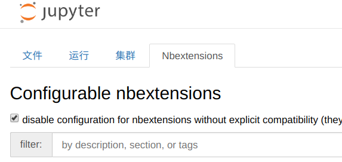

# Jupyter常用技巧

## 常用快捷键

- Enter：单元进入编辑状态
- ESC：单元退出编辑状态
- Ctrl-Enter：运行本单元
- Shift-Enter：运行本单元，选中下个单元
- Alt-Enter：运行并新建单元

以下快捷键必须在单元退出编辑状态下使用。

- FN-Y|Y：单元进入代码状态
- FN-M|M：单元进入md状态
- FN-A|A：上方插入单元
- FN-B|B：下方插入单元
- FN-D-D|D-D：删除选中单元
- FN-0-0|0-0：重启内核

## 默认设置

- 设置默认启动位置：

  ```bash
  # 生成配置文件
  ➜  Desktop jupyter notebook --generate-config
  Writing default config to: /home/fangjie/.jupyter/jupyter_notebook_config.py
  # 修改配置文件
  ➜  Desktop vi ~/.jupyter/jupyter_notebook_config.py
  c.NotebookApp.notebook_dir = '/home/fangjie/Documents/notebook/Jupyter'
  ```

## 安装插件

- Conda安装的Jupyter

  - Conda换源

  ```bash
  # 生成配置文件
  ➜  Desktop conda config
  ➜  Desktop vi ~/.condarc 
  channels:
    - https://mirrors.tuna.tsinghua.edu.cn/anaconda/cloud/conda-forge/
    - https://mirrors.tuna.tsinghua.edu.cn/anaconda/pkgs/main/
    - https://mirrors.tuna.tsinghua.edu.cn/anaconda/pkgs/free/
    - defaults
  default_channels:
    - https://mirrors.tuna.tsinghua.edu.cn/anaconda/cloud/conda-forge/
    - https://mirrors.tuna.tsinghua.edu.cn/anaconda/pkgs/main/
    - https://mirrors.tuna.tsinghua.edu.cn/anaconda/pkgs/free/
  show_channel_urls: true
  # 查看修改信息
  ➜  Desktop conda config --show
  # 注意看custom_channels、default_channels是否修改为清华源
  ```

  - 安装插件中心

  ```bash
  ➜  Desktop conda install jupyter_contrib_nbextensions
  ➜  Desktop jupyter-contrib-nbextension install --user
  ➜  Desktop jupyter-nbextensions_configurator enable --user
  ```

- PIP安装的Jupyter安装插件中心

  ```bash
  ➜  Desktop pip install jupyter_nbextensions_configurator
  ➜  Desktop jupyter-contrib-nbextension install --user
  ➜  Desktop jupyter-nbextensions_configurator enable --user
  ```
  
- 安装插件



- 常用拆件
  - Collapsible headings：标题折叠。
  - Codefolding：代码折叠。
  - Table of Contents：导航栏。
  - Autopep8：添加格式化代码键，要搭配`pip install autopep8`使用。
  - Variable Inspector：变量追踪。
  - ExecuteTime：单元格耗时。