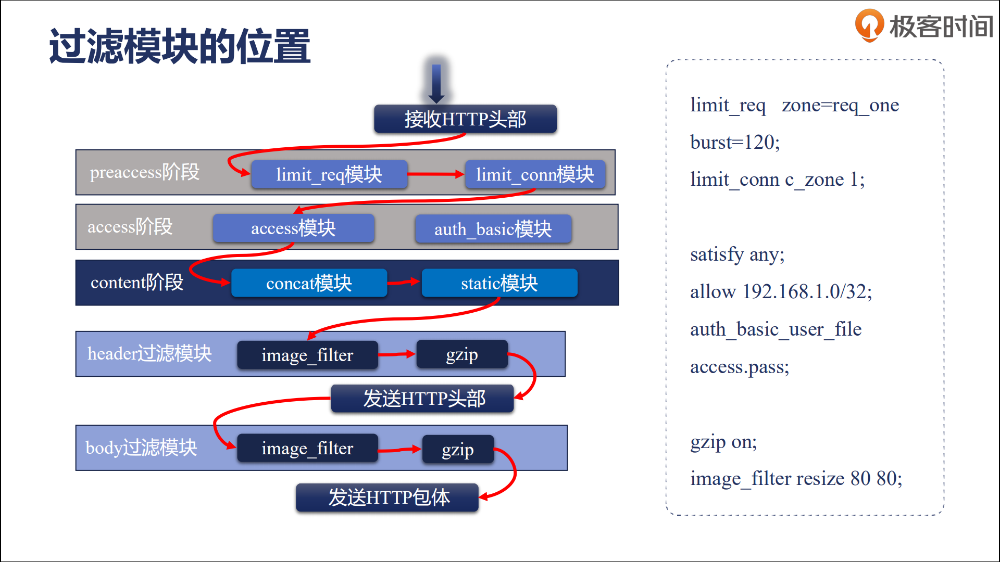
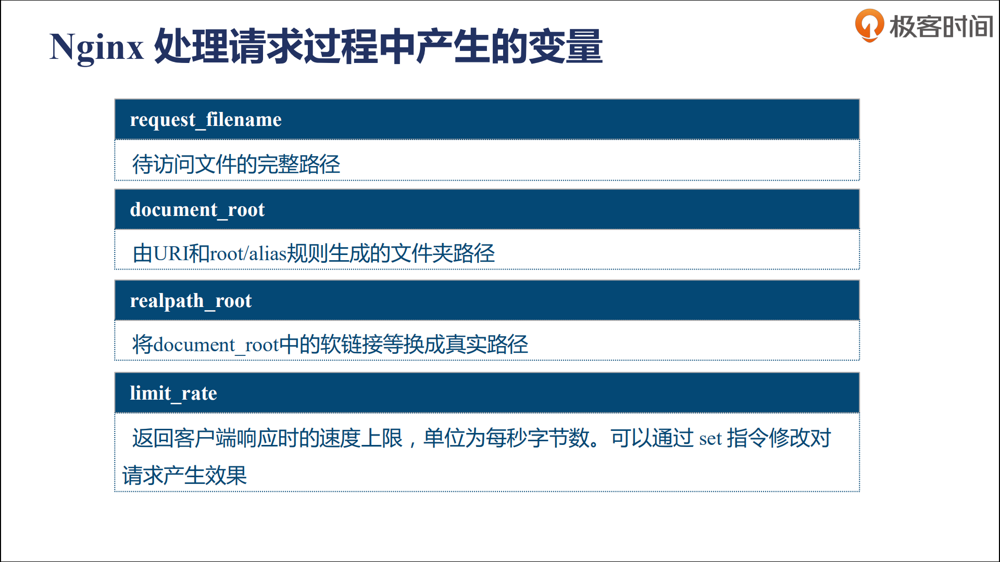
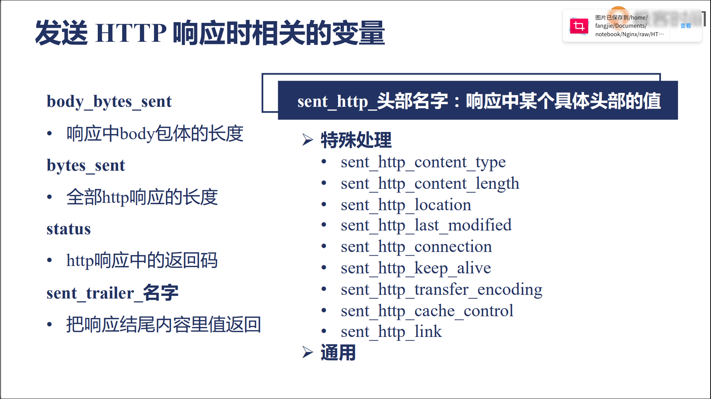
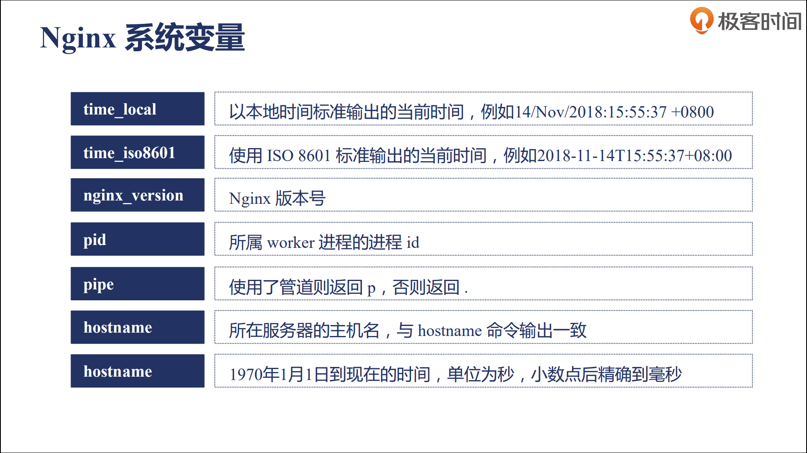

# HTTP模块

## HTTP配置指令

官方文档中的`Context`表示指令只能出现在哪些块中，如果出现在不支持的块，会语法检查错误。

指令在多个块下同时存在时，值指令是可以合并，而动作类指令是不能合并。


存储值的指令继承规则：子配置不存在时，直接使用父配置块；子配置存在时，直接覆盖父配置块。


源码查看工具：Source Insight，通过查看`ngx_http_module_t`查看回调方法。

## Listen语法

listen指令用于监听端口，在server块下使用。可以监听三类：

- ip+port
- port
- unix:path(socket)，用于本机通信。

## 请求头部处理

这些都是有操作系统和Nginx框架处理


## Nginx正则表达式

![正则表达式1]

检测，pcretest

## server指令块

`server_name`将决定由哪个server块来处理该指令。


curl -I 返回header。采用主域名`server_name_in_redirect`时，第一个域名为主域名，返回302时，将于主域名拼接。

使用正则表达式时，还能创建变量。


## HTTP请求11个阶段


编译完成后，看`ngx_modules.c`文件中，`ngx_module_names`中，`ngx_http`模块的倒序。灰色部分有nginx框架执行，只有每个阶段有一个满足，就会跳到下一个阶段。

## postread阶段

- 如何拿到用户的真实IP？

  

  通过X-Real-IP和X-Forwarded-For传递客户端的IP和代理IP。

- 如何使用真实IP？

  基于变量使用，如`binary_remote_addr`、`remote_addr`的变量，里面存储了客户端的真实IP，这些信息由realip模块解析，具体信息可以通过realip模块的相关指令配置。默认为直接与Nginx进行通信的客户端的ip(可能是代理)。


提供`realip_remote_addr`、`realip_remote_port`为TCP连接中的源IP和port。

`curl -H`可以设置header信息。

命令：

- `set_real_ip_from address | CIDR | unix`：设置可信连接的IP地址或域名，可信的情况下才会进行替换`remote_addr`。

```
Syntax: set_real_ip_from address | CIDR | unix:;
Default: —
Context: http, server, location
```

- `real_ip_header`：`remote_addr`的值来源，采用`X-Forwarded-For`时，取最后一个IP。

```
Syntax: real_ip_header field | X-Real-IP | X-Forwarded-For | proxy_protocol;
Default: real_ip_header X-Real-IP;
Context: http, server, location
```

- `real_ip_recursive`：打开时，从`X-Forwarded-For`左边开始，找第一个不等于`set_real_ip_from`的IP。

```
Syntax: real_ip_recursive on | off;
Default: real_ip_recursive off;
Context: http, server, location
```

## rewrite模块

rewrite模块在find_config模块之前和find_config之后会生效。如果使用了rewrite模块的return指令，后续模块将得不到工作机会。

```
Syntax:
return code [text];
return code URL;
return URL;
Default: —
Context: server, location, if
```


如果返回`444`，nginx将立即关闭连接，不再向用户返回任何内容

### error_page指令


error_page将处理错误码，能重写错误码并指定返回的信息。

### 疑问

- 如果error_page和return共同处理相同响应码时，error_page还能处理吗？

  如果return 404后，error_page将不能处理这个404响应。

  ```nginx
  server {
  server_name return.taohui.tech;
  listen 8080;
  root html/;
  error_page 404 /403.html;
  return 403;
  location /{
  return 404 "find nothing!";
  }
  }
  ```

- server和location块下的return指令关系？

  server块将先于location块处理。

### rewrite指令

```
Syntax: rewrite regex replacement [flag];
Default: —
Context: server, location, if
```

功能：

- `rewrite`指令将URL中，正则表达式匹配到的内容替换为`replacement`。
- 当replacement以http://或https//或$schema开头，直接返回302重定向。
- `flag`指定替换后url的行为
  - last：表持续，处理完后的URI继续匹配。
  - break：停止当前模块指令的执行。
  - redirect：返回302重定向。
  - permanent：返回301重定向。

### 实例

- 实例1

```nginx
# 目录结构
#html/first/
#└── 1.txt
#html/second/
#└── 2.txt
#html/third/
#└── 3.txt
root html/;
location /first { # 访问/first/3.txt 先将first替换为了second，然后继续到/second，然后将second替换为third，停止执行，返回html/thrid/3.txt
    rewrite /first(.*) /second$1 last;
    return 200 1first!';
}
location /second {# 访问/second/3.txt 返回 html/thrid/3.txt
    rewrite /second(.*) /third$1 break;
    # rewrite /second(.*) /third$1;如果使用这个将直接返回second，因为这两个指令是连续的
    return 200 'second!';
}
location /third {
	return 200 'third!';
}
```

- 实例2

```nginx
location /redirect1 {# 返回301重定向
	rewrite /redirect1(.*) $1 permanent;
}
location /redirect2 {# 返回302 临时重定向
	rewrite /redirect2(.*) $1 redirect;
}
location /redirect3 {# 返回302
	rewrite /redirect3(.*) http://rewrite.taohui.tech$1;
}
location /redirect4 {# 由于permanent的原因，返回301
	rewrite /redirect4(.*) http://rewrite.taohui.tech$1 permanent;
}
```

### rewrite_log

```
Syntax: rewrite_log on | off;
Default: rewrite_log off;
Context: http, server, location, if
```

所有重定向都会在error.log中出现

### if指令

```
Syntax: if (condition) { ... }
Default: —
Context: server, location
```

if指令用于根据变量的值来决定是否执行块中的指令。


实例

```nginx
if ($http_user_agent ~ MSIE) { # 判断是否能匹配到IE浏览器，大小写敏感
	rewrite ^(.*)$ /msie/$1 break;
}
if ($http_cookie ~* "id=([^;]+)(?:;|$)") {#大小写不敏感
	set $id $1;
}
if ($request_method = POST) {
return 405;
}
if ($slow) { # 判断变量
limit_rate 10k;
}
if ($invalid_referer) {# 判断是否为盗链
return 403;
}
```

## find_config阶段

find_config阶段主要负责找到处理请求的location指令块。

```
Syntax:
location [ = | ~ | ~* | ^~ ] uri { ... }
location @name { ... }
Default: —
Context: server, location
# merge_slashes 打开时，会将两个连在一起的斜杠合并在一起
Syntax: merge_slashes on | off; 
Default: merge_slashes on;
Context: http, server
```


```nginx
location ~ /Test1/$ {
return 200 'first regular expressions match!';
}
location ~* /Test1/(\w+)$ {
return 200 'longest regular expressions match!';
}
location ^~ /Test1/ {
return 200 'stop regular expressions match!';
}
location /Test1/Test2 {
return 200 'longest prefix string match!';
}
location /Test1 {
return 200 'prefix string match!';
}
location = /Test1 {
return 200 'exact match!';
}
```

匹配顺序


`^~`停止后续的匹配，nginx匹配顺序是先`=`精确匹配，然后是前缀匹配，选最长的，如果有`^~`，则选择该location。

配置文件是：

```nginx
server {
	server_name location.taohui.tech;
	error_log  logs/error.log  debug;
	#root html/;
	default_type text/plain;
	merge_slashes off;
	
	location ~ /Test1/$ {
		return 200 'first regular expressions match!\n';
	}

	location ~* /Test1/(\w+)$ {
		return 200 'longest regular expressions match!\n';
	}

	location ^~ /Test1/ {
		return 200 'stop regular expressions match!\n';
	}

        location /Test1/Test2 {
                return 200 'longest prefix string match!\n';
        }

        location /Test1 {
                return 200 'prefix string match!\n';
        }


	location = /Test1 {
		return 200 'exact match!\n';
	}
}
```

## preaccess阶段

### limit_conn模块

`limit_conn`用于限制每个客户端的并发连接数。


- `limit_conn_zone`：定义共享内存

```
Syntax: limit_conn_zone key zone=name:size;
Default: —
Context: http
```

- `limit_conn`：限制并发连接数

```
Syntax: limit_conn zone number;
Default: —
Context: http, server, location
```

- `limit_conn_log_level`：发送错误时，日志级别

```
Syntax: limit_conn_log_level info | notice | warn | error;
Default: limit_conn_log_level error;
Context: http, server, location
```

- `limit_conn_status`：发送限制时，返回的错误码

```
Syntax: limit_conn_status code;
Default: limit_conn_status 503;
Context: http, server, location
```

实例

```nginx
limit_conn_zone $binary_remote_addr zone=addr:10m;
limit_req_zone $binary_remote_addr zone=one:10m rate=2r/m;

server {
	server_name limit.taohui.tech;
	root html/;
	error_log logs/myerror.log info;
	
	location /{
		limit_conn_status 500;
		limit_conn_log_level  warn;
		limit_rate 50;  # 限制每秒返回的字节数
		limit_conn addr 1; # 现在连接数为1
		#limit_req zone=one burst=3 nodelay;
		limit_req zone=one;
	}
}
```

### limit_req

`limit_req`用于限制客户端每秒的请求数。


采用`leaky bucket`算法(漏斗算法)，将突发的流量限制为每秒发送多少个请求。会有一个缓冲区，缓存区中请求的消费速率是固定的，因此如果超出缓存区，则拒绝请求，未超出，只是请求变慢。

- `limit_req_zone `：定义共享内存

```
Syntax: limit_req_zone key zone=name:size rate=rate ;
Default: —
Context: http
Syntax: limit_req zone=name [burst=number] [nodelay];
Default: —
Context: http, server, location
- rate	r/s 或r/m
- key 为限制请求数的key
```

- `limit_req `：限制并发数

```
Syntax: limit_req zone=name [burst=number] [nodelay];
Default: —
Context: http, server, location
- burst 默认为0，缓存区能容纳多少个请求
- nodelay是对burst中的请求不再采用延时处理的做法，而是立即处理
```

- `limit_req_log_level`：发送限制时，日志级别

```
Syntax: limit_req_log_level info | notice | warn | error;
Default: limit_req_log_level error;
Context: http, server, location
```

- `limit_red_status`：发送限制时，返回的错误码

```
Syntax: limit_red_status code;
Default: limit_red_status 503;
Context: http, server, location
```

### 疑问？

- limit_req和limit_conn同时配置，哪个有效？

limit_req在limit_conn之前

- `nodelay`的作用？

nodelay将立即处理burst中的请求。

## access阶段

### access模块

access模块用于限制IP的访问权限，默认编译进nginx。

- `allow`：设置白名单

```
Syntax: allow address | CIDR | unix: | all;
Default: —
Context: http, server, location, limit_except
```

- `deny`：设置黑名单

```
Syntax: deny address | CIDR | unix: | all;
Default: —
Context: http, server, location, limit_except
```

实例

```nginx
location / {
deny 192.168.1.1;
allow 192.168.1.0/24;# 采用子网掩码
allow 10.1.1.0/16;
allow 2001:0db8::/32;# ipv6
deny all;
}
```

### auth_basic模块

auth_basic模块根据用户名密码是否匹配，来决定是否拒绝用户的请求。auth_basic基于`RFC2617:HTTP Basic Authentication`协议进行用户名密码认证。`auth_basic`默认编译进nginx。


RFC2617协议采用明文传输。

- `auth_basic`：是否打开auth_basic功能，string为弹窗的title。

```
Syntax: auth_basic string | off;
Default: auth_basic off;
Context: http, server, location, limit_except
```

- `auth_basic_user_file`：用户名密码文件。

```
Syntax: auth_basic_user_file file;
Default: —
Context: http, server, location, limit_except
```

密码文件的格式为：`username:password`，可以通过`httpd-tools`工具命令`htpasswd -c file -b user password`生成用户名密码文件，`-c`为新建。文件中的密码做了一下base64编码。

陶辉笔记 [www.taohui.pub]

### auth_request模块

auth_request能与应用服务器进行交互，通过交互的结果来判断是否拒绝用户的请求。应用服务器返回2xx，继续执行，401或403则将响应返回客户端，该模块默认未编译进nginx。

- `auth_request `：访问该URI，根据该URI的返回结果来决定是否向下继续运行。URI指向新的location，该location做了代理`proxy_pass`

```
Syntax: auth_request uri | off;
Default: auth_request off;
Context: http, server, location
```

- `auth_request_set `：设置一个变量，用于后续判断。

```
Syntax: auth_request_set $variable value;
Default: —
Context: http, server, location
```

### satisfy指令

satisfy指令用于改变access阶段中模块的执行顺序。

- `satisfy`：

```
Syntax: satisfy all | any;
Default: satisfy all;
Context: http, server, location

```

`all`代表每个模块都必须放行这个请求，任何一个模块拒绝了这个请求，都将返回4XX或5XX系列给用户。`any`只要有一个模块放行该请求，则继续执行。


### 问题

- 如果有return指令，access阶段还会生效吗？

  不会，因为return指令在rewrite阶段就生效了。

- 多个access模块的顺序有影响吗？

  有影响，由ngx_modules.c中的模块顺序决定(逆序)。

- 密码正确的情况下，下面能访问文件吗？

  ```nginx
  location /{
      satisfy any;
      auth_basic "test auth_basic";
      auth_basic_user_file examples/auth.pass;
      deny all;
  }
  ```

  可以，指令执行顺序只由模块顺序决定。

- 如果把deny all放在auth_basic之前会怎么样？

  不会有影响。

- 如果改为allow all，有机会输入密码吗？

  没有机会，因为access模块先于auth_basic模块之前，satisfy any只需要任意一个模块同意即可。

## precontent阶段

### try_files模块

`ngx_http_try_files_module`模块默认编译，无法取消。依次访问多个url对应的文件（root或alias指定），文件存在则直接返回文件，如果文件都不存在，则按最后一个URI或code返回。适用于反向代理，先尝试本地文件，没有再回源。

- `try_files`

```
Syntax: try_files file ... uri;
		try_files file ... =code;
Default: —
Context: server, location

```

实例：

```nginx
server {
	server_name tryfiles.taohui.tech;
	error_log  logs/myerror.log  info;
	root html/;
	default_type text/plain;
	
	location /first {
    		try_files /system/maintenance.html
              		$uri $uri/index.html $uri.html
              		@lasturl;
        # $uri访问的是html/first
        # @lasturl是跳转
	}

	location @lasturl {
    		return 200 'lasturl!\n';
	}

	location /second {
		try_files $uri $uri/index.html $uri.html =404;
	}

}
```

### mirror模块

`ngx_http_mirror_module`模块可以创建一个镜像，默认编译进nginx，可以通过without取消。处理请求时，生成子请求访问其他服务(比如测试)，对子请求的返回值不处理。

- `mirror`：uri指向子请求发送的位置。

```
Syntax: mirror uri | off;
Default: mirror off;
Context: http, server, location

```

- `mirror_request_body `：是否转发请求中的body。

```
Syntax: mirror_request_body on | off;
Default: mirror_request_body on;
Context: http, server, location

```

internal指令为内部。

## content阶段

content阶段主要负责生成响应。

### static模块

static模块是不能移除的，`alias`和`root`指令都是将url映射为文件路径，返回静态文件内容。

- `alias `

```
Syntax: alias path;
Default: —
Context: location

```

- `root `

```
Syntax: root path;
Default: root html;
Context: http, server, location, if in location

```

- 实例

```nginx
# 文件路径
#html/first/
#└── 1.txt
location /root {
	root html;
}
location /alias {
	alias html;
}
location ~ /root/(\w+\.txt) {
	root html/first/$1;
}
location ~ /alias/(\w+\.txt) {
	alias html/first/$1;
}
```

- 访问`/root`：访问`html/root`下的`index.html`（index.html为默认）
- 访问`/alias`：访问`html/index.html`
- 访问`/root/1.txt`：访问`html/first/1.txt/root/1.txt`。
- 访问`/alias/1.txt`：访问`html/first/1.txt`

static提供3个nginx变量

- `request_filename`：访问文件的完整路径
- `document_root`：由URI和root/alias生成的文件夹路径
- `realpath_root`：将软连接替换为真实的路径，root是文件夹的路径

```nginx
location /RealPath/ {
    # html下realpath为软连接指向first
	alias html/realpath/;
}
# 访问/RealPath/1.txt时
# request_filename /usr/local/openresty/nginx/html/realpath/1.txt
# document_root  /usr/local/openresty/nginx/html/realpath/
# realpath_root  /usr/local/openresty/nginx/html/first
```

静态文件返回时的`content-type`

- `types `：http中文件类型与文件扩展名的映射关系

```
Syntax: types { ... }
Default: types { text/html html; image/gif gif; image/jpeg jpg; }
Context: http, server, location

```

- `default_type`：默认的文件类型。

```
Syntax: default_type mime-type;
Default: default_type text/plain;
Context: http, server, location

```

- `types _hash_bucket_size`：放入hash表中进行加速

```
Syntax: types_hash_bucket_size size;
Default: types_hash_bucket_size 64;
Context: http, server, location

```

- `types _hash_max_size`：hash表存放元素个数。

```
Syntax: types_hash_max_size size;
Default: types_hash_max_size 1024;
Context: http, server, location

```

- `log_not_found`：文件不存在时，是否保存信息。

```
Syntax: log_not_found on | off;
Default: log_not_found on;
Context: http, server, location

```

访问目录时，URL没有带`/`时会如何处理？

static模块实现了`root/alias`功能时，发现访问目标是目录但没有带`/`，会返回301重定向，url后会加`/`。

- `server_name_in_redirect`：返回的Location中url是否包含端口信息，域名是否为servername(第一个域名)。

```
Syntax: server_name_in_redirect on | off;
Default: server_name_in_redirect off;
Context: http, server, location

```

- `port_in_redirect`：返回的Location中url是否包含端口信息，域名为`Host`

```
Syntax: port_in_redirect on | off;
Default: port_in_redirect on;
Context: http, server, location

```

- `absolute_redirect`：返回的Location中url是否包含域名。

```
Syntax: absolute_redirect on | off;
Default: absolute_redirect on;
Context: http, server, location

```

### index模块

`ngx_http_index_module`模块在url以`/`结尾时，返回该目录下index命令指定的内容。无法取消。

- `index`：指定index文件。

```
Syntax: index file ...;
Default: index index.html;
Context: http, server, location

```

### autoindex模块

`ngx_http_autoindex_module`模块在url以`/`结尾时,会以html/json/xml/jsonp的形式返回`root/alias`指向的目录结构。默认编译进nginx。

- `autoindex`：是否打开autoindex功能

```
Syntax: autoindex on | off;
Default: autoindex off;
Context: http, server, location

```

- `autoindex_exact_size`：返回相对格式还是绝对格式(字节)，仅当html有效。

```
Syntax: autoindex_exact_size on | off;
Default: autoindex_exact_size on;
Context: http, server, location

```

- `autoindex_format`：返回的格式

```
Syntax: autoindex_format html | xml | json | jsonp;
Default: autoindex_format html;
Context: http, server, location

```

- `autoindex_localtime`：是否用本地时间

```
Syntax: autoindex_localtime on | off;
Default: autoindex_localtime off;
Context: http, server, location

```

### random_index模块

`ngx_http_random_index_module`默认不编译进`nginx`,随机选择index指令指定的一系列index文件中的一个，作为`/`路径的返回文件内容。

- `random_index`

```
Syntax: random_index on | off;
Default: random_index off;
Context: location

```

### concat模块

当页面需要返回多个小文件时，`ngx_http_concat_module`（Tengine开发，需要去[github]([https://github.com/alibaba/nginx-http-concat)下载，通过add-module添加）通过将内容合并到一个http响应中返回，提升性能。

使用方法：在url后加??，后通过多个逗号分隔文件，如果还有参数，通过？添加参数。`
https://g.alicdn.com/??kissy/k/6.2.4/seed-min.js,kg/global-util/1.0.7/indexmin.js,tb/tracker/4.3.5/index.js,kg/tb-nav/2.5.3/index-min.js,secdev/sufei_data/3.3.5/index.js `

- `concat`：是否启动

```
concat ：on | off
default：concat off
Context：http, server, location

```

- `concat_delimiter`：返回多个文件时的分隔符

```
concat_delimiter:string
Default:NONE
Context:http, server, locatione

```

- `concat_types`：对那些文件做合并

```
concat_types:MIME types
Default:concat_types: text/css application/x-javascript
Context:http, server, location

```

- `concat_unique`：是否只对一种文件类型合并

```
concat_unique:on | off
Default: concat_unique on
Context: http, server, location

```

- `concat_ignore_file_error`：文件不存在时是否忽略

```
concat_ignore_file_error:on | off
Default:off
Context:http, server, location

```

- `concat_max_files`：最多拼接文件个数。

```
concat_max_files:numberp
Default:concat_max_files 10
Context: http, server, location

```

## log阶段

`ngx_http_log_module`将HTTP请求相关信息记录到日志中，无法禁用。

- `log_format`：定义log日志格式

```nginx
Syntax: log_format name [escape=default|json|none] string ...;
Default: log_format combined "...";
Context: http
```

默认日志格式：

```nginx
log_format combined '$remote_addr - $remote_user [$time_local] '
'"$request" $status $body_bytes_sent ' '"$http_referer"
"$http_user_agent"';
```

- `access_log`：配置日志文件位置。

  ```nginx
  Syntax: access_log path [format [buffer=size] [gzip[=level]] [flush=time] [if=condition]];
  access_log off;
  # format不填时，默认使用combined
  Default: access_log logs/access.log combined;
  Context: http, server, location, if in location, limit_except
  ```

  - path：path中可以包含变量，但不打开cache时，每记录一条日志都需要打开、关闭日志，性能差。
  - if：通过变量值判断是否记录。
  - 日志缓存：批量将内存中的日志写入磁盘，避免每次都需要移动磁头。
    - 缓存的日志超出缓存大小
    - 达到flush指定的时间
    - worker执行reopen或关闭。
  - 压缩：批量压缩缓存中的日志后，再写入，buffer默认64KB，压缩级别默认为1(9压缩率最高，但最慢)

当path中有变量时，避免每次都打开关闭日志(因为变量可能导致记录的位置不同)，采用`open_log_file_cache`进行优化。

- `open_log_file_cache`：打开缓存。

```
Syntax: open_log_file_cache max=N [inactive=time] [min_uses=N] [valid=time];
open_log_file_cache off;
Default: open_log_file_cache off;
Context: http, server, location
```

- 参数信息
  - max：缓存中最大文件句柄数，超出LRU
  - inactive：文件访问完后，该时间段内不关闭，默认为10s。
  - min_users:在inactive内使用次数超过min_users，才不会关闭，默认为1。
  - valid：超过valid后，将对缓存的日志文件检查是否存在，默认60S
  - off：关闭。

## 过滤模块

过滤模块在content阶段之后，log阶段之前进行工作。



content阶段生成响应后，先对header进行过滤，然后再压缩发送HTTP头部，最后采用对body进行过滤，压缩发送。相关的模块顺序查看编译后的`ngx_modules.c`文件。主要有四个过滤模块：

- `copy_filter`：复制包体内容
- `postpone_filter`：处理子请求
- `header_filter`：构造响应头部
- `write_filter`：发送响应

### sub模块

`ngx_http_sub_module`模块可以用于将响应中指定的字符串替换为新的字符串，默认不便于入Nginx。

- `sub_filter`：将string替换为replacement，替换时忽略大小写。

```
Syntax: sub_filter string replacement;
Default: —
Context: http, server, location
```

- `sub_filter_last_modified`：是否返回last_modified字段。

```
Syntax: sub_filter_last_modified on | off;
Default: sub_filter_last_modified off; 
Context: http, server, location
```

- `sub_filter_once`：是否只修改第一个匹配值。

```
Syntax: sub_filter_once on | off;
Default: sub_filter_once on; 
Context: http, server, location
```

- `sub_filter_types`：只针对那些类型的响应进行匹配。

```
Syntax: sub_filter_types mime-type ...;
Default: sub_filter_types text/html; 
Context: http, server, location
```

### addition模块

`ngx_http_addition_module`模块在响应前后响应后增加内容，而增加内容的方式是通过新增子请求的响应完成，默认不编译。

- `add_before_body`：添加在body之前，添加的内容为uri的响应。

```nginx
Syntax: add_before_body uri;
Default: —
Context: http, server, location
```

- `add_after_body`：添加在body之后。

```nginx
Syntax: add_after_body uri;
Default: —
Context: http, server, location
```

- `addition_types`：只对目标类型进行响应。

```nginx
Syntax: addition_types mime-type ...;
Default: addition_types text/html; 
Context: http, server, location
```

## 变量

### 运行原理

变量是一个很好的解耦工具，分为提供变量和使用变量的模块。Nginx启动时，提供变量的模块定义了一个kv结构，k为变量名，v为解析变量的方法(每个模块专注于自己提供)；在nginx.conf中使用变量的模块定义了变量的使用方式。当请求来后，通过定义好的方法解析请求。

- 惰性求值：只有当要使用这个变量时，才会去求值。因此变量值是实时变化的，其值是使用那一刻的值。

为了提高变量的存取性能，nginx提供了存放变量的哈希表。

- `variables_hash_bucket_size size`：每个元素的bucket_size，默认64，在http模块中。

- `variables_hash_max_size size`：默认1024，在http模块中。

### HTTP框架提供的变量

#### HTTP请求相关的变量

- `arg_参数名`：URL中某个具体参数的值。
- `query_string`：
- `args `：url中全部参数，`a=1&b=22`。
- `is_args`：判断是否有参数，有则为？，无则为空。
- `content_length`：返回请求中头部字段`Content-Length`的值。
- `content_type`：请求头部字段`Content-Type `。
- `uri`：返回请求的URI，不包括?后的参数
- `document_uri`：同uri。
- `request_uri`：请求的URL，包括参数。
- `scheme`：返回协议名。
- `request_method`：返回请求方法。
- `request_length`：请求内容的大小。
- `remote_user`：返回HTTP Basic Authentic协议传入的用户名。
- `request_body_file`：临时存放请求包体的文件(包体很小时不会存放入文件，使用client_body_in_file_only强制存入文件，可以删除)。
- `request_body`：请求的包体，只有在使用反向代理，且设定用内存暂存包体时才有效。
- `requst`：返回请求行，`GET /?a=1&b=22`
- `host`
  - 先从请求行中获取
  - 从Host字段中区
  - 前二者都不能取到，使用匹配上的server_name值。 
- `http_头部名字`：返回请求中头部字段，以下为特殊，nginx会进行特殊处理：
  - `http_host`
  - `http_user_agent`
  - `http_referer`
  - `http_via`
  - `http_x_forwarded_for`
  - `http_cookie`

#### TCP连接相关的变量

- `binary_remote_addr`：tcp连接为一个四元组，客户端地址的整形格式，对于IPv4为4字节，IPv6为16字节。
- `connection`：连接序号
- `connection_requests`：当前连接上执行的请求数，通常用在keepalive
- `remote_addr`：客户端IP
- `remote_port`：客户端端口
- `proxy_protocol_addr`：如果使用了`proxy_protocol`，则返回协议中的地址。
- `proxy_protocol_port`：如果使用了`proxy_protocol`，则返回协议中的端口。
- `server_addr`：服务器端地址
- `server_port`：服务器端端口
- `TCP_INFO`：tcp内核层参数，如`tcpinfo_rtt`、`tcpinfo_rttvar`、`tcpinfo_snd_cwnd`、`tcpinfo_rcv_space`。
- `server_protocol`：服务器端协议。

#### Nginx处理请求过程中产生的变量




#### HTTP响应时相关变量



#### Nginx系统变量



