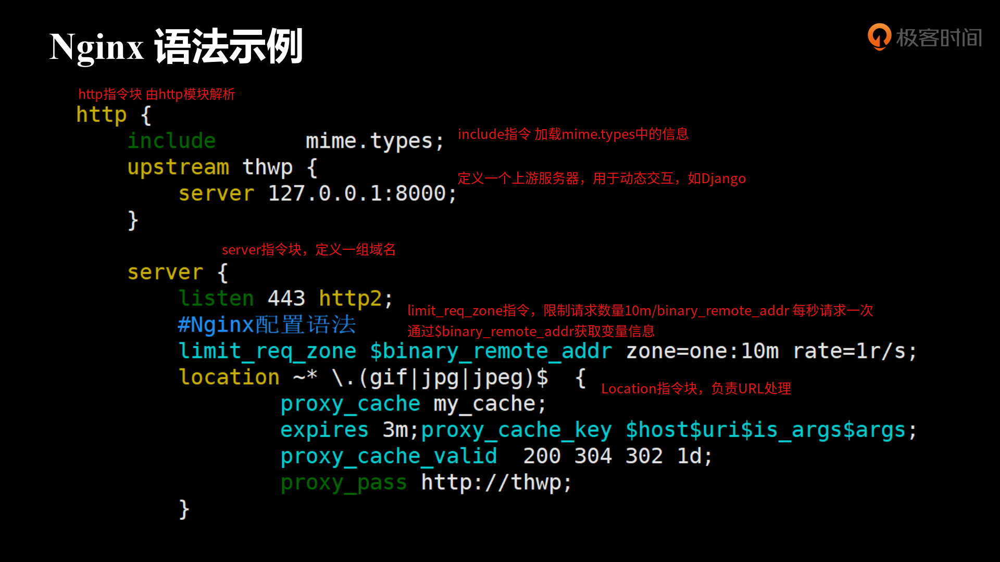
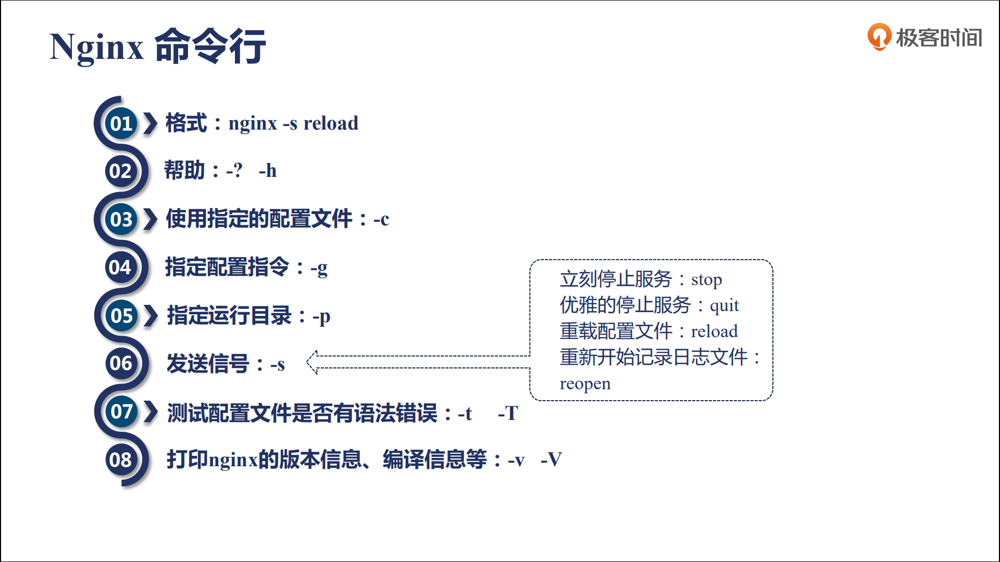

# Nginx

## 初识Nginx

### 使用场景

Nginx通常运行在网络的边界

- 静态资源服务：通过本地文件系统提供服务
- 反向代理服务：缓存、负载均衡
- API服务：OpenResty

### Nginx组成

- Nginx二进制可执行文件
- Nginx.conf配置文件：控制nginx的行为
- access.log访问日志：记录每一条http请求
- error.log错误日志：用于定位问题

### 编译Nginx

- 下载：https://nginx.org/en/download.html

  ```bash
  ➜  Nginx_source wget https://nginx.org/download/nginx-1.17.3.tar.gz
  ➜  Nginx_source tar -zxvf nginx-1.17.3.tar.gz
  ```

- 文件夹

  ```bash
  ➜  nginx-1.17.3 tree -L 1            
  .
  ├── auto	# 供configure命令调用，获取相关信息
  ├── CHANGES	# 修改日志
  ├── CHANGES.ru 	# 俄文修改日志
  ├── conf		# 配置文件模板
  ├── configure	# 生成编译前的配置文件
  ├── contrib		# 提供扩展工具，如vim支持nginx语法
  ├── html		# 提供500错误和欢迎界面
  ├── LICENSE		
  ├── man		# 提供nginx的帮助文档 man ./man/nginx.8
  ├── README
  └── src		# 源码
  # 添加vim扩展包
  ➜  nginx-1.17.3 cp -r contrib/vim/* ~/.vim/
  ```

- configure支持的参数

  ```bash
  ➜  nginx-1.17.3 ./configure --help
  # nginx辅助功能文件
  # 安装目录
  --prefix=PATH          	set installation prefix
  --sbin-path=PATH       	set nginx binary pathname
  ....
  --builddir=DIR         	set build directory
  
  # 模块选择 with开头 默认不开启 with-out 默认开启
  --with-select_module    enable select module
  --without-select_module disable select module
  ....
  # 编译的特殊参数
  --with-cc=PATH     		set C compiler pathname
  ...
  ```

- 生成配置文件

  ```bash
  ➜  nginx-1.17.3 ./configure --prefix=/home/fangjie/Nginx 
  checking for OS
   + Linux 4.15.0-30deepin-generic x86_64
  checking for C compiler ... found
   + using GNU C compiler
   + gcc version: 6.3.0 20170516 (Debian 6.3.0-18+deb9u1) 
  checking for gcc -pipe switch ... found
  ...
  Configuration summary
    + using system PCRE library
    + OpenSSL library is not used
    + using system zlib library
  # 相关目录信息
  nginx path prefix: "/home/fangjie/Nginx"
  nginx binary file: "/home/fangjie/Nginx/sbin/nginx"
  nginx modules path: "/home/fangjie/Nginx/modules"
  ...
  nginx http scgi temporary files: "scgi_temp"
  # 生成的中间文件
  ➜  nginx-1.17.3 tree objs -L 1
  objs
  ├── autoconf.err
  ├── Makefile
  ├── ngx_auto_config.h
  ├── ngx_auto_headers.h
  ├── ngx_modules.c	# 编译时开启的模块
  └── src
  ```

- 编译

  ```bash
  ➜  nginx-1.17.3 make 
  # 生成了大量中间文件与nginx二进制文件
  # 便于升级时，直接拷贝nginx二进制文件到目录中
  ➜  nginx-1.17.3 tree objs -L 1
  objs
  ├── autoconf.err
  ├── Makefile
  ├── nginx			# 二进制文件
  ├── nginx.8			# man文件
  ├── ngx_auto_config.h
  ├── ngx_auto_headers.h
  ├── ngx_modules.c
  ├── ngx_modules.o
  └── src				# 编译时生成的中间文件
  ```

- 安装

  ```bash
  # 安装
  ➜  nginx-1.17.3 make install
  # 查看安装目录
  ➜  nginx-1.17.3 cd /home/fangjie/Nginx
  ➜  Nginx tree -L 1
  .
  ├── conf	# 配置文件目标
  ├── html	
  ├── logs	# 日志目录
  └── sbin	# 二进制文件目录
  ```

### 配置文件

- 配置文件语法
  - 配置文件由指令与指令块构成
  - 每条指令以`；`结尾，指令与参数间以空格符号分隔
  - 指令块通过`{}`将多条指令组织在一起
  - `include`语句允许组合多个配置文件，提高可维护性。
  - 使用#符号添加注释，提高可读性
  - 通过$符号使用变量
  - 部分指令的参数支持正则表达式

  

- 时间单位

  

- 空间单位

  

### Nginx命令行



- 立刻停止和优雅停止的区别：优雅停止会把当前的任务然后后再关闭进程，而立刻停止会直接关闭进程。

#### 重载配置文件

重载配置文件不会影响用户使用。

- 修改配置文件
- 下发重载命令：`./nginx -s reload`

#### 热部署

在运行的过程中进行平稳的升级操作。

```bash
# 查看当前进程信息
➜  sbin ps -ef |grep nginx
fangjie  10018  5059  0 21:12 ?        00:00:04 /usr/share/code/code --unity-launch /home/fangjie/Nginx/conf/nginx.conf
root     15359     1  0 21:59 ?        00:00:00 nginx: master process ./nginx
nobody   15360 15359  0 21:59 ?        00:00:00 nginx: worker process
# 备份老版本nginx
➜  sbin mv nginx nginx.old
# 替换nginx二进制文件
➜  sbin cp nginx.old nginx
# 给当前nginx master进程发送信号：USR2，开始热部署
➜  sbin sudo kill -USR2 15359
➜  sbin ps -ef |grep nginx
fangjie  10018  5059  0 21:12 ?        00:00:05 /usr/share/code/code --unity-launch /home/fangjie/Nginx/conf/nginx.conf
root     15359     1  0 21:59 ?        00:00:00 nginx: master process ./nginx
nobody   15360 15359  0 21:59 ?        00:00:00 nginx: worker process
# 启动了新的nginx master
root     15815 15359  0 22:03 ?        00:00:00 nginx: master process ./nginx
nobody   15818 15815  0 22:03 ?        00:00:00 nginx: worker process
# 老进程不再监听端口

# 通知老nginx master优雅关闭work进程
➜  sbin sudo kill -WINCH 15359
➜  sbin ps -ef |grep nginx    
fangjie  10018  5059  0 21:12 ?        00:00:05 /usr/share/code/code --unity-launch /home/fangjie/Nginx/conf/nginx.conf
root     15359     1  0 21:59 ?        00:00:00 nginx: master process ./nginx
root     15815 15359  0 22:03 ?        00:00:00 nginx: master process ./nginx
nobody   15818 15815  0 22:03 ?        00:00:00 nginx: worker process

```

热部署后，老的nginx master不会退出，可以用于热部署后出现问题时，进行版本回退。

- 版本回退：`kill -USR1  OldMasterPid`，重新加载配置文件。
- 升级成功，退出老的nginx master：`kill -QUIT OldMasterPid`。

#### 日志切割

- 备份日志：`mv 日志名 备份`，改名不会影响已经打开的文件读写，因为文件的inode不变。
- 重新生成日志文件：`./nginx -s reopen`
- 通常会将日志切割操作写成`crontab`，定时执行(可以通过nginx的pid文件获取进程号)。

### 应用示例

#### 静态服务器

```nginx
 http {
    # 是否启用零拷贝，直接在内核中传输数据
    # 避免内核缓冲区和用户缓冲区之间的数据拷贝
    sendfile        on;
    #tcp_nopush     on;
    # 长连接的超时时间
    keepalive_timeout  65;

    # 定义日志格式 main为格式名称
    # 具体的变量可以查看模块的文档
    log_format  main  '$remote_addr - $remote_user [$time_local] "$request" '
                    '$status $body_bytes_sent "$http_referer" '
                    '"$http_user_agent" "$http_x_forwarded_for"';
    # 打开gzip压缩
    gzip on;
    # 小于1k的文件不压缩
    gzip_min_length 1k;
    # 设置压缩级别，越大越好，但是会消耗更多CPU时间
    gzip_comp_level 2;
    # 进行压缩的文件类型，类型可以参考mime.types。
    gzip_types text/plain application/javascript ;
    server{
        # 监听端口
        listen 监听的端口;
        # 域名信息
        server_name 域名;
        # 访问日志位置 日志的格式
        access_log  logs/access.log  main;
        # url解析
        location / {
            # 配置访问域名/时，访问的目录
            alias 文件夹名称/;
            # 是否打开文件树,由autoindex模块解析
            # 文档：http://nginx.org/en/docs/http/ngx_http_autoindex_module.html
            autoindex on;
            # 设置传输速率，腾出带宽为更多用户服务
            # limit_rate由http_core_module模块提供
            # 文档：http://nginx.org/en/docs/http/ngx_http_core_module.html
            set $limit_rate 1k;
            # 会将任何以/结尾的url，尝试添加index.html或index.htm
            # 可以用于访问目录的默认界面
            # index  index.html index.htm;
        }
    }
 }
```

#### 反向代理

#### GoAccess

#### SSL

