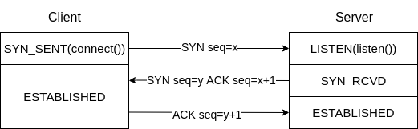
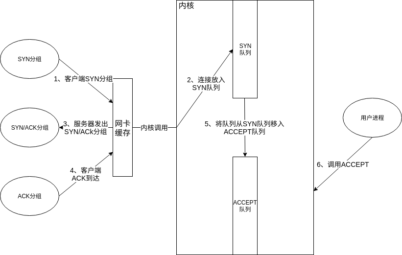

# Nginx优化—TCP握手流程优化

## 0X00 简介

这一节将先为大家简单介绍下TCP三次握手流程，然后介绍下内核是如何处理连接的握手流程以及内核提供了哪些参数。有了这些知识点作为铺垫后，再为大家介绍`Nginx`中相应的优化方法。

## 0X01 为什么TCP需要三次握手？

TCP协议是一种全双工协议，从逻辑上来说两端可以同时发送数据，因此从逻辑上来说，TCP连接可以视作为两个单向连接组成的连接。


TCP协议是面向连接的协议，正式传输数据之前，必须建立好连接，交换初始化信息。

TCP是一个可靠协议，每个发出的报文都需要对端发送`ACK`包，确保对端收到自己发出的报文，如果发出者没有收到报文的`ACK`，则会重发报文。在这个过程中，两端会通过报文`seq`来确保报文的有序性，`seq`是一个`2^32`序列号，报文序列号依次递增。两端握手时，其中一个核心任务就是交换初始序列号(`ISN`，具体计算暂且不表)。一个TCP连接可以用四元组进行标识`(源IP,源端口,目标IP,目标端口)`。

了解了握手流程的任务后，就能明白TCP为什么需要三次握手。

- 第一次握手：客户端初始化号资源后，主动发起连接请求，提供自己的端口号和`ISN`。
- 第二次握手：服务器收到`SYN`报文后，初始化资源，返回自己的`ISN`同时也会发送客户端握手请求的`ACK`。
- 第三次握手：客户端收到服务器的`SYN`报文后，返回`ACK`。



这里也简单介绍下TCP报文段的头部信息：


头部第四行的第2个字节的八位表示该报文段的类型，同一个报文可以是多种类型，只需要对应的二进制位为`1`即可。这也是第二次握手流程中，第一次握手流程的`ACK`报文段和第二次握手流程的`SYN`报文段共同发送的原因。

## 0X02 内核如何处理TCP握手流程？

服务器作为代理服务器时，TCP四元组中的源`IP`、目标`IP`、目标端口已经确定，因此源端口数量限制了服务器能发起的连接数。内核有两个参数用于控制作为客户端发起请求时的行为：

- `net.ipv4.ip_local_port_range`：建立连接时，端口的可用范围，可以修改该参数，上限为`65535`。
- `net.ipv4.tcp_syn_retries`：建立连接时，`SYN`重发次数。

```bash
# 查看
[root@fangjie ~]# cat /proc/sys/net/ipv4/ip_local_port_range 
32768	60999

# 临时修改
[root@fangjie ~]# echo '32768 55555' > /proc/sys/net/ipv4/ip_local_port_range
[root@fangjie ~]# cat /proc/sys/net/ipv4/ip_local_port_range 
32768	55555

# 永久修改 /etc/sysctl.conf
[root@fangjie ~]# echo "net.ipv4.ip_local_port_range = 32768 60999" >> /etc/sysctl.conf
[root@fangjie ~]# /sbin/sysctl -p
[root@fangjie ~]# cat /proc/sys/net/ipv4/ip_local_port_range
32768	60999
```




上图描述了作为服务器，内核完整处理一个`TCP`连接的握手流程，在这个流程中会经历三个缓存队列，但是一台服务器的资源有限，攻击者可通过短时间构造不同`IP`的`SYN`报文，快速占满队列，达到让服务器不能为正常用户服务的目的(`SYN`报文攻击)。内核提供了几个参数用于调整这三个队列：

- `net.core.netdev_max_backlog`：调整网卡缓存中报文个数。
- `net.ipv4.tcp_max_syn_backlog`：调整`SYN`队列中处于`SYN_RCVD`状态的TCP连接个数。
- `net.ipv4.tcp_max_synack_retries`：`SYN/ACK`分组重发次数。
- `net.ipv4.tcp_abort_on_overflow`：值为`1`时，如果超出处理能力，将对新的`SYN`分组回复`RST`分组，丢弃连接。
- `net.core.somaxconn`：调整`ACCEPT`队列中处于`ESTABLISHED`状态的连接个数。
- `net.ipv4.tcp_syncookies `：值为`1`时，启用`SYN Cookie`算法。

`SYN Cookie`算法用于应对`SYN`报文攻击，它的原理是：服务器采用特殊算法为SYN分组生成一个序列号，然后向客户端发送`SYN+ACK`分组，正常客户端收到分组后，返回`ACK`分组，服务器校验`ACK`分组中序列号后，恢复正常连接。换句话说，`SYN Cookie`算法将服务器为连接分配的资源(序列号)存放在`SYN/ACK`分组中，正常客户端会通过`ACK`分组返回该资源，因此连接不会进入`SYN_RCVD`状态。

`SYN Cookie`算法中最大的问题是，`SYN`攻击会占用序列号空间，导致此时所有TCP可选功能都会失效。

Linux中，一切皆文件，TCP连接也是以文件存在的。因此操作系统的文件句柄数也会限制建立的TCP连接数：

- `fs.file-max`：操作系统可使用的最大句柄数。
- `fs.file-nr`：当前已经分配句柄数、正使用句柄数、句柄上限。

`/etc/security/limits.conf`中对用户的句柄数上限也会限制该用户启动的进程建立的TCP连接数。

- `hard`：`soft`只能小于等于`hard`，由`root`用户设置。
- `soft`：限制会话或进程使用句柄数的最大值，非`root`用户可以修改`soft`值。

```nginx
# 查看最大值
[root@fangjie ~]#  cat /proc/sys/fs/file-max 
382069
# 当前使用情况
[root@fangjie ~]#  cat /proc/sys/fs/file-nr 
1056	0	382069
# 用户限制
[root@fangjie ~]#  tail -n 2 /etc/security/limits.conf 
root soft nofile 100001
root hard nofile 100002
```

## 0X03 如何优化TCP握手连接？

## 0X04 Nginx提供了哪些对应指令呢？

