# HTTP

## 处理流程

针对HTTP请求，Nginx定义了一个处理流程，该处理流程有11个阶段。除HTTP过滤模块和只提供变量的模块之外，其他HTTP模块必须在这11个阶段之中。


每个阶段中都对应着相关的模块，同一个阶段中可以有多个模块，模块之间也会有执行顺序。


具体的执行顺序将在`configure`的产物`ngx_modules.c`中定义，`ngx_module_names`定义了相关模块的执行顺序(执行顺序是定义的倒序)。

```c
char *ngx_module_names[] = {
… …
"ngx_http_static_module",
"ngx_http_autoindex_module",
"ngx_http_index_module",
"ngx_http_random_index_module",
"ngx_http_mirror_module",
"ngx_http_try_files_module",
"ngx_http_auth_request_module",
"ngx_http_auth_basic_module",
"ngx_http_access_module",
"ngx_http_limit_conn_module",
"ngx_http_limit_req_module",
"ngx_http_realip_module",
"ngx_http_referer_module",
"ngx_http_rewrite_module",
"ngx_http_concat_module",
… …
}
```

当请求到来后，Nginx会依次调用阶段对应的模块，处理请求。

## POST_READ阶段

### 理论

`POST_READ`阶段负责处理请求头部，该阶段只有一个模块`ngx_http_realip_module`。`realip`模块默认不会编入nginx，编译时，可使用`--with-http_realip_module`打开该模块。该模块会修改变量`remote_addr`中存储的客户端地址，默认是从TCP四元组中取源IP。如果传输过程中出现代理，通过`remote_addr`将不能获取到用户真实的IP，后续的限流操作也就无从谈起。

HTTP中有三种方法用于获取客户端的真实IP：

- `X-Real-IP`：记录客户端真实IP。
- `X-Forwarded-For`：会以链表形式表示为谁转发的信息。如`X-Forwarded-For:127.0.0.1,192.168.0.1`，当前HTTP请求转发自`192.168.0.1`。
- `proxy_protocol`：代理协议，会在TCP报文前添加源IP、源端口、目标IP、目标端口。

`realip`模块默认避讳编译进Nginx，需要在`configure`时通过`--with-http_realip_module`启用该功能。该模块提供两个变量和三个命令：

- `$realip_remote_addr`：TCP连接源IP。
- `$realip_remote_port`：TCP连接源端口。

- `set_real_ip_from`：设置可信地址，只有可信地址的连接才替换`remote_addr`。
- `real_ip_header`：指定`remote_addr`来源，如果采用X-Forwarded-For时，取末尾IP。
- `real_ip_recursive`：为`on`时，根据`X-Forwarded-For`，从右到左找第一个不是`set_real_ip_from`指定的IP。

### 实验

```nginx
# 编辑nginx.conf
worker_processes  1;

events {
    worker_connections  1024;
}

http {
    include       mime.types;
    default_type  application/octet-stream;

    sendfile        on;
    keepalive_timeout  65;

    server {
        listen 8080;
        server_name localhost;
        error_log logs/myerror.log debug;
        set_real_ip_from  127.0.0.1;
        #real_ip_header X-Real-IP;
        #real_ip_recursive off;
        real_ip_recursive on;
        real_ip_header    X-Forwarded-For;

        location /{
            return 200 "Client real ip: $remote_addr\n";
        }

    }
}
```

测试结果：


### 注意

- `set_real_ip_from`、`real_ip_header`不要放在`location`中，否则`remote_addr`将不会生效。
## SERVER_REWRITE阶段

### 理论

`SERVER_REWRITE`和`REWRITE`阶段主要负责重定向，这两个阶段公用`ngx_http_rewrite_module`模块。`rewrite`模块提供三个功能：

- 通过正则表达式修改请求的URI。
- 进行重定向。
- 条件选择。

为此，Nginx提供了五个指令：

- `break`：停止处理`rewrite`模块的指令，进入下一个阶段。
- `if (condition){...}`：如果`condition`成立，则执行相应的语句。
  - 变量，如果变量值为空或`0`则为`false`。
  - 字符串等值匹配：`=`、`!=`
  - 正则表达式：`~`(大小写敏感)、`~*`
  - 文件存在表达式，`-f`(文件)、`!-f`、`-d`(目录)、`!-d`、`-e`(文件或目录)、`!-e`、`-x`(可执行文件)、`!-x`。
- `return code|code text|code URL|URL`：返回指定的code或URL并停止处理。
  - `444`为特殊错误码，nginx将立即关闭连接，不返回任何内容。
  - `301`：永久重定向
  - `302`：临时重定向
  - `303`：临时重定向，允许改变方法
  - `307`：临时重定向，不允许改变方法
  - `308`"：永久重定向，不允许改变方法
- `rewrite regex replacement [flag]`：使用`replacement`替换`regex`的匹配值，`flag`表明是否继续匹配下去。如果`replacement`以`http://`、`https://`或`$scheme`开头，将停止处理并返回给客户端。
  - `last`：停止处理，进入下一个location匹配。
  - `break`：停止`rewrite`模块的指令处理。
  - `redirect`：返回302重定向，前提是`replacement`不满足三种情况。
  - `permanent`：返回永久重定向301。
- `set $variable value`：设置变量值。
- `rewrite_log`：执行结果是否记录在error_log中。
- `uninitialized_variable_warn`：是否记录未初始化的变量。

### 正则表达式

`rewrite`模块采用PCRE正则表达式，可以使用子表达式，并且通过`$1..$9`进行引用。针对于匹配大小写问题，它提供了四个符号：
- 大小写敏感：`~`、`!~`
- 大小写不敏感：`~*`、`!~*`


### 实验

```nginx
worker_processes  1;

events {
    worker_connections  1024;
}

http {
    include       mime.types;
    default_type  application/octet-stream;

    sendfile        on;
    keepalive_timeout  65;

    server {
        listen 80;
        server_name rewrite.fangjie.site;
        rewrite ^(/download)(/.*)/media/(.*)\..*$ $1/mp3/$3.mp3 last;
        root html/;
        rewrite_log on;
	    # rewrite记录位置
        error_log logs/rewrite_error.log notice;
        location /first {
            # uri变为/second$1，进入下一个location
            rewrite /first(.*) /second$1 last;
            return 200 'first!';
        }
        location /second {
            # 返回/third$1文件，因为有break，所以不会再匹配
            rewrite /second(.*) /third$1 break;
            return 200 'second!';
        }
        location /third {
            return 200 'third!';
        }

        location /redirect1 {
            # 返回301
            rewrite /redirect1(.*) $1 permanent;
        }
        location /redirect2 {
            # 返回302
            rewrite /redirect2(.*) $1 redirect;
        }
        location /redirect3 {
            # 返回302 因为以http开始
            rewrite /redirect3/(.*) https://www.baidu.com/s?wd=$1;
        }
        location /redirect4 {
            # 返回301 因为添加了permanent限制
            rewrite /redirect4/(.*) https://www.baidu.com/s?wd=$1 permanent;
        }
    }
}
```

测试结果：


### 注意

- `error_page`：`ngx_http_core_module`模块中的`error_page`指令用于处理正常请求的错误码，能重写错误码并指定返回的内容，如果`return`指令生效后，`error_page`将无法处理。
- `rewrite`指令执行完毕后，会向客户端返回最终uri指向的数据。

## FIND_CONFIG阶段

### 理论

`FIND_CONFIG`阶段主要负责查找处理请求的`location`指令块，具体操作由`Nginx`框架负责。该阶段有两个重要指令：

- `location`：匹配URI
  - 前缀字符串：常规字符串、`=`(精确匹配)、`^~`(匹配上后不再进行正则表达式匹配)
  - 正则表达式：`~`(大小写敏感)、`~*`(大小写不敏感)
  - 定义内部跳转：`@`
- `merge_slashes`：是否合并`uri`中的双斜杠。

### 匹配顺序

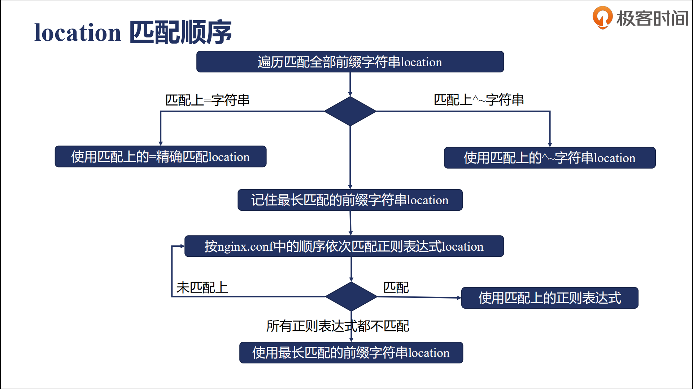

- 前缀字符串匹配
  - 匹配到精确匹配时，则使用该location。
  - 匹配到`^~`匹配时，则使用该location；匹配到多个location时，采用最长前缀的location。
  - 记住最长匹配，进入正则表达式匹配
- 正则表达式匹配，按定义顺序执行
  - 匹配上，则使用正则表达式指定的location。
  - 全部未匹配，则采用最长匹配的前缀字符串location。

### 实验

```nginx
worker_processes  1;
events {
    worker_connections  1024;
}

http {
    include       mime.types;
    default_type  application/octet-stream;
    sendfile        on;
    keepalive_timeout  65;

	server {
		listen 80;
		server_name fangjie.site;
		error_log logs/myerror.log notice;
		merge_slashes on;
		
		# 测试精确匹配，只匹配/Test1
		location = /Test1 {
			return 200 'match:= /Test1';
		}
		# 前缀字符串匹配，匹配后，不会执行正则匹配
		# 匹配/Test1开头,但是优先级比 =/Test1低
		location ^~ /Test1 {
			return 200 'match:^~ /Test1';
		}
		# 测试多个^~时，取最长匹配
		location ^~ /Test1/Test2 {
			return 200 'match:^~ /Test1/Test2';
		}
		# 大小写敏感，正则表达式匹配，不会被匹配到，因为^~拦截了
		location ~ /Test1/$ {
			return 200 'match:~ /Test1/\n';
		}
		
		# 常规前缀匹配
        location /Test3 {
            return 200 'match:/Test3';
        }
		# 常规前缀匹配，获取最长匹配
        location /Test3/Test2 {
            return 200 'match:/Test3/Test2';
        }

		
		# 测试常规匹配后，进行正则表达式匹配
		location /Test4 {
            return 200 'match:/Test4';
        }
		location ~ /Test4/T/(\w+) {
			return 200 'match:~ /Test4/T/(\w+)\n';
		}
		
		# 正则表达式大小写敏感
		location ~ /Test2/(\w+) {
			return 200 'match:~ /Test2/\n';
		}
		# 大小写不敏感，正则表达式匹配
		location ~* /Test5/(\w+)$ {
			return 200 'match:~* /Test5\n';
		}
	}
}
```

测试结果

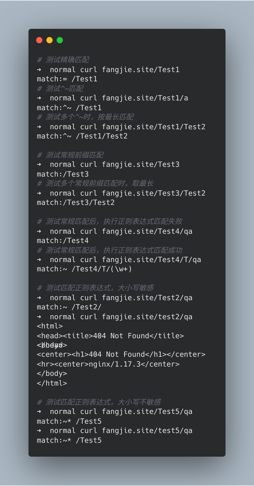


## PRE_ACCESS阶段

`PRE_ACCESS`阶段负责限制客户端的并发连接数和请求数，该阶段有两个模块：`ngx_http_limit_req_module`和`ngx_http_limit_conn_module`。`limit_conn`模块用于限制客户端的并发连接数，`limit_req`模块用于限制客户端每秒的请求数。

### limit_conn

#### 理论

`limit_conn`模块用于限制客户端的并发连接数，默认编入nginx，编译时，可使用`--without-http_limit_conn_module`禁用该模块。`limit_conn`模块基于共享内存，因此在全部worker进程中都生效，其限制的有效性取决于`POST_READ`阶段，通过`relaip`获取的IP是否真实。

该模块提供四个指令用于操作相关的配置：

- `limit_conn_zone key zone=name:size`：创建共享内存。
- `limit_conn zone_name number`：设置并发连接数。
- `limit_conn_log_level info | notice | warn | error`：发生限制时，记录的日志级别。
- `limit_conn_status code`：发生限制时，返回的响应码。

#### 实验

```nginx
worker_processes  1;
events {
    worker_connections  1024;
}

http {
    include       mime.types;
    default_type  application/octet-stream;
    sendfile        on;
    keepalive_timeout  65;
	# 以binary_remote_addr作为key，创建一个10M的共享空间，空间名为addr
	limit_conn_zone $binary_remote_addr zone=addr:10m;
	server {
		listen 80;
		server_name fangjie.site;
		error_log logs/myerror.log notice;
		
		location / {
			limit_conn_status 500;
			limit_conn_log_level  warn;
			# 限制每秒向客户端返回为字节数，更好触发并发连接
			limit_rate 50;
			# 并发连接数为1
			limit_conn addr 1;
		}
	}
}
```

测试结果：

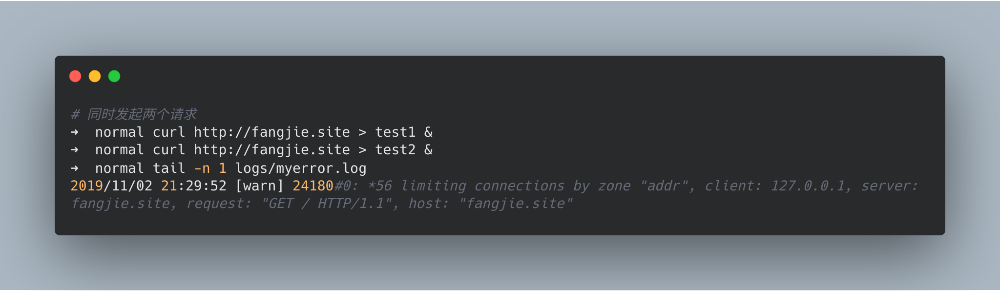

### limit_req

#### 理论

`limit_req`模块用于限制客户端每秒的请求数，默认编入nginx，编译时，可使用`--without-http_limit_req_module`禁用该模块。`limit_req`模块基于共享内存，因此在全部worker进程中都生效，其限制的有效性取决于`POST_READ`阶段，通过`relaip`获取的IP是否真实。`limit_req`模块采用`leaky bucket`算法(漏斗算法)，它的目的是让请求速率保持恒定，使突发的流量变得平滑。


漏桶算法的核心是建立一个缓冲区，通过固定的速率消费缓冲的请求，如果缓冲区满，则拒绝掉请求。

`limit_req`模块提供了四个指令：

- `limit_req_zone key zone=name:size rate=rate`：创建共享内存。
- `limit_req zone=name [burst=number] [nodelay]`：设置请求数。
  - burst：默认为0，缓存区能容纳多少个请求。
  - nodelay：立即处理burst中的请求。
- `limit_req_log_level info | notice | warn | error`：发生限制时，记录的日志级别。
- `limit_red_status code`：发生限制时，返回的响应码。

#### 实验

```nginx
worker_processes  1;
events {
    worker_connections  1024;
}

http {
    include       mime.types;
    default_type  application/octet-stream;
    sendfile        on;
    keepalive_timeout  65;
	# 以binary_remote_addr作为key，创建一个10M的共享空间，空间名为one
	# 每分钟消费一个请求
	limit_req_zone $binary_remote_addr zone=one:10m rate=1r/m;
	server {
		listen 80;
		server_name fangjie.site;
		error_log logs/myerror.log notice;
		
		location / {
			limit_req_status 500;
			limit_req_log_level  warn;
			# 限制每秒向客户端返回为字节数，更好触发并发连接
			limit_rate 50;
			# 允许两个请求排队，并且立即处理排队请求
			limit_req zone=one burst=2 nodelay;
		}
	}
}
```

测试结果：

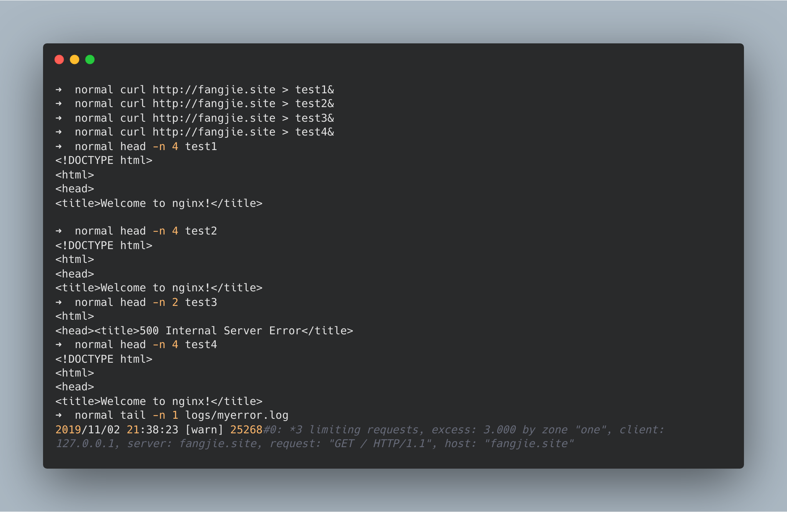

## ACCESS阶段

`ACCESS`阶段负责处理用户的访问权限，包含三个模块：`ngx_http_access_module`、`ngx_http_auth_basic_module`和`ngx_http_auth_request_module`。`access`模块用于IP黑白名单，`auth_basic`模块用于`HTTP Basic Authentication`认证、`auth_request`模块可以使用第三个做权限控制。

### access

#### 理论

`access`模块提供两个指令用于设置IP的访问权限：

- ` allow address | CIDR | unix: | all`：设置白名单
- ` deny address | CIDR | unix: | all`：设置黑名单

#### 实验

```nginx
worker_processes  1;
events {
    worker_connections  1024;
}

http {
    include       mime.types;
    default_type  application/octet-stream;
    sendfile        on;
    keepalive_timeout  65;
	server {
		listen 80;
		server_name fangjie.site;
		error_log logs/myerror.log notice;
		set_real_ip_from 127.0.0.1;
		real_ip_header X-Real-IP;
		location / {
			allow 192.168.0.1/24;
			deny 127.0.0.1;
		}
	}
}
```

测试结果：

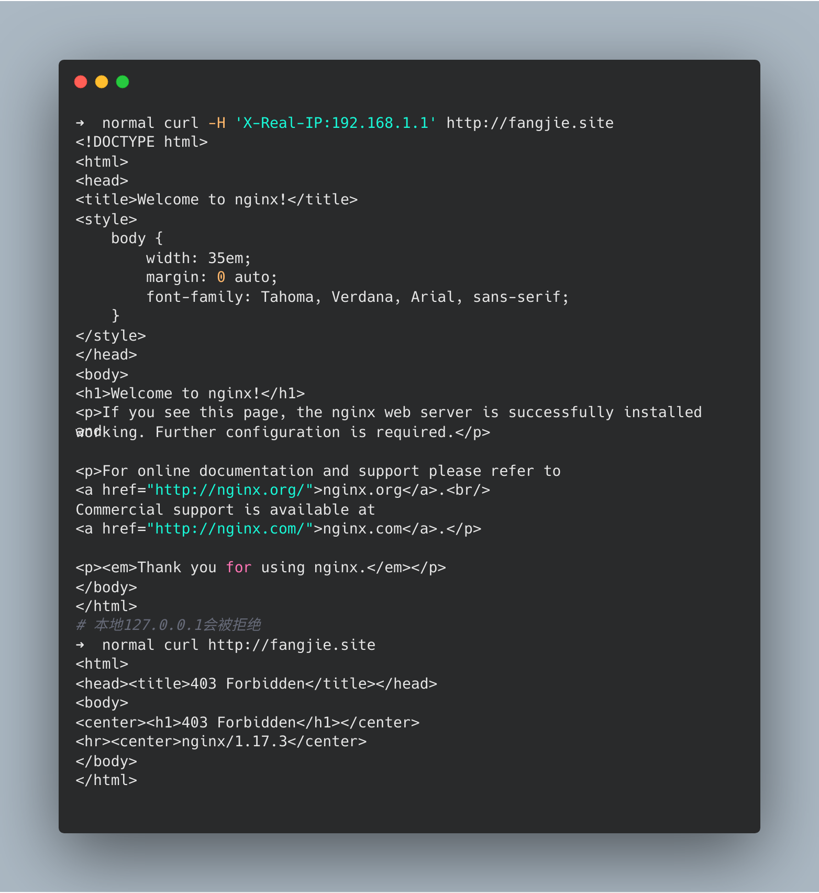

### auth_basic

#### 理论

`auth_basic`模块基于`RFC2617:HTTP Basic Authentication`协议，对用户名和密码进行认证，默认编入nginx，可使用`--without-http_auth_basic_module disable ngx_http_auth_basic_module`关闭该模块。

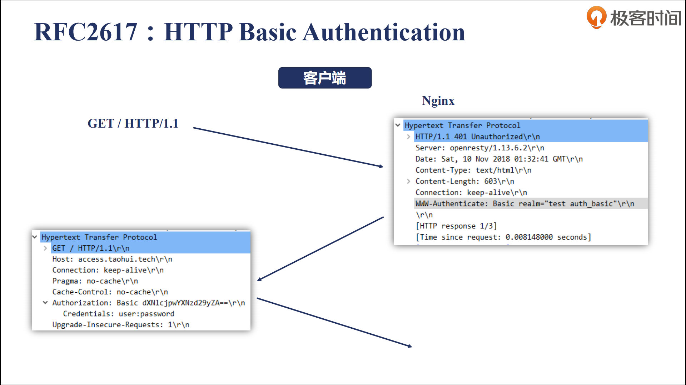

该模块提供两个指令：

- `auth_basic string | off`：是否打开认证，打开时，`string`为弹窗title。
- `auth_basic_user_file file`：设置用户名和密码文件位置，格式为`username:password`。

#### 实验

先通过httpd-tools包中命令
`htpasswd –b –c file  user pass`创建密码文件。

```nginx
worker_processes  1;
events {
    worker_connections  1024;
}

http {
    include       mime.types;
    default_type  application/octet-stream;
    sendfile        on;
    keepalive_timeout  65;
	server {
		listen 80;
		server_name fangjie.site;
		error_log logs/myerror.log notice;
		set_real_ip_from 127.0.0.1;
		real_ip_header X-Real-IP;
		location / {
			auth_basic your_user_name_and_password;
			auth_basic_user_file ../pwd/password;
		}
	}
}
```

测试结果：

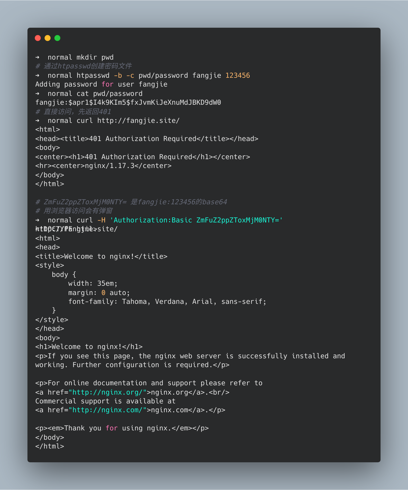

### auth_request

#### 理论

`auth_request`模块收到请求后，将生产子请求，通过反向代理，将子请求传递给上游服务，若上游服务返回`2XX`响应码，则继续执行；若上游服务器返回`401`或`403`，则将子请求的响应返回给客户端。该模块默认没有编入nginx，编译时，可以通过`--with-http_auth_request_module`打开该模块。

该模块提供两个指令：

- `auth_request uri | off`：打开认证时，将把子请求转发给`uri`。
- `auth_request_set $variable value`：设置变量，用于后续判断。

#### 实验

该实验需要有启动两个Nginx服务，上游服务的配置为：

```nginx
worker_processes  1;
events {
    worker_connections  1024;
}

http {
    include       mime.types;
    default_type  application/octet-stream;
    sendfile        on;
    keepalive_timeout  65;
	server {
		listen 8000;
		server_name localhost;
		error_log logs/myerror.log notice;
        location / {
            if ($remote_addr = 127.0.0.1){
                return 200;
            }
            return 400;
        }
	}
}
```

验证服务的nginx配置为：

```nginx
worker_processes  1;
events {
    worker_connections  1024;
}

http {
    include       mime.types;
    default_type  application/octet-stream;
    sendfile        on;
    keepalive_timeout  65;
	server {
		listen 80;
		server_name fangjie.site;
		error_log logs/myerror.log notice;
		location / {
			# uri是本机的一个反向代理，也可以是一个具体的地址
			auth_request /auth_request;
		}
		
		location = /auth_request{
			proxy_pass http://127.0.0.1:8000;
			# 不传递body
			proxy_pass_request_body off;
			proxy_set_header Content-Length '';
			# 传递原始的uri
			proxy_set_header X-Original-URI $request_uri;
		}
	}
}
```

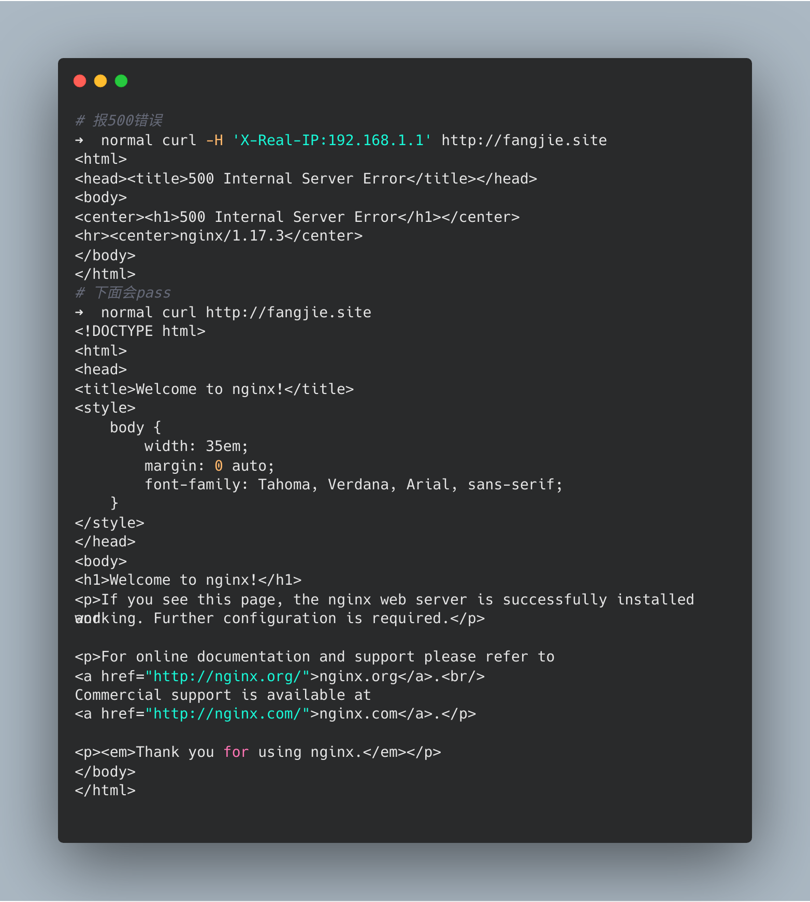

### 注意

- Nginx还提供了一个指令`satisfy all | any`，如果为`any`，则`ACCESS`阶段中任一模块通过，则进入下一阶段；如果为`all`，则要求`ACCESS`阶段中所有的模块都必须通过。

## PRE_CONTENT阶段

`PRE_CONTENT`阶段有两个模块`ngx_http_try_files_modules`和`ngx_http_mirror_module`模块。

### try_files

#### 理论

`try_files`模块由`ngx_http_core_module`提供支持，该模块只有一个指令：

- `try_files file ... uri|try_files file ...=code`：将依次访问指定的文件，如果文件都不存在，则将返回最后一个`uri`或`code`的结果。

`try_files`指令中可以使用一个特殊参数`$uri`，表示当前的路径，路径由`root`或`alias`指定。

#### 实验

```nginx
worker_processes  1;
events {
    worker_connections  1024;
}

http {
    include       mime.types;
    default_type  application/octet-stream;
    sendfile        on;
    keepalive_timeout  65;
	server {
		listen 80;
		server_name fangjie.site;
		error_log logs/myerror.log notice;
		root html/;
		location /first{
			# $uri表示html/first
			try_files $uri $uri/index.html $uri.html @lasturl;
		}
        # 内部服务
		location @lasturl{
			return 200 'lasturl!\n';
		}
		location /second{
			try_files $uri $uri/index.html $uri.html =400;
		}
	}
}
```

实验结果：

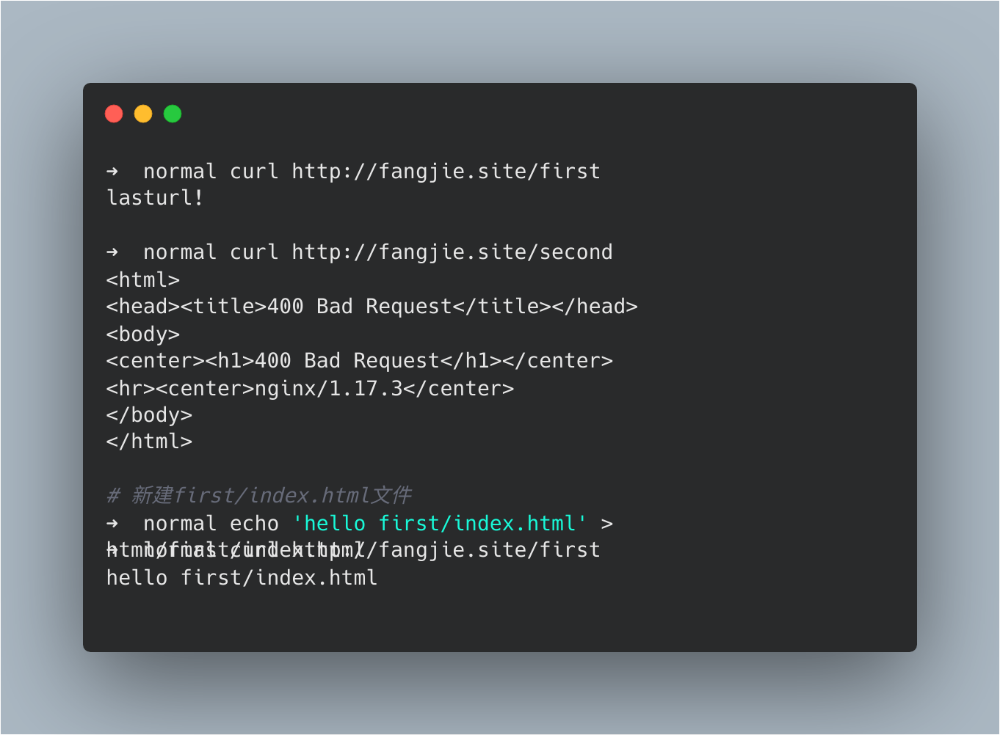

### mirror

#### 理论

`mirror`模块将生成一个子请求，然后发送给指定的URI，子请求的返回值不会影响当前模块的处理。`mirror`模块通常用于A/B测试，该模块默认编入nginx，编译时，可以使用`--without-ngx_http_mirror_module`关闭该模块。

`mirror`模块提供两条指令：

- `mirror uri | off`：是否打开`mirror`，打开时，子请求发往的`uri`。
- `mirror_request_body on|off`：是否发送body。

#### 实验

该实验也需要两个Nginx服务，上游的Nginx配置为：

```nginx
worker_processes  1;
events {
    worker_connections  1024;
}

http {
    include       mime.types;
    default_type  application/octet-stream;
    sendfile        on;
    keepalive_timeout  65;
	server {
		listen 8000;
		server_name localhost;
		error_log logs/myerror.log notice;
        location / {
            return 200 'hello';
        }
	}
}
```

`mirror`模块Nginx配置为：

```nginx
worker_processes  1;
events {
    worker_connections  1024;
}

http {
    include       mime.types;
    default_type  application/octet-stream;
    sendfile        on;
    keepalive_timeout  65;
	server {
		listen 80;
		server_name fangjie.site;
		error_log logs/myerror.log notice;
		root html/;
		location /first{
			mirror /mirror;
			mirror_request_body off;
		}
		location = /mirror {
			internal;
			proxy_pass http://127.0.0.1:8000$request_uri;
			proxy_pass_request_body off;
			proxy_set_header Content-Length "";
			proxy_set_header X-Original-URI $request_uri;
		}
	}
}
```

实验结果：

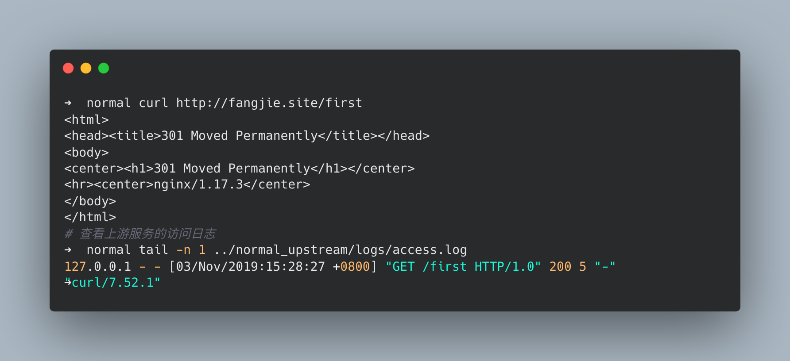

## CONTENT阶段

`CONTENT`阶段负责生成响应，其中包含五个模块：`ngx_http_concat_module`、`ngx_http_random_index_module`、`ngx_http_index_module`、`ngx_http_auto_index_module`、`ngx_http_static_module`。

### concat

#### 理论

`concat`模块可以将多个小文件合并为一个响应，通过减少请求次数，提高性能。`concat`模块由`Tengine`开发，编译时，需要先下载[源码](https://github.com/alibaba/nginx-http-concat)，然后使用`--add_module path`添加模块。该模块的使用方法是通过在`url`后添加`??文件1,文件2...`，如`http://example.com/??1.js,2.js`。

`concat`模块提供6个指令：

- `concat on|off`：是否打开该功能。
- `concat_delimiter string`：指定文件的分割符。
- `content_type MIME types`：指定拼接的文件类型。
- `concat_unique on|off`：是否只对一种文件进行拼接。
- `concat_ignore_file_error on|off`：文件不存在时，是否忽略。
- `concat_max_files number`：最多拼接文件个数。

#### 实验

编译安装流程：

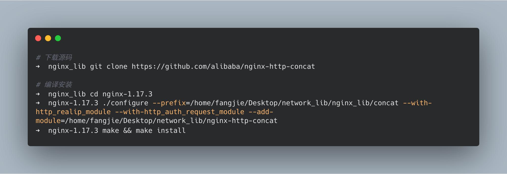

Nginx配置文件

```nginx
worker_processes  1;
events {
    worker_connections  1024;
}

http {
    include       mime.types;
    default_type  application/octet-stream;
    sendfile        on;
    keepalive_timeout  65;
	server {
		listen 80;
		server_name fangjie.site;
		error_log logs/myerror.log notice;
		root html/;
		location /{
            # 打开concat
            concat on;
            # 指定类型
            concat_types text/plain;
            # 指定分隔符
            concat_delimiter ':::';
            concat_max_files 2;
		}
	}
}
```

实验结果：

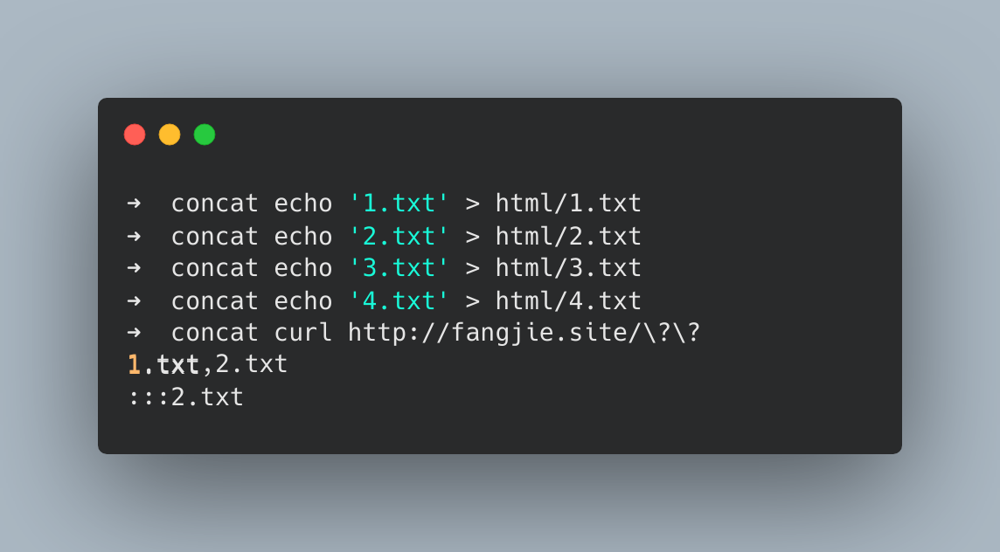

### random_index

#### 理论

`random_index`模块用于处理uri以`/`结尾的请求，将随机返回目录下一个文件作为`index`文件。该模块默认不编入Nginx，编译时，使用`--with-http_random_index_module`打开该模块。`random_index`模块只提供一个命令：

- `random_index on|off`：是否打开该功能。

#### 实验

```nginx
worker_processes  1;
events {
    worker_connections  1024;
}

http {
    include       mime.types;
    default_type  application/octet-stream;
    sendfile        on;
    keepalive_timeout  65;
	server {
		listen 80;
		server_name fangjie.site;
		error_log logs/myerror.log notice;
		root html/;
		location /{
            random_index on;
		}
	}
}
```

实验结果：

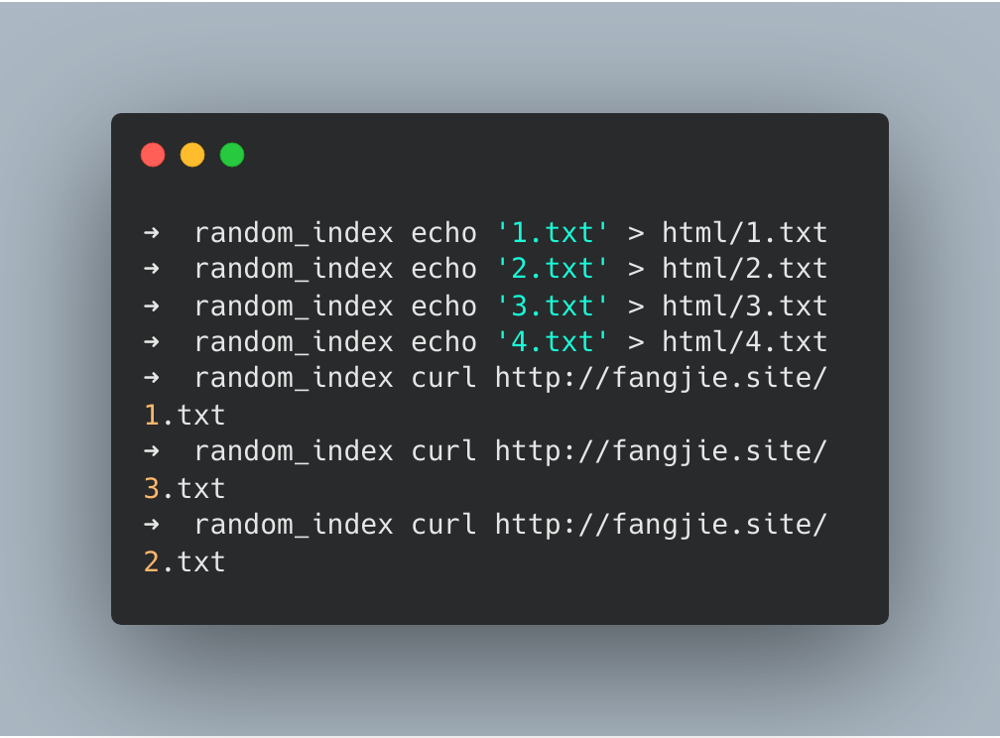

### index

#### 理论

`index`模块会在`url`以`/`结尾时，返回`index`指令指定的文件，默认为`index、index.html`。该模块只提供一个指令：

- `index file`：指定返回的文件名。

#### 实验

```nginx
worker_processes  1;
events {
    worker_connections  1024;
}

http {
    include       mime.types;
    default_type  application/octet-stream;
    sendfile        on;
    keepalive_timeout  65;
	server {
		listen 80;
		server_name fangjie.site;
		error_log logs/myerror.log notice;
		root html/;
		location /{
		}
        location /first{
            index first.html;
        }
	}
}
```

实验结果

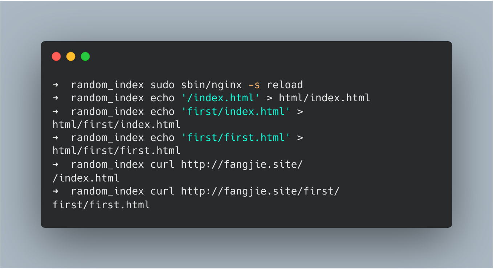

### auto_index

#### 理论

`auto_index`模块会在url以`/`结尾时，返回对应目录的结构。该模块默认编入nginx，编译时，可以使用`--without-http_autoindex_module`关闭该模块。

`auto_index`模块提供了四条指令：

- `autoindex on|off`：是否打开该功能。
- `autoindex_exact_size on|off`：是否返回文件精确的大小，只针对html文件有效。
- `autoindex_format html|xml|json|jsonp`：指定返回的信息格式。
- `autoindex_locltime on|off`：是否采用服务器本地时间。

#### 实验

```nginx
worker_processes  1;
events {
    worker_connections  1024;
}

http {
    include       mime.types;
    default_type  application/octet-stream;
    sendfile        on;
    keepalive_timeout  65;
	server {
		listen 80;
		server_name fangjie.site;
		error_log logs/myerror.log notice;
		root html/;
		location /{
		}
        location /first{
            autoindex on;
			autoindex_exact_size on;
			autoindex_format json;
        }
	}
}
```

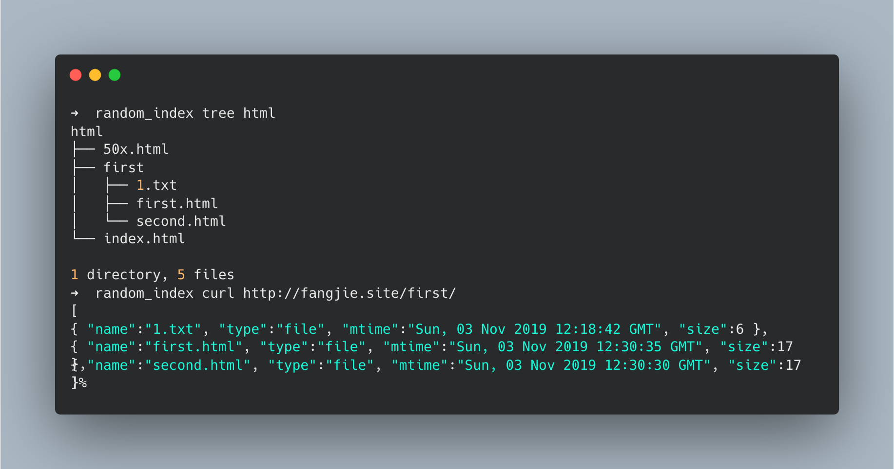

### static

#### 理论

`static`模块由`ngx_http_core_module`提供，主要负责静态文件的处理。`static`模块中有两个非常重要的命令：

- `alias`：将`location`匹配的uri重定向到指定目录下。
- `root`：设置静态资源的根目录。

举个简单例子：

```nginx
server {
		listen 80;
		server_name fangjie.site;
		error_log logs/myerror.log notice;
		root html/;
        location /first{
            # 访问的目录是/html/first/first
		    root html/first;            
		}
        location /second {
           
            alias third/
        }
}
```


访问`/second`将获取`html/third/index.html`，而访问`/first`将获取`/html/first/first/index.html`。

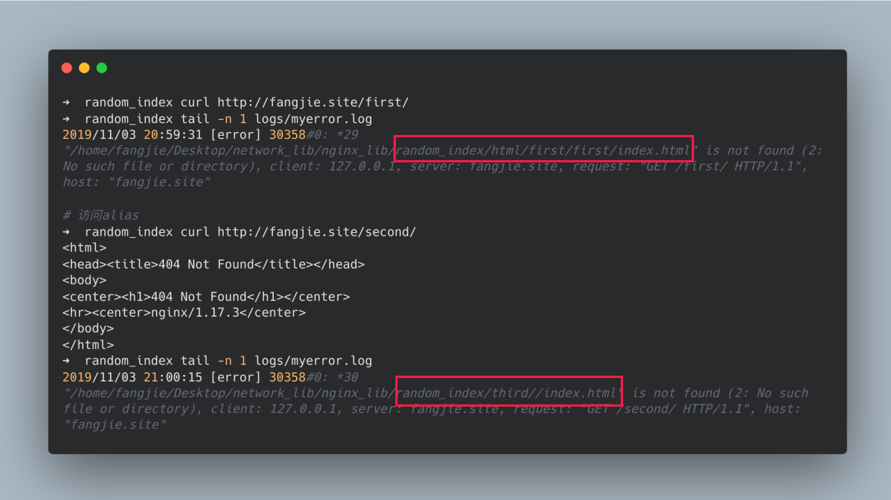

与此同时，`static`模块还提供了3个和文件路径相关的变量：

- `$request_filename`：文件的完整路径。
- `$document_root`：文件所在文件夹路径。
- `$realpath_root`：文件的真实路径，如果存在软连接，则执行文件真正存在的位置。

返回静态文件时，`static`模块提供了几个指令用于控制响应的`Content-Type`头部：

- `types { text/html html; image/gif gif;}`：指定后缀名和`type`的映射关系。
- `default_type mime-type`：指定默认类型。
- `types_hash_bucket_size size`：指定存储在hash表中，每个映射的容量大小。
- `types_hash_max_size size`：指定映射个数。
- `log_not_found on|off`：找不到文件时，是否记录到日志中。

如果url是向访问目录，但是没有添加`/`时，会返回301重定向，重定向的url后会添加`/`，`static`模块也提供了几个指令来控制重定向行为。

- `absolute_redirect on|off`：301响应的`location`字段是否为绝对路径。
- `server_name_in_redirect on|off`：301响应中`location`字段的域名是请求中的`host`还是配置的`server_name`。
- `port_in_redirect on|off`：默认端口不为80时，是否在`location`中显示。

#### 实验

```nginx
worker_processes  1;
events {
    worker_connections  1024;
}

http {
    include       mime.types;
    default_type  application/octet-stream;
    sendfile        on;
    keepalive_timeout  65;
	server {
		listen 8080;
		server_name redict.fangjie.site,fangjie.site;
		error_log logs/myerror.log notice;
		root html/;
        location /first{
            # 访问的目录是/html/first/first
		    root html/first;            
		}
        location /second {
            # 访问的目录是html/third
            alias third/;
        }

		# 只返回相对路径
		location /1 {
			server_name_in_redirect off;
			port_in_redirect off;
			absolute_redirect off;
        }

		# 域名由Host字段控制
		location /2 {
			server_name_in_redirect off;
			port_in_redirect off;
			absolute_redirect on;
        }
		# 域名为server_name中指定，不带端口号
		location /3 {
			server_name_in_redirect on;
			port_in_redirect off;
			absolute_redirect on;
        }
		# 域名为server_name中指定，带端口号
		location /4 {
			server_name_in_redirect on;
			port_in_redirect on;
			absolute_redirect on;
        }

		location /types{
			types {
				my_txt txt;
				text/html  html;
				image/gif  gif;
				image/jpeg jpg;
			}
		}

		location /path{
			alias html/real_path/;
			return 200 'request_filename:$request_filename
document_root:$document_root
realpath_root:$realpath_root
			';
		}
	}
}
```

实验结果：

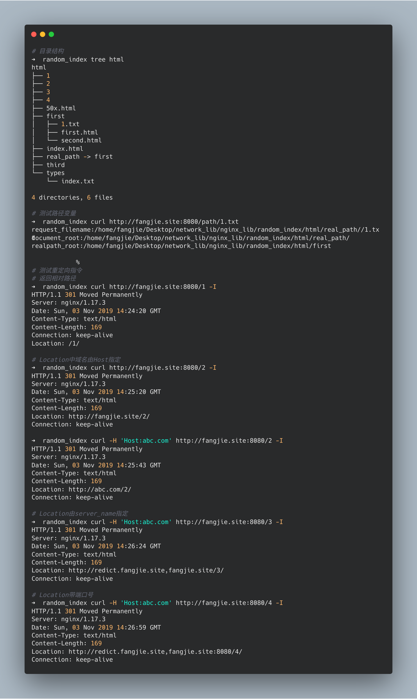


## 过滤阶段

## LOG阶段