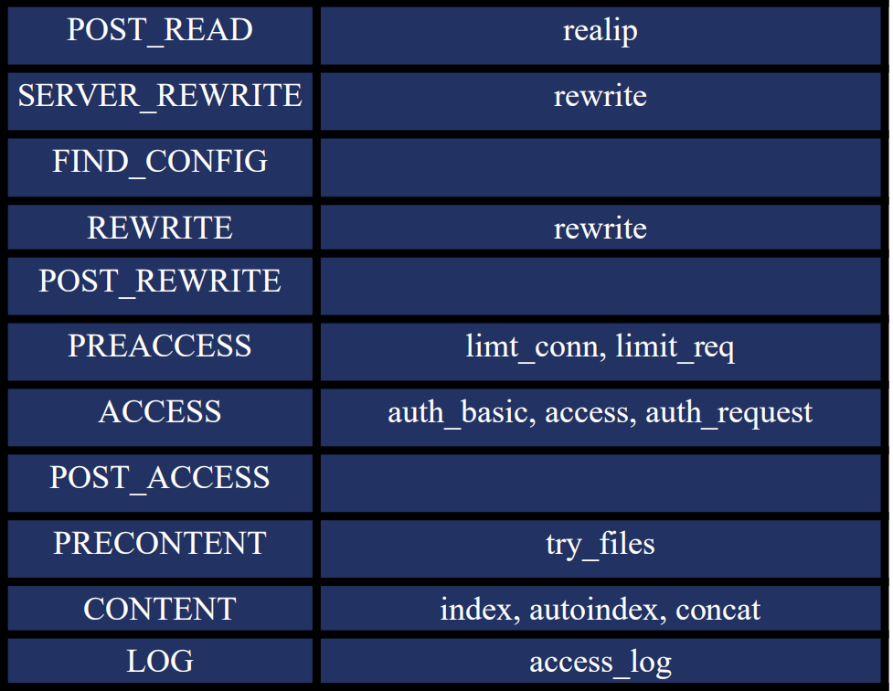
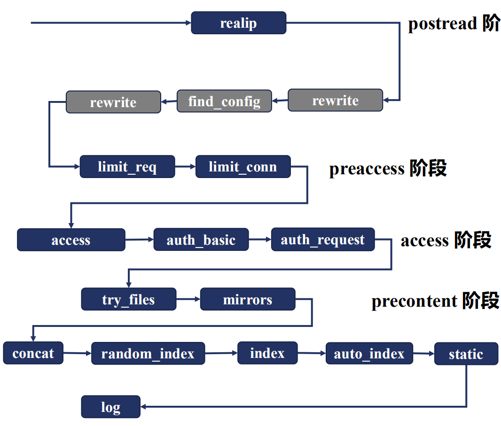
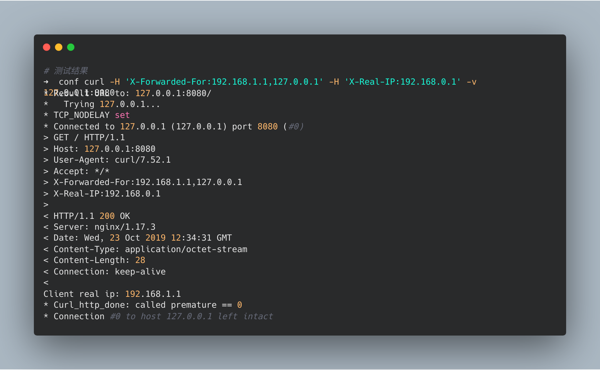
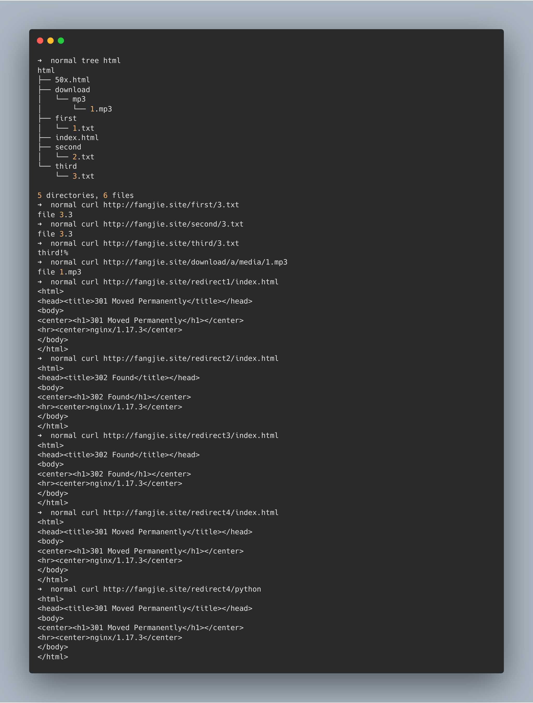

# HTTP

## 处理流程

针对HTTP请求，Nginx定义了一个处理流程，该处理流程有11个阶段。除HTTP过滤模块和只提供变量的模块之外，其他HTTP模块必须在这11个阶段之中。



每个阶段中都对应着相关的模块，同一个阶段中可以有多个模块，模块之间也会有执行顺序。



具体的执行顺序将在`configure`的产物`ngx_modules.c`中定义，`ngx_module_names`定义了相关模块的执行顺序(执行顺序是定义的倒序)。

```c
char *ngx_module_names[] = {
… …
"ngx_http_static_module",
"ngx_http_autoindex_module",
"ngx_http_index_module",
"ngx_http_random_index_module",
"ngx_http_mirror_module",
"ngx_http_try_files_module",
"ngx_http_auth_request_module",
"ngx_http_auth_basic_module",
"ngx_http_access_module",
"ngx_http_limit_conn_module",
"ngx_http_limit_req_module",
"ngx_http_realip_module",
"ngx_http_referer_module",
"ngx_http_rewrite_module",
"ngx_http_concat_module",
… …
}
```

当请求到来后，Nginx会依次调用阶段对应的模块，处理请求。

## POST_READ

### 理论

`POST_READ`阶段只有一个模块`ngx_http_realip_module`，该模块负责修改变量`remote_addr`中存储的客户端地址，默认是从TCP四元组中取源IP。如果传输过程中出现代理，通过`remote_addr`将不能获取到用户真实的IP，后续的限流操作也就无从谈起。

HTTP中有三种方法用于获取客户端的真实IP：

- `X-Real-IP`：记录客户端真实IP。
- `X-Forwarded-For`：会以链表形式表示为谁转发的信息。如`X-Forwarded-For:127.0.0.1,192.168.0.1`，当前HTTP请求转发自`192.168.0.1`。
- `proxy_protocol`：代理协议，会在TCP报文前添加源IP、源端口、目标IP、目标端口。

`realip`模块默认避讳编译进Nginx，需要在`configure`时通过`--with-http_realip_module`启用该功能。该模块提供两个变量和三个命令：

- `$realip_remote_addr`：TCP连接源IP。
- `$realip_remote_port`：TCP连接源端口。

- `set_real_ip_from`：设置可信地址，只有可信地址的连接才替换`remote_addr`。
- `real_ip_header`：指定`remote_addr`来源，如果采用X-Forwarded-For时，取末尾IP。
- `real_ip_recursive`：为`on`时，根据`X-Forwarded-For`，从右到左找第一个不是`set_real_ip_from`指定的IP。

### 实践

```nginx
# 编辑nginx.conf
worker_processes  1;

events {
    worker_connections  1024;
}

http {
    include       mime.types;
    default_type  application/octet-stream;

    sendfile        on;
    keepalive_timeout  65;

    server {
        listen 8080;
        server_name localhost;
        error_log logs/myerror.log debug;
        set_real_ip_from  127.0.0.1;
        #real_ip_header X-Real-IP;
        #real_ip_recursive off;
        real_ip_recursive on;
        real_ip_header    X-Forwarded-For;

        location /{
            return 200 "Client real ip: $remote_addr\n";
        }

    }
}
```

测试结果：



### 注意

- `set_real_ip_from`、`real_ip_header`不要放在`location`中，否则`remote_addr`将不会生效。
## SERVER_REWRITE

### 理论

`SERVER_REWRITE`和`REWRITE`阶段由`ngx_http_rewrite_module`模块负责。`rewrite`模块提供三个功能：

- 通过正则表达式修改请求的URI。
- 进行重定向。
- 条件选择。

为此，Nginx提供了五个指令：

- `break`：停止处理`rewrite`模块的指令，进入下一个阶段。
- `if (condition){...}`：如果`condition`成立，则执行相应的语句。
  - 变量，如果变量值为空或`0`则为`false`。
  - 字符串等值匹配：`=`、`!=`
  - 正则表达式：`~`(大小写敏感)、`~*`
  - 文件存在表达式，`-f`(文件)、`!-f`、`-d`(目录)、`!-d`、`-e`(文件或目录)、`!-e`、`-x`(可执行文件)、`!-x`。
- `return code|code text|code URL|URL`：返回指定的code或URL并停止处理。
  - `444`为特殊错误码，nginx将立即关闭连接，不返回任何内容。
  - `301`：永久重定向
  - `302`：临时重定向
  - `303`：临时重定向，允许改变方法
  - `307`：临时重定向，不允许改变方法
  - `308`"：永久重定向，不允许改变方法
- `rewrite regex replacement [flag]`：使用`replacement`替换`regex`的匹配值，`flag`表明是否继续匹配下去。如果`replacement`以`http://`、`https://`或`$scheme`开头，将停止处理并返回给客户端。
  - `last`：停止处理，进入下一个location匹配。
  - `break`：停止`rewrite`模块的指令处理。
  - `redirect`：返回302重定向，前提是`replacement`不满足三种情况。
  - `permanent`：返回永久重定向301。
- `set $variable value`：设置变量值。
- `rewrite_log`：执行结果是否记录在error_log中。
- `uninitialized_variable_warn`：是否记录未初始化的变量。

### 正则表达式

`rewrite`模块的正则表达式与常用的正则表达式无异，也可以使用子表达式，并且通过`$1..$9`进行引用。针对于匹配大小写问题，它提供了四个符号：

- 大小写敏感：`~`、`!~`
- 大小写不敏感：`~*`、`!~*`

### 实践

```nginx
worker_processes  1;

events {
    worker_connections  1024;
}

http {
    include       mime.types;
    default_type  application/octet-stream;

    sendfile        on;
    keepalive_timeout  65;

    server {
        listen 80;
        server_name rewrite.fangjie.site;
        rewrite ^(/download)(/.*)/media/(.*)\..*$ $1/mp3/$3.mp3 last;
        root html/;
        rewrite_log on;
	    # rewrite记录位置
        error_log logs/rewrite_error.log notice;
        location /first {
            # uri变为/second$1，进入下一个location
            rewrite /first(.*) /second$1 last;
            return 200 'first!';
        }
        location /second {
            # 返回/third$1文件，因为有break，所以不会再匹配
            rewrite /second(.*) /third$1 break;
            return 200 'second!';
        }
        location /third {
            return 200 'third!';
        }

        location /redirect1 {
            # 返回301
            rewrite /redirect1(.*) $1 permanent;
        }
        location /redirect2 {
            # 返回302
            rewrite /redirect2(.*) $1 redirect;
        }
        location /redirect3 {
            # 返回302 因为以http开始
            rewrite /redirect3/(.*) https://www.baidu.com/s?wd=$1;
        }
        location /redirect4 {
            # 返回301 因为添加了permanent限制
            rewrite /redirect4/(.*) https://www.baidu.com/s?wd=$1 permanent;
        }
    }
}
```

测试结果：



### 注意

- `error_page`：`ngx_http_core_module`模块中的`error_page`指令用于处理正常请求的错误码，能重写错误码并指定返回的内容，如果`return`指令生效后，`error_page`将无法处理。
- `rewrite`指令执行完毕后，会向客户端返回最终uri指向的数据。

