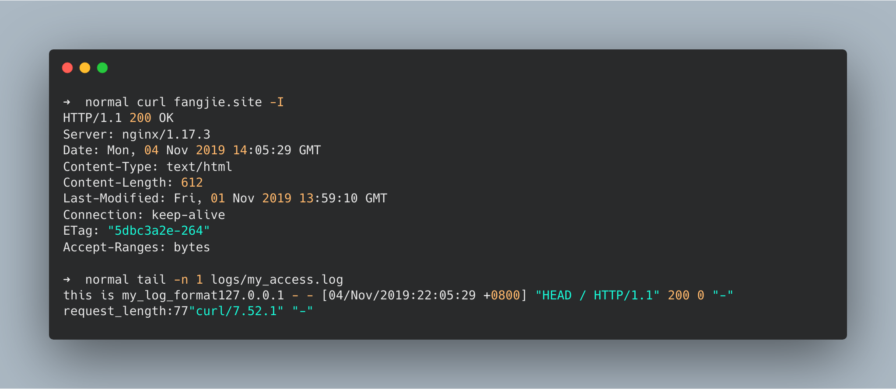
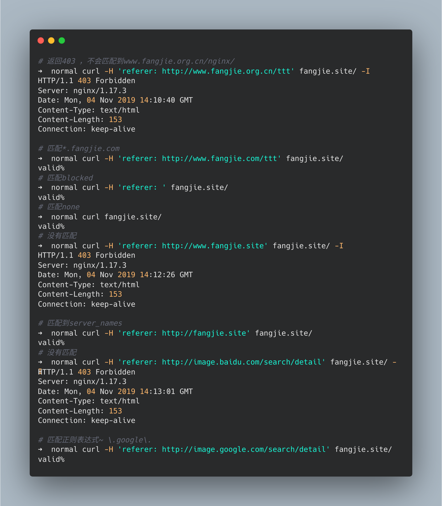
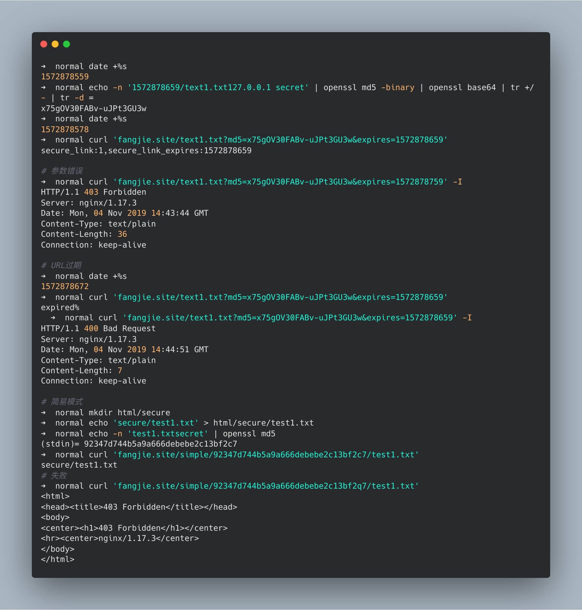
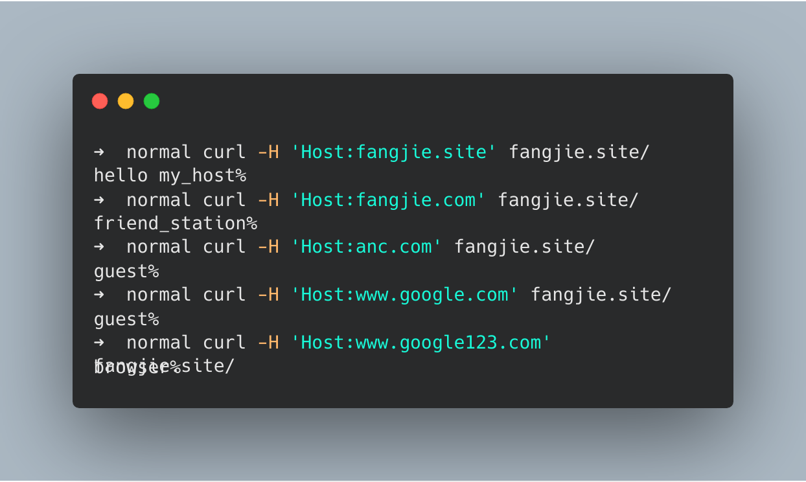

# HTTP

## 处理流程

针对HTTP请求，Nginx定义了一个处理流程，该处理流程有11个阶段。除HTTP过滤模块和只提供变量的模块之外，其他HTTP模块必须在这11个阶段之中。


每个阶段中都对应着相关的模块，同一个阶段中可以有多个模块，模块之间也会有执行顺序。


具体的执行顺序将在`configure`的产物`ngx_modules.c`中定义，`ngx_module_names`定义了相关模块的执行顺序(执行顺序是定义的倒序)。

```c
char *ngx_module_names[] = {
… …
"ngx_http_static_module",
"ngx_http_autoindex_module",
"ngx_http_index_module",
"ngx_http_random_index_module",
"ngx_http_mirror_module",
"ngx_http_try_files_module",
"ngx_http_auth_request_module",
"ngx_http_auth_basic_module",
"ngx_http_access_module",
"ngx_http_limit_conn_module",
"ngx_http_limit_req_module",
"ngx_http_realip_module",
"ngx_http_referer_module",
"ngx_http_rewrite_module",
"ngx_http_concat_module",
… …
}
```

当请求到来后，Nginx会依次调用阶段对应的模块，处理请求。

## POST_READ阶段

### 理论

`POST_READ`阶段负责处理请求头部，该阶段只有一个模块`ngx_http_realip_module`。`realip`模块默认不会编入nginx，编译时，可使用`--with-http_realip_module`打开该模块。该模块会修改变量`remote_addr`中存储的客户端地址，默认是从TCP四元组中取源IP。如果传输过程中出现代理，通过`remote_addr`将不能获取到用户真实的IP，后续的限流操作也就无从谈起。

HTTP中有三种方法用于获取客户端的真实IP：

- `X-Real-IP`：记录客户端真实IP。
- `X-Forwarded-For`：会以链表形式表示为谁转发的信息。如`X-Forwarded-For:127.0.0.1,192.168.0.1`，当前HTTP请求转发自`192.168.0.1`。
- `proxy_protocol`：代理协议，会在TCP报文前添加源IP、源端口、目标IP、目标端口。

`realip`模块默认避讳编译进Nginx，需要在`configure`时通过`--with-http_realip_module`启用该功能。该模块提供两个变量和三个命令：

- `$realip_remote_addr`：TCP连接源IP。
- `$realip_remote_port`：TCP连接源端口。

- `set_real_ip_from`：设置可信地址，只有可信地址的连接才替换`remote_addr`。
- `real_ip_header`：指定`remote_addr`来源，如果采用X-Forwarded-For时，取末尾IP。
- `real_ip_recursive`：为`on`时，根据`X-Forwarded-For`，从右到左找第一个不是`set_real_ip_from`指定的IP。

### 实验

```nginx
# 编辑nginx.conf
worker_processes  1;

events {
    worker_connections  1024;
}

http {
    include       mime.types;
    default_type  application/octet-stream;

    sendfile        on;
    keepalive_timeout  65;

    server {
        listen 8080;
        server_name localhost;
        error_log logs/myerror.log debug;
        set_real_ip_from  127.0.0.1;
        #real_ip_header X-Real-IP;
        #real_ip_recursive off;
        real_ip_recursive on;
        real_ip_header    X-Forwarded-For;

        location /{
            return 200 "Client real ip: $remote_addr\n";
        }

    }
}
```

测试结果：


### 注意

- `set_real_ip_from`、`real_ip_header`不要放在`location`中，否则`remote_addr`将不会生效。
## SERVER_REWRITE阶段

### 理论

`SERVER_REWRITE`和`REWRITE`阶段主要负责重定向，这两个阶段公用`ngx_http_rewrite_module`模块。`rewrite`模块提供三个功能：

- 通过正则表达式修改请求的URI。
- 进行重定向。
- 条件选择。

为此，Nginx提供了五个指令：

- `break`：停止处理`rewrite`模块的指令，进入下一个阶段。
- `if (condition){...}`：如果`condition`成立，则执行相应的语句。
  - 变量，如果变量值为空或`0`则为`false`。
  - 字符串等值匹配：`=`、`!=`
  - 正则表达式：`~`(大小写敏感)、`~*`
  - 文件存在表达式，`-f`(文件)、`!-f`、`-d`(目录)、`!-d`、`-e`(文件或目录)、`!-e`、`-x`(可执行文件)、`!-x`。
- `return code|code text|code URL|URL`：返回指定的code或URL并停止处理。
  - `444`为特殊错误码，nginx将立即关闭连接，不返回任何内容。
  - `301`：永久重定向
  - `302`：临时重定向
  - `303`：临时重定向，允许改变方法
  - `307`：临时重定向，不允许改变方法
  - `308`"：永久重定向，不允许改变方法
- `rewrite regex replacement [flag]`：使用`replacement`替换`regex`的匹配值，`flag`表明是否继续匹配下去。如果`replacement`以`http://`、`https://`或`$scheme`开头，将停止处理并返回给客户端。
  - `last`：停止处理，进入下一个location匹配。
  - `break`：停止`rewrite`模块的指令处理。
  - `redirect`：返回302重定向，前提是`replacement`不满足三种情况。
  - `permanent`：返回永久重定向301。
- `set $variable value`：设置变量值。
- `rewrite_log`：执行结果是否记录在error_log中。
- `uninitialized_variable_warn`：是否记录未初始化的变量。

### 正则表达式

`rewrite`模块采用PCRE正则表达式，可以使用子表达式，并且通过`$1..$9`进行引用。针对于匹配大小写问题，它提供了四个符号：
- 大小写敏感：`~`、`!~`
- 大小写不敏感：`~*`、`!~*`


### 实验

```nginx
worker_processes  1;

events {
    worker_connections  1024;
}

http {
    include       mime.types;
    default_type  application/octet-stream;

    sendfile        on;
    keepalive_timeout  65;

    server {
        listen 80;
        server_name rewrite.fangjie.site;
        rewrite ^(/download)(/.*)/media/(.*)\..*$ $1/mp3/$3.mp3 last;
        root html/;
        rewrite_log on;
	    # rewrite记录位置
        error_log logs/rewrite_error.log notice;
        location /first {
            # uri变为/second$1，进入下一个location
            rewrite /first(.*) /second$1 last;
            return 200 'first!';
        }
        location /second {
            # 返回/third$1文件，因为有break，所以不会再匹配
            rewrite /second(.*) /third$1 break;
            return 200 'second!';
        }
        location /third {
            return 200 'third!';
        }

        location /redirect1 {
            # 返回301
            rewrite /redirect1(.*) $1 permanent;
        }
        location /redirect2 {
            # 返回302
            rewrite /redirect2(.*) $1 redirect;
        }
        location /redirect3 {
            # 返回302 因为以http开始
            rewrite /redirect3/(.*) https://www.baidu.com/s?wd=$1;
        }
        location /redirect4 {
            # 返回301 因为添加了permanent限制
            rewrite /redirect4/(.*) https://www.baidu.com/s?wd=$1 permanent;
        }
    }
}
```

测试结果：


### 注意

- `error_page`：`ngx_http_core_module`模块中的`error_page`指令用于处理正常请求的错误码，能重写错误码并指定返回的内容，如果`return`指令生效后，`error_page`将无法处理。
- `rewrite`指令执行完毕后，会向客户端返回最终uri指向的数据。

## FIND_CONFIG阶段

### 理论

`FIND_CONFIG`阶段主要负责查找处理请求的`location`指令块，具体操作由`Nginx`框架负责。该阶段有两个重要指令：

- `location`：匹配URI
  - 前缀字符串：常规字符串、`=`(精确匹配)、`^~`(匹配上后不再进行正则表达式匹配)
  - 正则表达式：`~`(大小写敏感)、`~*`(大小写不敏感)
  - 定义内部跳转：`@`
- `merge_slashes`：是否合并`uri`中的双斜杠。

### 匹配顺序


- 前缀字符串匹配
  - 匹配到精确匹配时，则使用该location。
  - 匹配到`^~`匹配时，则使用该location；匹配到多个location时，采用最长前缀的location。
  - 记住最长匹配，进入正则表达式匹配
- 正则表达式匹配，按定义顺序执行
  - 匹配上，则使用正则表达式指定的location。
  - 全部未匹配，则采用最长匹配的前缀字符串location。

### 实验

```nginx
worker_processes  1;
events {
    worker_connections  1024;
}

http {
    include       mime.types;
    default_type  application/octet-stream;
    sendfile        on;
    keepalive_timeout  65;

	server {
		listen 80;
		server_name fangjie.site;
		error_log logs/myerror.log notice;
		merge_slashes on;
		
		# 测试精确匹配，只匹配/Test1
		location = /Test1 {
			return 200 'match:= /Test1';
		}
		# 前缀字符串匹配，匹配后，不会执行正则匹配
		# 匹配/Test1开头,但是优先级比 =/Test1低
		location ^~ /Test1 {
			return 200 'match:^~ /Test1';
		}
		# 测试多个^~时，取最长匹配
		location ^~ /Test1/Test2 {
			return 200 'match:^~ /Test1/Test2';
		}
		# 大小写敏感，正则表达式匹配，不会被匹配到，因为^~拦截了
		location ~ /Test1/$ {
			return 200 'match:~ /Test1/\n';
		}
		
		# 常规前缀匹配
        location /Test3 {
            return 200 'match:/Test3';
        }
		# 常规前缀匹配，获取最长匹配
        location /Test3/Test2 {
            return 200 'match:/Test3/Test2';
        }

		
		# 测试常规匹配后，进行正则表达式匹配
		location /Test4 {
            return 200 'match:/Test4';
        }
		location ~ /Test4/T/(\w+) {
			return 200 'match:~ /Test4/T/(\w+)\n';
		}
		
		# 正则表达式大小写敏感
		location ~ /Test2/(\w+) {
			return 200 'match:~ /Test2/\n';
		}
		# 大小写不敏感，正则表达式匹配
		location ~* /Test5/(\w+)$ {
			return 200 'match:~* /Test5\n';
		}
	}
}
```

测试结果


## PRE_ACCESS阶段

`PRE_ACCESS`阶段负责限制客户端的并发连接数和请求数，该阶段有两个模块：`ngx_http_limit_req_module`和`ngx_http_limit_conn_module`。`limit_conn`模块用于限制客户端的并发连接数，`limit_req`模块用于限制客户端每秒的请求数。

### limit_conn

#### 理论

`limit_conn`模块用于限制客户端的并发连接数，默认编入nginx，编译时，可使用`--without-http_limit_conn_module`禁用该模块。`limit_conn`模块基于共享内存，因此在全部worker进程中都生效，其限制的有效性取决于`POST_READ`阶段，通过`relaip`获取的IP是否真实。

该模块提供四个指令用于操作相关的配置：

- `limit_conn_zone key zone=name:size`：创建共享内存。
- `limit_conn zone_name number`：设置并发连接数。
- `limit_conn_log_level info | notice | warn | error`：发生限制时，记录的日志级别。
- `limit_conn_status code`：发生限制时，返回的响应码。

#### 实验

```nginx
worker_processes  1;
events {
    worker_connections  1024;
}

http {
    include       mime.types;
    default_type  application/octet-stream;
    sendfile        on;
    keepalive_timeout  65;
	# 以binary_remote_addr作为key，创建一个10M的共享空间，空间名为addr
	limit_conn_zone $binary_remote_addr zone=addr:10m;
	server {
		listen 80;
		server_name fangjie.site;
		error_log logs/myerror.log notice;
		
		location / {
			limit_conn_status 500;
			limit_conn_log_level  warn;
			# 限制每秒向客户端返回为字节数，更好触发并发连接
			limit_rate 50;
			# 并发连接数为1
			limit_conn addr 1;
		}
	}
}
```

测试结果：


### limit_req

#### 理论

`limit_req`模块用于限制客户端每秒的请求数，默认编入nginx，编译时，可使用`--without-http_limit_req_module`禁用该模块。`limit_req`模块基于共享内存，因此在全部worker进程中都生效，其限制的有效性取决于`POST_READ`阶段，通过`relaip`获取的IP是否真实。`limit_req`模块采用`leaky bucket`算法(漏斗算法)，它的目的是让请求速率保持恒定，使突发的流量变得平滑。


漏桶算法的核心是建立一个缓冲区，通过固定的速率消费缓冲的请求，如果缓冲区满，则拒绝掉请求。

`limit_req`模块提供了四个指令：

- `limit_req_zone key zone=name:size rate=rate`：创建共享内存。
- `limit_req zone=name [burst=number] [nodelay]`：设置请求数。
  - burst：默认为0，缓存区能容纳多少个请求。
  - nodelay：立即处理burst中的请求。
- `limit_req_log_level info | notice | warn | error`：发生限制时，记录的日志级别。
- `limit_red_status code`：发生限制时，返回的响应码。

#### 实验

```nginx
worker_processes  1;
events {
    worker_connections  1024;
}

http {
    include       mime.types;
    default_type  application/octet-stream;
    sendfile        on;
    keepalive_timeout  65;
	# 以binary_remote_addr作为key，创建一个10M的共享空间，空间名为one
	# 每分钟消费一个请求
	limit_req_zone $binary_remote_addr zone=one:10m rate=1r/m;
	server {
		listen 80;
		server_name fangjie.site;
		error_log logs/myerror.log notice;
		
		location / {
			limit_req_status 500;
			limit_req_log_level  warn;
			# 限制每秒向客户端返回为字节数，更好触发并发连接
			limit_rate 50;
			# 允许两个请求排队，并且立即处理排队请求
			limit_req zone=one burst=2 nodelay;
		}
	}
}
```

测试结果：


## ACCESS阶段

`ACCESS`阶段负责处理用户的访问权限，包含三个模块：`ngx_http_access_module`、`ngx_http_auth_basic_module`和`ngx_http_auth_request_module`。`access`模块用于IP黑白名单，`auth_basic`模块用于`HTTP Basic Authentication`认证、`auth_request`模块可以使用第三个做权限控制。

### access

#### 理论

`access`模块提供两个指令用于设置IP的访问权限：

- ` allow address | CIDR | unix: | all`：设置白名单
- ` deny address | CIDR | unix: | all`：设置黑名单

#### 实验

```nginx
worker_processes  1;
events {
    worker_connections  1024;
}

http {
    include       mime.types;
    default_type  application/octet-stream;
    sendfile        on;
    keepalive_timeout  65;
	server {
		listen 80;
		server_name fangjie.site;
		error_log logs/myerror.log notice;
		set_real_ip_from 127.0.0.1;
		real_ip_header X-Real-IP;
		location / {
			allow 192.168.0.1/24;
			deny 127.0.0.1;
		}
	}
}
```

测试结果：


### auth_basic

#### 理论

`auth_basic`模块基于`RFC2617:HTTP Basic Authentication`协议，对用户名和密码进行认证，默认编入nginx，可使用`--without-http_auth_basic_module disable ngx_http_auth_basic_module`关闭该模块。


该模块提供两个指令：

- `auth_basic string | off`：是否打开认证，打开时，`string`为弹窗title。
- `auth_basic_user_file file`：设置用户名和密码文件位置，格式为`username:password`。

#### 实验

先通过httpd-tools包中命令
`htpasswd –b –c file  user pass`创建密码文件。

```nginx
worker_processes  1;
events {
    worker_connections  1024;
}

http {
    include       mime.types;
    default_type  application/octet-stream;
    sendfile        on;
    keepalive_timeout  65;
	server {
		listen 80;
		server_name fangjie.site;
		error_log logs/myerror.log notice;
		set_real_ip_from 127.0.0.1;
		real_ip_header X-Real-IP;
		location / {
			auth_basic your_user_name_and_password;
			auth_basic_user_file ../pwd/password;
		}
	}
}
```

测试结果：


### auth_request

#### 理论

`auth_request`模块收到请求后，将生产子请求，通过反向代理，将子请求传递给上游服务，若上游服务返回`2XX`响应码，则继续执行；若上游服务器返回`401`或`403`，则将子请求的响应返回给客户端。该模块默认没有编入nginx，编译时，可以通过`--with-http_auth_request_module`打开该模块。

该模块提供两个指令：

- `auth_request uri | off`：打开认证时，将把子请求转发给`uri`。
- `auth_request_set $variable value`：设置变量，用于后续判断。

#### 实验

该实验需要有启动两个Nginx服务，上游服务的配置为：

```nginx
worker_processes  1;
events {
    worker_connections  1024;
}

http {
    include       mime.types;
    default_type  application/octet-stream;
    sendfile        on;
    keepalive_timeout  65;
	server {
		listen 8000;
		server_name localhost;
		error_log logs/myerror.log notice;
        location / {
            if ($remote_addr = 127.0.0.1){
                return 200;
            }
            return 400;
        }
	}
}
```

验证服务的nginx配置为：

```nginx
worker_processes  1;
events {
    worker_connections  1024;
}

http {
    include       mime.types;
    default_type  application/octet-stream;
    sendfile        on;
    keepalive_timeout  65;
	server {
		listen 80;
		server_name fangjie.site;
		error_log logs/myerror.log notice;
		location / {
			# uri是本机的一个反向代理，也可以是一个具体的地址
			auth_request /auth_request;
		}
		
		location = /auth_request{
			proxy_pass http://127.0.0.1:8000;
			# 不传递body
			proxy_pass_request_body off;
			proxy_set_header Content-Length '';
			# 传递原始的uri
			proxy_set_header X-Original-URI $request_uri;
		}
	}
}
```


### 注意

- Nginx还提供了一个指令`satisfy all | any`，如果为`any`，则`ACCESS`阶段中任一模块通过，则进入下一阶段；如果为`all`，则要求`ACCESS`阶段中所有的模块都必须通过。

## PRE_CONTENT阶段

`PRE_CONTENT`阶段有两个模块`ngx_http_try_files_modules`和`ngx_http_mirror_module`模块。

### try_files

#### 理论

`try_files`模块由`ngx_http_core_module`提供支持，该模块只有一个指令：

- `try_files file ... uri|try_files file ...=code`：将依次访问指定的文件，如果文件都不存在，则将返回最后一个`uri`或`code`的结果。

`try_files`指令中可以使用一个特殊参数`$uri`，表示当前的路径，路径由`root`或`alias`指定。

#### 实验

```nginx
worker_processes  1;
events {
    worker_connections  1024;
}

http {
    include       mime.types;
    default_type  application/octet-stream;
    sendfile        on;
    keepalive_timeout  65;
	server {
		listen 80;
		server_name fangjie.site;
		error_log logs/myerror.log notice;
		root html/;
		location /first{
			# $uri表示html/first
			try_files $uri $uri/index.html $uri.html @lasturl;
		}
        # 内部服务
		location @lasturl{
			return 200 'lasturl!\n';
		}
		location /second{
			try_files $uri $uri/index.html $uri.html =400;
		}
	}
}
```

实验结果：


### mirror

#### 理论

`mirror`模块将生成一个子请求，然后发送给指定的URI，子请求的返回值不会影响当前模块的处理。`mirror`模块通常用于A/B测试，该模块默认编入nginx，编译时，可以使用`--without-ngx_http_mirror_module`关闭该模块。

`mirror`模块提供两条指令：

- `mirror uri | off`：是否打开`mirror`，打开时，子请求发往的`uri`。
- `mirror_request_body on|off`：是否发送body。

#### 实验

该实验也需要两个Nginx服务，上游的Nginx配置为：

```nginx
worker_processes  1;
events {
    worker_connections  1024;
}

http {
    include       mime.types;
    default_type  application/octet-stream;
    sendfile        on;
    keepalive_timeout  65;
	server {
		listen 8000;
		server_name localhost;
		error_log logs/myerror.log notice;
        location / {
            return 200 'hello';
        }
	}
}
```

`mirror`模块Nginx配置为：

```nginx
worker_processes  1;
events {
    worker_connections  1024;
}

http {
    include       mime.types;
    default_type  application/octet-stream;
    sendfile        on;
    keepalive_timeout  65;
	server {
		listen 80;
		server_name fangjie.site;
		error_log logs/myerror.log notice;
		root html/;
		location /first{
			mirror /mirror;
			mirror_request_body off;
		}
		location = /mirror {
			internal;
			proxy_pass http://127.0.0.1:8000$request_uri;
			proxy_pass_request_body off;
			proxy_set_header Content-Length "";
			proxy_set_header X-Original-URI $request_uri;
		}
	}
}
```

实验结果：


## CONTENT阶段

`CONTENT`阶段负责生成响应，其中包含五个模块：`ngx_http_concat_module`、`ngx_http_random_index_module`、`ngx_http_index_module`、`ngx_http_auto_index_module`、`ngx_http_static_module`。

### concat

#### 理论

`concat`模块可以将多个小文件合并为一个响应，通过减少请求次数，提高性能。`concat`模块由`Tengine`开发，编译时，需要先下载[源码](https://github.com/alibaba/nginx-http-concat)，然后使用`--add_module path`添加模块。该模块的使用方法是通过在`url`后添加`??文件1,文件2...`，如`http://example.com/??1.js,2.js`。

`concat`模块提供6个指令：

- `concat on|off`：是否打开该功能。
- `concat_delimiter string`：指定文件的分割符。
- `content_type MIME types`：指定拼接的文件类型。
- `concat_unique on|off`：是否只对一种文件进行拼接。
- `concat_ignore_file_error on|off`：文件不存在时，是否忽略。
- `concat_max_files number`：最多拼接文件个数。

#### 实验

编译安装流程：


Nginx配置文件

```nginx
worker_processes  1;
events {
    worker_connections  1024;
}

http {
    include       mime.types;
    default_type  application/octet-stream;
    sendfile        on;
    keepalive_timeout  65;
	server {
		listen 80;
		server_name fangjie.site;
		error_log logs/myerror.log notice;
		root html/;
		location /{
            # 打开concat
            concat on;
            # 指定类型
            concat_types text/plain;
            # 指定分隔符
            concat_delimiter ':::';
            concat_max_files 2;
		}
	}
}
```

实验结果：


### random_index

#### 理论

`random_index`模块用于处理uri以`/`结尾的请求，将随机返回目录下一个文件作为`index`文件。该模块默认不编入Nginx，编译时，使用`--with-http_random_index_module`打开该模块。`random_index`模块只提供一个命令：

- `random_index on|off`：是否打开该功能。

#### 实验

```nginx
worker_processes  1;
events {
    worker_connections  1024;
}

http {
    include       mime.types;
    default_type  application/octet-stream;
    sendfile        on;
    keepalive_timeout  65;
	server {
		listen 80;
		server_name fangjie.site;
		error_log logs/myerror.log notice;
		root html/;
		location /{
            random_index on;
		}
	}
}
```

实验结果：


### index

#### 理论

`index`模块会在`url`以`/`结尾时，返回`index`指令指定的文件，默认为`index、index.html`。该模块只提供一个指令：

- `index file`：指定返回的文件名。

#### 实验

```nginx
worker_processes  1;
events {
    worker_connections  1024;
}

http {
    include       mime.types;
    default_type  application/octet-stream;
    sendfile        on;
    keepalive_timeout  65;
	server {
		listen 80;
		server_name fangjie.site;
		error_log logs/myerror.log notice;
		root html/;
		location /{
		}
        location /first{
            index first.html;
        }
	}
}
```

实验结果


### auto_index

#### 理论

`auto_index`模块会在url以`/`结尾时，返回对应目录的结构。该模块默认编入nginx，编译时，可以使用`--without-http_autoindex_module`关闭该模块。

`auto_index`模块提供了四条指令：

- `autoindex on|off`：是否打开该功能。
- `autoindex_exact_size on|off`：是否返回文件精确的大小，只针对html文件有效。
- `autoindex_format html|xml|json|jsonp`：指定返回的信息格式。
- `autoindex_locltime on|off`：是否采用服务器本地时间。

#### 实验

```nginx
worker_processes  1;
events {
    worker_connections  1024;
}

http {
    include       mime.types;
    default_type  application/octet-stream;
    sendfile        on;
    keepalive_timeout  65;
	server {
		listen 80;
		server_name fangjie.site;
		error_log logs/myerror.log notice;
		root html/;
		location /{
		}
        location /first{
            autoindex on;
			autoindex_exact_size on;
			autoindex_format json;
        }
	}
}
```


### static

#### 理论

`static`模块由`ngx_http_core_module`提供，主要负责静态文件的处理。`static`模块中有两个非常重要的命令：

- `alias`：将`location`匹配的uri重定向到指定目录下。
- `root`：设置静态资源的根目录。

举个简单例子：

```nginx
server {
		listen 80;
		server_name fangjie.site;
		error_log logs/myerror.log notice;
		root html/;
        location /first{
            # 访问的目录是/html/first/first
		    root html/first;            
		}
        location /second {
           
            alias third/
        }
}
```


访问`/second`将获取`html/third/index.html`，而访问`/first`将获取`/html/first/first/index.html`。


与此同时，`static`模块还提供了3个和文件路径相关的变量：

- `$request_filename`：文件的完整路径。
- `$document_root`：文件所在文件夹路径。
- `$realpath_root`：文件的真实路径，如果存在软连接，则执行文件真正存在的位置。

返回静态文件时，`static`模块提供了几个指令用于控制响应的`Content-Type`头部：

- `types { text/html html; image/gif gif;}`：指定后缀名和`type`的映射关系。
- `default_type mime-type`：指定默认类型。
- `types_hash_bucket_size size`：指定存储在hash表中，每个映射的容量大小。
- `types_hash_max_size size`：指定映射个数。
- `log_not_found on|off`：找不到文件时，是否记录到日志中。

如果url是向访问目录，但是没有添加`/`时，会返回301重定向，重定向的url后会添加`/`，`static`模块也提供了几个指令来控制重定向行为。

- `absolute_redirect on|off`：301响应的`location`字段是否为绝对路径。
- `server_name_in_redirect on|off`：301响应中`location`字段的域名是请求中的`host`还是配置的`server_name`。
- `port_in_redirect on|off`：默认端口不为80时，是否在`location`中显示。

#### 实验

```nginx
worker_processes  1;
events {
    worker_connections  1024;
}

http {
    include       mime.types;
    default_type  application/octet-stream;
    sendfile        on;
    keepalive_timeout  65;
	server {
		listen 8080;
		server_name redict.fangjie.site,fangjie.site;
		error_log logs/myerror.log notice;
		root html/;
        location /first{
            # 访问的目录是/html/first/first
		    root html/first;            
		}
        location /second {
            # 访问的目录是html/third
            alias third/;
        }

		# 只返回相对路径
		location /1 {
			server_name_in_redirect off;
			port_in_redirect off;
			absolute_redirect off;
        }

		# 域名由Host字段控制
		location /2 {
			server_name_in_redirect off;
			port_in_redirect off;
			absolute_redirect on;
        }
		# 域名为server_name中指定，不带端口号
		location /3 {
			server_name_in_redirect on;
			port_in_redirect off;
			absolute_redirect on;
        }
		# 域名为server_name中指定，带端口号
		location /4 {
			server_name_in_redirect on;
			port_in_redirect on;
			absolute_redirect on;
        }

		location /types{
			types {
				my_txt txt;
				text/html  html;
				image/gif  gif;
				image/jpeg jpg;
			}
		}

		location /path{
			alias html/real_path/;
			return 200 'request_filename:$request_filename
document_root:$document_root
realpath_root:$realpath_root
			';
		}
	}
}
```

实验结果：


## LOG阶段

`LOG`阶段负责将HTTP请求的相关信息记录到日志中，该阶段由`ngx_http_log_module`模块负责，无法禁用。

### log

#### 理论

`log`模块提供了三条指令用于控制日志记录：

- `log_format name [escape=default|json|none] string ... `：定义log日志的格式，默认日志格式为：

  ```nginx
  log_format combined '$remote_addr - $remote_user [$time_local] '
  '"$request" $status $body_bytes_sent ' '"$http_referer"
  "$http_user_agent"';
  ```

- `access_log path [format [buffer=size] [gzip[=level]] [flush=time] [if=condition]];`：定义日志的存储方式。

  - `path`：指定日志的存储路径，路径可以包含变量，默认为`log/access.log`。在不打开cache的情况下，每记录一条日志都需要获取文件句柄、读写磁盘，性能差。
  - `format`：指定日志的格式，默认为`combined`。
  - `buffer`：日志缓存，默认为64KB。
  - `gzip`：指定压缩级别，默认为1。
  - `flush`：将缓存中的数据写入磁盘。如果缓存写满、worker进程执行reopen命令或关闭时，也会将缓存中的日志写入磁盘。
  - `if`：通过变量判断是否记录日志。

- `open_log_file_cache max=N [inactive=time] [min_uses=N] [valid=time]`：确定是否打开日志缓存，默认值为`off`。该指令主要针对`access_log`中包含变量时，避免每次记录日志都需要获取文件句柄。

  - `max`：缓存文件句柄数最大值，超过采用LRU淘汰。
  - `inactive`：超过`inactive`后，未被访问的文件将被关闭，默认为10S。
  - `min_uses`：`inactive`内最少访问`min_uses`次，否则将被关闭，默认为1。
  - `valid`：超过`valid`后，将对缓存的日志文件检查是否存在，默认60S。

#### 实验

```nginx
worker_processes  1;
events {
    worker_connections  1024;
}

http {
    include       mime.types;
    default_type  application/octet-stream;
    sendfile        on;
    keepalive_timeout  65;
    log_format  my_log_format  'this is my_log_format' 
        				'$remote_addr - $remote_user [$time_local] "$request" '
                        '$status $body_bytes_sent "$http_referer" '
        				'request_length:$request_length'
                        '"$http_user_agent" "$http_x_forwarded_for"';
	server {
		listen 80;
		server_name fangjie.site;
		error_log logs/myerror.log notice;
		root html/;
		location /{
			access_log logs/my_access.log my_log_format;
        }
	}
}
```

实验结果：



## 防盗链

### refer模块

#### 理论

`ngx_http_referer_module`模块提供防盗链功能。该模块的原理是，网站通过url引用页面后，用户点击url，浏览器会在HTTP请求的`referer`头部中将当前页面的url带上，告知服务器发起请求的页面。该模块默认编入`Nginx`，编译时，可以使用`--with-http_referer_module`禁用。

`refer`模块提供三个指令：

- `valid_referers none | blocked | server_names | string`：设置允许访问的条件，为真则允许。
  - `none`：允许缺失`referer`头部。
  - `blocked`：允许`referer`头部为空。
  - `server_names`：对`referer`执行域名匹配。
  - `带*通配符字符串`：对`referer`执行匹配。
  - `正则表达式`：对`referer`执行正则匹配。
- `referer_hash_bucket_size size`：指定每个hash的块大小，默认值为64。
- `referer_hash_max_size size`：指定哈希的最大数量，默认值为2048。

`referer`模块还提供一个变量`$invalid_referer`用于判断是否是盗链。

#### 实验

```nginx
worker_processes  1;
events {
    worker_connections  1024;
}

http {
    include       mime.types;
    default_type  application/octet-stream;
    sendfile        on;
    keepalive_timeout  65;
	server {
		listen 80;
		server_name fangjie.site;
		error_log logs/myerror.log notice;
		root html/;
		location /{
			valid_referers none blocked server_names
                *.fangjie.com www.fangjie.org.cn/nginx/
                ~\.google\.;
            if ($invalid_referer){
                return 403;
            }
            return 200 'valid';
        }
	}
}
```

实验结果：



### secure_link模块

#### 理论

`ngx_http_secure_link_module`模块的原理是服务器向客户端返回哈希后的URL，客户端通过该URL访问，nginx校验URL中的哈希值。由于哈希算法不可逆，因此客户端无法进行逆向。`secure_link`模块默认不编入nginx，编译时，使用`--with-http_secure_link_module`添加。原始URL通常包含如下信息：

- 资源位置，防止攻击者拿到一个URL后访问该URL下任意资源。
- 用户信息，，防止其他用户盗用。
- 时间戳，让安全URL及时过期。
- 密钥，增加攻击者逆向难度。

`secure_link`模块支持两种安全连接，两种方式的hash值均为安全连接原始字符串的md5值：

- `/link?md5=md5&expires=expires`，可以指定安全连接原始字符串构造方式，需要使用两个指令：
  - `secure_link hash值,时间戳`：指定hash值和时间戳的取值。

  - `secure_link_md5 expression`：指定字符串的构造方式。

  - `$secure_link`：
    - 空字符串，表示验证不通过
    - 0，表示URL过期
    - 1，表示验证通过。
  - `$secure_link_expires`：时间戳的值，只能由`secure_link_md5`使用。

- `/prefix/hash/link`，其安全连接原始字符串为`link密钥`，该方式只需使用一个指令：

  - `secure_link_secret word`：指定密钥。
  - `$secure_link`：为空则表示验证不通过，否则为原始URL。


#### 实验

```nginx
worker_processes  1;
events {
    worker_connections  1024;
}

http {
    include       mime.types;
    default_type  application/octet-stream;
    sendfile        on;
    keepalive_timeout  65;
	server {
		listen 80;
		server_name fangjie.site;
		error_log logs/myerror.log notice;
		root html/;
        location / {
            # md5和过期时间从uri参数中获取
            secure_link $arg_md5,$arg_expires;
            # 指定原始字符串的格式：过期时间uriIP地址 密钥
            secure_link_md5 "$secure_link_expires$uri$remote_addr secret";
            if ($secure_link = ""){
                return 403;
            }
            if ($secure_link = "0"){
                return 400 'expired';
            }
            return 200 "secure_link:$secure_link,secure_link_expires:$secure_link_expires\n";
        }
        # 前缀为simple
        location /simple/ {
            secure_link_secret secret;
            if ($secure_link = ""){
                return 403;
            }
            # 重定向到secure中，^ 匹配任意url
            rewrite ^ /secure/$secure_link;
        }
        location /secure/{
            alias html/secure/;
            internal;
        }
	}
}
```

实验结果：



## 创建新变量

### map模块

#### 理论

`ngx_http_map_module`模块提供类似`switch {case:...,default:...}`语法，创建新的变量。该模块默认编入nginx，可以使用`--without-http_map_module`禁用。

`map`模块提供三个指令：

- `map string $variable { ... }`：添加映射关系。

  ```nginx
  map $http_user_agent $mobile {
      default 0;
      "~Opera Mini" 1;
  }
  ```

- ` map_hash_bucket_size size`：每个映射的最大尺寸，默认32|64|128。

- `map_hash_max_size size`：映射最大个数，默认为2048。

`map`指令支持如下配置：

- `default value`：设置默认值。
- `hostnames`：可以对域名支持`*`匹配。
- `include`：加载文件，优化可读性。
- `volatile`：静止变量被缓存。

`case`的匹配顺序为：

- 严格匹配字符串。
- 前缀匹配的最长字符串，如`*.example.com`。
- 后缀匹配的最长字符串，`example.*`。
- `~`和`~*`搭配的正则匹配。
- 默认值。

#### 实验

```nginx
worker_processes  1;
events {
    worker_connections  1024;
}

http {
    include       mime.types;
    default_type  application/octet-stream;
    sendfile        on;
    keepalive_timeout  65;
    map $http_host $name{
        hostnames;
        default guest;
        *.fangjie.site host;# 匹配xxx.fangjie.site
		fangjie.site host;
        fangjie.* friend_station;
        ~www\.google\w+\.com browser; 
    }
	server {
		listen 80;
		server_name fangjie.site;
		error_log logs/myerror.log notice;
		root html/;
		location /{
			if ($name = host){
				return 200 'hello my_host';
			}
			return 200 '$name';
        }
	}
}
```

实验结果：



### split_clients模块

#### 理论

`ngx_http_split_clients`模块提供AB测试的功能，其原理是对已有变量执行MurmurHash2算法，获得一个32位无符号整数`hash`，根据百分比`hsah/(2^32-1)`为新变量赋值。该模块默认编译进入nginx，可以通过`--without-http_split_clients_module`禁用该模块。

该模块提供一个指令：

- `split_clients string $variable { ... }`：设置条件。

  ```nginx
  split_clients "${http_testcli}" $variant {
           0.51%          .one;  # 0-0.51% variant为.one
           20.0%          .two;  # 0.51-20.0% variant为.two
           50.5%          .three;# 20.0-50.5% variant为.three
           *              "";    # 50.5-100% variant为""
  }
  ```

#### 实验

```nginx
worker_processes  1;
events {
    worker_connections  1024;
}

http {
    include       mime.types;
    default_type  application/octet-stream;
    sendfile        on;
    keepalive_timeout  65;
	split_clients "${http_testcli}" $variant {
		50.00% 		A;
		*           '';
	}

	server {
		listen 80;
		server_name fangjie.site;
		error_log logs/myerror.log notice;
		root html/;
		location /{
			if ($variant=A){
				rewrite ^ /A;
			}
			return 200 'Client normal';
		}
        # 可以反向代理到相应的业务中。
		location /A{
			internal;
			return 200 'Client A';
		}
	}
}
```


### geo模块

#### 理论

`ngx_http_geo_module`模块能根据客户端IP创建新的变量。该模块默认编入nginx，可以通过`--without-http_geo_module`禁用。该模块只有一个指令：

- `geo [$address] $variable {条件}`：条件格式为`IP 值;`，如果客户端IP地址满足条件，则为变量符相应的值。如果有多个匹配，则采用最长匹配。

  ```nginx
  geo $country {
      127.0.0.0/24 US;
      127.0.0.1/32 CN;
  }
  ```

`geo`指令中提供了几个配置：

- `delete`：删除指定网络。
- `default`：设置默认值。
- `include`：加载其他文件，优化可读性。
- `proxy`：指定可信地址(同realip)，此时`remote_addr`为`X-Forwarded-For`最后一个IP。
- `proxy_recursive`：`remote_addr`为`X-Forwarded-For`中最后一个不可信地址。
- `ranges`：采用范围作为条件，需放在最前面，最好采用顺序排列。

#### 实验

```nginx
worker_processes  1;
events {
    worker_connections  1024;
}

http {
    include       mime.types;
    default_type  application/octet-stream;
    sendfile        on;
    keepalive_timeout  65;
    geo $country {
        default ZZ;
        proxy 127.0.0.1;
        # proxy_recursive;
        127.0.0.0/24 US;
        127.0.0.1/32 CN;
        10.1.0.0/16 CN;
        192.168.1.0/24 UK;
    }
	server {
		listen 80;
		server_name fangjie.site;
		error_log logs/myerror.log notice;
		root html/;
        
		location /{
            return 200 'your country:$country';
        }
	}
}
```

实验结果

```bash
# 返回CN
curl -H 'X-Forwarded-For:192.168.1.1,10.1.0.0' fangjie.site
# 返回CN，返回最长匹配
curl -H 'X-Forwarded-For:192.168.1.1,127.0.0.1' fangjie.site
# 返回US
curl -H 'X-Forwarded-For:192.168.1.1,127.0.0.5' fangjie.site
# 打开proxy_recursive,
sudo sbin/nginx -s reload
# 返回UK
curl -H 'X-Forwarded-For:192.168.1.1,127.0.0.1' fangjie.site
```

### geoip模块

#### 理论

`ngx_http_geoip_module`能根据IP地址获取地理位置。该模块默认没有编入nginx，使用`--with-http_geoip_module`开启。`geoip`模块依赖于[MaxMind](dev.maxmind.com/geoip/geoip2/geolite2)的开发库，安装后，还需要下载`MaxMind`提供的二进制数据库。

`geoip`模块有两个功能：

- 获取国家信息
  - `geoip_country file`：配置国家信息数据库位置。
  - `geoip_proxy address|CIDR`：可信地址。
  - `$geoip_country_code`：两个字母的国家代码，如CN。
  - `$geoip_country_code3`：三个字母的国家代码，如CHN。
  - `$geoip_country_name`：国家全称，如China。
- 获取城市信息
  - `geoip_city file`：配置城市信息数据库位置。
  - `$geoip_latitude`：纬度。
  - `$geoip_longitudu`：精度。
  - `$geoip_city_continent_code`：洲名。
  - `$geoip_region`：州或省编码。
  - `$geoip_region_name`：州或省名。
  - `$geoip_city`：城市名。
  - `$geoip_postal_code`：邮编号。
  - `$geoip_city_country_code`：两个字母的国家代码，如CN。
  - `$geoip_city_country_code3`：三个字母的国家代码，如CHN。
  - `$geoip_city_country_name`：国家全称，如China。

#### 实验

```

```

## 连接管理

Nginx可以通过多个HTTP请求复用同一个TCP连接，减少握手次数，降低TCP拥塞控制的影响(新建的连接受拥塞控制影响，需要一定时间才能达到最优速率)。复用TCP连接还有一个好处，并发连接数减少，也降低了服务器资源的消耗。

HTTP协议中，可以通过`Connection`、`Keep-Alive`字段控制：

- `Connection:close|keepalive`：`close`不复用连接；`keepalive`复用连接。
- `Keep-Alive:timeout=n`：该连接至少保留n秒。

Nginx也提供了3条指令控制连接复用：

- `keepalive_disable none | browser`：指定不使用`keepalive`功能的客户端，默认值为`msie6`。
- ` keepalive_requests number`：设置最多复用多少次，默认值为100。
- `keepalive_timeout timeout [header_timeout]`：两次请求的最大间隔时间，默认为75秒。

## 过滤模块

HTTP过滤模块是对响应内容进行加工，其作用于`CONTENT`和`LOG`阶段之间。


过滤时会先对header进行过滤，然后再对body进行过滤，具体的过滤模块执行顺序由`ngx_modules.c`中指定。过滤模块中有四个模块比较重要：

- `ngx_http_copy_filter_module`：复制包体的内容，`sendfile`指令采用零拷贝技术，将文件内容不经过用户态内容(nginx)，直接发给用户。`gzip`模块必须在`copy_filter`之后，因为`gzip`必须对内存中的内容进行压缩，所以打开`gzip`后，会让`sendfile`失效，`copy_filter`会拷贝一份，给后续模块使用。
- `ngx_http_postpone_filter_module`：处理子请求。
- `ngx_http_header_filter_module`：构造响应头部。
- `ngx_http_write_filter_module`：负责将内存中的内容发送给客户端。

### sub模块

#### 理论

`ngx_http_sub_filter_module`模块能将响应中指定的字符串替换为新的字符串。该模块默认没有编入nginx，可以通过`--with-http_sub_module`启用。

该模块提供了四个指令：

- `sub_filter string replacement`：指定替换内容，忽略大小写。
- `sub_filter_last_modified on | off`：是否返回`Last-Modified`头部字段，默认为`off`。
- `sub_filter_once on | off`：是否只替换一次，默认为`on`。
- `sub_filter_types mime-type`：指定哪些响应类型执行该操作，设置为`*`，则对所有的响应都启动替换，默认为`text/html`。

#### 实验

```nginx
worker_processes  1;
events {
    worker_connections  1024;
}

http {
    include       mime.types;
    default_type  application/octet-stream;
    sendfile        on;
    keepalive_timeout  65;
    
	server {
		listen 80;
		server_name fangjie.site;
		error_log logs/myerror.log notice;
		root html/;
		location /1{
			sub_filter one 1;
            sub_filter_once on;
        }
        location /2{
            sub_filter two 2;
            sub_filter_once off;
            sub_filter_last_modified on;
        }
	}
}
```

实验结果：


### addition模块

#### 理论

`ngx_http_addition_filter_module`模块能在响应前后添加子请求的响应内容。该模块默认没有编入nginx，可以通过`--with-http_addition_module`启用。

该模块提供三条指令：

- `add_before_body uri`：在body之前添加内容，新的内容是uri的响应。
- `add_after_body uri`：在body之后添加内容，新的内容是uri的响应。
- `addition_types mime-type`：指定哪些响应类型执行该操作，设置为`*`，则对所有的响应都启动替换，默认为`text/html`。

#### 实验

```nginx
worker_processes  1;
events {
    worker_connections  1024;
}

http {
    include       mime.types;
    default_type  application/octet-stream;
    sendfile        on;
    keepalive_timeout  65;
    
	server {
		listen 80;
		server_name fangjie.site;
		error_log logs/myerror.log notice;
		root html/;
		location /{
            add_before_body /before;
            add_after_body /after;
        }
        location /before{
           	return 200 'before';
        }
        location /after{
			return 200 'after';
        }
	}
}
```

实验结果：


## 变量

Nginx的变量分为提供变量的模块和使用变量的模块。Nginx启动时，会调用模块的`preconfiguration`方法，该方法会在模块读取`nginx.conf`之前，定义一个映射`变量名和解析出该变量的方法`，通过该方法，可以与调用者解耦，专注于自己的职责。使用变量的模块在处理请求时，通过变量名找到对应的方法，获取变量值。

Nginx的变量有两大特性：

- 惰性求值：只有使用时，才会计算变量值。
- 动态变化：变量值可以一直变化，其值为使用时刻的值。

为了存储这些变量信息，Nginx提供了一个哈希表：

- `variables_hash_bucket_size size `：每个映射的最大容量，默认为64。
- `variables_hash_max_size size`：映射的最大个数，默认为1024。

### HTTP请求相关的变量

- `arg_参数名`：获取URL中参数的值。
- `args`：获取全部URL参数。
- `query_string`：同`args`。
- `is_args`：URL中是否有参数，有参数返回`?`，没有返回空。
- `content_length`：获取请求中`Content-Length`头部的值。
- `content_type`：获取请求中`Content-Type`头部的值。
- `uri`：获取请求的URI，不包含参数。
- `document_uri`：同`uri`。
- `request_uri`：请求的URL，包含参数。
- `scheme`：协议名。
- `request_method`：请求方法。
- `request_length`：请求的大小。
- `remote_user`：HTTP Basic Authentication协议传入的用户名。
- `request_body_file`：临时存放请求包体的文件，包体很小时，不会存文件。
- `request_body`：请求中的包体，只有使用反向代理，且设置内存暂存包体时，才能获取。
- `request`：获取请求行。
- `host`
  - 先从请求行中获取。
  - 如果头部含有`Host`，则使用`Host`。
  - 都匹配失败，则取匹配上的server_name。
- 头部字段：
  - 通用：`http_头部字段名`
  - 微小处理：
    - `http_host`
    - `http_user_agent`
    - `http_referer`
    - `http_via`
    - `http_x_forwarded_for`
    - `http_cookie`

### HTTP响应相关的变量

- `body_bytes_sent`：响应中包体长度。
- `bytes_sent`：整个响应的长度。
- `status`：响应码
- `send_trailer_name`：获取响应结尾的内容。
- 头部字段
  - 通用：`sent_http_头部字段名`
  - 特殊处理：
    - `sent_http_content_type`
    - `sent_http_content_length` 
    - `sent_http_location`
    - `sent_http_last_modified`
    - `sent_http_connection`
    - `sent_http_keep_alive`
    - `sent_http_transfer_encoding`
    - `sent_http_cache_control`
    - `sent_http_link`

### TCP相关的变量

- `binary_remote_addr`：客户端IP地址的二进制格式，IPv4消耗4字节。
- `connection`：连接序号。
- `connection_requests`：连接上执行过的请求数。
- `remote_addr`：客户端地址，字符串格式。
- `remorte_port`：客户端端口。
- `proxy_protocol_addr`：获取代理协议`proxy_protocol`中的地址，没有使用则返回空。
- `proxy_protocol_port`：获取代理协议`proxy_protocol`中的端口，没有使用则返回空。
- `server_addr`：服务器地址。
- `server_port`：服务器端口号。
- `TCP_INFO`：tcp内核参数。
- `server_protocol`：服务器协议版本，如`HTTP/1.1`。

### Nginx处理请求产生的变量

- `request_time`：请求处理耗时，单位为秒，精度为毫秒。
- `server_name`：匹配上请求的`server_name`。
- `https`：是否是`https`，是为`on`，否为空。
- `request_completion`：请求处理完毕返回OK，否则返回空。
- `request_id`：请求标识id，长度为16进制，随机生成。
- `request_filename`：待访问的文件的完整路径。
- `document_root`：文件所在文件夹的路径。
- `realpath_root`：真实路径。
- `limit_rate`：返回响应时的速度上限，单位为每秒字节数。

### Nginx系统变量

- `time_local`：本地时间标准的当前时间。
- `time_iso8601`：ISO 8601标准的当前时间。
- `nginx_version`：Nginx版本号。
- `pid`：`worker`进程的pid。
- `pipe`：是否使用了管道，使用则返回`p`，否则返回`.`。
- `hostname`：主机名。

