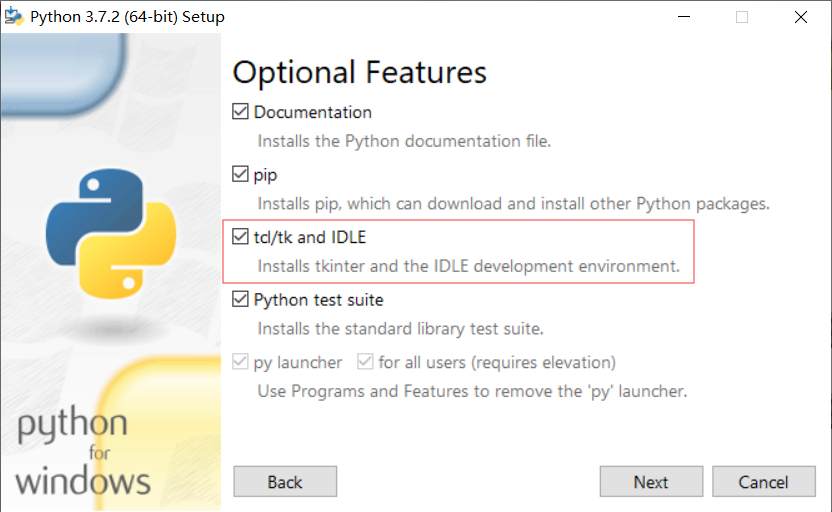

# Python Tkinter使用

## 安装

`Tkinter`是`Python`内置的一个`UI`库，可以通过它创建一些简单的`UI`界面。使用`Tkinter`时，可能会出现`No module named '_tkinter'`：

```python
import tkinter
Traceback (most recent call last):
  File "<input>", line 1, in <module>
  File "/usr/local/apps/pycharm-2019.1.3/helpers/pydev/_pydev_bundle/pydev_import_hook.py", line 21, in do_import
    module = self._system_import(name, *args, **kwargs)
  File "/usr/local/python37/lib/python3.7/tkinter/__init__.py", line 36, in <module>
    import _tkinter # If this fails your Python may not be configured for Tk
  File "/usr/local/apps/pycharm-2019.1.3/helpers/pydev/_pydev_bundle/pydev_import_hook.py", line 21, in do_import
    module = self._system_import(name, *args, **kwargs)
ModuleNotFoundError: No module named '_tkinter'
```

### Windows安装



### Linux安装

`Linux`针对这个问题有两种解决方案：

- `sudo apt install python-tk`或`sudo apt install python3-tk`，这种方案对高版本`Python`可能不起作用。
- 安装`tcl`和`tk`后，重新编译`Python`。

```bash
# tcl和tk下载位置
# http://www.tcl.tk/software/tcltk/download.html
# tk文档
# https://tkdocs.com/tutorial/install.html
# 安装tcl
➜  ~ 
wget https://prdownloads.sourceforge.net/tcl/tcl8.7a3-src.tar.gz
➜  ~ tar -zxvf tcl8.7a3-src.tar.gz
➜  ~ cd tcl8.7a3/unix
➜  unix ./configure
➜  unix sudo make && sudo make install
# 安装tk
➜  ~ 
wget https://prdownloads.sourceforge.net/tcl/tk8.7a3-src.tar.gz
➜  ~ tar -zxvf tk8.7a3-src.tar.gz
➜  ~ cd tk8.7a3/unix
➜  unix ./configure
➜  unix sudo make && sudo make install
# 编译安装python
➜  ~ wget https://www.python.org/ftp/python/3.8.0/Python-3.8.0.tar.xz
➜  ~ tar -zxvf Python-3.8.0.tar.xz
➜  ~ cd Python-3.8.0
➜  Python-3.8.0 ./configure --prefix=/usr/local/apps/python38/ --with-tcltk-includes=/usr/local/include/ --with-tcltk-libs='/usr/local/lib/libtcl8.7.so /usr/local/lib/libtk8.7.so'
# 测试
➜  ~ cd /usr/local/apps/python38/bin 
➜  bin ./python3.8 
Python 3.8.0 (default, Dec  6 2019, 21:49:23) 
[GCC 6.3.0 20170516] on linux
Type "help", "copyright", "credits" or "license" for more information.
>>> import tkinter
>>> 
```

