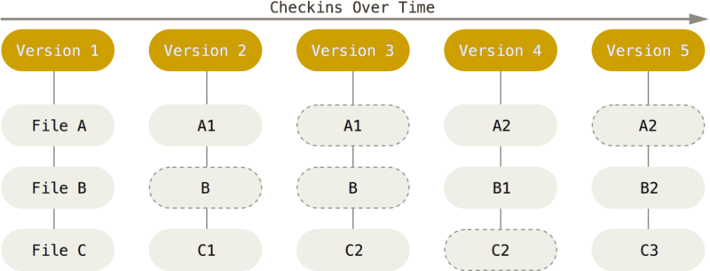
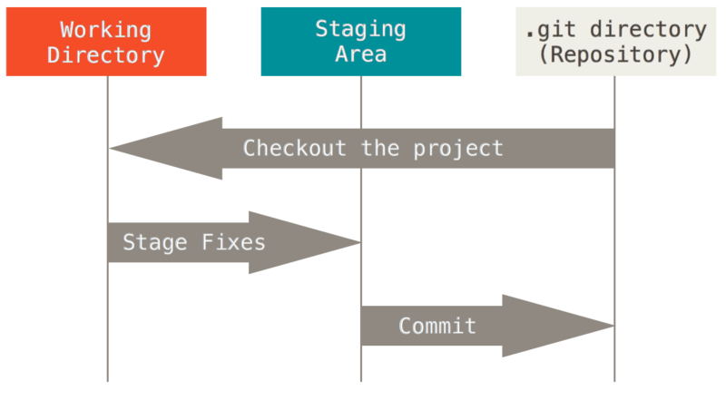
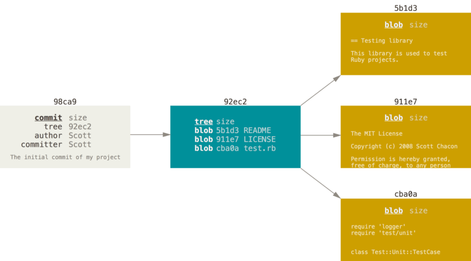
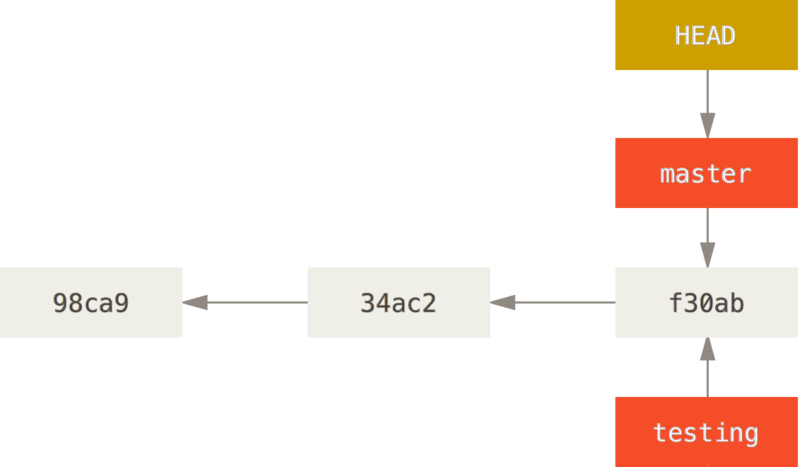
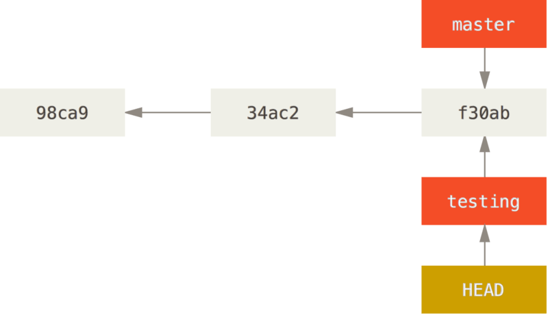

# Git部分

## Git简介

Git是一款由`Linus`开发的开源版本控制工具，它具备简单易用、高效、完全分布式的特点，现被广泛用于各类项目。

## 安装

### Linux

- Debian/Ubuntu

  ```bash
  ➜  Desktop sudo apt install git
  ```

- Centos

  ```bash
  ➜  Desktop sudo yum install git
  ```

更多Linux版本的安装步骤参见`https://git-scm.com/download/linux`。

### Windows

Windows可以直接从https://git-scm.com/download/win中下载`Git for Windows`，点击安装即可。


## Git基本原理

Git

Git是基于快照的，每次提交更新时，都会将

Git采用快照来存储版本信息，每次提交更新，它会对当前状态的全部文件制作一个快照并在版本信息中保存快照的索引。为了高效和节约空间，如果文件没有修改，则只在版本信息中保留指向之前存储的文件的连接。



Git在保存数据前都会先计算校验和(SHA-11散列)，然后采用校验和作为文件快照的索引，因此数据在传输过程中出现损坏或丢失，Git能立即发现。

Git中的文件有四种状态：未提交(`Untracked`)、已提交(`Unmodi`)、已修改`modified`和已暂存(`staged`)，


分别对应三个工作区概念：Git仓库、工作目录、暂存区域。

- Git仓库：用于存储元数据和对象数据库。

- 工作目录：用于存放某个版本的内容，便于使用与修改。

- 暂存区：用于存储下次提交的文件列表信息。



工作目录中存储的文件有三种状态：

- Untracked：新建的文件的状态。
- Modified：版本中已提交但被修改文件的状态。

- Unmodified：版本中已提交但未修改文件的状态。

基本的Git工作流程如下：

- 工作目录中修改文件。
- 暂存文件(`Stage Fixes`)，此时会将文件的快照放入暂存区。
- 提交更新(`Commit`)，将暂存区中的内容存储到Git仓库中。

## 常用命令

Git提供命令行模式和GUI模式，但是为了更好的理解Git的运行模式，推荐采用命令行，如果要使用GUI模式，可以从https://git-scm.com/downloads/guisGit下载相应的GUI版本。

### 获取Git仓库

获得Git仓库有两种方法：

- 从服务器中克隆一个现有Git仓库。
- 创建一个仓库。

#### 克隆

克隆仓库的命令格式是`git clone url [new_dir_name]`。假如克隆Git的源码仓库：

```bash
➜  Desktop git clone https://github.com/git/git.git
➜  Desktop ls |grep git
git
```

如果要自定义本地仓库的名称：

```bash
➜  Desktop git clone https://github.com/git/git.git MyGit
➜  Desktop ls |grep git
MyGit
```

#### 创建

如果想要在本地创建一个Git仓库，只需要创建一个文件夹，然后执行`git init`即可。

```bash
➜  Desktop mkdir MyGitTest
➜  Desktop cd MyGitTest 
➜  MyGitTest git init
已初始化空的 Git 仓库于 /home/root/Desktop/MyGitTest/.git/
```

通过查看文件夹中的内容，可以发现多了一个`.git`的文件夹，其中存储的是Git仓库。

```bash
➜  MyGitTest git:(master) ls -al
总用量 12
drwxr-xr-x 3 root root 4096 2月  16 23:19 .
drwxr-xr-x 6 root root 4096 2月  16 23:19 ..
drwxr-xr-x 7 root root 4096 2月  16 23:19 .git
```

### 记录更新

#### 状态查看

Git中可以使用`git status`查看当前仓库中文件的状态。

```bash
➜  MyGitTest git:(master) git status
位于分支 master

初始提交

无文件要提交（创建/拷贝文件并使用 "git add" 建立跟踪）
# 创建新文件 new_file
➜  MyGitTest git:(master) echo "new" > new_file
➜  MyGitTest git:(master) ✗ git status
位于分支 master

初始提交

未跟踪的文件:
  （使用 "git add <文件>..." 以包含要提交的内容）

	new_file

提交为空，但是存在尚未跟踪的文件（使用 "git add" 建立跟踪）
```

通过实验我们可以看到，在工作空间中创建一个新文件后，`git status`会提示仓库中存在未追踪的文件，此时`new_file`的状态为`Untracked`。

#### 暂存文件

上一节中，`git status`提示我们可以使用`git add 文件`暂存文件。使用`git add`暂存文件后，文件将被存入暂存区。

```bash
➜  MyGitTest git:(master) ✗ git add new_file 
➜  MyGitTest git:(master) ✗ git status
位于分支 master

初始提交

要提交的变更：
  （使用 "git rm --cached <文件>..." 以取消暂存）

	新文件：   new_file
```

#### 移除文件

如果暂存文件时，暂存了我们暂时不想存入的文件，可以采用`git rm --cached`将其移出暂存区。

```bash
➜  MyGitTest git:(master) ✗ git rm --cached new_file 
rm 'new_file'
➜  MyGitTest git:(master) ✗ git status
位于分支 master

初始提交

未跟踪的文件:
  （使用 "git add <文件>..." 以包含要提交的内容）

	new_file

提交为空，但是存在尚未跟踪的文件（使用 "git add" 建立跟踪）
```

#### 提交更新

暂存区中的文件可以使用`git commit -m "修改描述信息"`将暂存区中的快照存入Git 仓库，生成一个新的版本。修改描述信息用于在log中快速查找修改对应的版本号。

```bash
➜  MyGitTest git:(master) ✗ git add new_file 
➜  MyGitTest git:(master) ✗ git commit -m "第一个版本"
[master（根提交） 9a4a2a9] 第一个版本
 1 file changed, 1 insertion(+)
 create mode 100644 new_file
```

### 版本管理

#### 查看提交历史

我们可以通过`git log`查看整个提交历史。

```bash
➜  MyGitTest git:(master) git log

commit 9a4a2a97fb87e428fa1fe217460618844d2c98e6
Author: martin <838379742@qq.com>
Date:   Mon Feb 17 00:06:25 2020 +0800

    第一个版本
(END)
```

历史记录中，`commit`字段对应一串hash字符串，这串hash字符串就是该版本的索引信息。

#### 版本回退

Git中可以通过`git reset commit字段`将当前版本回退到`commit字段`对应的版本中。

```bash
# 先修改new_file，生成新的版本信息
➜  MyGitTest git:(master) echo 'new_file2'>> new_file 
➜  MyGitTest git:(master) ✗ git status
位于分支 master
尚未暂存以备提交的变更：
  （使用 "git add <文件>..." 更新要提交的内容）
  （使用 "git checkout -- <文件>..." 丢弃工作区的改动）

	修改：     new_file

修改尚未加入提交（使用 "git add" 和/或 "git commit -a"）
➜  MyGitTest git:(master) ✗ cat new_file 
new
new_file2
➜  MyGitTest git:(master) ✗ git add new_file 
➜  MyGitTest git:(master) ✗ git commit -m "第二个版本"
[master f2ec9f0] 第二个版本
 1 file changed, 1 insertion(+)
➜  MyGitTest git:(master) git log
commit f2ec9f0a5f84cacd59b2eb1c330a1949b026e7d4
Author: martin <838379742@qq.com>
Date:   Mon Feb 17 00:18:30 2020 +0800

    第二个版本

commit 9a4a2a97fb87e428fa1fe217460618844d2c98e6
Author: martin <838379742@qq.com>
Date:   Mon Feb 17 00:06:25 2020 +0800

    第一个版本
# 回退到第一个版本
➜  MyGitTest git:(master) git reset 9a4a2a97fb87e428fa1fe217460618844d2c98e6
重置后取消暂存的变更：
M	new_file
# 可以看到文件状态已经改变
➜  MyGitTest git:(master) ✗ git status
位于分支 master
尚未暂存以备提交的变更：
  （使用 "git add <文件>..." 更新要提交的内容）
  （使用 "git checkout -- <文件>..." 丢弃工作区的改动）

	修改：     new_file

修改尚未加入提交（使用 "git add" 和/或 "git commit -a"）
# 文件内容实际没有变化
➜  MyGitTest git:(master) ✗ cat new_file 
new
new_file2
# 提交历史已经变化
➜  MyGitTest git:(master) git log
commit 9a4a2a97fb87e428fa1fe217460618844d2c98e6
Author: martin <838379742@qq.com>
Date:   Mon Feb 17 00:06:25 2020 +0800

    第一个版本
```

#### 撤销文件修改

版本回退只能将版本状态切换到指定版本，但是文件内容实际上没有变化。如果想要将某个文件切换为某个版本的内容，可以使用`git checkout`命令。

```bash
➜  MyGitTest git:(master) git log
commit f2ec9f0a5f84cacd59b2eb1c330a1949b026e7d4
Author: martin <838379742@qq.com>
Date:   Mon Feb 17 00:18:30 2020 +0800

    第二个版本

commit 9a4a2a97fb87e428fa1fe217460618844d2c98e6
Author: martin <838379742@qq.com>
Date:   Mon Feb 17 00:06:25 2020 +0800

    第一个版本
➜  MyGitTest git:(master) git checkout 9a4a2a97fb87e428fa1fe217460618844d2c98e6 new_file 
# 文件内容已经切换到第一个版本
➜  MyGitTest git:(master) ✗ cat new_file 
new
# 查看提交历史，提交历史不会变化
➜  MyGitTest git:(master) git log
commit f2ec9f0a5f84cacd59b2eb1c330a1949b026e7d4
Author: martin <838379742@qq.com>
Date:   Mon Feb 17 00:18:30 2020 +0800

    第二个版本

commit 9a4a2a97fb87e428fa1fe217460618844d2c98e6
Author: martin <838379742@qq.com>
Date:   Mon Feb 17 00:06:25 2020 +0800

    第一个版本
```

### 分支管理

多人协作中，分支常常用于将自己的工作从开发主线上分离，避免影响开发主线，工作完成后，再合并到开发主线中。

基本原理一节中提到Git是基于快照的，当我们每次`commit`后，会生成一个提交对象和一个树对象，这个树对象记录目录结构和快照对象的引用。



Git中的分支只是一个指向提交对象的可变指针，Git默认分支名是`master`，指向最后一个提交对象。

#### 创建分支

Git中创建一个分支，需要使用`git branch`命令。`git branch`还能查看仓库中已有的分支。

```bash
# 可以看到git(分支) 显示的当前分支是master
➜  MyGitTest git:(master) git branch testing
# 查看已有分支
➜  MyGitTest git:(master) git branch
* master
  testing
```

那么Git是如何知道当前的分支是哪个呢？这是因为Git中有一个`HEAD`指针，指向了当前所在分支。



```
git log --oneline --decorate 查看每个分支当前所指对象
```

#### 切换分支

Git中切换到已有分支，可以使用`git checkout`指令。

```bash
➜  MyGitTest git:(master) git checkout testing
切换到分支 'testing'
➜  MyGitTest git:(testing) 
```



展示分支切换的优势。

### 分支合并

`git merge`

#### 删除分支

Git中删除一个无用分支，可以使用`git branch -d  分支名`。

```bash
git branch -d 分支名
```

