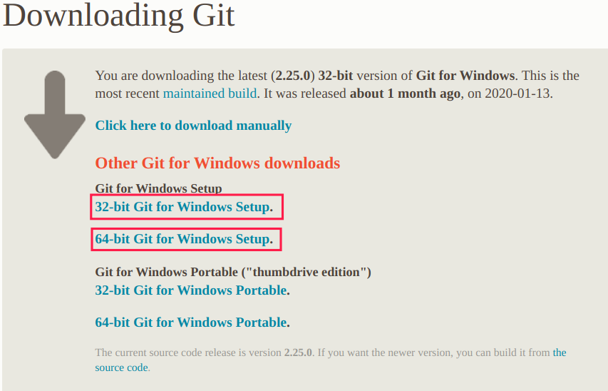
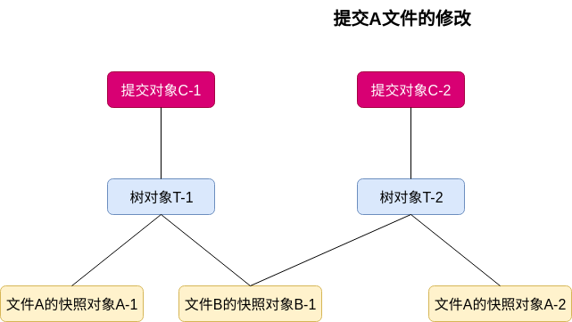
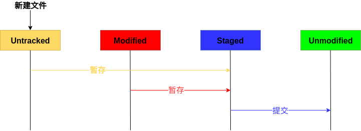
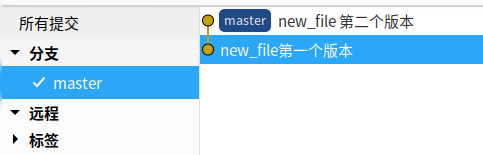
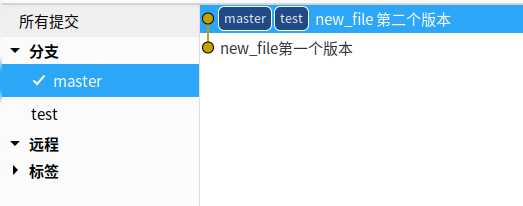
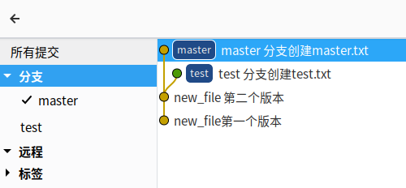
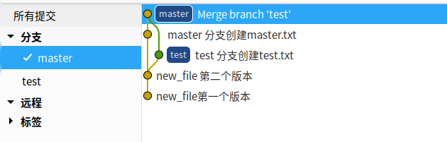

# Git部分

## Git简介

Git是一款由`Linus`开发的开源版本控制工具，它具备简单易用、高效、完全分布式的特点，现被广泛用于各类项目。

## 安装

### Linux

- Debian/Ubuntu

  ```bash
  [root@root ~]#  sudo apt install git
  ```

- Centos

  ```bash
  [root@root ~]#  Desktop sudo yum install git
  ```

更多Linux版本的安装步骤参见`https://git-scm.com/download/linux`。

### Windows

Windows可从https://git-scm.com/download/win中下载`Git for Windows`，点击安装即可。



## Git基本原理

Git有三个工作区概念：

- Git仓库：存储元数据和对象数据库。
- 工作目录：存储某个版本的内容，便于使用与修改。
- 暂存区：存储下次提交的文件列表信息。

Git是一款基于快照的版本控制工具，提交更新时，Git会为暂存区中的文件生成相应的快照对象(`blob`对象)，然后生成一个树对象(`tree`对象)，存储当前的目录结构和对应文件快照对象的指针，最后生成一个提交对象(`commit`对象)，提交对象中有指向该树对象的指针。

Git为了节约空间和高效处理，如果Git仓库中的文件没有修改，那么树对象中对应文件的指针将执行之前生成的快照对象。



提交更新时，Git还会为每个对象生成相应的校验码(`SHA-11`散列)，将校验码作为对象的索引名，因此在传输过程中如果出现损坏或丢失，Git能立马通过校验码发现。

一个Git项目中的文件有四种状态：

- 已提交(`Unmodified`)：已提交到Git仓库。
- 已暂存(`Staged`)：已提交到暂存区。
- 已修改(`Modified`)：工作目录中被修改的文件。
- 未提交(`Untracked`)：工作目录中新建的文件。

因此，一个基本的Git工作流程如下：

- 工作目录中修改文件或新建文件。
- 暂存文件，Git将生成相应文件的快照并存入暂存区。
- 提交更新，将暂存区中的内容存储到Git仓库中。



## 常用命令

Git提供命令行模式和GUI模式，但是为了更好的理解Git的运行模式，推荐采用命令行，如果要使用GUI模式，可以从https://git-scm.com/downloads/guisGit下载相应的GUI版本。

### 基础配置

第一次安装使用Git时，需要配置用户信息。

```bash
# 用户名，便于提交更新时，标识更新记录
[root@root ~]#  git config --global user.name "martin"
# 配置邮箱
[root@root ~]#  git config --global user.email  xxx@email.com
# 查看已有配置
[root@root ~]#  git config --list 
user.name=martin
user.email=xxx@email.com
```

### 创建Git仓库

创建一个Git仓库，只需要有一个文件夹，然后在该文件夹下执行`git init`，这个命令将在当前目录下创建一个空的Git仓库`.git`。

```bash
# 创建文件夹 MyGitTest
[root@root ~]# mkdir GitTest
# 进入文件夹MyGitTest
[root@root ~]# cd GitTest
# 创建Git仓库
[root@root GitTest]# git init
Initialized empty Git repository in /root/GitTest/.git/
# .git目录下有很多文件，objects用于存放对象
[root@root GitTest]#  ls .git
branches  config  description  HEAD  hooks  info  objects  refs
```

### 提交更新

提交更新，会使用到如下几个命令：

- `git status`：查看工作目录中文件的状态。
- `git add`：将文件修改添加到暂存区。
- `git rm`：将文件修改移出暂存区。
- `git commit`：提交更新。

#### 状态查看

工作空间状态查看会使用`git status`指令。

```bash
[root@root GitTest]#  git status
# On branch master
#
# Initial commit
#
nothing to commit (create/copy files and use "git add" to track)
```

如果工作空间中有新建的文件，那么文件处于未追踪(Untracked)状态。

```bash
# 创建新文件 new_file
[root@root GitTest]#  echo "new" >> new_file
[root@root GitTest]#  git status
# On branch master
#
# Initial commit
#
# Untracked files:
#   (use "git add <file>..." to include in what will be committed)
#
#       new_file
nothing added to commit but untracked files present (use "git add" to track)
```

#### 暂存文件

暂存文件会使用`git add 文件`，将文件修改暂存到暂存区，暂存操作会生成相应的文件快照对象。

```bash
# objects下没有对象
[root@root GitTest]#  ls .git/objects       
info  pack
# 将文件加入暂存区
[root@root GitTest]#  git add new_file 
# object目录下生成了一个快照对象3e757656
# 目录规则：校验码前两位做目录
[root@root GitTest]#  tree .git/objects
.git/objects
├── 3e
│   └── 757656cf36eca53338e520d134963a44f793f8
├── info
└── pack

3 directories, 1 file
```

暂存操作执行后，文件的状态将发生改变。

```bash
[root@root GitTest]#  git status
# On branch master
#
# Initial commit
#
# Changes to be committed:
#   (use "git rm --cached <file>..." to unstage)
#
#       new file:   new_file
```

#### 移出暂存区

如果暂存文件时，加入了我们不想存入的文件，可使用`git rm --cached`命令将其移出暂存区。

```bash
[root@root GitTest]#  git rm --cached new_file
rm 'new_file'
[root@root GitTest]#  git status
# On branch master
#
# Initial commit
#
# Untracked files:
#   (use "git add <file>..." to include in what will be committed)
#
#       new_file
nothing added to commit but untracked files present (use "git add" to track)
```

#### 提交更新

提交更新的命令格式是`git commit -m "修改描述信息"`，Git会将暂存区中的快照存入仓库，生成对应树对象和提交对象。修改描述信息便于在日志中快速查找修改对应的版本号。

```bash
[root@root GitTest]#  git add new_file
[root@root GitTest]#  git commit -m "new_file第一个版本"
[master a17e531] new_file第一个版本
 1 file changed, 1 insertion(+)
 create mode 100644 new_file
# git仓库中多了两个个对象，a17e531对象与commit返回值相同
# 因此可以推断出a17e531是提交对象，0f6ab7a9是树对象
[root@root GitTest]#  tree .git/objects
.git/objects
├── 0f
│   └── 6ab7a9f9f0ae63c37835bb91c82e7050422cc3
├── 3e
│   └── 757656cf36eca53338e520d134963a44f793f8
├── a1
│   └── 7e531ec313da086478dac63e8d6c41845417aa
├── info
└── pack
```

### 版本管理

Git中一个提交等价于一个版本，版本管理中通常会用到如下命令：

- `git log`：查看提交历史。
- `git reset`：版本回退。
- `git checkout`：切换版本。

#### 查看提交历史

`git log`命令将进入提交历史页面，按上、下键执行页面滚动操作，按`q`退出页面。

```bash
[root@root GitTest]#  git log
# commit commit_id
commit a17e531ec313da086478dac63e8d6c41845417aa
Author: martin <xxx@email.com>
Date:   Sat Feb 22 14:37:38 2020 +0800

    new_file第一个版本
```

提交历史记录中，每个`commit`都对应相应的`commit id`，这个`id`对应的提交对象可以在`.git/objects`目录下找到。

#### 版本回退

`git reset commit_id`命令会将当前版本回退到`commit_id`对应版本，但工作空间中的文件内容仍保持切换前的状态。

我们先创建修改`new_file`，提交更新，生成新的版本信息。

```bash
[root@root GitTest]#  echo 'new_file2'>> new_file 
[root@root GitTest]#  cat new_file 
new
new_file2
[root@root GitTest]#  git add new_file 
[root@root GitTest]#  git commit -m "new_file 第二个版本"
[master 65ae1d0] new_file 第二个版本
 1 file changed, 1 insertion(+)
[root@root GitTest]#  git log
commit 65ae1d0bd49549cd26a427f411f3bef25159d6a1
Author: martin <xxx@email.com>
Date:   Sat Feb 22 14:51:15 2020 +0800
    new_file 第二个版本

commit a17e531ec313da086478dac63e8d6c41845417aa
Author: martin <xxx@email.com>
Date:   Sat Feb 22 14:37:38 2020 +0800
    new_file第一个版本
```

然后我们使用`git reset`命令回退到第一个版本。

```bash
# 回退到第一个版本，文件状态变为了M
[root@root GitTest]#  git reset a17e531ec313da086478dac63e8d6c41845417aa
Unstaged changes after reset:
M       new_file
# 提交历史已经变化
[root@root GitTest]#  git log
commit a17e531ec313da086478dac63e8d6c41845417aa
Author: martin <xxx@email.com>
Date:   Sat Feb 22 14:37:38 2020 +0800
    new_file第一个版本
# 文件内容实际没有变化
[root@root GitTest]#  cat new_file 
new
new_file2
```

`git reset`命令还可以切换到任意已存在版本。我们现在切回去到new_file的第二个版本。

```bash
[root@root GitTest]#  git reset 65ae1d0bd49549cd26a427f411f3bef25159d6a1
[root@root GitTest]#  git log
commit 65ae1d0bd49549cd26a427f411f3bef25159d6a1
Author: martin <xxx@email.com>
Date:   Sat Feb 22 14:51:15 2020 +0800
    new_file 第二个版本

commit a17e531ec313da086478dac63e8d6c41845417aa
Author: martin <xxx@email.com>
Date:   Sat Feb 22 14:37:38 2020 +0800
    new_file第一个版本
```

#### 切换版本

`git reset`只能将版本切换到指定版本，但文件内容实际上没有变化。如果要切换到指定版本，需要使用`git checkout commit_id`命令。

```bash
[root@root GitTest]#  git checkout a17e531ec313da086478dac63e8d6c41845417aa new_file 
# 文件内容已经切换到第一个版本
[root@root GitTest]#  cat new_file 
new
# 查看提交历史，提交历史不会变化
[root@root GitTest]#  git log
commit 65ae1d0bd49549cd26a427f411f3bef25159d6a1
Author: martin <xxx@email.com>
Date:   Sat Feb 22 14:51:15 2020 +0800
    new_file 第二个版本

commit a17e531ec313da086478dac63e8d6c41845417aa
Author: martin <xxx@email.com>
Date:   Sat Feb 22 14:37:38 2020 +0800
    new_file第一个版本
```

### 分支管理

分支常用于将自己的工作从开发主线上分离，避免影响开发主线，工作完成后，再合并到开发主线中。

基本原理一节中提到提交更新后，Git会生成相应的提交对象。Git中，分支是个可变指针，执行相应的提交对象。Git默认分支名是`master`，指向当前分支最后一个提交对象。通过可视化工具查看仓库的分支信息。




分支管理通常会使用到如下三个命令：

- `git branch`：创建、删除分支。
- `git checkout`：切换分支。
- `git merge`：分支合并。

#### 创建、删除分支

`git branch`命令主要有三个功能：

- 查看已有分支：`git branch`
- 创建分支：`git branch 分支名`
- 删除分支：`git branch -d 分支名`

```bash
# 查看已有分支
[root@root GitTest]#  git branch
* master
# 创建分支
[root@root GitTest]#  git branch test
[root@root GitTest]#  git branch
* master
  test
# 删除分支
[root@root GitTest]#  git branch -d test
Deleted branch test (was 65ae1d0)
```



Git是如何知道当前的分支是哪个呢？这是因为Git中有一个`HEAD`指针，指向了当前所在分支。

```bash
[root@root GitTest]#  cat .git/HEAD 
ref: refs/heads/master
```

#### 切换分支

`git checkout 分支名`会将工作空间的版本切换到指定分支名对应的版本。

```bash
[root@root GitTest]#  git checkout test
Switched to branch 'test'
➜  GitTest git:(test) git branch
  master
* test
```

我们先在`test`分支下创建`test.txt`。

```bash
# test分支创建test.txt
[root@root GitTest]#  echo 'file test'>test.txt
[root@root GitTest]#  git add test.txt 
[root@root GitTest]#  git commit -m "test 分支创建test.txt"
[test 512cb7f] test 分支创建test.txt
 1 file changed, 1 insertion(+)
 create mode 100644 test.txt
[root@root GitTest]#  ls
new_file  test.txt
```

然后在`master`分支下创建`master.txt`文件，可以发现两个分支互不影响。

```bash
[root@root GitTest]#  git checkout master
Switched to branch 'master'
[root@root GitTest]#  ls
new_file
[root@root GitTest]#  echo 'file master'>master.txt    
[root@root GitTest]#  git add master.txt 
[root@root GitTest]#  git commit -m "master 分支创建master.txt"
[master 7e18d3b] master 分支创建master.txt
 1 file changed, 1 insertion(+)
 create mode 100644 master.txt
```



#### 分支合并

当分支开发完毕后，需要通过`git merge 分支`将分支上的修改合并到当前分支。

```bash
# 当前分支为master
[root@root GitTest]#  git branch
* master
  test
# 将test分支的内容合并到master
[root@root GitTest]#  git merge test
Merge made by the 'recursive' strategy.
 test.txt | 1 +
 1 file changed, 1 insertion(+)
 create mode 100644 test.txt
[root@root GitTest]#  ls
master.txt  new_file  test.txt
```



