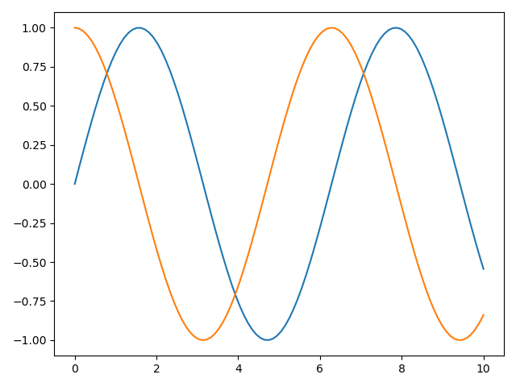
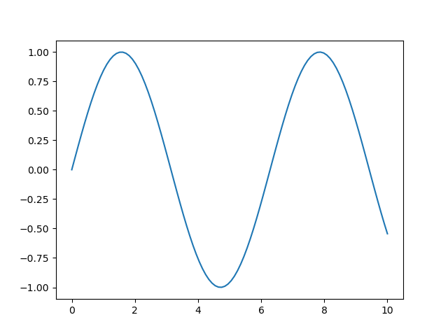
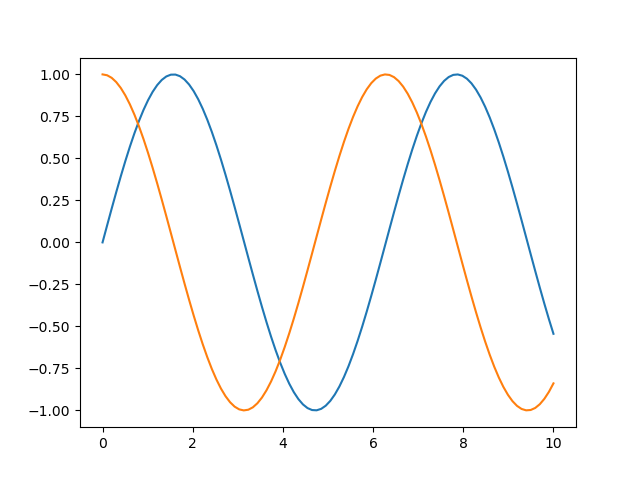
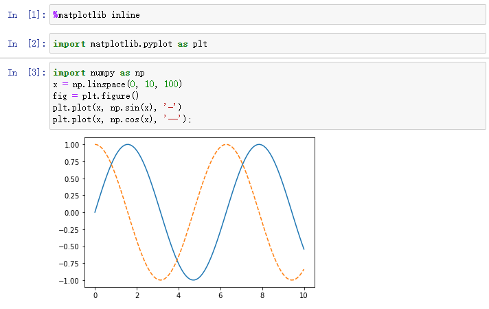
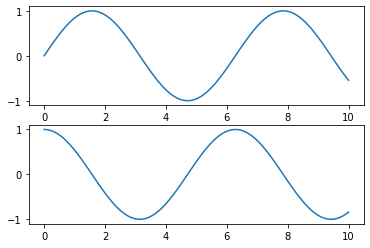
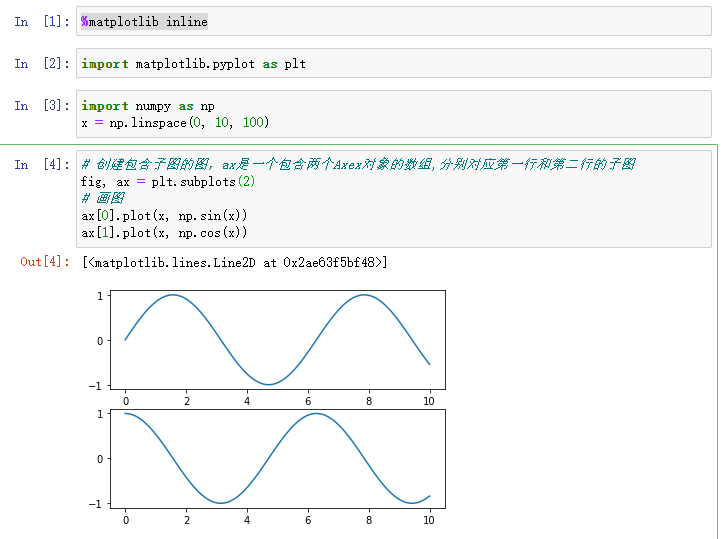

# Matplotlib学习笔记

## 其他图像显示库

- `ggplot`：`http://www.ggplot2-exts.org/gallery/`
- `HoloViews`：`http://holoviews.org`
- `Altair`：`https://altair-viz.github.io/`
- `Pandas`

## 基础使用

### 导入

```python
import matplotlib as mpl
import matplotlib.pyplot as plt
```

### 设置绘图样式

```python
plt.style.use('classic')
```

### 显示图形

- 脚本画图：`plt.show()`，开启事件循环，找到所有可用的图形对象，打开相应的交互式窗口。

```python
import numpy as np
import matplotlib.pyplot as plt
x = np.linspace(0, 10, 100)
plt.plot(x, np.sin(x))
plt.plot(x, np.cos(x))
plt.show()
```



- `IPython shell`：`%matplotlib`，不需要调用`show`方法，会自动更新，如果没有及时更新，调用`plt.draw()`强制更新。

  

  ​	

- `IPython Notebook`

  - `%matplotlib notebook`：交互式图形。
  - `%matplotlib inline`：启动静态图形。

  

### 保持为图片

```python
import numpy as np
import matplotlib.pyplot as plt

x = np.linspace(0, 10, 100)
# 创建图片对象
fig = plt.figure()
plt.plot(x, np.sin(x))
plt.plot(x, np.cos(x))
# 保存
fig.savefig('figure.png')
```

在`Ipython`中可通过`Image`对象查看图片。

```python
from IPython.display import Image
Image('figure.png')
```

`Matplotlib`支持很多图形格式，具体由操作系统决定，可通过`canvas`查看。

```python
In[9]: fig.canvas.get_supported_filetypes()
Out[9]: 
{'ps': 'Postscript',
 'eps': 'Encapsulated Postscript',
 'pdf': 'Portable Document Format',
 'pgf': 'PGF code for LaTeX',
 'png': 'Portable Network Graphics',
 'raw': 'Raw RGBA bitmap',
 'rgba': 'Raw RGBA bitmap',
 'svg': 'Scalable Vector Graphics',
 'svgz': 'Scalable Vector Graphics'}
```

## 画图接口

### MATLAB风格

```python
import matplotlib.pyplot as plt
import numpy as np
x = np.linspace(0, 10, 100)
# 创建图形
plt.figure()
# 添加第一个子图，坐标 行、列、子图行号为1
# (两行,一列,第一行)
plt.subplot(2, 1, 1)
# 添加数据，画图
plt.plot(x, np.sin(x))
# 添加第二个子图，坐标 行、列、子图行号为2
# (两行,一列,第二行)
plt.subplot(2, 1, 2)
# 添加数据，画图
plt.plot(x, np.cos(x));
```



MATLAB风格的接口是有状态的，会持续跟踪当前的图像`plt.gcf()`和坐标轴`plt.gca()`，缺点是画图过于复杂。

### 面对对象风格

面对对象风格适用于复杂场景。



## 简易线形图

