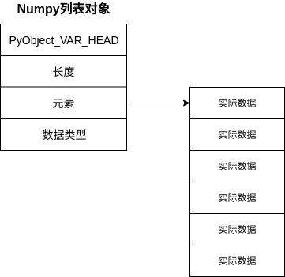

# numpy 学习笔记

## Python列表与NumPy列表的区别

Python中，类型是动态推断的，因此可以将任意类型的数据传递给任意引用，引用只存储对象的指针，对象不仅仅存储值，还会存储与值相关的信息，如类型。

标准的Python是由C语言实现的，Python的[长整型源码如下：](<https://github.com/python/cpython/blob/e42b705188271da108de42b55d9344642170aa2b/Include/longintrepr.h>)

```c
struct _longobject {
    PyObject_VAR_HEAD // 对象头部，包含引用计数、数据大小等信息
    digit ob_digit[1];// 实际数据存储位置
};
```

C语言中整型变量的本质是一个指针，指向相应的内存位置，其中存储的数据将被解释为整型。Python中整型引用的实质也是指针，只是指向的内存是一个整型对象，该对象中包含了实际数据。

类型动态推断为Python带来了自由灵活的特点，但是也带来了耗时和占用更多存储空间的缺点。当数据对象很多时，对每个数据都执行运算，类型推断带来的时间损坏就无法接受。

Python的列表本质上是一个容器，存储的是每个数据对象的引用，因此会有很多冗余数据，但是优点是每个元素的数据类型可以不同。


NumPy中列表对象也是一个容器，只是直接存储了实际的数据，而不是存储的引用，因此空间消耗小，但是缺点是存储的数据类型必须相同。



## NumPy 数组创建

`NumPy`提供了两种创建数组的方法：

- 使用Python列表创建数组。
- 自身提供了一系列数组创建方法。

### 使用Python列表创建数组

```python
In[2]: import numpy as np
# 列表中，每个元素的大小相同，保持原有结构
In[3]: np.array([[1,2,3],[4,5,6]])
Out[3]: 
array([[1, 2, 3],
       [4, 5, 6]])
# 当列表中，每个元素的个数不同时，将列表作为array中的元素
In[4]: np.array([[1,2,3],[4,5,6],[7,8,9,0]])
Out[4]: array([list([1, 2, 3]), list([4, 5, 6]), list([7, 8, 9, 0])], dtype=object)
# array函数还支持指定元素类型
In[5]: np.array([[1,2,3],[4,5,6]],dtype='float32')
Out[5]: 
array([[1., 2., 3.],
       [4., 5., 6.]], dtype=float32)
```

### NumPy提供的数组创建方法

- `np.zeros(shape,dtype=None)`：创建元素全为0的数组。

```python
In[2]: import numpy as np
# 创建元素全为0的数组，第一个参数用于指定数组的形状
In[3]: np.zeros((3,4),dtype='float32')
Out[3]: 
array([[0., 0., 0., 0.],
       [0., 0., 0., 0.],
       [0., 0., 0., 0.]], dtype=float32)
```

- `np.ones(shape,dtype=None)`：创建元素全为1的数组。

```python
In[4]: np.ones((3,4),dtype='int')
Out[4]: 
array([[1, 1, 1, 1],
       [1, 1, 1, 1],
       [1, 1, 1, 1]])
```

- `np.eye(N, M=None, k=0, dtype=None)`：单位矩阵，N为行数，M为列数，k表示主对角线位置，为正右移，为负下移。

```python
In[5]: np.eye(3,5)
Out[5]: 
array([[1., 0., 0., 0., 0.],
       [0., 1., 0., 0., 0.],
       [0., 0., 1., 0., 0.]])
In[6]: np.eye(3,5,2)
Out[6]: 
array([[0., 0., 1., 0., 0.],
       [0., 0., 0., 1., 0.],
       [0., 0., 0., 0., 1.]])
# 为正，主对角线向右移动
In[7]: np.eye(3,5,1)
Out[7]: 
array([[0., 1., 0., 0., 0.],
       [0., 0., 1., 0., 0.],
       [0., 0., 0., 1., 0.]])
# 为负，主对角线向下移动
In[8]: np.eye(3,5,-1)
Out[8]: 
array([[0., 0., 0., 0., 0.],
       [1., 0., 0., 0., 0.],
       [0., 1., 0., 0., 0.]])
```

- `np.empty(shape,dtype=None)`：未初始化数组，使用内存中的值。

```python
In[9]: np.empty((2,3))
Out[9]: 
array([[0., 0., 0.],
       [0., 0., 0.]])
```

- `np.full(shape,fill_value,dtype=None)`：指定数组中的元素。使用`fill_value`填充整个数组。

```python
In[10]: np.full((2,2),3)
Out[10]: 
array([[3, 3],
       [3, 3]])
```

- `np.arange(start,end,step)`：类似`range`。

```python
In[11]: np.arange(0,10,2)
Out[11]: array([0, 2, 4, 6, 8])
```

- `np.linspace(start, stop, num)`：等分。

```python
In[12]: np.linspace(0,2,8)
Out[12]: 
array([0.        , 0.28571429, 0.57142857, 0.85714286, 1.14285714,
       1.42857143, 1.71428571, 2.        ])
```

- `np.random.random(shape)`：随机数数组，随机数数组可以通过种子设置`np.random.seed(种子值)`，确保每次都可以生成相同的随机数组。

```python
In[13]: np.random.random((2,3))
Out[13]: 
array([[0.25291727, 0.31061105, 0.35846742],
       [0.70097643, 0.42273938, 0.68979842]])
```

- `np.random.randint(low, high=None, size=None, dtype='l')`：随机整数数组。`low`指定最小值，`high`指定最大值，`size`指定数组大小，`dtype`指定类型，默认为长整数。

```python
In[14]: np.random.randint(3,10,(3,3))
Out[14]: 
array([[5, 4, 9],
       [5, 7, 8],
       [6, 7, 6]])
```

- `np.random.normal(loc=0.0, scale=1.0, size=None)`：正态分布的随机数数组。`loc`为均值，`scale`为方差。

```python
In[15]: np.random.normal(loc=0,scale=1,size=(3,3))
Out[15]: 
array([[-0.27790899, -0.40555873,  1.4556945 ],
       [ 0.30803511,  0.48139034, -0.4113923 ],
       [-0.03732743,  0.58483608,  0.33255994]])
```

### 数据类型

`Numpy`创建数组时，可以指定数组元素类型，如果初始化时数据类型不一致，会自动转换为相应的类型。

```python
In[1]: import numpy as np
In[2]: np.array([1,2],dtype='float')
Out[2]: array([1., 2.])
```

`NumPy`支持如下数据类型：

| 数据类型   | 描述                                                         |
| ---------- | ------------------------------------------------------------ |
| bool_      | 布尔值（真、 True 或假、 False） ， 用一个字节存储           |
| int_       | 默认整型（类似于 C 语言中的 long， 通常情况下是 int64 或 int32） |
| intc       | 同 C 语言的 int 相同（通常是 int32 或 int64）                |
| intp       | 用作索引的整型（和 C 语言的 ssize_t 相同， 通常情况下是 int32 或 int64） |
| int8       | 字节（byte， 范围从–128 到 127）                             |
| int16      | 整型（范围从–32768 到 32767）                                |
| int32      | 整型（范围从–2147483648 到 2147483647）                      |
| int64      | 整型（范围从–9223372036854775808 到 9223372036854775807）    |
| uint8      | 无符号整型（范围从 0 到 255）                                |
| uint16     | 无符号整型（范围从 0 到 65535）                              |
| uint32     | 无符号整型（范围从 0 到 4294967295）                         |
| uint64     | 无符号整型（范围从 0 到 18446744073709551615)                |
| float\_    | float64 的简化形式                                           |
| float16    | 半精度浮点型： 符号比特位， 5 比特位指数（exponent） ， 10 比特位尾数 （mantissa） |
| float32    | 单精度浮点型： 符号比特位， 8 比特位指数， 23 比特位尾数     |
| float64    | 双精度浮点型： 符号比特位， 11 比特位指数， 52 比特位尾数    |
| complex\_  | complex128 的简化形式                                        |
| complex64  | 复数， 由两个 32 位浮点数表示                                |
| complex128 | 复数， 由两个 64 位浮点数表示                                |

## 数组的基础操作

### 属性

数组常见的属性有：

- `ndim`：维度。
- `shape`：形状。
- `size`：数组的总大小(元素个数)。
- `dtype`：数据类型。
- `itemsize`：每个元素的字节数。
- `nbytes`：数组总字节数，`nbtypes=size*itemsize`。

```python
In[1]: import numpy as np
# (3,4,5):三层四行五列
In[2]: array = np.random.randint(0,10,(3,4,5),int)
In[3]: array.ndim
Out[3]: 3
In[4]: array.shape
Out[4]: (3, 4, 5)
In[5]: array.size
Out[5]: 60
In[6]: array.dtype
Out[6]: dtype('int32')
In[7]: array.itemsize
Out[7]: 4
In[8]: array.nbytes
Out[8]: 240
```

### 索引

`NumPy`的数组支持Python列表的标准索引，在多为数组中，采用逗号隔离。

```python
In[9]: array
Out[9]: 
array([[[1, 4, 2, 5, 0],
        [2, 9, 8, 9, 3],
        [4, 0, 6, 2, 9],
        [3, 5, 2, 5, 7]],
       [[3, 8, 7, 3, 7],
        [9, 9, 9, 1, 5],
        [0, 5, 3, 7, 6],
        [0, 1, 4, 7, 6]],
       [[6, 5, 9, 8, 1],
        [8, 9, 0, 3, 7],
        [9, 9, 4, 6, 9],
        [4, 3, 2, 4, 2]]])
In[10]: array[1,2]
Out[10]: array([0, 5, 3, 7, 6])
In[11]: array[1,2,2]
Out[11]: 3
In[12]: array[1,2,1]
Out[12]: 5
```

### 切片

`NumPy`的数组切片语法与`Python`列表切片语法相同，用`:`表示，在多为数组中，采用逗号隔离。

```python
In[13]: array
Out[13]: 
array([[[1, 4, 2, 5, 0],
        [2, 9, 8, 9, 3],
        [4, 0, 6, 2, 9],
        [3, 5, 2, 5, 7]],
       [[3, 8, 7, 3, 7],
        [9, 9, 9, 1, 5],
        [0, 5, 3, 7, 6],
        [0, 1, 4, 7, 6]],
       [[6, 5, 9, 8, 1],
        [8, 9, 0, 3, 7],
        [9, 9, 4, 6, 9],
        [4, 3, 2, 4, 2]]])
In[14]: array[1:]
Out[14]: 
array([[[3, 8, 7, 3, 7],
        [9, 9, 9, 1, 5],
        [0, 5, 3, 7, 6],
        [0, 1, 4, 7, 6]],

       [[6, 5, 9, 8, 1],
        [8, 9, 0, 3, 7],
        [9, 9, 4, 6, 9],
        [4, 3, 2, 4, 2]]])
In[15]: array[1:,:1]
Out[15]: 
array([[[3, 8, 7, 3, 7]],

       [[6, 5, 9, 8, 1]]])
In[16]: array[1:,:1,:1]
Out[16]: 
array([[[3]],

       [[6]]])
# 取第1层
In[17]: array[0,:,:]
Out[17]: 
array([[1, 4, 2, 5, 0],
       [2, 9, 8, 9, 3],
       [4, 0, 6, 2, 9],
       [3, 5, 2, 5, 7]])
# 取第2层第1行
In[18]: array[1,0,:]
Out[18]: array([3, 8, 7, 3, 7])
```

**注意**：Python列表切片生成的列表是一个副本，但`NumPy`切片生成的数组不是副本，修改切片得到的数组，原数组也会改变，这有利于通过片段进行计算数据。

```python
In[19]: a=array[1,0,:]
In[20]: a[0]=18
In[21]: a
Out[21]: array([18,  8,  7,  3,  7])
In[22]: array
Out[22]: 
array([[[ 1,  4,  2,  5,  0],
        [ 2,  9,  8,  9,  3],
        [ 4,  0,  6,  2,  9],
        [ 3,  5,  2,  5,  7]],

       [[18,  8,  7,  3,  7],
        [ 9,  9,  9,  1,  5],
        [ 0,  5,  3,  7,  6],
        [ 0,  1,  4,  7,  6]],

       [[ 6,  5,  9,  8,  1],
        [ 8,  9,  0,  3,  7],
        [ 9,  9,  4,  6,  9],
        [ 4,  3,  2,  4,  2]]])
```

如果想获取副本，这可以通过`copy`实现。

```python
In[23]: a=array[1,0,:].copy()
In[24]: a[0]=0
In[25]: a
Out[25]: array([0, 8, 7, 3, 7])
In[26]: array
Out[26]: 
array([[[ 1,  4,  2,  5,  0],
        [ 2,  9,  8,  9,  3],
        [ 4,  0,  6,  2,  9],
        [ 3,  5,  2,  5,  7]],

       [[18,  8,  7,  3,  7],
        [ 9,  9,  9,  1,  5],
        [ 0,  5,  3,  7,  6],
        [ 0,  1,  4,  7,  6]],

       [[ 6,  5,  9,  8,  1],
        [ 8,  9,  0,  3,  7],
        [ 9,  9,  4,  6,  9],
        [ 4,  3,  2,  4,  2]]])
```

### 变形

`NumPy`支持两种编写操作：

- `reshape(shape)`：变形前后元素个数必须相同，否则变形失败。
- 切片操作中的`newaxis`关键字：将一位数组变为二维的行或列。

```python
In[2]: import numpy as np
In[3]: array = np.arange(1,10)
In[4]: array.reshape((3,3))
Out[4]: 
array([[1, 2, 3],
       [4, 5, 6],
       [7, 8, 9]])
In[5]: x=np.array([1,2,3])
In[6]: x[np.newaxis,:]
Out[6]: array([[1, 2, 3]])
In[7]: x[:,np.newaxis]
Out[7]: 
array([[1],
       [2],
       [3]])
```

变形操作返回的是一个非副本视图。

```python
In[8]: a[0][0]=10
In[9]: a
Out[9]: 
array([[10,  2,  3],
       [ 4,  5,  6],
       [ 7,  8,  9]])
In[10]: array
Out[10]: array([10,  2,  3,  4,  5,  6,  7,  8,  9])
```

### 拼接

`NumPy`提供了是三个方法来拼接两个数组：

- `np.concatenate`

```
In[2]: import numpy as np
In[3]: x=np.array([1,2,3])
In[4]: y=np.array([4,5,6])
In[5]: np.concatenate([x,y])
Out[5]: array([1, 2, 3, 4, 5, 6])
# 拼接二维数组，垂直拼接
In[6]: x=np.array([[1,2,3],[4,5,6]])
In[7]: y=np.array([[7,8,9],[10,11,12]])
In[8]: np.concatenate([x,y])
Out[8]: 
array([[ 1,  2,  3],
       [ 4,  5,  6],
       [ 7,  8,  9],
       [10, 11, 12]])
# 按第二个轴开始拼接，索引从0开始，水平拼接
In[9]: np.concatenate([x,y],axis=1)
Out[9]: 
array([[ 1,  2,  3,  7,  8,  9],
       [ 4,  5,  6, 10, 11, 12]])
```

- `np.vstack`：垂直拼接。

```python
In[10]: np.vstack([x,y])
Out[10]: 
array([[ 1,  2,  3],
       [ 4,  5,  6],
       [ 7,  8,  9],
       [10, 11, 12]])
```

- `np.hstack`：水平拼接。

```python
In[11]: np.hstack([x,y])
Out[11]: 
array([[ 1,  2,  3,  7,  8,  9],
       [ 4,  5,  6, 10, 11, 12]])
```

- `np.dstack`：沿第三个维度拼接数组。

```python
# 先将x,y分别变为3维度
# [[[1],[2],[3]],[[4],[5],[6]]] 
# [[[7],[8],[9]],[[10],[11],[12]]]
# 然后再将一一拼接
In[12]: np.dstack([x,y])
Out[12]: 
array([[[ 1,  7],
        [ 2,  8],
        [ 3,  9]],
       [[ 4, 10],
        [ 5, 11],
        [ 6, 12]]])
```

### 拆分

- `np.split`

```python
In[2]: import numpy as np
In[3]: array = np.array([1,2,3,4,5,6,7,8,9])
# 拆分坐标点
In[4]: np.split(array,[3,5])
Out[4]: [array([1, 2, 3]), array([4, 5]), array([6, 7, 8, 9])]
```

- `np.hsplit`：水平拆分。

```python
In[5]: array = np.array([[1,2,3],[4,5,6],[7,8,9]])
In[6]: np.hsplit(array,[1])
Out[6]: 
[array([[1],
        [4],
        [7]]),
 array([[2, 3],
        [5, 6],
        [8, 9]])]
```

- `np.vsplit`：垂直拆分。

```python
In[7]: np.vsplit(array,[1])
Out[7]: 
[array([[1, 2, 3]]),
 array([[4, 5, 6],
        [7, 8, 9]])]
```

- `np.dsplit`：沿第三个维度拆分。

```python
In[9]: array = np.array([[[1,2,3],[4,5,6]],[[7,8,9],[10,11,12]]])
In[10]: np.dsplit(array,[1])
Out[10]: 
[array([[[ 1],
         [ 4]],
 
        [[ 7],
         [10]]]),
 array([[[ 2,  3],
         [ 5,  6]],
 
        [[ 8,  9],
         [11, 12]]])]
```

