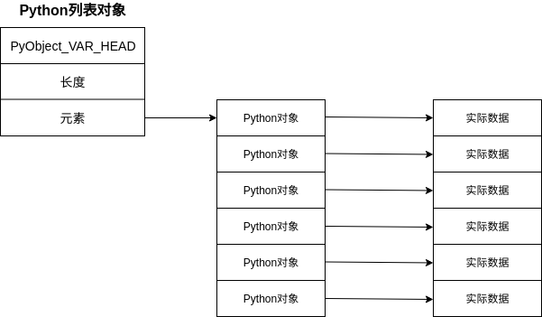

# numpy 学习笔记

## Python列表与NumPy列表的区别

Python中，类型是动态推断的，因此可以将任意类型的数据传递给任意引用，引用只存储对象的指针，对象不仅仅存储值，还会存储与值相关的信息，如类型。

标准的Python是由C语言实现的，Python的[长整型源码如下：](<https://github.com/python/cpython/blob/e42b705188271da108de42b55d9344642170aa2b/Include/longintrepr.h>)

```c
struct _longobject {
    PyObject_VAR_HEAD // 对象头部，包含引用计数、数据大小等信息
    digit ob_digit[1];// 实际数据存储位置
};
```

C语言中整型变量的本质是一个指针，指向相应的内存位置，其中存储的数据将被解释为整型。Python中整型引用的实质也是指针，只是指向的内存是一个整型对象，该对象中包含了实际数据。

类型动态推断为Python带来了自由灵活的特点，但是也带来了耗时和占用更多存储空间的缺点。当数据对象很多时，对每个数据都执行运算，类型推断带来的时间损坏就无法接受。

Python的列表本质上是一个容器，存储的是每个数据对象的引用，因此会有很多冗余数据，但是优点是每个元素的数据类型可以不同。



NumPy中列表对象也是一个容器，只是直接存储了实际的数据，而不是存储的引用，因此空间消耗小，但是缺点是存储的数据类型必须相同。


## NumPy数组创建