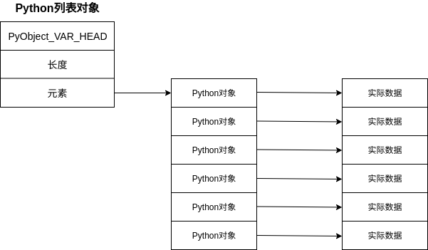
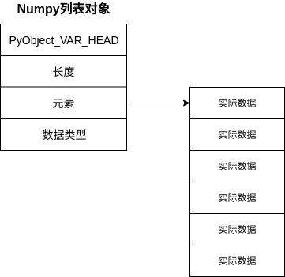
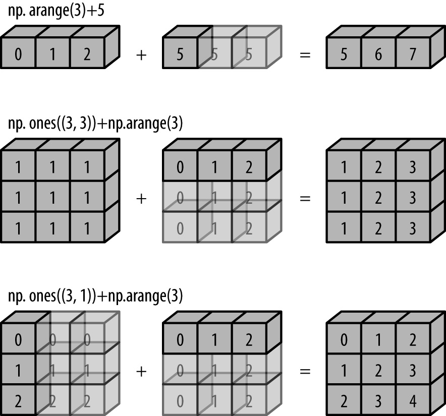
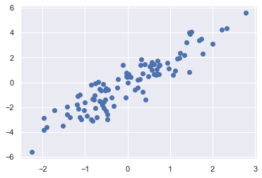
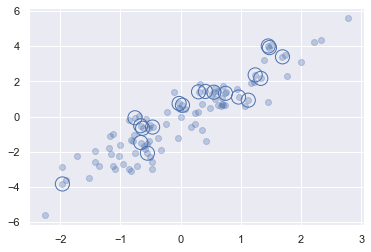
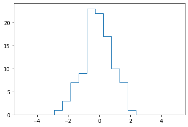

# numpy 学习笔记

## Python列表与NumPy列表的区别

Python中，类型是动态推断的，因此可以将任意类型的数据传递给任意引用，引用只存储对象的指针，对象不仅仅存储值，还会存储与值相关的信息，如类型。

标准的Python是由C语言实现的，Python的[长整型源码如下：](<https://github.com/python/cpython/blob/e42b705188271da108de42b55d9344642170aa2b/Include/longintrepr.h>)

```c
struct _longobject {
    PyObject_VAR_HEAD // 对象头部，包含引用计数、数据大小等信息
    digit ob_digit[1];// 实际数据存储位置
};
```

C语言中整型变量的本质是一个指针，指向相应的内存位置，其中存储的数据将被解释为整型。Python中整型引用的实质也是指针，只是指向的内存是一个整型对象，该对象中包含了实际数据。

类型动态推断为Python带来了自由灵活的特点，但是也带来了耗时和占用更多存储空间的缺点。当数据对象很多时，对每个数据都执行运算，类型推断带来的时间损坏就无法接受。

Python的列表本质上是一个容器，存储的是每个数据对象的引用，因此会有很多冗余数据，但是优点是每个元素的数据类型可以不同。



NumPy中列表对象也是一个容器，只是直接存储了实际的数据，而不是存储的引用，因此空间消耗小，但是缺点是存储的数据类型必须相同。



## NumPy 数组创建

`NumPy`提供了两种创建数组的方法：

- 使用Python列表创建数组。
- 自身提供了一系列数组创建方法。

### 使用Python列表创建数组

```python
In[2]: import numpy as np
# 列表中，每个元素的大小相同，保持原有结构
In[3]: np.array([[1,2,3],[4,5,6]])
Out[3]: 
array([[1, 2, 3],
       [4, 5, 6]])
# 当列表中，每个元素的个数不同时，将列表作为array中的元素
In[4]: np.array([[1,2,3],[4,5,6],[7,8,9,0]])
Out[4]: array([list([1, 2, 3]), list([4, 5, 6]), list([7, 8, 9, 0])], dtype=object)
# array函数还支持指定元素类型
In[5]: np.array([[1,2,3],[4,5,6]],dtype='float32')
Out[5]: 
array([[1., 2., 3.],
       [4., 5., 6.]], dtype=float32)
```

### NumPy提供的数组创建方法

- `np.zeros(shape,dtype=None)`：创建元素全为0的数组。

```python
In[2]: import numpy as np
# 创建元素全为0的数组，第一个参数用于指定数组的形状
In[3]: np.zeros((3,4),dtype='float32')
Out[3]: 
array([[0., 0., 0., 0.],
       [0., 0., 0., 0.],
       [0., 0., 0., 0.]], dtype=float32)
```

- `np.ones(shape,dtype=None)`：创建元素全为1的数组。

```python
In[4]: np.ones((3,4),dtype='int')
Out[4]: 
array([[1, 1, 1, 1],
       [1, 1, 1, 1],
       [1, 1, 1, 1]])
```

- `np.eye(N, M=None, k=0, dtype=None)`：单位矩阵，N为行数，M为列数，k表示主对角线位置，为正右移，为负下移。

```python
In[5]: np.eye(3,5)
Out[5]: 
array([[1., 0., 0., 0., 0.],
       [0., 1., 0., 0., 0.],
       [0., 0., 1., 0., 0.]])
In[6]: np.eye(3,5,2)
Out[6]: 
array([[0., 0., 1., 0., 0.],
       [0., 0., 0., 1., 0.],
       [0., 0., 0., 0., 1.]])
# 为正，主对角线向右移动
In[7]: np.eye(3,5,1)
Out[7]: 
array([[0., 1., 0., 0., 0.],
       [0., 0., 1., 0., 0.],
       [0., 0., 0., 1., 0.]])
# 为负，主对角线向下移动
In[8]: np.eye(3,5,-1)
Out[8]: 
array([[0., 0., 0., 0., 0.],
       [1., 0., 0., 0., 0.],
       [0., 1., 0., 0., 0.]])
```

- `np.empty(shape,dtype=None)`：未初始化数组，使用内存中的值。

```python
In[9]: np.empty((2,3))
Out[9]: 
array([[0., 0., 0.],
       [0., 0., 0.]])
```

- `np.full(shape,fill_value,dtype=None)`：指定数组中的元素。使用`fill_value`填充整个数组。

```python
In[10]: np.full((2,2),3)
Out[10]: 
array([[3, 3],
       [3, 3]])
```

- `np.arange(start,end,step)`：类似`range`。

```python
In[11]: np.arange(0,10,2)
Out[11]: array([0, 2, 4, 6, 8])
```

- `np.linspace(start, stop, num)`：等分。

```python
In[12]: np.linspace(0,2,8)
Out[12]: 
array([0.        , 0.28571429, 0.57142857, 0.85714286, 1.14285714,
       1.42857143, 1.71428571, 2.        ])
```

- `np.random.random(shape)`：随机数数组，随机数数组可以通过种子设置`np.random.seed(种子值)`，确保每次都可以生成相同的随机数组。

```python
In[13]: np.random.random((2,3))
Out[13]: 
array([[0.25291727, 0.31061105, 0.35846742],
       [0.70097643, 0.42273938, 0.68979842]])
```

- `np.random.randint(low, high=None, size=None, dtype='l')`：随机整数数组。`low`指定最小值，`high`指定最大值，`size`指定数组大小，`dtype`指定类型，默认为长整数。

```python
In[14]: np.random.randint(3,10,(3,3))
Out[14]: 
array([[5, 4, 9],
       [5, 7, 8],
       [6, 7, 6]])
```

- `np.random.normal(loc=0.0, scale=1.0, size=None)`：正态分布的随机数数组。`loc`为均值，`scale`为方差。

```python
In[15]: np.random.normal(loc=0,scale=1,size=(3,3))
Out[15]: 
array([[-0.27790899, -0.40555873,  1.4556945 ],
       [ 0.30803511,  0.48139034, -0.4113923 ],
       [-0.03732743,  0.58483608,  0.33255994]])
```

### 数据类型

`Numpy`创建数组时，可以指定数组元素类型，如果初始化时数据类型不一致，会自动转换为相应的类型。

```python
In[1]: import numpy as np
In[2]: np.array([1,2],dtype='float')
Out[2]: array([1., 2.])
```

`NumPy`支持如下数据类型：

| 数据类型   | 描述                                                         |
| ---------- | ------------------------------------------------------------ |
| bool_      | 布尔值（真、 True 或假、 False） ， 用一个字节存储           |
| int_       | 默认整型（类似于 C 语言中的 long， 通常情况下是 int64 或 int32） |
| intc       | 同 C 语言的 int 相同（通常是 int32 或 int64）                |
| intp       | 用作索引的整型（和 C 语言的 ssize_t 相同， 通常情况下是 int32 或 int64） |
| int8       | 字节（byte， 范围从–128 到 127）                             |
| int16      | 整型（范围从–32768 到 32767）                                |
| int32      | 整型（范围从–2147483648 到 2147483647）                      |
| int64      | 整型（范围从–9223372036854775808 到 9223372036854775807）    |
| uint8      | 无符号整型（范围从 0 到 255）                                |
| uint16     | 无符号整型（范围从 0 到 65535）                              |
| uint32     | 无符号整型（范围从 0 到 4294967295）                         |
| uint64     | 无符号整型（范围从 0 到 18446744073709551615)                |
| float\_    | float64 的简化形式                                           |
| float16    | 半精度浮点型： 符号比特位， 5 比特位指数（exponent） ， 10 比特位尾数 （mantissa） |
| float32    | 单精度浮点型： 符号比特位， 8 比特位指数， 23 比特位尾数     |
| float64    | 双精度浮点型： 符号比特位， 11 比特位指数， 52 比特位尾数    |
| complex\_  | complex128 的简化形式                                        |
| complex64  | 复数， 由两个 32 位浮点数表示                                |
| complex128 | 复数， 由两个 64 位浮点数表示                                |

## 数组的基础操作

### 属性

数组常见的属性有：

- `ndim`：维度。
- `shape`：形状。
- `size`：数组的总大小(元素个数)。
- `dtype`：数据类型。
- `itemsize`：每个元素的字节数。
- `nbytes`：数组总字节数，`nbtypes=size*itemsize`。

```python
In[1]: import numpy as np
# (3,4,5):三层四行五列
In[2]: array = np.random.randint(0,10,(3,4,5),int)
In[3]: array.ndim
Out[3]: 3
In[4]: array.shape
Out[4]: (3, 4, 5)
In[5]: array.size
Out[5]: 60
In[6]: array.dtype
Out[6]: dtype('int32')
In[7]: array.itemsize
Out[7]: 4
In[8]: array.nbytes
Out[8]: 240
```

### 索引

`NumPy`的数组支持Python列表的标准索引，在多为数组中，采用逗号隔离。

```python
In[9]: array
Out[9]: 
array([[[1, 4, 2, 5, 0],
        [2, 9, 8, 9, 3],
        [4, 0, 6, 2, 9],
        [3, 5, 2, 5, 7]],
       [[3, 8, 7, 3, 7],
        [9, 9, 9, 1, 5],
        [0, 5, 3, 7, 6],
        [0, 1, 4, 7, 6]],
       [[6, 5, 9, 8, 1],
        [8, 9, 0, 3, 7],
        [9, 9, 4, 6, 9],
        [4, 3, 2, 4, 2]]])
In[10]: array[1,2]
Out[10]: array([0, 5, 3, 7, 6])
In[11]: array[1,2,2]
Out[11]: 3
In[12]: array[1,2,1]
Out[12]: 5
```

### 切片

`NumPy`的数组切片语法与`Python`列表切片语法相同，用`:`表示，在多为数组中，采用逗号隔离。

```python
In[13]: array
Out[13]: 
array([[[1, 4, 2, 5, 0],
        [2, 9, 8, 9, 3],
        [4, 0, 6, 2, 9],
        [3, 5, 2, 5, 7]],
       [[3, 8, 7, 3, 7],
        [9, 9, 9, 1, 5],
        [0, 5, 3, 7, 6],
        [0, 1, 4, 7, 6]],
       [[6, 5, 9, 8, 1],
        [8, 9, 0, 3, 7],
        [9, 9, 4, 6, 9],
        [4, 3, 2, 4, 2]]])
In[14]: array[1:]
Out[14]: 
array([[[3, 8, 7, 3, 7],
        [9, 9, 9, 1, 5],
        [0, 5, 3, 7, 6],
        [0, 1, 4, 7, 6]],

       [[6, 5, 9, 8, 1],
        [8, 9, 0, 3, 7],
        [9, 9, 4, 6, 9],
        [4, 3, 2, 4, 2]]])
In[15]: array[1:,:1]
Out[15]: 
array([[[3, 8, 7, 3, 7]],

       [[6, 5, 9, 8, 1]]])
In[16]: array[1:,:1,:1]
Out[16]: 
array([[[3]],

       [[6]]])
# 取第1层
In[17]: array[0,:,:]
Out[17]: 
array([[1, 4, 2, 5, 0],
       [2, 9, 8, 9, 3],
       [4, 0, 6, 2, 9],
       [3, 5, 2, 5, 7]])
# 取第2层第1行
In[18]: array[1,0,:]
Out[18]: array([3, 8, 7, 3, 7])
```

**注意**：Python列表切片生成的列表是一个副本，但`NumPy`切片生成的数组不是副本，修改切片得到的数组，原数组也会改变，这有利于通过片段进行计算数据。

```python
In[19]: a=array[1,0,:]
In[20]: a[0]=18
In[21]: a
Out[21]: array([18,  8,  7,  3,  7])
In[22]: array
Out[22]: 
array([[[ 1,  4,  2,  5,  0],
        [ 2,  9,  8,  9,  3],
        [ 4,  0,  6,  2,  9],
        [ 3,  5,  2,  5,  7]],

       [[18,  8,  7,  3,  7],
        [ 9,  9,  9,  1,  5],
        [ 0,  5,  3,  7,  6],
        [ 0,  1,  4,  7,  6]],

       [[ 6,  5,  9,  8,  1],
        [ 8,  9,  0,  3,  7],
        [ 9,  9,  4,  6,  9],
        [ 4,  3,  2,  4,  2]]])
```

如果想获取副本，这可以通过`copy`实现。

```python
In[23]: a=array[1,0,:].copy()
In[24]: a[0]=0
In[25]: a
Out[25]: array([0, 8, 7, 3, 7])
In[26]: array
Out[26]: 
array([[[ 1,  4,  2,  5,  0],
        [ 2,  9,  8,  9,  3],
        [ 4,  0,  6,  2,  9],
        [ 3,  5,  2,  5,  7]],

       [[18,  8,  7,  3,  7],
        [ 9,  9,  9,  1,  5],
        [ 0,  5,  3,  7,  6],
        [ 0,  1,  4,  7,  6]],

       [[ 6,  5,  9,  8,  1],
        [ 8,  9,  0,  3,  7],
        [ 9,  9,  4,  6,  9],
        [ 4,  3,  2,  4,  2]]])
```

### 变形

`NumPy`支持两种编写操作：

- `reshape(shape)`：变形前后元素个数必须相同，否则变形失败。
- 切片操作中的`newaxis`关键字：将一位数组变为二维的行或列。

```python
In[2]: import numpy as np
In[3]: array = np.arange(1,10)
In[4]: array.reshape((3,3))
Out[4]: 
array([[1, 2, 3],
       [4, 5, 6],
       [7, 8, 9]])
In[5]: x=np.array([1,2,3])
In[6]: x[np.newaxis,:]
Out[6]: array([[1, 2, 3]])
In[7]: x[:,np.newaxis]
Out[7]: 
array([[1],
       [2],
       [3]])
```

变形操作返回的是一个非副本视图。

```python
In[8]: a[0][0]=10
In[9]: a
Out[9]: 
array([[10,  2,  3],
       [ 4,  5,  6],
       [ 7,  8,  9]])
In[10]: array
Out[10]: array([10,  2,  3,  4,  5,  6,  7,  8,  9])
```

### 拼接

`NumPy`提供了是三个方法来拼接两个数组：

- `np.concatenate`

```
In[2]: import numpy as np
In[3]: x=np.array([1,2,3])
In[4]: y=np.array([4,5,6])
In[5]: np.concatenate([x,y])
Out[5]: array([1, 2, 3, 4, 5, 6])
# 拼接二维数组，垂直拼接
In[6]: x=np.array([[1,2,3],[4,5,6]])
In[7]: y=np.array([[7,8,9],[10,11,12]])
In[8]: np.concatenate([x,y])
Out[8]: 
array([[ 1,  2,  3],
       [ 4,  5,  6],
       [ 7,  8,  9],
       [10, 11, 12]])
# 按第二个轴开始拼接，索引从0开始，水平拼接
In[9]: np.concatenate([x,y],axis=1)
Out[9]: 
array([[ 1,  2,  3,  7,  8,  9],
       [ 4,  5,  6, 10, 11, 12]])
```

- `np.vstack`：垂直拼接。

```python
In[10]: np.vstack([x,y])
Out[10]: 
array([[ 1,  2,  3],
       [ 4,  5,  6],
       [ 7,  8,  9],
       [10, 11, 12]])
```

- `np.hstack`：水平拼接。

```python
In[11]: np.hstack([x,y])
Out[11]: 
array([[ 1,  2,  3,  7,  8,  9],
       [ 4,  5,  6, 10, 11, 12]])
```

- `np.dstack`：沿第三个维度拼接数组。

```python
# 先将x,y分别变为3维度
# [[[1],[2],[3]],[[4],[5],[6]]] 
# [[[7],[8],[9]],[[10],[11],[12]]]
# 然后再将一一拼接
In[12]: np.dstack([x,y])
Out[12]: 
array([[[ 1,  7],
        [ 2,  8],
        [ 3,  9]],
       [[ 4, 10],
        [ 5, 11],
        [ 6, 12]]])
```

### 拆分

- `np.split`

```python
In[2]: import numpy as np
In[3]: array = np.array([1,2,3,4,5,6,7,8,9])
# 拆分坐标点
In[4]: np.split(array,[3,5])
Out[4]: [array([1, 2, 3]), array([4, 5]), array([6, 7, 8, 9])]
```

- `np.hsplit`：水平拆分。

```python
In[5]: array = np.array([[1,2,3],[4,5,6],[7,8,9]])
In[6]: np.hsplit(array,[1])
Out[6]: 
[array([[1],
        [4],
        [7]]),
 array([[2, 3],
        [5, 6],
        [8, 9]])]
```

- `np.vsplit`：垂直拆分。

```python
In[7]: np.vsplit(array,[1])
Out[7]: 
[array([[1, 2, 3]]),
 array([[4, 5, 6],
        [7, 8, 9]])]
```

- `np.dsplit`：沿第三个维度拆分。

```python
In[9]: array = np.array([[[1,2,3],[4,5,6]],[[7,8,9],[10,11,12]]])
In[10]: array
Out[10]: 
array([[[ 1,  2,  3],
        [ 4,  5,  6]],

       [[ 7,  8,  9],
        [10, 11, 12]]])
In[11]: np.dsplit(array,[1])
Out[11]: 
[array([[[ 1],
         [ 4]],
 
        [[ 7],
         [10]]]),
 array([[[ 2,  3],
         [ 5,  6]],
 
        [[ 8,  9],
         [11, 12]]])]
```

## 通用函数

### 基础

`Python`由于语言的动态性，其循环操作是非常慢的。每次循环时都会做数据类型的检查，并且动态查找该类型对应的函数，因此要提高运行速度，需要在代码执行前知道类型的声明。

```python
In[2]: import numpy as np
In[3]: np.random.seed(0)
In[4]: def compute_reciprocals(values):
  ...:     output = np.empty(len(values))
  ...:     for i in range(len(values)):
  ...:         output[i] = 1.0 / values[i]
  ...:     return output
  ...: 
In[5]: values = np.random.randint(1, 100, size=1000000)
In[6]: %timeit compute_reciprocals(values)
1.71 s ± 9.34 ms per loop (mean ± std. dev. of 7 runs, 1 loop each)
```

`NumPy`提供通用函数则可以优化数据数组的计算，它的核心是利用了向量化操作。

```python
In[7]: %timeit (1 /values)
4.06 ms ± 21.2 µs per loop (mean ± std. dev. of 7 runs, 100 loops each)
```

通用函数的主要目的是对数组中的值执行快速重复操作，支持标量和数组的运算、数组和数组间的运算。

```python
In[8]: array = np.arange(1,10).reshape((3,3))
In[9]: array*2
Out[9]: 
array([[ 2,  4,  6],
       [ 8, 10, 12],
       [14, 16, 18]])
In[10]: array+array
Out[10]: 
array([[ 2,  4,  6],
       [ 8, 10, 12],
       [14, 16, 18]])
```

### 常用通用函数

通用函数有两种存在形式：一元通用函数和二元通用函数。

- 算术运算

| 运算符 | 对应的通用函数    | 描述                                           |
| ------ | ----------------- | ---------------------------------------------- |
| +      | `np.add`          | 加法运算（即 1 + 1 = 2）                       |
| -      | `np.subtract`     | 减法运算（即 3 - 2 = 1）                       |
| -      | `np.negative`     | 负数运算（ 即 -2）                             |
| *      | `np.multiply`     | 乘法运算（即 2 \* 3 = 6）                      |
| /      | `np.divide`       | 除法运算（即 3 / 2 = 1.5）                     |
| //     | `np.floor_divide` | 向下整除运算（floor division， 即 3 // 2 = 1） |
| **     | `np.power`        | 指数运算（即 2 ** 3 = 8）                      |
| %      | `np.mod`          | 模运算（ 即 9 % 4 = 1）                        |

- 绝对值：`np.absolute(array)`或者`np.abs(array)`，绝对值函数处理复数时，返回该复数的幅度。

```python
In[2]: import numpy as np
In[3]: x=np.array([3 - 4j, 4 - 3j, 2 + 0j, 0 + 1j])
In[4]: np.abs(x)
Out[4]: array([5., 5., 2., 1.])
```

- 三角函数

| 通用函数    | 描述       |
| ----------- | ---------- |
| `np.sin`    | 正弦函数   |
| `np.cos`    | 余弦函数   |
| `np.tan`    | 正切函数   |
| `np.arcsin` | 反正弦函数 |
| `np.arccos` | 反余弦函数 |
| `np.arctan` | 反正切函数 |

- 指数

| 通用函数        | 描述                                    |
| --------------- | --------------------------------------- |
| `np.exp(x)`     | e的x次方                                |
| `np.exp2(x)`    | 2的x次方                                |
| `np.power(a,b)` | a的b次方                                |
| `np.expm1(x)`   | exp(x)-1，适用于x很小时，精读高于np.exp |

- 对数运算
| 通用函数      | 描述                                    |
| ------------- | --------------------------------------- |
| `np.log(x)`   | ln(x)                                   |
| `np.log2(x)`  | log2(x)                                 |
| `np.log10(x)` | log10(x)                                |
| `np.log1p(x)` | log(1+x)，适用于x很小时，精读高于np.log |
- 专用函数：子模块`scipy.special  `和`NumPy`提供了很多统计学或其他专业的专用函数。

### 高级特性

- 指定输出：可以通过`out`属性，指定运算结果保留位置，节约内存。

```python
In[2]: import numpy as np
In[3]: x=np.arange(5)
In[4]: y=np.empty(5)
In[5]: np.multiply(x,10,out=y)
Out[5]: array([ 0., 10., 20., 30., 40.])
In[6]: y
Out[6]: array([ 0., 10., 20., 30., 40.])
In[7]: y=np.zeros(10)
# 可以接受切片
In[8]: np.power(2,x,out=y[::2])
Out[8]: array([ 1.,  2.,  4.,  8., 16.])
In[9]: y
Out[9]: array([ 1.,  0.,  2.,  0.,  4.,  0.,  8.,  0., 16.,  0.])
```

- 外积：通用函数都有一个`outer`方法，用于获取两个输入数组的所有元素对的运算结果。

```python
In[10]: x = np.arange(1, 6)
In[11]: x
Out[11]: array([1, 2, 3, 4, 5])
# 参数类似与笛卡尔积
In[12]: np.multiply.outer(x, x)
Out[12]: 
array([[ 1,  2,  3,  4,  5],
       [ 2,  4,  6,  8, 10],
       [ 3,  6,  9, 12, 15],
       [ 4,  8, 12, 16, 20],
       [ 5, 10, 15, 20, 25]])
```

- 聚合：通用函数都有一个`reduce`方法，将输入的数组中所有元素重复执行操作，直到获得单个结果。如果想要存储每次计算的中间结果，可以使用`accumulate`。

```python
In[13]: np.add.reduce(x)
Out[13]: 15
In[14]: np.multiply.reduce(x)
Out[14]: 120
In[15]: np.multiply.accumulate(x)
Out[15]: array([  1,   2,   6,  24, 120], dtype=int32)
```

### 更多函数

- http://www.numpy.org
- http://www.scipy.org

## 聚合

聚合操作常用于获取数据的一些信息，如中位数、平均值、最值等。

- 求和：`np.sum(array)`，对应快捷方式`array.sum()`。
- 最值：`np.min`、`np.max`，对应快捷方式是`array.min()`、`array.max()`。

- 聚合函数支持用`axis`指定聚合方向。`axis`指定数组将被折叠的维度，如`axis=0`，则第一个轴将被折叠。

```python
In[2]: import numpy as np
In[3]: a=np.array([[1,2,3],[4,5,6]])
In[4]: a
Out[4]: 
array([[1, 2, 3],
       [4, 5, 6]])
# 行被折叠，每一列都会被聚合
In[5]: a.sum(axis=0)
Out[5]: array([5, 7, 9])
# 列被折叠，每一行都会被聚合
In[6]: a.sum(axis=1)
Out[6]: array([ 6, 15])
In[7]: a=np.array([[[1],[2],[3]],[[4],[5],[6]]])
In[8]: a.sum(axis=2)
Out[8]: 
array([[1, 2, 3],
       [4, 5, 6]])
```

- 其他聚合函数

| 函数名称      | NaN安全版本      | 描述                     |
| ------------- | ---------------- | ------------------------ |
| np.sum        | np.nansum        | 计算元素的和             |
| np.prod       | np.nanprod       | 计算元素的积             |
| np.mean       | np.nanmean       | 计算元素的平均值         |
| np.std        | np.nanstd        | 计算元素的标准差         |
| np.var        | np.nanvar        | 计算元素的方差           |
| np.min        | np.nanmin        | 找出最小值               |
| np.max        | np.nanmax        | 找出最大值               |
| np.argmin     | np.nanargmin     | 找出最小值的索引         |
| np.argmax     | np.nanargmax     | 找出最大值的索引         |
| np.median     | np.nanmedian     | 计算元素的中位数         |
| np.percentile | np.nanpercentile | 计算基于元素排序的统计值 |
| np.any        | N/A              | 验证任何一个元素是否为真 |
| np.all        | N/A              | 验证所有元素是否为真     |

## 广播

### 基础

广播机制也是一种向量化操作，用于提高运行效率。针对相同大小的数组，二进制操作(加、减、乘、除等)是对应元素逐个计算，广播机制允许二进制操作作用于两个不同大小的数组。

```
In[2]: import numpy as np
In[3]: a= np.array([0,1,2])
In[4]: b = np.array([5,5,5])
# 二进制操作
In[5]: a+b
Out[5]: array([5, 6, 7])
# 广播机制，5被扩展为[5,5,5] (实际没发生，只是便于理解)
In[6]: a+5
Out[6]: array([5, 6, 7])
# 一维数组a被扩展为二维 [[1,2,3],[1,2,3],[1,2,3]]
In[7]: b = np.ones((3, 3))
In[8]: a+b
Out[8]: 
array([[1., 2., 3.],
       [1., 2., 3.],
       [1., 2., 3.]])
# 三维
In[9]: b = np.arange(3)[:, np.newaxis]
In[10]: a = np.arange(3)
In[11]: a
Out[11]: array([0, 1, 2])
In[12]: b
Out[12]: 
array([[0],
       [1],
       [2]])
In[13]: a+b
Out[13]: 
array([[0, 1, 2],
       [1, 2, 3],
       [2, 3, 4]])
```



### 广播规则

- 如果两个数组的维度数不相同， 那么小维度数组的形状将会在最左边补1。
- 如果两个数组的形状在任何一个维度上都不匹配，那么数组的形状会沿着维度为1的维度扩展以匹配另外一个数组的形状。
- 如果两个数组的形状在任何一个维度上都不匹配并且没有任何一个维度等于1，那么会引发异常。  

### 使用常见

- 归一化：将数据映射到[0-1]之间。

```python
In[2]: import numpy as np
In[3]: array = np.random.random((10,3))
In[4]: mean = array.mean()
In[5]: array_centered = array-mean
In[6]: array_centered.mean(0)
Out[6]: array([-0.01082438, -0.066441  ,  0.07726538])
```

## 布尔掩码

布尔掩码常用于基于某些准则来抽取、修改或根据阈值筛选值。

示例：统计下雨天数，[数据集](https://github.com/jakevdp/PythonDataScienceHandbook/blob/master/notebooks/data/Seattle2014.csv)。

传统的方法是对数据集循环，设置计数器，当数据落在区间内，则计数器+1。当时循环是一种比较低效的方法。

### 比较运算符

`NumPy`支持6种标准的比较运算符。

| 运算符 | 对应的通用函数     |
| ------ | ------------------ |
| ==     | `np.equal`         |
| !=     | `np.not_equal`     |
| <      | `np.less`          |
| <=     | `np.less_equal`    |
| >      | `np.greater`       |
| >=     | `np.greater_equal` |

比较运算符将返回一个数据元素为布尔类型的数组。

```python
In[2]: import numpy as np
In[3]: np.array([1,2,3,4,5])
Out[3]: array([1, 2, 3, 4, 5])
In[4]: array = np.array([1,2,3,4,5])
In[5]: array %2 ==0
Out[5]: array([False,  True, False,  True, False])
```

### 聚合运算

- 统计个数：布尔数组可以通过`np.count_nonzero`函数和`np.sum`来统计`True`元素的个数，`sum`中`True`被解释为`1`。`sum`支持选轴统计。

```python
In[2]: import numpy as np 
In[3]: x = np.random.randint(0,10,(3,4))
In[4]: x
Out[4]: 
array([[3, 9, 5, 4],
       [7, 3, 9, 4],
       [6, 7, 1, 1]])
In[5]: np.count_nonzero(x<6)
Out[5]: 7
In[6]: np.sum(x<6)
Out[6]: 7
# 统计每列小于6的元素个数
In[7]: np.sum(x<6,axis=0)
Out[7]: array([1, 1, 2, 3])
```

- 快速判断数据：`np.any`和`np.all`可以判断数组中元素是否为全是`True`。

```python
In[14]: np.all(x<8,axis=1)
Out[14]: array([False, False,  True])
```

- 位运算符：`NumPy`支持`&`、`|`、`^`(按位异或)、`~`(按位取反)。

```python
In[15]: np.sum((x>3)& (x<5),axis=1)
Out[15]: array([1, 1, 0])
```

| 运算符 | 对应通用函数   |
| ------ | -------------- |
| &      | `np.bitwise_and` |
| \|   | `np.bitwise_or` |
| ^    | `np.bitwise_xor` |
| ~    | `np.bitwise_not` |

### 掩码操作

布尔操作返回的是一个布尔数组。`NumPy`支持掩码操作，返回符合条件的值。

```python
In[16]: x[x<5]
Out[16]: array([3, 4, 3, 4, 1, 1])
```

## 索引

`NumPy`数组支持四种方法来获取数组中的元素或子数组：

- 索引值
- 切片
- 布尔掩码
- 索引数组

### 索引数组基础

```python
In[2]: import numpy as np
In[3]: x = np.random.randint(0,10,20)
In[4]: x
Out[4]: array([5, 2, 5, 9, 3, 4, 3, 8, 9, 1, 9, 4, 2, 9, 4, 9, 5, 0, 9, 2])
In[5]: x[[3,4,7]]
Out[5]: array([9, 3, 8])
# 结果的形状同索引数组的形状
In[6]: b= np.array([[3,4],[9,10]])
In[7]: x[b]
Out[7]: 
array([[9, 3],
       [1, 9]])
```

索引数组还支持对多个维度，第一个索引为行，第二个索引为列。

```python
In[8]: x = np.arange(12).reshape((3, 4))
In[9]: x
Out[9]: 
array([[ 0,  1,  2,  3],
       [ 4,  5,  6,  7],
       [ 8,  9, 10, 11]])
In[10]: row=np.array([0,1,2])
In[11]: col=np.array([2,1,3])
# 索引值将一一配对 (0,2)、(1,2)、(2,3)
In[12]: x[row,col]
Out[12]: array([ 2,  5, 11])
```

索引值配对时遵循广播的规则。

```python
# row[:,np.newaxis] ==> [[0],[1],[2]] shape (3,1) ==> (3,3)
# col [2,1,3]  shape (1,3) ==> (3,3)
In[14]: x[row[:,np.newaxis],col]
Out[14]: 
array([[ 2,  1,  3],
       [ 6,  5,  7],
       [10,  9, 11]])
```

### 组合索引

索引数组可以和其他索引方案搭配，形成更强大的索引操作。

```python
In[15]: x= np.arange(0,12).reshape((3,4))
In[16]: x
Out[16]: 
array([[ 0,  1,  2,  3],
       [ 4,  5,  6,  7],
       [ 8,  9, 10, 11]])
# 广播
In[17]: x[2,[2,0,1]]
Out[17]: array([10,  8,  9])
# 广播
In[18]: x[1:,[2,0,1]]
Out[18]: 
array([[ 6,  4,  5],
       [10,  8,  9]])
```

### 示例

采用`jupyter-notebook`。

- 选择随机点：快速分割数据，即需要分割训练/测试数据集以验证统计模型。

```python
import numpy as np
import matplotlib.pyplot as plt
import seaborn;seaborn.set()
mean = [0, 0]
cov = [[1, 2],
       [2, 5]]
# 多元正态 mean为对应维度分布的均值，维度为1
# cov:协方差矩阵,协方差矩阵必须是对称的且需为半正定矩阵
# https://blog.csdn.net/zch1990s/article/details/80001991
# size=生成的正态分布矩阵的维数 100==> shape (100,len(mean))
x = np.random.multivariate_normal(mean, cov, size=100)
%matplotlib inline
plt.scatter(x[:, 0], x[:, 1]);
```



随机选取20个点。

```python
indices = np.random.choice(X.shape[0], 20, replace=False)
# 索引数组选取值
selection = x[indices]
# 点颜色变浅
plt.scatter(x[:, 0], x[:, 1], alpha=0.3)
plt.scatter(selection[:, 0], selection[:, 1],
facecolor='none', edgecolor='b', s=200);
```



- 通过索引修改值：通过索引数组获取的数组是原数组的非副本。

```python
In[2]: import numpy as np
In[3]: x=np.arange(10)
In[4]: i=np.array([2,1,8,4])
In[5]: x[i]
Out[5]: array([2, 1, 8, 4])
In[6]: x[i]-=10
In[7]: x
Out[7]: array([ 0, -9, -8,  3, -6,  5,  6,  7, -2,  9])
# 重复索引值获取最后一次的值
In[8]: x[[0,0]]=[4,6]
In[9]: x
Out[9]: array([ 6, -9, -8,  3, -6,  5,  6,  7, -2,  9])
In[10]: x=np.zeros(10)
# 重复索引不会发生累加
# x[i]=x[i]+1
# x[1]=x[1]+1 x[1]=x[1]+1 x[1]=x[1]+1 x[1]是第一次取出的值
In[11]: x[[1,1,1,2,2]]+=1 
In[12]: x
Out[12]: array([0., 1., 1., 0., 0., 0., 0., 0., 0., 0.])
```

如果要实现累加，可以使用通用函数的`at`方法。

```python
In[13]: x=np.zeros(10)
In[14]: np.add.at(x,[1,1,1,2,2],1)
In[15]: x
Out[15]: array([0., 3., 2., 0., 0., 0., 0., 0., 0., 0.])
```

- 数据区间划分：划分区间并创建直方图。

```
import numpy as np
import matplotlib.pyplot as plt
np.random.seed(42)
# 生成100个数据
x = np.random.randn(100)
# -5到5之间20等分
bins = np.linspace(-5, 5, 20)
# 手动画直方图
counts = np.zeros_like(bins)
# 计算每个x所在bins中的序号
i = np.searchsorted(bins, x)
# 统计区间个数
np.add.at(counts, i, 1)
# 等价于counts, edges = np.histogram(x, bins) 适用于大数据
# np.add.at(counts, np.searchsorted(bins, x), 1)
# 画图
plt.plot(bins, counts, linestyle='steps');

# 快捷画图
%matplotlib inline
# 画直方图
plt.hist(x, bins, histtype='step');
```



## 排序


## 结构化数据

