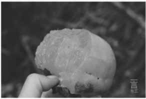
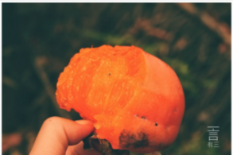
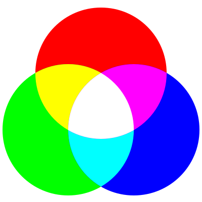
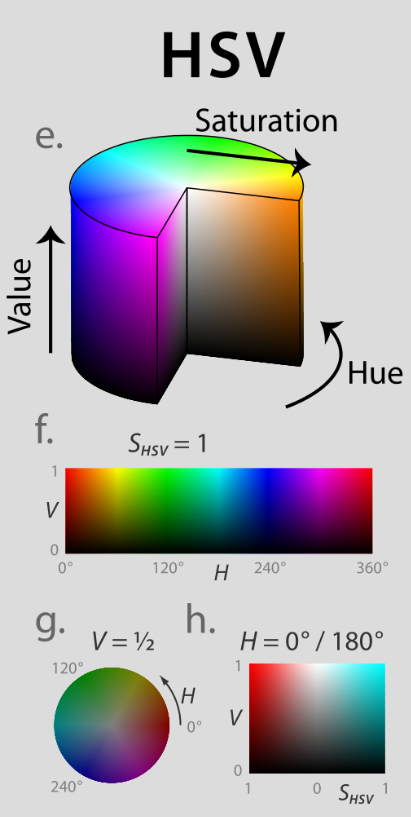
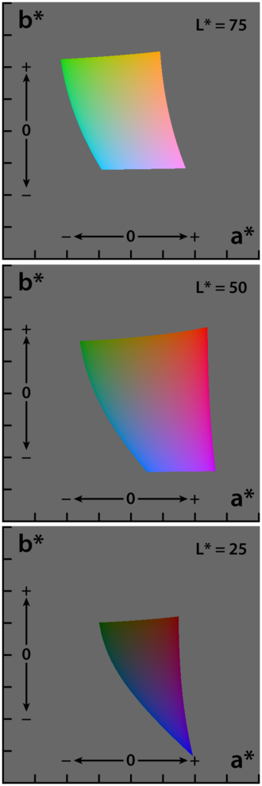

# 图像基础概念

## 图像

- [二值图像(`binary image`)]([https://zh.wikipedia.org/wiki/%E4%BA%8C%E5%80%BC%E5%9B%BE%E5%83%8F](https://zh.wikipedia.org/wiki/二值图像))：二值图是每个像素的可能性只要两个值的数字图像，如黑白。二值图通常在图像处理中作为图像掩码或图像分割、二值化中出现。二值图通常采用位图存储，一位代表一个像素。

- [灰度图像(`gray image`)]([https://zh.wikipedia.org/wiki/%E7%81%B0%E5%BA%A6%E5%9B%BE%E5%83%8F](https://zh.wikipedia.org/wiki/灰度图像))：灰度图像只包含一个通道的信息，其中每个像素可以表示最暗黑色和最亮白色之间的亮度信息。如果每个像素采用8位存储，就有256级灰度。

  

- 彩色图像：彩色图的每个像素点由颜色模型决定。

  

常见的彩色图有三种颜色模型：

- RGB颜色模型
- HSV色彩空间
- CIELab彩色空间

**RGB颜色模型**中每个像素由矢量`(R,G,B)`表示，每个像素由红(R)、绿(G)、蓝(B)三原色光按不同的比例符合后，让我们产生不同颜色的色觉。

8位图中，矢量的每个元素有8bit表示，表示范围为0~255，如全红色表示为(255,0,0)。RGB模型的基础是加色原理：




**HSV色彩空间**是RGB模型的笛卡尔坐标系表示，HSV即色相(H)、饱和度(S)、明度(V)：

- 色相：色彩基本属性，即颜色名称。
- 饱和度：色彩的纯度，越高色彩越纯，低则变暗。
- 明度：色彩的亮度。



**CIELab彩色空间**中，L表示亮度，a，b表示颜色对立维度。



## 例题

### 安装opencv

```bash
#安装opencv
➜  Desktop sudo pip37 install opencv-python
#安装opencv的contrib扩展包
➜  Desktop sudo pip37 install opencv-contrib-python
```

### RGB直方图

使用 python+matplotlib,完成“柿子图”的灰度直方图和彩色直方图统计。

```python
import cv2
import matplotlib.pyplot as plt
import numpy as np
# 彩色直方图
filename = "./柿子.jpg"
img = cv2.imread(filename)

colors = ['blue', 'green', 'red']
print(img[:, :, 0].ravel())
for i in range(3):
    hist, x = np.histogram(img[:, :, i].ravel(), bins=256, range=(0, 256))
    # x[:-1]+x[1:]  对应元素相加，组成新的数组
    plt.plot(0.5 * (x[:-1] + x[1:]), hist, label=colors[i], color=colors[i])

plt.show()

# 灰度直方图
img_grey = cv2.cvtColor(img, cv2.COLOR_BGR2GRAY)

hist, x = np.histogram(img_grey[:, :].ravel(), bins=256, range=(0, 256))
# x[:-1]+x[1:]  对应元素相加，组成新的数组
plt.plot(0.5 * (x[:-1] + x[1:]), hist, label='grey', color='grey')

plt.show()
```


### 将柿子图转换为HSV、CIELab

```python
import cv2

filename = "./柿子.jpg"
img = cv2.imread(filename)
# opencv读取图片时采用的是BGR
hsv = cv2.cvtColor(img, cv2.COLOR_BGR2HSV)
cv2.imwrite("柿子 hsv.jpg", hsv)
rgb = cv2.cvtColor(img, cv2.COLOR_BGR2RGB)
cv2.imwrite("柿子 rgb.jpg", rgb)
lab = cv2.cvtColor(img, cv2.COLOR_BGR2Lab)
cv2.imwrite("柿子 lab.jpg", lab)
cv2.imwrite("柿子 bgr.jpg", img)
```


## 参考

- [加色法]([https://zh.wikipedia.org/wiki/%E5%8A%A0%E8%89%B2%E6%B3%95](https://zh.wikipedia.org/wiki/加色法))
- [ 三原色光模式]([https://zh.wikipedia.org/wiki/%E4%B8%89%E5%8E%9F%E8%89%B2%E5%85%89%E6%A8%A1%E5%BC%8F](https://zh.wikipedia.org/wiki/三原色光模式))
- [HSV彩色空间]([https://zh.wikipedia.org/wiki/HSL%E5%92%8CHSV%E8%89%B2%E5%BD%A9%E7%A9%BA%E9%97%B4](https://zh.wikipedia.org/wiki/HSL和HSV色彩空间))
- [CIELab彩色空间]([https://zh.wikipedia.org/wiki/Lab%E8%89%B2%E5%BD%A9%E7%A9%BA%E9%97%B4](https://zh.wikipedia.org/wiki/Lab色彩空间))