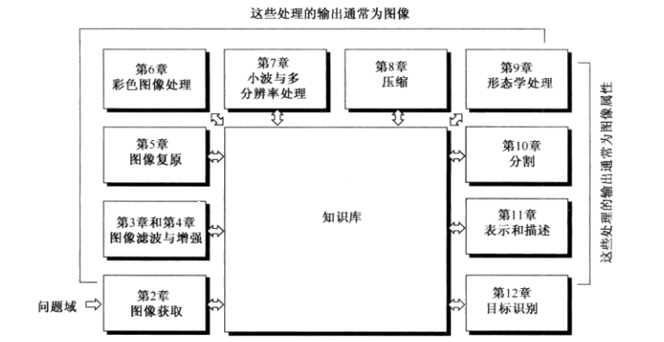
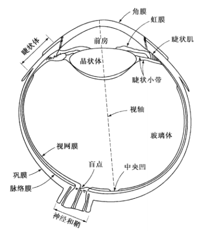
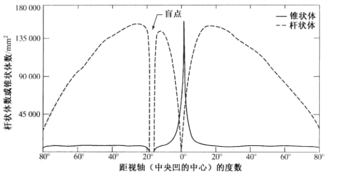
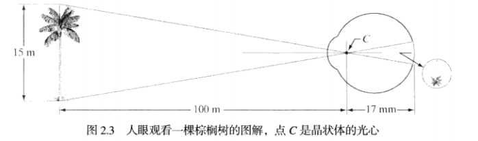

# 数字图像处理学习笔记

## 绪论

图像可以被定义为一个二维函数`f(x,y)`，`x`和`y`是空间坐标，对应的函数值`f(x,y)`表示该点的强度或灰度。当`x`，`y`和`f`为有限离散数值时，称之为数字图像。数字图像中的点被称之为像素。

## 数字图像基础

### 人类视觉系统机理

#### 人眼结构

人眼成像的核心是视网膜，来自外部物体的光分布在视网膜上，由视网膜上的感受器提供团视觉。感受器分为两种：

- 锥状体：对颜色亮度高度敏感，提供白昼视觉或亮视觉。
- 杆状体：没有色彩感觉，对低照明度敏感，提供暗视觉或微光视觉(如白天有鲜艳色彩的物体，在月光下没有颜色)。

中间凹是视网膜中直径为1.5mm的圆形凹坑，可以近似于一个1.5mm*1.5mm的方形传感器阵列，这一区域的锥状体密度大约为150000个/mm^2，大约有337000个。

#### 人眼成像

人眼成像时，由于晶状体和视网膜之间的距离是固定的，其实现正确聚焦是采用改变晶状体的形状获得。中间凹的感受器接受到刺激后，产生电脉冲，然后有大脑进行解码。

普通相机成像和人相反，每个镜头都有固定的焦距，其不同距离的聚焦是通过改变镜头和成像平面之间的距离实现。