# 远程编程 Code远程

## 0X00 简介

前段时间换了一块固态盘，重装了操作系统半小时，配置开发环境花了将近一天，正可谓：重装一时爽，配置火葬场。

为了彻底解决这个问题，我决定将我的开发环境迁移到云服务器上面，这篇文章记录下我的尝试过程。

- 本地：deepin 15.11
- 服务器：Ubuntu 16.04

## Visual Studio Code

### 安装插件

安装插件`Remote Development`

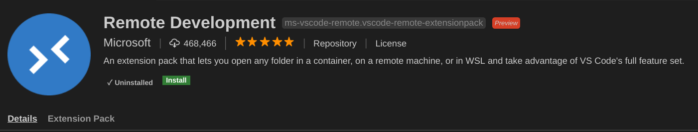

### 配置ssh

如果你是Windows请自行安装OpenSSH，然后生成SSH key。

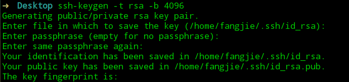

我的`/home/fangjie/.ssh/`目录下已经有`id_rsa`和`id_rsa.pub`，然后通过`ssh-copy-id user@ip`上传公钥到目标服务器。

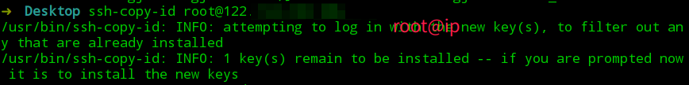

### 配置VS Code

打开VS Code，按`ctrl+shift+p`打开命令搜索，搜索`remote-ssh`

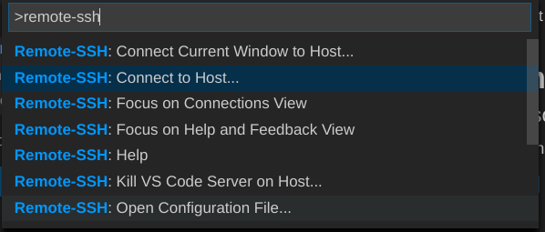

选择`Connect to Host`连接服务器

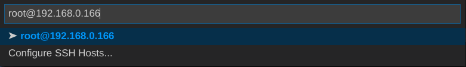

连接成功

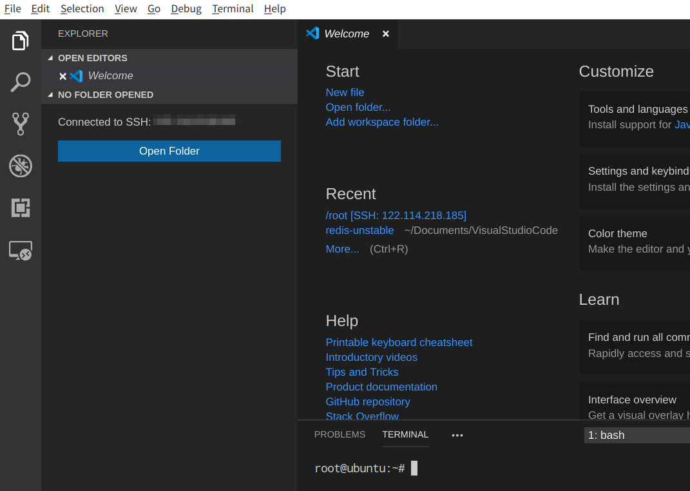

## Pycharm

选择`Tools-->Deployment`

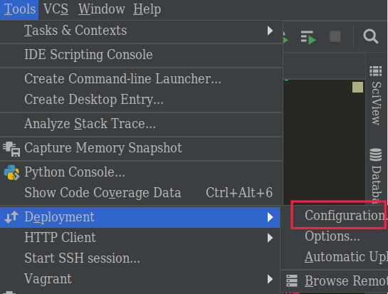

新建环境

配置环境信息

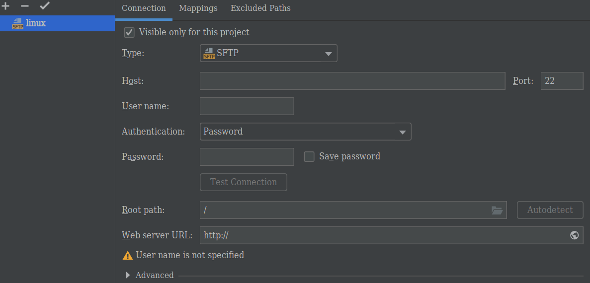

建立目录映射

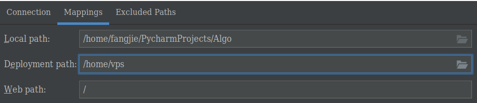

同步文件`Tools->Deployment`

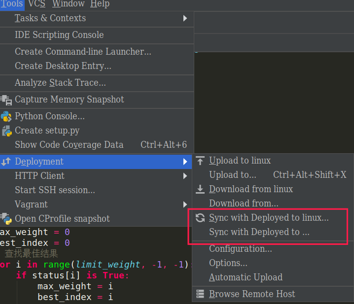

配置远程解释器`File->Settings->Project`

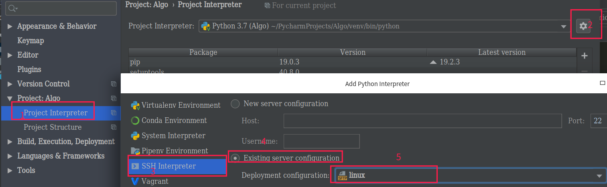

选择解释器`Run->Run->Edit Configuration`

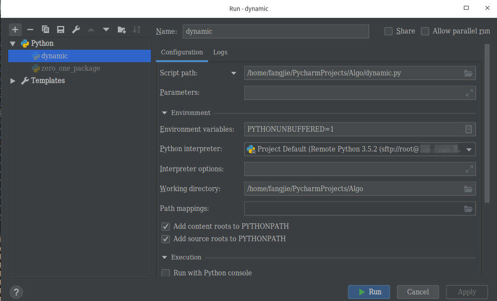

## 参考

- https://code.visualstudio.com/docs/remote/remote-tutorials
- 玩转VS Code：远程开发初探 - VS Code Remote Development