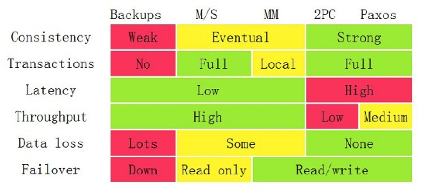

# 分布式

## 什么是分布式架构？

- 采用分布式架构的目的？

  采用分布式主要有两个目的：通过增加节点增大系统业务容量、通过冗余系统提高系统可用性、并行开发和服务解耦

- 分布式架构的问题？

  架构设计复杂，学习曲线高、部署多个服务，流程复杂、运维复杂度随服务增加而增加、测试和查错的复杂度增加、管理分布式系统中的服务和调度变得困难和复杂

- 分布式难点是什么？

  CAP

- Martin Folwer 文章：https://martinfowler.com › articles › microservices

## 亚马逊分布式实践

亚马逊的架构规定：

- 团队间程序模块的通信只能采用接口的形式。
- 所有的Service Interface必须设计成能对外开放。

分布式带来的问题：

- 线上故障的工单会在不同服务和团队之间转来转去：通过每个服务都要提供人准备修复工单，每次出现工单，都上线准备解决问题。
- 每个团队都可能成为一个潜在的DDoS攻击者，除非每个服务都要做好配额和限流。
- 监控和查错变得更为复杂。
- 服务发现和服务之力变得复杂。

亚马逊的实践：

- 分布式服务的架构需要分布式的团队架构：将团队拆分为小团队，按职责分工，而不是按技能。
- 分布式服务查错不容易：出现故障后，每个相关的团队都会上线，签到自查，然后等待问题解决。
- 开发完成所有的任务，包括测试，运维，好处是吃自己的狗粮，让自己明白写代码容易维护代码复杂，这样开发人员会在需求、设计等方面考虑软件的长期维护性。
- 运维优先，崇尚简化和自动化。
- 内部服务和外部服务一致，让内部服务随时都可以开放出来。

分布式系统中需要注意的问题：

**异构系统的不标准问题：**因为不同的软件、不同的语言带来了不同的开发运维标准。不同的标准带来导致架构复杂度提升。

- 接口必须采用Swagger规范。
- 配置管理应该分为三层：
  - 底层：和操作系统有关
  - 中间层：和中间件有关
  - 业务层：和业务相关
  - 只有业务层允许用户灵活修改，底层和中间层提供模板让用户选择。
- 数据通信协议，必须有协议头和协议体，协议体是业务数据，协议头定义基本的协议数据。

**系统架构中的服务依赖性：**服务是由依赖的，一个服务依赖的某个服务挂了后，会出现多米诺骨牌效应。一个非关键业务被关键业务所依赖，会导致非关键业务变成关键业务。

核心问题是定义出服务的关键程度的同时，还需要我们定义或描述出关键业务或服务调用的主要路径。这里需要注意的是：不仅仅要业务隔离，还有数据库隔离，防止非关键业务将数据库拖死，导致整个业务不可用。微服务的要求是：服务之间只通过接口耦合，不仅仅要拆分服务，还有为每个服务拆分相应的数据库。

**故障发生的概率更大：**分布式系统中，使用的机器和服务更多，导致故障发生的频率更大；管理负责，导致很少有人知道架构中有什么(路径图)。这要求我们在设计或运维系统时，必须为故障所考虑，SLA的关键指标，设计时要考虑如何减轻故障，如果无法减轻故障，必须采用自动化的方式恢复故障，减少故障影响面，通过机器自动化帮忙我们，因为我们无法对复杂的事情做到事无巨细。

**多层架构的运维复杂度更大：**系统分层四层：基础层、平台层、应用层、接入层

- 基础层：机器、网络设备等
- 平台层：中间件，如Tomcat、MySQL、Kafka
- 应用层：业务软件
- 接入层：接入用户请求的网关、负载均衡、CDN等

任何一层的问题都会导致整体的问题。如果没有统一的视图和管理，导致运维被割裂开，造成更大的复杂度。分工不是问题，如何确保分后后的协作统一和规范才是核心。

## 技术栈

构建分布式系统的目的：

- 大流量处理，通过集群技术把大规模并发请求的负载分散到不同的机器。
- 保护关键业务：提高后台服务的可用性，把故障隔离起来阻止雪崩效应(多米诺骨牌效应)。

总结：

- 提高整体架构的吞吐量。
- 提高系统的稳定性，让系统的可用性更高。

### 提高架构的性能

- 缓存系统：加入缓存提高系统的访问能力，缓存分区、缓存更新、缓存命中。
- 负载均衡：使用多个节点共同分担一部分流量请求，网关系统(负载均衡、服务路由、服务发现)。
- 异步调用：异步系统通过消息队列实现削峰平谷，可以增加系统的吞吐量，单实时性差，还会引入消息丢失问题，需要做消息持久化，这也带来了有状态的节点，增加服务调度难度。
- 数据分区：将数据按一定方式，分为多个区，不同的区分担不同的区的流量，需要数据路由的中间件，而且跨库的join和跨库的事务非常复杂。
- 数据镜像：将数据库镜像为多份，不需要数据路由中间件，最大的问题是如何保证数据的一致性。

初期采用读写分离的数据镜像，后期采用分库分表的做法。

### 提高架构的稳定性

- 服务拆分：隔离故障，重用服务模块，但是会带来服务间调用的依赖问题。

- 服务冗余：提供多个节点，去除单点故障，支持弹性伸缩，对于有状态的服务，复杂度更高，弹性伸缩时需要考虑数据的负载或重新分片。
- 限流降级：避免系统被压垮，通过限流或功能降级停一部分服务，保证整个架构不挂掉。
- 高可用架构：多租户隔离，灾备多活，保证不出现单点故障。
- 高可用运维：CI/CD，能做足够多的自动化测试和灰度测试，还有自动化控制。

### 关键技术

- 服务治理：将服务间的依赖关系和调用链，将关键服务过滤出来，并对这些服务进行性能和可靠性的管理。
- 架构软件管理：服务之间有依赖，并且有兼容性问题，整体服务形成的架构需要由架构版本管理和生命周期管理。
- DevOps：服务的测试和部署。
- 自动化运维：对服务自动伸缩、故障迁移、状态管理等。
- 资源调度管理
- 整体架构监控：自动化运维和资源调度管理的基石，需要对应用层、中间件、基础层监控。
- 流量控制：负载均衡、服务路由、熔断、降级、限流和与流量相关的调度(灰度发布)。

核心：docker和Kubernetes。

关键技术：

- 全栈系统监控
- 服务/资源调度
- 流量调度
- 状态/数据调度
- 开发和运维的自动化

前4者为核心。

## 全栈系统监控

通过全栈系统监控，我们能知道系统发生了什么，更好的管理和运维整个系统。

- 全栈监控
- 关联分析
- 跨系统调用串联
- 实时报警和自动处置
- 系统性能分析

### 多层次监控

三层监控：

- 基础层：监控主机和底层资源：CPU、内存、磁盘、网络等。
- 中间层：中间件监控
- 应用层：HTTP访问吞吐量、响应时间、返回码、调用链路分析、性能瓶颈和用户端监控。

监控的标准化：

- 日志数据结构化
- 监控数据格式标准化
- 统一的监控平台
- 统一的日志分析

很多监控系统的问题：

- 监控数据是隔离：将不同部门的监控数据梳理，整合。
- 监控的数据项太多

好的监控系统的特征：

- 从用户服务的API开始监控整个系统。
- 关联指标聚合：将有关联的系统及其指标聚合展示，最关键的是将服务、相关的中间件以及主机关联在一起，方便定位。
- 快速故障定位：做一个用户请求跟踪的trace监控，要监控到所有请求的调用链，最好做成没有侵入性的。

两个场景：

- 体检：
  - 容量管理：通过全局的系统运行时数据展示，了解是否需要增加机器或资源。
  - 性能管理：通过大盘，寻找瓶颈。
- 急诊
  - 定位问题：快速暴露并找到问题发生点。
  - 性能分析：出现非预期的流量提升时，快速找到系统的瓶颈。

### 最佳实践

- 服务调用链追踪：从对外的API开始，将后台的实际服务关联起来，然后再将该服务的依赖服务关联起来，进一步将整个系统的服务串联起来(Google Dapper)，开源实现zipkin。
- 服务调用时长：整个服务调用链中的耗时。
- 服务的TOP N视图：系统请求排名，调用量、请求最耗时、热点排名。
- 数据库排名：获取数据库对应的操作耗时。
- 服务资源追踪

通过以上数据的关联，能达到以下目标：

- 节点故障会影响那些对外服务的API。
- 服务响应慢，了解瓶颈在哪里。
- SQL过慢，知道影响的对外服务API。
- 消息队列阻塞，影响的对外服务API。

根据这些信息，我们能做出响应的调度：

- 因为CPU使用过高，导致服务过慢，可以做弹性伸缩。
- 因为MySQL出现慢查询，导致服务过慢，流量限制或降级。

核心：将数据收集好的同时将数据关联好，以便于更好定位故障，进行自动化调度。

## 服务调度

### 绘制服务地图

梳理和定义的服务重要程度，需要细致地管理对业务的理解

梳理服务间的依赖，在无法做到服务无依赖时，需要降低服务依赖的深度和广度，简化管理

服务依赖：上限是微服务，下限是没有依赖环。

依赖环的解决方案：依赖倒置的设计模式，通过添加第三方服务，由第三方服务调用原本依赖的服务。

检查方法：Zipkin

### 管理服务

服务地图是动态变化的，需要由一个服务发现的中间件来处理服务状态变化(服务数量、版本、状态、服务内实例状态)

### 架构版本管理

管理服务间的版本依赖关系、运行环境依赖(环境变量、CPU、内存、文件系统)、最大最小实例数。

### 资源/服务调度

- 服务状态的维持和拟合：state(明确的状态，如TCP协议中状态切换)、status(不明确的状态)。针对不预期的变化，如故障导致的服务挂掉、服务不健康，集群控制器应该能强行维护服务状态(摘除不健康的节点，重启新的，zookper、Kubernetes)。针对预期的变化，如发布新版本，集群管理器能将集群从当前的状态逐渐迁移到另一个新状态(通过一步一步向集群发布命令，拟合)
- 弹性伸缩和故障迁移
  - 弹性伸缩
  - 故障迁移
    - 宠物模式：必须救活，通过服务重试
    - 奶牛模式：直接重新创建服务
- 作业和应用调度
- 服务工作流和编排
  - 将一堆独立工作的进程协调起来
    - ESB的Choreography：各自完成专属自己的工作基础上进行协作。
    - Orchestration：有一个指挥，如API-Gateway(zuul)，所有请求通过api Gateway访问内部服务。

## 流量调度

流量调度系统的功能：

- 根据系统运行的情况，自动进行流量调度，提升系统的稳定性。
- 应对弹性计算计算扩缩容时间窗口长和底层资源消耗殆尽时，保证系统平稳运行。

能实现如下的事情：

- 服务流控：服务发现、服务路由、服务降级、服务熔断、服务保护。
- 流量控制：负载均衡、流量分配、流量控制、异地灾备。
- 流量管理：协议转换、请求校验、数据缓存、数据计算。

这些功能有API Gateway实现，可以考虑kong。

- 高性能
- 通过集群技术抗流量。集群的关键点是集群内各个节点共享数据。
- 简单的业务逻辑。
- 服务化。通过API来修改配置。

### 状态数据调度

某些服务会保存一些数据，这些数据是不能丢失的，因此这些数据需要随服务一起调度。通常可以采用将这些有状态的数据存放在第三方服务上，如Redis，MySQL，ZooKeeper。数据存储节点为了保护数据不丢失，必须采用分布式存储。

### 分布式事务一致性的问题

分布式存储，涉及到数据的replication问题，数据replication会带来数据不一致问题，从而带来性能问题。

- 解决数据的高可用，必须创建数据副本。
- 副本带来数据一致性问题。
- 数据一致性问题带来性能问题。

解决方案：[<https://coolshell.cn/articles/10910.html>]

- Master-Slaver
- Master-Master
- 两段或三段提交（应用层解决事务问题）
- Paxos方案(数据层解决事务问题)

### 数据节点的分布式方案

当节点有问题时，需要在另一个节点上重启一个实例，也需要将其持久化的数据搬迁到新节点(等待数据同步，时间耗时长)，因此需要一个底层是分布式的文件系统，这样新节点只需要将远程文件系统mount就可以调度数据过来，所以真正解决数据节点调度的方案应该是底层的数据节点。

## 分布式系统的事务处理

- 单机提供数据服务存在的问题？

  单机性能不足以应对所有的网络请求；单机停机会导致服务不可用或数据丢失。

- 解决方案

  - 数据分区：将数据分区存放在不同的服务器。
  - 数据镜像：所有服务其都拥有相同的数据。

- 采用数据镜像存在的问题

  - 数据一致性：数据镜像中，在不同节点对同一数据的写操作，如何保证一致性。
  - 性能问题：吞吐量 、 响应时间
  - 可用性：数据不丢、结点的Failover

- 一致性模型

  - 弱一致性(Weak)：新数据写入后，读操作可能会读到旧值(异步冗余)。
  - 最终一致性(Eventually)：新数据写入后，保证一段时间后，读操作为新值(异步冗余)。
  - 强一致性(Strong)：新数据写入后，读操作必须为新值(同步冗余)。

### 解决方案

- Master-Slave：Master负责读写请求和数据同步，Slaver负责Master的备份。

- Master-Master：系统中存在多个Master节点，每个Master都提供读写服务，通常数据同步采用异步完成，如果出现未同步，则数据丢失。使用Master-Master，切忌不要对同一个数据进行修改，会出现数据冲突。

- 两段提交(Two/Three Phase Commit 2PC)：对于跨节点的事务，为了保证事务的ACID特性，需要引入协调者来统一掌控所有节点的操作结果并最终指示这些节点是否将操作结果提交(强一致性)。

  - 第一阶段：协调者询问参与者是否可以执行提交操作，参与者做事务的准备工作(上锁之类)，然后响应是否可以可以。
  - 第二阶段：如果所有参与者都响应可以提交，则协调者发送提交指令，参与者完成提交后，响应。如果存在参与者不允许提交，则协调者向参与者发送回滚操作，参与者完成回滚后响应，协调者取消该次事务。

  两段提交存在两个问题：

  - 同步阻塞，影响性能
  - 超时：
    - 第一阶段：参与者没收到询问请求或协调者没收到参与者的响应，需要协调者做超时处理。
    - 第二阶段：参与者没有收到提交操作或协调者未收到响应，也需要协调者做超时处理。
    - 第二阶段：协调者挂了，为了一致性，导致参与者只能死等或重发第一阶段的响应，导致事务block。

  为了解决两段提交因协调者挂了导致事务BLOCK，提出了三段提交：

  

  在询问的时候并不锁定资源，除非所有人都同意了，才开始锁资源。三段提交降低了概率，参与者收到PreCommit后，也知道大家都同意修改。
  
  
  
  q – Query，a – Abort，w – Wait，p – PreCommit，c – Commit
  
  F-Fail T-Timeout

- Paxos算法：采用投票来觉得整个集群是否接收本次修改，超过半数同意，则整个集群都同意(类似zookeeper)。
  - prepare阶段：节点向其他节点发送请求(带提案号)，节点会拒绝小于当前提案号的提案(当节点发现有更高的提案时，通知提案人终止该次提案)。
  - 当提案者收到超过半数的同意后，向所有节点发布接收该提案，否则返回失败。
- 著名的CAP理论：一致性，可用性，分区容忍性，只能要其中两个。

