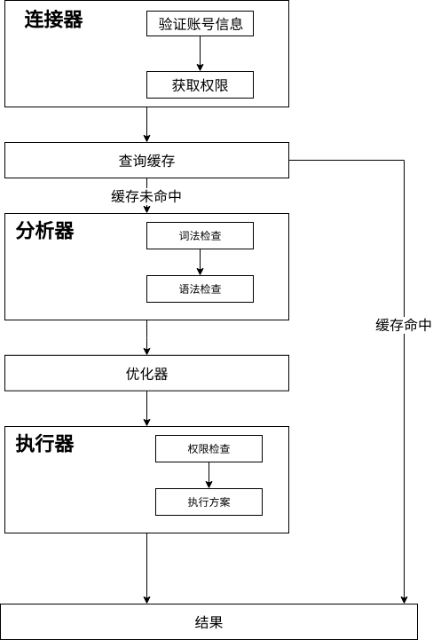
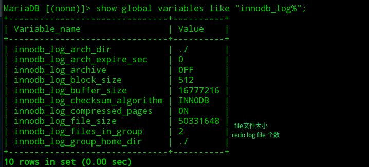

# MySQL学习笔记(一) 执行流程

## 0X00 查询语句执行流程

大体上MySQL可以分为两层：

- Server层：负责管理连接和处理SQL语句的逻辑。
- 存储引擎层：负责数据的存储和提取，存储引擎以插件形式存在。

Server层包含五大组件：连接器、缓存管理、分析器、优化器和执行器。其执行流程图为：



### 连接器

连接器负责和客户端建立连接、获取权限、维持和管理连接。客户端通过命令`mysql -h ip -P password -u root -p`与服务器建立连接。连接器会先验证用户信息，然后从权限表中获取权限信息，后续操作的权限判断将依赖该权限信息(建立连接后，修改权限只影响后续连接)。通过命令`show processlist;`或通过`dbmonitor`工具查看已经建立的连接。

MySQL的连接分为长连接和短连接，当客户端建立长连接后，如果持续请求，将一直使用同一个连接；短连接则意味着每次执行几个查询，则断开连接，连接需要消耗一定的时间，因此尽量使用长连接。

MySQL在执行过程中使用的内存是管理在连接对象中，连接断开时才会释放，因此大量长连接会消耗大量内存。解决方案：

- 定期断开长连接。
- Mysql 5.7以上版本，执行完较大操作后，执行`mysql_reset_connection`重新初始化连接资源(不会重连和权限验证)。

### 查询缓存

查询语句执行完后会将语句和结果以kv的形式存储在内存中作为缓存，当语句再次执行时，则直接返回结果。但是查询缓存失效十分频繁，只要对表进行更新，则该表的所有查询缓存将全部清空。MySQL8.0已将该功能删除。在其他版本中，可以通过将参数`query_cache_type`设置为DEMAND，需要使用查询缓存可以通过`SELECT SQL_CACHE * from 表`显示指定。

### 分析器、优化器、执行器

分析器负责对SQL语句进行词法和语法分析，判断SQL语句是否满足MySQL的要求和判断SQL语句操控的对象(表、列名)是否存在。

优化器负责根据SQL语句生成最优的执行方案。

执行器收到优化器生成的执行方案后，判断是否有执行权限(因为触发器只能在执行过程才能触发)，若有执行权限，则根据执行方案调用存储引擎的相关接口。可通过慢日志中的`rows_examined`字段判断语句执行过程中调用引擎获取数据行的次数(引擎扫描行数可能多余接口调用次数)。

### 存储引擎

- InnoDB：MySQL5.5.8以后默认存储引擎，支持事务、行级锁定、外键约束。
- MyISAM：MySQL5.5.8之前的默认存储引擎，不支持事务与外键，优点是速度快、占用资源小。
- Memory：采用内存作为存储介质，相应速度快，但Server进程崩溃，将丢失数据，只适用于临时数据。
- Archive：良好的压缩机制，适合文件归档。

## 0X01 更新语句执行流程

MySQL 5.5.8之后，默认使用的引擎为InnoDB。更新语句执行流程在查询语句执行流程基础上多了两个日志操作：

- Server层日志：binlog(归档日志)。
- InnoDB日志：redo log(重做日志)。

### redo log

redo log是InnoDB数据引擎特有的日志，其目的是为了避免每次更新都写入磁盘带来的高消耗。

正对更新操作，InnoDB会先将操作记录在redo log中，更新内存中的数据，完成更新操作(WAL)。系统空闲时，再将内存中的数据写入磁盘，通过此方法，InnoDB提供了crash-safe(保证数据库发生异常重启时，不会丢失数据)。

redo log是由多个固定大小redo log file组成的循环列表，如图：


`write pos`是当前记录位置，`check_point`是擦除位置。如果写满，则必须将数据写入磁盘，擦除掉这部分日志。redo log中记录的是物理日志(某个数据页上做了什么修改)。

使用`SET GLOBAL innodb_flush_log_at_trx_commit=1`能确保每次事务的redo log日志持久化到磁盘。

使用`SHOW GLOBAL VARIABLES LIKE "innodb_log%"`可以查看redo log配置信息。



redo log的位置在`/var/lib/mysql`下。

```bash
➜  Desktop ls -al /var/lib/mysql |grep ib_log
-rw-rw----  1 mysql mysql 50331648 9月   1 12:29 ib_logfile0
-rw-rw----  1 mysql mysql 50331648 8月  31 23:58 ib_logfile1
```

### binlog

binlog是Server层的日志，记录更新语句的原始逻辑。归档日志是追加写的，写到一定大小后，会切换到新的日志。使用命令`SET GLOBAL sync_binlog=1;`，可以确保每次事务的归档日志持久化到磁盘。

binlog中有三个格式，使用`SET GLOBAL binlog-format='格式' `可以设置为响应格式。

- STATEMENT：记录SQL语句。
- ROW：记录各个表行的修改。 
- MIXED：混合使用STATEMENT和ROW。

启动binlog需要修改配置文件。

```mysql
# 启动binlog
➜  Desktop cd /etc/mysql
# 添加如下几行
[mysqld]
log_bin = ON
➜  mariadb.conf.d sudo vi my.cnf
➜  mariadb.conf.d sudo service mysql restart
➜  mariadb.conf.d mysql -u root -p
```

创建库、表并插入数据后，查看binlog日志信息。


使用的命令有：

- show master status：当前操作的binlog。
- show binlog events in  'binlog名'：查看binlog日志的内容。
- show binary logs：显示所有的binlog日志。

### 备份恢复流程

一个备份恢复流程有两步：

- 恢复最近的一个全量备份。
- 然后将这个全量备份之后的binlog重放即可。

### 更新流程


- 为什么redo log 采用两段提交？
  - 先写redo log再写binlog。写完redo log后发生crash，系统重启后，数据引擎将能自动恢复数据。但binlog中没有这条记录，因此使通过binlog恢复的数据库将少一次更新。
  - 先写binlog再写redo log。写redo log时发生crash，系统重启后无法恢复该数据，通过binlog恢复的数据库将多一次更新。
- 日志两段提交如何保证两份日志的逻辑一致？
  - redo log为prepare状态时，在写binlog时crash
    - 重启恢复：没有commit，也没有binlog，回滚。
  - 写完binlog后，出现crash
    - 重启恢复：已经写入了binlog，则自动commit。

## 0x02 参考

https://dev.mysql.com/doc/refman/8.0/en/binary-log.html