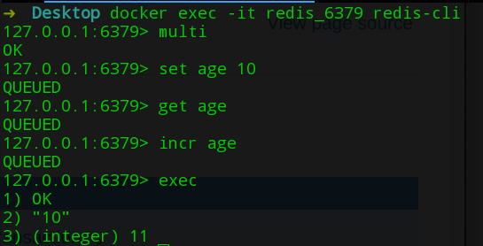

# Redis学习笔记—原理

## IO模型

Redis是一个单线程程序，在使用复杂度为O(n)的指令时，会出现卡顿。Redis的数据存储在内存中，避免了磁盘IO读写，因此其运算速度很快。

Redis采用多路复用IO模型(非阻塞IO)，并发处理多个请求。

- 阻塞IO：必须在缓冲区读写一定字节，若条件不满足，阻塞至任务完成。
- 非阻塞IO：在缓存区中读写尽可能多字节，通过返回值告知实际读写字节数。

非阻塞IO面临一个问题：任务完成部分，条件满足后，如何通知线程继续任务。`select|epoll`函数提供事件轮询API，调用`select(read_fds,write_fds,timeout)`，返回读写描述符对应的读写事件(这一步是阻塞)，线程拿到事件后，处理相关事件，然后继续轮询。

Redis在处理多个客户端的请求时构建了：

- 指令队列：客户端关联指令队列，客户端发送的指令在队列中进行排序，先到先服务。
- 响应队列：客户端关联响应队列，服务器通过响应队列将结果返回客户端，如果队列为空，则不调用写事件，避免无效消耗CPU。

针对Redis的定时任务，为了避免线程调用`select`时阻塞，导致定时任务无法准时调度。Redis维护一个最小堆用于记录最快要执行的任务，每个循环周期，处理已经到点的任务，并将到执行下一个任务的事件差作为`select`的timeout参数。

## 持久化

持久化机制用于保证数据不会因为故障而丢失，Redis的持久化机制有两种：快照和AOF日志。

### 快照

- 原理

  快照是一次全量备份，将内存中的数据二进制序列化后存储在磁盘中，因此存储上十分紧凑。为了避免生成快照时内存中数据的变化以及频繁文件IO(不能多路复用)对服务器性能的影响，Redis采用操作系统的多进程COW机制实现持久化。

  Redis在持久化时，会通过fork函数，创建子进程，由子进程负责快照持久化，子进程生成后，与父进程共享内存资源。子进程遍历内存中的数据，将其序列化后写入磁盘，与此同时，父进程对数据修改时，会通过COW机制进行数据段页面分离(一个数据段由多个页面组成)，当父进程对一个页面进行修改时，会将共享的页面复制一份，因此不会影响子进程的内存资源，也不会导致内存消耗大幅度增加。

- 优点

  - 适用于灾难恢复：快照会将内存中的数据全部备份。
  - 最大化Redis性能：快照任务由子进程负责，不影响父进程的性能。
  - 恢复大数据集时比AOF日志恢复速度快。

- 缺点

  - 不能实时备份数据。
  - 当数据集过大，`fork`子进程时，耗时过大。

### AOF日志

- 原理

  AOF日志是增量备份，记录会修改内存数据的指令，Redis收到一条指令后，验证参数，存储到磁盘中，再执行指令，因此如果出现宕机，可以重放AOF日志中的指令，恢复到宕机之前的状态。写AOF日志时，会先将内容写入内核的内存缓存中，由内核异步将数据写入磁盘，可以通过`fsync`策略强制刷盘，AOF默认间隔事件为`1S`。

  AOF日志会随着运行时间的增加而增加，数据库重启时，会重放AOF日志，如果容量过大，会导致重启耗时过多，需要定期对AOF日志瘦身，瘦身后，新的AOF日志只包含重建当前数据集所需的最少命令。

- 优点

  - `fork`子进程速度快。
  - 备份的时间粒度更小。

- 缺点

  - 体积大。

### 混合持久化

快照和AOF日志都会消耗一定资源，通常不会在Redis主节点进行持久化操作，持久化操作主要在从节点执行。为了避免AOF日志大和快照的时间粒度大的问题，通常将二者结合使用。

## 管道

Redis客户端下发一条指令会需要两个操作：写、读，需要一个网络读写时间，如果是N条指令，则需要花费N个网络读写时间。如果调整N条指令的读写顺序从


调整为


则可大幅节省IO时间。

Redis中一个完整的请求交互流程为


- write在发送缓冲写数据，基本没有耗时，只有当发送缓冲满了，才需要等待缓冲空出空闲空间。
- read从接收缓冲读数据，也基本没有耗时，当接收缓冲为空，需要等待数据到来。
- 因此对于管道来说，连续的write操作基本没有耗时，而第一个read操作需要等待一个网络数据包往返开销，后续read直接从缓冲中拿数据。

Python可以通过管道执行任务

```python
import redis
pool = redis.ConnectionPool(host="localhost",port=6379)
client = redis.StrictRedis(connection_pool=pool)
pipline = client.pipeline(transaction=True)
pipline.set('a',1)
pipline.incr('a')
pipline.incr('a')
pipline.execute()
```

## 事务

事务通常用于确保多个操作的原子性，但在Redis中，事务只具备隔离性(单线程特性，不必担心执行队列会被其他指令干扰)而不具备原子性(指令执行失败后，后续指令会继续执行，在Redis中，只有语法错误或键不支持该命令才会出现命令失败，这都是使用者带来的错误)。

通过客户端，下发`MULTI`指令，启动一个事务。Redis会将后续指令存入事务队列中，当遇到`EXEC`指令时，执行事务队列中所有指令，也可以通过`DISCARD`指令清空事务队列，放弃执行事务。



客户端发送一条指令到事务缓存队列中需要消耗一个网络读写时间，当事务中指令较多时，会导致网络IO时间过长，因此通常情况下事务需要搭配管道使用。

在多并发的场景下，为了避免修改数据时出现冲突，可以采用分布式锁(悲观锁：假设拿数据时会有用户修改，因此每次都上锁)或watch(乐观锁：假设拿数据时不会有用户修改，不会上锁，更新数据时，需要判断期间是否有其他用户更新，可以使用版本号和CAS算法实现)。watch命令需要在multi之前执行，wach会在事务开始之前获取多个关键变量的数据，当事务执行前，会检查是否关键变量信息是否被修改，修改则告知事务执行失败。执行exec前，新开cli，修改age的值。


- 为什么Redis中的事务在失败时不会进行回滚？

只有当Redis命令有语法错误或键不支持该指令时，才会导致命令失败，这两种错误都是程序带来的错误，而回滚并不能解决任何程序错误，这些问题应该在开发期间会被解决，因此Redis在系统内部对功能进行了简化，确保更快的运行速度。

## 消息多播

### 发布者订阅者模型

消息的多播允许生产者生成一次消息，中间件将消息复制到多个消息队列中，由消息队列的消费者组进行消费。Redis中通过PubSub(发布者订阅者模型)来实现消息多播。


PubSub支持的命令有：

- 订阅：subscribe 主题
- 发送消息：publish 主题 消息
- 取消订阅：unsubscribe 主题
- 订阅模型：psubscribe 匹配符
- 订阅模型：punsubscribe 匹配符

PubSub的实验(开启两个窗口，一个窗口订阅信息，一个窗口发布消息)：


Python中可以通过pubsub方法创建一个消费者

```python
# 消费者(要先启动)
import redis
pool = redis.ConnectionPool(host="localhost", port=6379)
client = redis.StrictRedis(connection_pool=pool)
sub = client.pubsub()
sub.subscribe('user')
for msg in sub.listen():
    print(msg)

# 生产者
import redis
pool = redis.ConnectionPool(host="localhost", port=6379)
client = redis.StrictRedis(connection_pool=pool)
client.publish('user',1)
client.publish('user',2)
client.publish('user',3)
```

PubSub模式有一个缺点：当消费者重连后，这段时间内生产者发送的消息彻底丢失(没有消费者，消息直接丢弃)。

### Stream

为了解决这个问题，Redis通过Stream来提供一个支持多播的可持久化消息队列(灵感来自Kafka)。


通过创建一个消息链表，将所有的消息串联起来，并为每个消息添加一个ID，一个Stream支持多个消费者组，每个消费者组通过游标`last_delivered_id`用于标记该消费者组消费到哪条消息。同一个消费者组中消费者之间存在竞争关系，任意一个消费者读取消息都会导致消费者组的`last_delivered_id`前移。消费者内维护`pending_ids`，记录当前客户端读取，但是未ack的消息ID，用于确保消息不会因网络传输丢失而没处理。消息ID的形式为` timestampInMillis-sequence`，消息的内容为键值对。

消费者通过`pending_ids`维护正在处理的消息ID列表PEL，若消费者处理完消息后没有ack，PEL列表不断增长。


通过PEL列表，当客户端断开重连后，可以通过`xreadgroup 0-0`指令能再次读取PEL列表中的消息以及`last_delivered_id`之后的新消息。

stream的高可用建立在主从复制的基础上，但Redis的复制是异步执行的，因此可能会丢失部分数据。Redis还能通过分配多个stream来实现分区，客户端采用一定的策略(哈希)将生产的消息发送到不同的stream中，实现负载均衡。

与stream相关命令有：

- 流管理
  - 添加消息：`xadd 流 消息ID(*代表自动) 键 值`
  - 定长stream：`xadd 流 maxlen 长度 ID 键 值`
  - 删除消息：`xdel 流 消息ID(只设置标志位)`
  - 独立消费消息：`xread 指令 streams 流 起始ID(0-0代表从头，$代表从尾部开始接收新消息)`
    - `count 数量`：指定消费数量
    - `block 时间(毫秒)`：阻塞超时时间，`0`为一直阻塞
  - 删除流：`del 流`
  - 获取消息列表：`xrange 流 起始ID 结束ID(过滤已被删除的消息，-代表开始 +代表结尾)`
  - 消息长度：`xlen 流(包含被删元素)`
  - 查看流信息：`xinfo stream 流`
- 消费者组管理
  - 创建消费者组：`xgroup create 流 组 消费起始序号(0-0代表从头，$代表从尾部开始接收新消息)`
  - 查看消费者组信息：`xinfo groups 流`
  - 查看消费者信息：`xinfo consumers 流 组`
  - 消费信息：`xreadgroup GROUP 组 消费者 指令 streams 流 >`
    - `count 数量`：指定消费数量
    - `block 时间(毫秒)`：阻塞超时时间，`0`为一直阻塞
  - ack消息：` xack 流 组 消息ID`

命令行实战：

```bash
# 添加消息
127.0.0.1:6379> xadd users * name martin age 24
"1562814476559-0"
127.0.0.1:6379> xadd users * name kevin age 26
"1562814492173-0"
127.0.0.1:6379> xadd users * name elune age 24
"1562814503526-0"
# 查看消息长度
127.0.0.1:6379> xlen users
(integer) 3
# 获取消息列表
127.0.0.1:6379> xrange users - +
1) 1) "1562814476559-0"
   2) 1) "name"
      2) "martin"
      3) "age"
      4) "24"
2) 1) "1562814492173-0"
   2) 1) "name"
      2) "kevin"
      3) "age"
      4) "26"
3) 1) "1562814503526-0"
   2) 1) "name"
      2) "elune"
      3) "age"
      4) "24"
# 查看流信息      
127.0.0.1:6379> xinfo stream users
 1) "length"
 2) (integer) 3
 3) "radix-tree-keys"
 4) (integer) 1
 5) "radix-tree-nodes"
 6) (integer) 2
 7) "groups"
 8) (integer) 0
 9) "last-generated-id"
10) "1562814503526-0"
11) "first-entry"
12) 1) "1562814476559-0"
    2) 1) "name"
       2) "martin"
       3) "age"
       4) "24"
13) "last-entry"
14) 1) "1562814503526-0"
    2) 1) "name"
       2) "elune"
       3) "age"
       4) "24"
# 独立消费消息
127.0.0.1:6379> xread count 1 streams users 0-0
1) 1) "users"
   2) 1) 1) "1562814476559-0"
         2) 1) "name"
            2) "martin"
            3) "age"
            4) "24"
# 创建消费者组
127.0.0.1:6379> xgroup create users client 0-0
OK
# 查看消费者组信息
127.0.0.1:6379> xinfo groups users
1) 1) "name"
   2) "client"
   3) "consumers"
   4) (integer) 0
   5) "pending"
   6) (integer) 0
   7) "last-delivered-id"
   8) "0-0"
# 消费者消费消息
127.0.0.1:6379> xreadgroup GROUP client client_1 count 1 streams users >
1) 1) "users"
   2) 1) 1) "1562814476559-0"
         2) 1) "name"
            2) "martin"
            3) "age"
            4) "24"
# ack消息
127.0.0.1:6379> xack users client 1562814476559-0
(integer) 1
127.0.0.1:6379> xreadgroup GROUP client client_1 count 1 streams users >
1) 1) "users"
   2) 1) 1) "1562814492173-0"
         2) 1) "name"
            2) "kevin"
            3) "age"
            4) "26"
127.0.0.1:6379> xreadgroup GROUP client client_1 count 1 streams users >
1) 1) "users"
   2) 1) 1) "1562814503526-0"
         2) 1) "name"
            2) "elune"
            3) "age"
            4) "24"
# 查看消费者信息
127.0.0.1:6379> xinfo consumers users client
1) 1) "name"
   2) "client_1"
   3) "pending"
   4) (integer) 2
   5) "idle"
   6) (integer) 57623
```

Python实战：

```python
import redis

pool = redis.ConnectionPool(host='localhost', port='6379')
client = redis.StrictRedis(connection_pool=pool)
users = [
    {
        'name': 'martin',
        'age': 24
    },
    {
        'name': 'kevin',
        'age': 26
    },
    {
        'name': 'elune',
        'age': 24
    }
]
for user in users:
    client.xadd(name='users', fields=user, id='*')

client.xgroup_create(name='users', groupname='clients', id='0-0')
print(client.xreadgroup(groupname='clients', consumername='client_1', count=1,
                        streams={'users': '>'}))
print(client.xreadgroup(groupname='clients', consumername='client_1', count=1,
                        streams={'users': '>'}))
print(client.xreadgroup(groupname='clients', consumername='client_1', count=1,
                        streams={'users': '>'}))
```

## 内存优化

Redis所有的数据都存放在内存中，因此十分消耗内存，如果不优化数据结构的内存占用，将因为内存不足而崩溃。Redis的内存消耗包含：自身内存+对象内存+缓冲内存+内存碎片，可以通过redis-cli命令`info memory `查看内存使用情况。

- `used_memory_rss` ：Redis实例实际占用物理内存大小。
- `used_memory`：Redis实例从内存分配器上获得的内存，只包含缓存和自身占用内存，没有包含内存碎片使用空间。
- `mem_fragmentation_ratio`：内存碎片率，由`used_memory_rss/used_memory`计算得出 。当其大于`1`时，则表明出现内存碎片，大于`1`部分为内存碎片率；当小于`1`，则表明Redis获得的内存大于物理内存，Redis存在内存交换(将部分数据存放在磁盘上的虚拟内存中)，会出现响应延迟。

### 如何压缩对象内存？

如果Redis内部管理的集合数据结构很小时，会使用紧凑存储形式压缩存储(可以通过` object encoding KEY`查看)。会采用如下策略：

- 存储`hash`结构，采用`ziplist`结构，将`key`和`value`相邻存储。
- 存储`zset`结构，采用`ziplist`结构，将`value`和`score`相邻存储。
- 存储纯数字，采用`intset`结构，支持`unit16`、`unit132`、`unit64`.
- 存储字符串时，采用`hashtable`结构。

当元素个数(`entries`)或`value`的大小超过界限时，将采用标准结构存储：

- hash-max-zipmap-entries 512 
- hash-max-zipmap-value 64 
- list-max-ziplist-entries 512 
- list-max-ziplist-value 64 
- zset-max-ziplist-entries 128 
- zset-max-ziplist-value 64 
- set-max-intset-entries 512 

### 如何回收内存？

Redis不会立即回收被释放的空闲内存(操作系统回收内存是以页为单位，如果该页有未删除的数据，则不能回收)，可以执行flushdb强制回收(所有key都会被删除)，因此Redis无法保证立即回收已经删除KEY的内存，但其会重用未被回收的内存。

### 内存分配策略是什么？

Redis为了保持自身结构的简单性，内存分配的细节采用第三方内存分配库实现。默认情况下Redis采用[jemalloc](<http://tinylab.org/memory-allocation-mystery-%C2%B7-jemalloc-a/>)库管理内存，备选项有：glibe、tcmalloc。

### 如何应对内存碎片？

通常导致内存碎片率高的原因有两点：

- 变长`key-value`：KV对在初始化时的内存大小最为合适，如果因为修改value导致内存大小不够时，则需重新分配内存。
- `maxmemory`：限制最大内存使用(修改配置文件`redis.conf`或使用`CONFIG SET`指令修改)。当数据超过限制后，Redis会根据回收策略来淘汰部分旧数据，而被淘汰的数据占用的内存没有被Redis释放。频繁淘汰数据，会增加响应延迟。

解决内存碎片的方法有两种：

- 重启Redis：如果内存碎片率超过1.5，可以考虑重启Redis。
- 内存碎片清理
  - 自动内存碎片清理：修改配置文件或通过`config set activedefrag yes`+`config rewrite`将配置写入文件中。
  - 手工内存清理：命令`memory purge`。

### 如何避免内存交换？

当Redis使用的内存接近可用内存极限时，Reids会将部分数据存放在虚拟内存中，这时发生Redis崩溃导致数据丢失的可能性极高。

可用通过如下手段避免内存交换：

- 如果数据量不超过4G，请使用32位版本(32位版本内部所有数据结构所使用的指针空间占用会少一半)，如果只比4G大一点点，可以通过添加实例来解决。
- 设置`maxmemory`和回收策略`maxmemory-policy`：
  - `volatile-lru`：对有过期时间的键采用最近最少使用策略(淘汰时间最久未被使用的数据)。
  - `allkeys-lru`：对所有键采用LRU策略。
  - `volatile-lfu`：对有过期时间的键采用最近最不常用策略(淘汰一定时间内访问次数最少数据)。
  - `allkeys-lfu`：对所有的键采用LFU策略。
  - `volatile-random`：对有过期时间的键采用随机策略。
  - `allkeys-random`：对所有的键采用随机策略。
  - `volatile-ttl`：移除最接近超时的数据。
  - `noeviction`：当容量大于`maxmemory`时，只允许读，不允许写(默认策略)。
- 为KEY设置过期时间。

## 主从同步

现代分布式系统理论基石(CAP原理)：

- 一致性(Consistent)
- 可用性(Availability)
- 分区可容忍性(Partition tolerance)

CAP原理中，如果出现网络分区现象(节点连不上)，则会导致主从不一致，因此要确保一致性就只能暂停服务(牺牲可用性)，直到网络恢复正常后，再提供服务。

Redis的主从数据是异步同步的，所以分布式的Redis并不满足一致性要求，只满足可用性，但Redis保证最终一致性(从节点努力追赶主节点，最终主从状态一致)，一旦出现网络分区现象，则主从会出现大量不一致。当网络恢复后，从节点会努力追赶。Redis支持主从同步、从从同步。

- 增量同步：同步指令流，主节点将对状态有修改的指令记录在buffer中，然后异步将指令同步给从节点。buffer是一个定长环形数组，如果数组内容满了，则会出现覆盖现象。因此可能出现未被同步的指令被覆盖掉。
- 快照同步：先对主节点的数据进行一次快照，从节点根据获得的快照进行全量加载，然后在进行增量同步。如果buffer过小时，会出现快照同步过程中，buffer中出现了覆盖，然后又发起快照同步，进入死循环。

### 添加从节点时将如何处理？

当从节点加入集群时，必须先进行快照同步，然后进行增量同步。

### 如何避免快照同步对系统负载的影响？

主节点的快照同步操作是文件IO操作，对系统负载有较大影响。如果系统在进行AOF的fsync操作时发生快照，fsync将会推迟，影响服务效率。Redis采用无盘复制技术，主服务器直接通过套接字将快照内容发送到从节点，从节点将快照存储到磁盘，然后再进行一次性加载。

### 如何实现强一致性？

Redis中可以通过`wait N(从库数量) 超时时间(毫秒单位)`进行同步复制。该指令会将之前的写操作同步到N个从库中，如果超时时间为`0`，则直到成功才进行后续操作，如果出现网络分区现象，将丧失可用性。

## 学习资料

- 掘金小册：《Redis 深度历险：核心原理与应用实践》
- Redis命令参考：http://redisdoc.com
