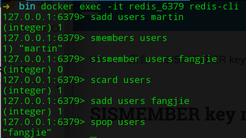
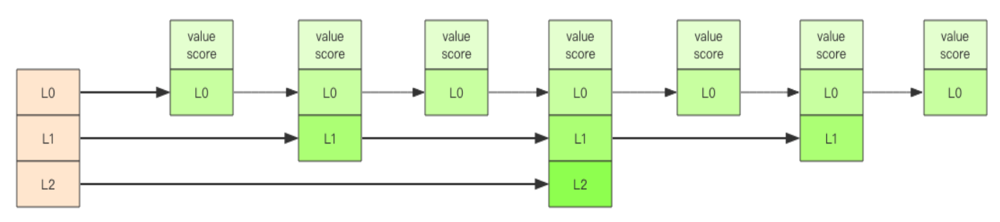

# Redis学习笔记—基本数据结构

## Docker 安装Redis

- 拉取镜像：`docker pull redis`
- 创建容器：`docker run -p 6379:6379 -v /home/fangjie/Documents/Databases/Redis/data:/data --name=redis_6379 -d redis  redis-server --appendonly yes`
    - `-p 本地端口:容器端口`：将本地端口映射到容器端口
    - `-v 本地路径:容器路径`:将本地路径映射到容器中
    - `--name=容器名字`
    - `-d 镜像名词`
    - `redis-server --appendonly yes`：启动Redis且开启持久化
- 验证：`docker exec -it redis_6379 redis-cli`

## 基本数据结构
Redis中所有数据结构都是Key-Value形式，不同的数据结构的差异在Value的结构。

### 字符串(string)

- 结构：字符串的value是一个动态字符串(通过预分配冗余空间避免修改内容导致频繁内存分配)。字符串的长度小于`1M`时，每次扩容都是加倍，如果长度超过`1M`，则每次扩容`1M`，字符串的最大长度为`512M`。通常字符串会搭配序列化与反序列化来存储用户信息。

- 应用场景：搭配序列化与反序列化缓存用户信息。
- 操作：
    - 添加：
        - set 键 值 选项：EX 超时时间(秒)|PX 超时时间(毫秒)|NX(前提键不存在)|XX(前提键存在)
        - 批量添加(原子操作)：mset 键 值 键 值|msetnx(前提键不存在) 键 值 键 值
    - 查询：get|mget 键
    - 追加：append 键 值(原值基础上追加新值)
    - 删除：del 键
    - 是否存在：exists 键
    - 设置过期时间：expire 键 timeout|setex 键 timeout 值
    - 字符串长度：strlen 键(获取键对应字符串长度)

#### 命令行操作


#### Python操作

Python操作Redis需要安装`redis`库。
- 创建Redis


```python
import json
import redis
# decode_responses=True 写入的数据为字符串类型
client = redis.StrictRedis(host='localhost', port=6379, decode_responses=True)
user_info={'name':'fangjie'}
client.set('martin',json.dumps(user_info))
print(client.get('martin'))
```


- 使用连接池管理连接，避免每次建立、释放连接


```python
import json
import redis
# decode_responses=True 写入的数据为字符串类型
pool = redis.ConnectionPool(host='localhost', port=6379, decode_responses=True)
client = redis.StrictRedis(connection_pool=pool)
user_info={'name':'fangjie_123'}
client.set('martin_123',json.dumps(user_info))
print(client.get('martin_123'))
```


### 列表(list)

- 结构：Redis列表在数量比较少时，采用连续内存空间存储(压缩列表:ziplist)；当元素比较多时，采用快速列表(quicklist)，将多个压缩链表通过双向指针连接，构成双向列表。通过该策略，Redis的列表在实现快速插入删除性能的同时，避免了过多指针浪费存储空间。

- 应用场景：搭配序列化与反序列化缓存用户信息。
- 操作：
    - 添加元素：rpush(右)|lpush(左) 列表名 元素
    - 获取元素：rpop|lpop 列表名
    - 获取长度：llen 列表名
    - 按序取值：lindex 列表名 索引
    - 获取区间元素：lrange 列表名 起始索引 结束索引
    - 定义区间(只保留区间内元素)：ltrim 列表名 起始索引 结束索引

#### 命令行操作


#### Python操作


```python
import json
import redis
# decode_responses=True 写入的数据为字符串类型
pool = redis.ConnectionPool(host='localhost', port=6379, decode_responses=True)
client = redis.StrictRedis(connection_pool=pool)
client.rpush('alpha','a')
client.rpush('alpha','b')
print(client.lrange('alpha',0,-1))
client.lpush('alpha','c')
print(client.lrange('alpha',0,-1))
client.ltrim('alpha',1,-1)
print(client.lrange('alpha',0,-1))
```


### 哈希表(hash)

- 结构：哈希是一个无序字典，采用数组+链表的二维结构，数组用于表示hash位置，链表用于存储碰撞的元素。


  哈希表在rehash时，为了提高性能，采用渐进式rehash策略(渐进式rehash在rehash时将保留新旧两个hash结构，因此查询时会同时查询两个hash结构，通过后续定时任务、hash子指令，慢慢迁移到新hash结构，迁移完后，再删除旧hash结构)。
  

- 应用场景：通常哈希表用于存储用户属性，数据传输量小于字符串，但是其内存消耗比字符串大。

- 操作：
    - 添加元素：hset|hmset 字典 键 值
    - 删除元素：hdel 字典 键
    - 获取元素：hget|hmget 字典 键
    - 获取所有元素：hgetall 字典
    - 获取字典长度：hlen 字典
    - 字典值增量：hincrby 字典 键 增量

#### 命令行操作


#### Python操作


```python
import redis
pool = redis.ConnectionPool(host='localhost', port=6379, decode_responses=True)
client = redis.StrictRedis(connection_pool=pool)
client.hset('martin','name','fangjie')
client.hset('martin','age',24)
print(client.hget('martin','name'))
```


### 集合(set)

- 结构：Redis集合的内部实现是一个特殊字典，其value都为NULL，其内部的键值对是唯一且无序的。
- 应用场景：用于去重。
- 操作：
    - 添加元素：sadd 集合 元素
    - 获取一个元素：spop 集合
    - 查看所有元素：smembers 集合
    - 存在与否：sismember 集合 元素
    - 长度：scard 集合

#### 命令行操作



#### Python操作


```python
import redis
pool = redis.ConnectionPool(host='localhost',port=6379,decode_responses=True)
client = redis.StrictRedis(connection_pool=pool)
client.sadd('user','martin')
print(client.sismember('user','fangjie'))
print(client.smembers('user'))
print(client.scard('user'))
print(client.spop('user'))
```


### 有序集合(zset)

- 结构：有序集合和集合类似，内部的元素是唯一的，但其为每个元素提供score，用于元素的排序。有序集合的排序功能由跳表实现，其原理参考了数组二分法查找，为一个链表维护一个层次结构，便于查找。通过该结构能快速定位插入点。
- 应用场景：点赞排行榜
- 操作：
    - 添加元素：zadd 集合名 权重 元素
    - 删除元素：zrem 集合 元素
    - 倒序排序：zrange 集合名 起始位置 结束位置
    - 顺序排序：zrevrange 集合名 起始位置 结束位置
    - 获取长度：zcard 集合名
    - 获取权重：zscore 集合名 元素
    - 获得排名(倒序)：zrank 集合名 元素
    - 获得排名(顺序)：zrank 集合名 元素
    - 获得权重范围内的元素：zrangebyscore 集合名 起始权重 结束权重
    - 带权重信息：zrangebyscore 集合名 起始(inf代表无穷大) 结束 withscores

#### 命令行操作


#### Python操作


```python
import redis
pool = redis.ConnectionPool(host='localhost', port=6379, decode_responses=True)
client = redis.StrictRedis(connection_pool=pool)
client.zadd('like', {'fangjie':3,'martin':2,'martin_1':1})
print(client.zrange('like', 0, -1))
print(client.zrank('like', 'fangjie'))
```


### 过期时间

Redis中所有的数据结构都支持设置过期时间，Redis会自动删除过期的对象。当对对象进行修改后，过期时间会消失。
- 操作：
    - 设置过期时间：expire 对象 时间
    - 查看过期时间：ttl 对象
