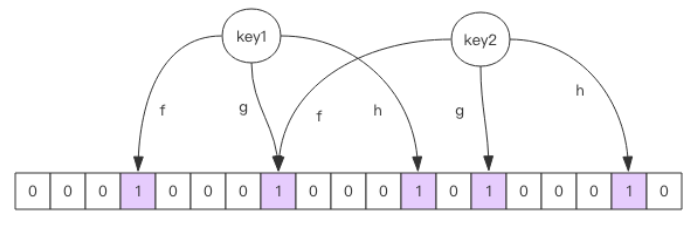
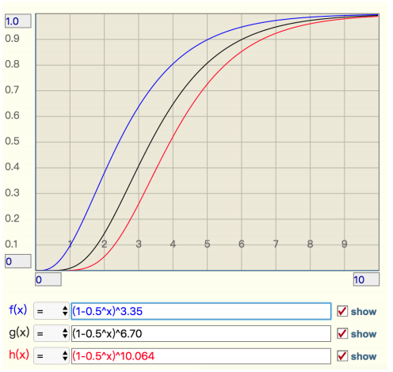

# Redis学习笔记—应用

## 分布式锁

### 并发锁

并发编程中，修改共享资源时，必须确保其操作是原子性(不会被线程调度机制打断)。原子性操作很难实现，但可通过在修改操作中加锁实现同一时刻只有一个线程在操作该资源。多线程访问本地Redis。

```python
import redis
import threading

lock = threading.Lock()

def multi_thread_set():
    import random
    import time
    client = redis.StrictRedis(host='127.0.0.1', port=6379)
    lock.acquire()
    try:
        info = client.get('info')
        time.sleep(random.random())
        client.set('info', int(info) + 1)
    finally:
        lock.release()

def test():
    client = redis.StrictRedis(host='127.0.0.1', port=6379)
    client.set('info', 0)

    threads = [threading.Thread(target=multi_thread_set) for _ in range(5)]
    for thread in threads:
        thread.start()
    for thread in threads:
        thread.join()
    assert int(client.get('info')) == 5
    client.delete('info')

if __name__ == '__main__':
    test()
```

### 分布式锁

分布式应用中，必须确保同一时刻在多个节点中只能有一个线程在修改该共享资源。此时，线程锁将不再生效，因为线程锁只能保证本节点在同一时刻只有一个线程工作。这是就需要使用分布式锁来控制多个节点的并发操作。


分布式锁的本质是在Redis中创建一个标准位：客户端先使用`setnx(set if not exist)` 指令尝试创建该标志位，若创建成果，则进行后续操作，完成操作后，再通过`del`指令释放标志位。这里存在一个问题，若客户端获取标志位后，出现了异常，导致无法调用`del`指令，则会陷入死锁。这是有两种解决方案：

- 客户端通过设置异常处理机制调用`del`指令(客户端没有崩溃的情况下)。
- 通过`set 锁 锁信息 ex 超时时间 nx OK`指令在创建标志位时为其添加超时时间。

```python
import redis
import threading

def multi_thread_set():
    import random
    import time
    client = redis.StrictRedis(host='127.0.0.1', port=6379)
    while client.set('lock', '1', ex=5, nx=True) is None:
        time.sleep(0.1)
    try:
        info = client.get('info')
        time.sleep(0.1 * random.randrange(1, 4))
        client.set('info', int(info) + 1)
    finally:
        client.delete('lock')

def test():
    client = redis.StrictRedis(host='127.0.0.1', port=6379)
    client.set('info', 0)

    threads = [threading.Thread(target=multi_thread_set) for _ in range(5)]
    for thread in threads:
        thread.start()
    for thread in threads:
        thread.join()
    assert int(client.get('info')) == 5
    client.delete('info')

if __name__ == '__main__':
    test()
```

即使有了超时处理机制，也存在当逻辑操作时长大于锁的超时限制出现不安全操作：ABC三个线程同时请求锁，A线程拿到了锁，并处理逻辑，这是锁过期了导致B线程拿到了锁，在B执行逻辑操作时，A完成了逻辑操作，执行锁释放操作，因此会导致线程C也拿到了锁。

针对这种情况，需要在锁的value中存放一个随机数(线程ID)，释放锁时先判断随机数是否一致，然后再决定是否删除(但这里有一个问题：匹配value和删除锁不是原子操作，需要搭配Lua脚本)。

```python
import redis
import threading

def multi_thread_set():
    import random
    import time
    client = redis.StrictRedis(host='127.0.0.1', port=6379)
    while client.set('lock', threading.currentThread().ident, ex=5, nx=True) is None:
        time.sleep(0.1)
    try:
        info = client.get('info')
        time.sleep(0.1 * random.randrange(1, 4))
        client.set('info', int(info) + 1)
    finally:
        # 比较操作和删除操作 非原子操作
        if client.get('lock') and client.get('lock')==threading.currentThread().ident:
            client.delete('lock')

def test():
    client = redis.StrictRedis(host='127.0.0.1', port=6379)
    client.set('info', 0)

    threads = [threading.Thread(target=multi_thread_set) for _ in range(5)]
    for thread in threads:
        thread.start()
    for thread in threads:
        thread.join()
    assert int(client.get('info')) == 5
    client.delete('info')

if __name__ == '__main__':
    test()
```

### 集群分布式锁

在集群环境下，分布式锁也存在缺陷：当客户端A在主节点获取锁后，主节点挂掉，从节点会取而代之，但此时由于异步同步，从节点可能没有该锁的信息，可能会存在客户端B也获得了该锁。为了解决这个问题，Redis添加了`Redlock`算法(`redlock-py`模块实现了封装)。`Redlock`算法采用大多数机制来解决该问题：加锁时，会将该指令同步给过半的节点，只要当过半节点执行成功后，则认为加锁成功；释放锁时，向所有节点下发`del`指令，由于涉及到多个节点读写，因此相比单实例性能有所下降。使用时需要使用多个相互独立的`Redis`实例。

```python
import redlock

addrs = [{
    "host": "localhost",
    "port": 6379,
    "db": 0
}, {
    "host": "localhost",
    "port": 6479,
    "db": 0
}, {
    "host": "localhost",
    "port": 6579,
    "db": 0
}]
dlm = redlock.Redlock(addrs)
success = dlm.lock("user-lck-laoqian", 5000)
if success:
    print('lock success')
    dlm.unlock('user-lck-laoqian')
else:
    print('lock failed')
```

## 消息队列

Redis可以通过`list`搭配`lpush`和`rpop`指令，实现只有一组消费者的消息队列，但是Redis的消息队列没有ack保证，不适用于对消息可靠性有很高要求的应用。


如果出现队列为空时，客户端频繁对队列使用`rpop`操作会导致Redis的性能下降，针对这种情况有两种解决方案：

- 当获取不到数据时，客户端主动睡眠，但会导致消息延迟大。
- 采用`brpop`指令，当队列没有数据时，会阻塞；如果有数据后，会立即恢复。

如果客户端被阻塞很长时间后，会导致该链接被视作为闲置链接。闲置时间过长，服务器会主动断开链接，减少闲置资源占用，因此`brpop`指令会抛异常`ConnectionError`，因此需要做好异常处理机制。

### 延时队列

分布式锁中，当客户端加锁失败后，我们采用的解决方案：客户端主动sleep一定时间，但是该方案会存在两个问题：

- sleep会阻塞当前线程，导致后续消息处理出现延迟。
- sleep时间不合适，线程可能会很迟才能获得锁。
- 线程因为死锁阻塞，导致后续消息无法处理。

针对这种情况，可以将冲突请求存放到一个延迟队列中延后处理避开冲突。在Redis中，可以使用`zset`实现延时队列，将消息序列化后存入value中，以消息的到期时间作为score，通过`zrangebyscore`指令获取最近一个要过期的消息，进行处理。然后使用多进程(保障可用性)来轮询`zset`，这里为了避免因为并发导致任务被多次执行，可以采用两种方案：

- 采用锁机制。
- 通过CAS机制，先获取消息，然后去删除消息，如果删除成功，则表明该进程获得了消息；删除失败，则获取消息失败。

```python
import random
import threading
import time
import pickle
import uuid
import redis
from datetime import datetime, timedelta

class Task(object):
    def __init__(self, msg):
        self._msg = msg
        self._id = uuid.uuid4()

    @property
    def msg(self):
        return "consumer" + self._msg

def handle_msg(task):
    time.sleep(0.1 * random.randrange(1, 4))
    print("{} handing {}".format(threading.current_thread().ident, task.msg))

class RedisDelayingQueue(object):
    def __init__(self, client, queue_name):
        self._client = client
        self._queue_name = queue_name

    def delay(self, msg):
        task = Task(msg)
        value = pickle.dumps(task)
        dt = datetime.now() + timedelta(seconds=5)
        self._client.zadd(self._queue_name, {value: int(dt.timestamp())})

    def loop(self):
        while True:
            now = datetime.now().timestamp()
            values = self._client.zrangebyscore(self._queue_name, 0, int(now),
                                                start=0, num=1)
            if not values:
                print(
                    "{} waiting task".format(threading.current_thread().ident))
                time.sleep(1)
                continue
            value = values[0]
            # 判断是否抢占任务成功
            success = self._client.zrem(self._queue_name, value)
            if success:
                task = pickle.loads(value)
                handle_msg(task)

def producer_task(delay_queue):
    for i in range(10):
        delay_queue.delay('task' + str(i))

def consumer_task(delay_queue):
    delay_queue.loop()

if __name__ == '__main__':
    client = redis.StrictRedis(host='127.0.0.1', port=6379)
    delay_queue = RedisDelayingQueue(client, 'tasks')
    producer = threading.Thread(target=producer_task, args=(delay_queue,))
    consumers = [threading.Thread(target=consumer_task, args=(delay_queue,))
                 for _ in range(2)]
    producer.start()
    for consumer in consumers:
        consumer.start()

    producer.join()
    for consumer in consumers:
        consumer.join()
```

该实现有一个小问题：同一个任务会被多个进程获取，但是只能有一个进程获抢占该任务，因此会出现大量的无效任务获取，可以采用`lua`脚本将`zrangebyscore`和`zrem`封装为一个原子化操作，因此可以避免多个进程之间抢占任务。

### 为什么Redis作为消息队列无法保证100%可靠性呢？

因为消息队列没有`ack`机制，因此只能保证消息被发送出去，但是不能保证消息被客户端收到，而且也不能保证消息被客户端正确处理了。

## 位图

位图可以用于需要存储bool类型数据的场景，如：用户一年的签到记录，每一位代表一天。通过位图可以节约大量存储空间。


在Redis中，位图实际是普通的字符串，只是可以进行位图操作`getbit/setbit`，也可以通过`get/set`进行字节操作，可以将其是作为位数组。


位数组支持自动扩展，当访问的位置超出现有内容范围，自动进行零扩充。

```python
import redis

client = redis.StrictRedis(host='127.0.0.1', port=6379)
for index, data in enumerate('01101000'):
    client.setbit('data', index, int(data))
assert client.getbit('data', 0) == 0
assert client.getbit('data', 1) == 1
assert client.getbit('data', 2) == 1
assert client.getbit('data', 3) == 0
assert client.getbit('data', 4) == 1
assert client.getbit('data', 5) == 0
assert client.getbit('data', 6) == 0
assert client.getbit('data', 7) == 0
assert client.get('data')==b'h'
client.delete('data')
```

Redis提供了三个位图指令：

- 位图统计指令`bitcount key [start end]`：统计指定范围内`1`的个数。
- 位图查找指令`bitpos key bit [start end]`：查找指定范围内出现的第一个`0`或`1`。
- start、end是字节索引，并不是位索引，因此必须是8的倍数。
- 多位处理指令`bitfield key 指令`：支持三个子指令`get/set/incrby`，用于对指定位片段进行读写操作，最多可以处理64个连续的位。
  - 子指令的格式
    - `get u4 0`：从第一位开始，将接下来的`4`位视作为无符号数。
    - `set u4 0 5`：从第一位开始，将接下来的`4`位用无符号数`5`替换。
    - `incrby u4 0 1`：从第一位开始，将接下来的`4`位无符号数`+1`。
  - 数据类型
    - `u`：无符号数。
    - `i`：有符号数。
  - 溢出策略`overflow`，只影响接下来第一条指令。
    - 默认折返(wrap)：溢出后，循环。
    - 失败报错不执行(fail)：溢出后报错
    - 饱和截断(sat)：超过范围后，只停留在最大|最小值。

```python
import redis

client = redis.StrictRedis(host='127.0.0.1', port=6379)
# 01101000
client.set('data', 'h')
assert client.bitcount('data', 0, 1) == 3
assert client.bitpos('data', 1, 0, 1) == 1
assert client.bitfield('data').get('u4', 0).execute() == [6]

client.bitfield('data').set('u4', 0, 7).execute()
assert client.bitfield('data').get('u4', 0).execute() == [7]

client.bitfield('data').incrby('u4', 0, 1).execute()
assert client.bitfield('data').get('u4', 0).execute() == [8]
for i in range(8):
    client.setbit('data', i, 1)
assert client.bitfield('data').get('u8', 0).execute() == [255]

assert client.bitfield('data', 'fail').incrby('u8', 0, 1).execute()==[None]

client.bitfield('data', 'sat').incrby('u8', 0, 1).execute()
assert client.bitfield('data').get('u8', 0).execute() == [255]

client.bitfield('data', 'wrap').incrby('u8', 0, 1).execute()
assert client.bitfield('data').get('u8', 0).execute() == [0]

client.delete('data')
```

## HyperLogLog

## 布隆过滤器

布隆过滤器通常用于解决去重问题，如：垃圾邮件过滤、防止缓存穿透(访问不存在的数据时，每次都会去访问数据库，而不会访问缓存)。布隆过滤器只能精确的判断值不存在，但是对值存在可能会出现误判。

### 安装

```bash
# 拉取镜像
➜  Desktop docker pull redislabs/rebloom
# 创建容器
➜  Desktop docker run -d -p 6379:6379 --name bloomfilter redislabs/rebloom
# 启动交互平台
➜  Desktop docker exec -it bloomfilter redis-cli
```

### 常用指令

- 显示创建：`bf.reserve key error_rate initial_size`
  - `error_rate`：错误率越低，需要的空间越大，默认值`0.01`。
  - `initial_size`：预计放入元素数量，当实际数量超过时，误判率会上升，默认值`100`。
- 添加元素：`bf.add|bf.madd  key value`
- 判断元素是否存在：`bf.exists|bf.mexists key value`

### Python使用布隆过滤器

```python
import redis

client = redis.StrictRedis(host='localhost', port='6379')
# 添加用户
user_number = 10000
not_include = 0

for i in range(user_number):
    client.execute_command('bf.add', 'users', f'user_{i}')
    ret = client.execute_command('bf.exists', 'users', f'user_{i + 1}')
    if ret == 1:
        not_include += 1

print(
    f"共计：{user_number}，实际误判：{not_include}，误判率：{not_include * 100 / user_number}%")

client.delete('users')
```

### 原理

布隆过滤器的数据结构时一个位数组，其原理是采用计算元素的hash值，然后将位数组对应的位置设置为1，因此可以通过位数组来判断元素是否已经存在。计算哈希时会出现hash冲突，因此可以通过设置多个位+多个hash函数来降低hash冲突的概率，同一个元素的对应的多个位有一位不为`1`，则元素不存在。



使用时不要让实际元素数量远大于初始化大小(错误率会上升)，应该重新分配一个更大的过滤器。

布隆过滤器的空间占用估计公式：

- $k=0.7*(l/n)$：$k$为hash函数数量，$l$为位数组长度，$n$为预计元素数量。
- $f=0.6185^{(l/n)}$：$f$为误判率。

实际元素数量超出时，误判率变化公式：

- $f=(1-0.5^t)^k$：$t$为实际元素和预计元素倍数。

$k$值分别为错误率为$10.0\%、1\%、0.1\%$时。