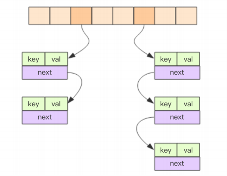
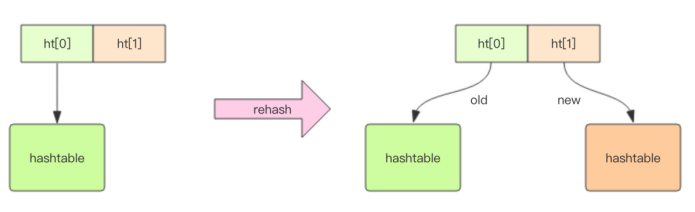
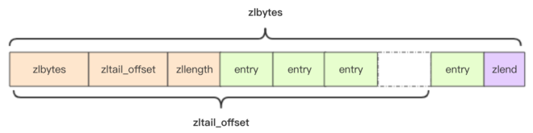

# Redis学习笔记—源码

## 字符串

Redis中的字符串是可以修改的字符串，在内存中它是以字节数组的形式存在的。Redis中的字符串叫SDS(Simple Dynamic String)，它的结构是一个带长度信息的字节数组。

```c
/*src/sds.h*/
struct __attribute__ ((__packed__)) sdshdr8 {
    uint8_t len; /* 实际使用的长度 */
    uint8_t alloc; /*分配长度，包含头部和null*/
    unsigned char flags; /* 3 标志位*/
    char buf[];
};
```

这样设计的目的：C语言中字符串的标准形式是以NULL结尾，获取字符串长度的函数为`strlen`，该函数的算法复杂度为$O(n)$。Redis为了对内存做极致的优化，不同长度的字符串采用不同的结构体表示。

对数组执行`append`操作时，如果数组没有冗余空间，则需要分配新数组，将旧数组的内容复制到新数组中，因此如果旧数组的长度很长时，内存分配与复制的开销会很大。

```c
/*src/sds.c*/
/* Append the specified binary-safe string pointed by 't' of 'len' bytes to the
 * end of the specified sds string 's'.
 *
 * After the call, the passed sds string is no longer valid and all the
 * references must be substituted with the new pointer returned by the call. */
sds sdscatlen(sds s, const void *t, size_t len) {
    size_t curlen = sdslen(s);/*原字符串长度*/

    s = sdsMakeRoomFor(s,len);/*按需调整空间*/
    if (s == NULL) return NULL;
    memcpy(s+curlen, t, len);/*追加字符串*/
    sdssetlen(s, curlen+len);/*设置追加后的长度*/
    s[curlen+len] = '\0';
    return s;
}
```

Redis规定字符串长度不能超过`512M`字节。

```c
/*src/t_string.c*/
static int checkStringLength(client *c, long long size) {
    if (size > 512*1024*1024) {
        addReplyError(c,"string exceeds maximum allowed size (512MB)");
        return C_ERR;
    }
    return C_OK;
}
```

### 扩容策略

字符串长度小于`1M`时，采用加倍策略扩容，当长度超过`1M`后，每次只多分配`1M`的冗余空间。

```c
/*src/sds.c*/
/* Enlarge the free space at the end of the sds string so that the caller
 * is sure that after calling this function can overwrite up to addlen
 * bytes after the end of the string, plus one more byte for nul term.
 *
 * Note: this does not change the *length* of the sds string as returned
 * by sdslen(), but only the free buffer space we have. */
sds sdsMakeRoomFor(sds s, size_t addlen) {
    void *sh, *newsh;
    //未分配数组长度
    size_t avail = sdsavail(s);
    size_t len, newlen;
    char type, oldtype = s[-1] & SDS_TYPE_MASK;
    int hdrlen;

    /* Return ASAP if there is enough space left. */
    if (avail >= addlen) return s;

    len = sdslen(s);
    sh = (char*)s-sdsHdrSize(oldtype);
    newlen = (len+addlen);
    // 如果新长度小于1M,则预分配为倍增
    if (newlen < SDS_MAX_PREALLOC)
        newlen *= 2;
    else
    // 如果新长度大于1M,则预分配+1M
        newlen += SDS_MAX_PREALLOC;

    type = sdsReqType(newlen);

    /* Don't use type 5: the user is appending to the string and type 5 is
     * not able to remember empty space, so sdsMakeRoomFor() must be called
     * at every appending operation. */
    if (type == SDS_TYPE_5) type = SDS_TYPE_8;

    hdrlen = sdsHdrSize(type);
    if (oldtype==type) {
        newsh = s_realloc(sh, hdrlen+newlen+1);
        if (newsh == NULL) return NULL;
        s = (char*)newsh+hdrlen;
    } else {
        /* Since the header size changes, need to move the string forward,
         * and can't use realloc */
        newsh = s_malloc(hdrlen+newlen+1);
        if (newsh == NULL) return NULL;
        memcpy((char*)newsh+hdrlen, s, len+1);
        s_free(sh);
        s = (char*)newsh+hdrlen;
        s[-1] = type;
        sdssetlen(s, len);
    }
    sdssetalloc(s, newlen);
    return s;
}
```

### 存储策略

Redis的字符串有两种存储方式：

- 当字符串长度小于等于`44`字节时，采用`embed`形式存储。
- 当字符串长度大于`44`字节时，采用`raw`形式存储。

```bash
127.0.0.1:6379> set emb  abcdefghijklmnopqrstuvwxyz012345678912345678
OK
127.0.0.1:6379> debug object emb
Value at:000007EA82412F40 refcount:1 encoding:embstr serializedlength:45 lru:529
7573 lru_seconds_idle:13
127.0.0.1:6379> set raw abcdefghijklmnopqrstuvwxyz0123456789123456789
OK
127.0.0.1:6379> debug object raw
Value at:000007EA8246AEC0 refcount:1 encoding:raw serializedlength:46 lru:529770
2 lru_seconds_idle:22
```

通过上面的实验可以看到两个字符串的`encoding`字段不同，这里有一个疑问：`emb`实际存储了`44`字节的数据，为什么`serializedlength`的值却是`45`？这个问题的答案是字符串的结尾会添加一个`\0`作为结束符。

Redis所有的对象都会有一个对象头结构体：

```c
/*src/server.h*/
typedef struct redisObject {
    unsigned type:4;  //对象类型 4bits
    unsigned encoding:4;//存储形式 4bits
    unsigned lru:24; //LRU信息 24bits
    int refcount;//引用计数 32bits
    void *ptr;//ptr指向对象内容实际存储位置 8bytes
} robj; //共计16字节
```

当字符串很小时，`SDS`的结构体为：

```c
/*src/sds.h*/
struct __attribute__ ((__packed__)) sdshdr8 {
    uint8_t len; // 实际使用的长度 8bits
    uint8_t alloc; // 分配长度 8bits
    unsigned char flags; // 标志位 8bits
    char buf[];
};
```

因此分配一个字符串最小长度为`19+1`字节(结束符`\0`占一个字节)。`jemalloc`分配内存大小依次为：`2、4、8、16、32、64`字节，如果超过总体`64`字节，Redis将使用`raw`来存储大字符串，因此`embed`和`raw`的分界线为`64-20=44`字节。

在存储上，`embstr`采用RedisObject对象头和SDS对象连续存储，只需调用`malloc`一次来分配内存。


而`raw`中，对象头和SDS对象分开存储，将调用两次`malloc`分配内存。


## 字典

字典是Redis中出现最频繁的复合型数据结构，整个Redis的所有Key和Value组成了一个全局字典。

### 内部结构

字典是有哈希表组成的。哈希表是一个二维结构：第一维是数组；第二维是链表，存放冲突的元素。



字典中元素的源码：

```c#
/*src/dict.h*/
typedef struct dictEntry {
    void *key;
    union {
        void *val;
        uint64_t u64;
        int64_t s64;
        double d;
    } v;
    // 指向下一个元素
    struct dictEntry *next;
} dictEntry;
```

哈希表的源码：

```c
/*src/dict.h*/
typedef struct dictht {
    // 二维结构
    dictEntry **table;
    // 第一维的长度
    unsigned long size;
    unsigned long sizemask;
    // 哈希表的元素个数
    unsigned long used;
} dictht;
```

### rehash

当字典中元素有很多时，则需要对字典进行扩容。扩容流程分为两步：

- 申请新的一维数组。
- 将旧字典中的元素重新挂载到新的数组上。

这个操作的时间复杂度为$O(n)$，Redis只有一个线程，这样的操作难以承受，因此Redis采用渐进式rehash。Redis的字典中有两个哈希表，旧的哈希表在完成rehash操作后，将变为空。



字典的源码：

```c
/*src/dict.h*/
typedef struct dict {
    dictType *type;
    void *privdata;
    // 哈希表
    dictht ht[2];
    // rehash状态
    long rehashidx; /* rehashing not in progress if rehashidx == -1 */
    unsigned long iterators; /* number of iterators currently running */
} dict;
```

Redis将rehash操作拆分两部分：

- 字典添加新元素时，执行部分rehash操作。
- 定时进行rehash操作。

字典添加新元素源码：

```c
dictEntry *dictAddRaw(dict *d, void *key, dictEntry **existing)
{
    long index;
    dictEntry *entry;
    dictht *ht;
	//进行小步rehash操作
    if (dictIsRehashing(d)) _dictRehashStep(d);

    if ((index = _dictKeyIndex(d, key, dictHashKey(d,key), existing)) == -1)
        return NULL;
	//如果处于rehash操作中，则将元素放入新哈希表中
    ht = dictIsRehashing(d) ? &d->ht[1] : &d->ht[0];
    entry = zmalloc(sizeof(*entry));
    entry->next = ht->table[index];
    ht->table[index] = entry;
    ht->used++;

    dictSetKey(d, entry, key);
    return entry;
}
```

定时任务源码：

```c
/*src/server.c*/
void databasesCron(void) {
    ......
	//rehash
    if (server.activerehashing) {
        for (j = 0; j < dbs_per_call; j++) {
            int work_done = incrementallyRehash(rehash_db);
            if (work_done) {
                // 如果执行了rehash操作
                // 将在下一个循环中继续执行
                break;
            } else {
                // 当前db不需要rehash操作，
                // 切换到下一个db
                rehash_db++;
                rehash_db %= server.dbnum;
            }
        }
    }
    .....
}
```

### hash函数

哈希表的性能的取决于hash函数的质量。如果hash函数能将key分散的比较均匀，让二维链表的长度比较均匀时，则查找时的性能比较稳定。如果hash函数有偏向性，黑客可以通过存入有偏向性的数据，导致大量数据元素集中在个别链表中，导致性能下降，甚至还可能退化为单链表。Redis中默认采用`siphash`算法。

### 扩缩容

Redis会在字典的元素过多或过少时进行相应的容量调整。

- 扩容

  - 元素个数等于一维数组长度时，若没有做`bgsave`，则进行扩容(减少内存页过分分离)，新数组是原数组大小的2倍。
  - 元素个数达到一维数组长度的5倍，则强制扩容。

  ```c
  static int _dictExpandIfNeeded(dict *d)
  {
      //rehash状态，则代表上次扩容未完成
      if (dictIsRehashing(d)) return DICT_OK;
  
      // 字典为空时，扩容到初始化状态
      if (d->ht[0].size == 0) return dictExpand(d, DICT_HT_INITIAL_SIZE);
  	// 判断是否强制扩容
      if (d->ht[0].used >= d->ht[0].size &&
          (dict_can_resize ||
           d->ht[0].used/d->ht[0].size > dict_force_resize_ratio))
      {
          return dictExpand(d, d->ht[0].used*2);
      }
      return DICT_OK;
  }
  ```

- 缩容：当元素的个数小于数组长度的`10%`时，将执行缩容，减少空间占用。

  ```c
  static int _dictExpandIfNeeded(dict *d)
  {
      if (dictIsRehashing(d)) return DICT_OK;
  
      if (d->ht[0].size == 0) return dictExpand(d, DICT_HT_INITIAL_SIZE);
  
      if (d->ht[0].used >= d->ht[0].size &&
          (dict_can_resize ||
           d->ht[0].used/d->ht[0].size > dict_force_resize_ratio))
      {
          return dictExpand(d, d->ht[0].used*2);
      }
      return DICT_OK;
  }
  ```

## 压缩列表

Redis的zset和hash容器在元素个数较少时，采用压缩列表`ziplist`进行存储。压缩列表是一块连续的内存空间，元素之间紧挨着存储。



### ziplist结构

`ziplist`由三部分组成：

- 头部(`zlbytes+zltail_offset+zllength`)
  - `zlbytes`：该字段为`uint32_t`类型，用于表示整个`ziplist`所占字节数。
  - `zltail_offset`：该字段为`uint32_t`类型，表示头部到最后一个`entry`的偏移量，用于快速跳转到列表尾部。
  - `zllength`：该字段为`uint16_t`类型，用于表示存储的`entry`的个数。
- 内容(`entry`)：存储`ziplist`中的元素。
- 尾部(`zlend`)：尾部是一个特殊的`entry`，固定值为255，用于表示链表尾部。

`ziplist`结构的源码：

```c
/*src/ziplist.c*/
#define ZIPLIST_HEADER_SIZE     (sizeof(uint32_t)*2+sizeof(uint16_t))
#define ZIPLIST_END_SIZE        (sizeof(uint8_t))
#define ZIP_END 255 
unsigned char *ziplistNew(void) {
	// ZIPLIST_HEADER_SIZE ziplist头部大小 十个字节
    // ZIPLIST_END_SIZE 一个字节
    unsigned int bytes = ZIPLIST_HEADER_SIZE+ZIPLIST_END_SIZE;
    unsigned char *zl = zmalloc(bytes);
    // 设置zlbytes
    ZIPLIST_BYTES(zl) = intrev32ifbe(bytes);
    //设置zltail_offset
    ZIPLIST_TAIL_OFFSET(zl) = intrev32ifbe(ZIPLIST_HEADER_SIZE);
    // 设置zllength
    ZIPLIST_LENGTH(zl) = 0;
    // 设置zlend
    zl[bytes-1] = ZIP_END;
    return zl;
}
```

### entry

`entry`用于存储元素，其结构为：

- `prelen`：前一个元素长度，倒序遍历时，可以通过该字段快速定位到下一个元素位置。
  - 如果小于`0XFE（254）`，则只占一个字节。
  - 如果值大于`0XFE`，占5个字节，第一个字节恒为`0XFE`，其余四个字节表示长度。
- `encoding`：元素内容的编码类型信息。
- `entry-data`：存储元素的内容，如果值为很小的整数`(0-12)`，则该字段不存在。

Redis为了节约空间，`encoding`的设计相当复杂，Redis可以通过该字段的前缀识别具体存储的数据类型。

- `00xxxxxx `：短字符串，后6位表示字符串长度。
- `01xxxxxx xxxxxxxx `：中等长度字符串，后14位表示字符串长度。
- `10000000 `：特大字符串，后四个字节表示字符串长度。
- `11000000`：表示`int16`，后跟两个字节表示整数。
- `11010000`：表示`int32`，后跟四个字节表示整数。
- `11100000`：表示`int64`，后跟八个字节表示整数。
- `11110000`：表示`int24`，后跟三个字节表示整数。
- `11111110`：表示`int8`，后跟一个字节表示整数。
- `11111111`：表示`zlend`。 
- `1111xxxx `：表示极小整数，后四位的范围为`(0001~1101)`，Redis用其值-1，表达`0~12`。极小整数不会有data

`entry`的源码为：

```c
typedef struct zlentry {
    // 前一个entry的len的所占字节数
    unsigned int prevrawlensize;
    // 前一个entry的长度
    unsigned int prevrawlen;
    // 当前entry的len所占字节数
    unsigned int lensize;
    // 当前entry的长度
    unsigned int len;
    // header的大小=prevrawlensize + lensize
    unsigned int headersize;    
    unsigned char encoding;
    unsigned char *p;
} zlentry;
```

### 插入

`ziplist`采用数组存储，因此每次插入新元素时，需要对原`ziplist`扩容，可能会涉及到拷贝旧内存的操作，因此`ziplist`不适合存储大型字符串，其存储的元素也不宜过大。

每个`enrty`都有`prevlen`字段保存前一个`entry`的长度。如果修改`entryA`的长度为`253`字节，为`entryA`添加两个字节的字符，因此`entryA`的`lensize`将变为`2`，`len`字段将使用两个字节，因此需要挪动后续节点，以便腾出空间。更新一个`entry`的数据后，还可能导致后续`entry`都需要修改，从而触发级联更新。

### IntSet

当`set`集合中容纳的元素都是整数且个数较少时，Redis会采用`intset`来存储。`intset`也是紧凑的数组结构，同时指出存储16位，32位和64位的整数。


`intset`结构体源码为：

```c
typedef struct intset {
    uint32_t encoding;
    uint32_t length;
    int8_t contents[];
} intset;
```

### 参考

- [redis源码分析之压缩链表ziplist](<https://www.jianshu.com/p/565795f43eed>)


## 快速列表

Redis早期的`list`采用`ziplist`(元素少时采用压缩列表)+`linkedlist`(元素多时采用普通的双向链表)。但`linkedlist`存在两个缺陷：

- 附加空间相对较大：前驱`prev`和后继`next`需要占用`16`字节(64位操作系统)。
- 每个节点的内存单独分配，加减内存的碎片化，影响内存管理效率。

为了减轻这两个缺陷的影响，Redis采用`quicklist`来替换`ziplist`+`linkedlist`。`quicklist`是由多个`ziplist`组成的双链表。


`quicklist`源码为：

```c
/*src/quicklist.h*/
typedef struct quicklistNode {
    struct quicklistNode *prev;
    struct quicklistNode *next;
    unsigned char *zl;
    unsigned int sz;             /* ziplist size in bytes */
    unsigned int count : 16;     /* count of items in ziplist */
    unsigned int encoding : 2;   /* RAW==1 or LZF==2 */
    unsigned int container : 2;  /* NONE==1 or ZIPLIST==2 */
    unsigned int recompress : 1; /* was this node previous compressed? */
    unsigned int attempted_compress : 1; /* node can't compress; too small */
    unsigned int extra : 10; /* more bits to steal for future usage */
} quicklistNode;
...
typedef struct quicklist {
    quicklistNode *head;
    quicklistNode *tail;
    unsigned long count;        /* total count of all entries in all ziplists */
    unsigned long len;          /* number of quicklistNodes */
    int fill : 16;              /* fill factor for individual nodes */
    unsigned int compress : 16; /* depth of end nodes not to compress;0=off */
} quicklist;
```

`quicklist`内单个`ziplist`的长度为`8k`字节，超过则新建一个`ziplist`，可以通过配置文件`redis.conf`的`list-max-ziplist-size`参数调整。

Redis为了更节约空间，提供使用`LZF`对`ziplist`进行压缩。可以通过`listcompress-depth  `参数配置压缩深度。

- `0`：不压缩。
- `1`：首尾两个`ziplist`压缩。
- `2`：首尾前两个`ziplist`压缩(共计4个)。

## 跳表

Redis中的`zset`是一个符合结构，一方面需要一个hash结构来存储`value`和`score`的对应关系；另一方面需要跳表来提供按`score`排序和指定`score`的范围来获取`value`列表的功能。`zset`的基础结构为：


跳表中节点的结构为：

```c
typedef struct zskiplistNode {
    sds ele;// value
    double score;//score
    struct zskiplistNode *backward;//上一个节点
    struct zskiplistLevel {
        struct zskiplistNode *forward;//下一个节点
        unsigned long span;// 跨度
    } level[];// 层次信息
} zskiplistNode;
// 节点的backward指针和第一个forward指针用于创建最下层的双链表
// 创建跳表中的节点
zskiplistNode *zslCreateNode(int level, double score, sds ele) {
	// 节点包含节点信息和level个层次信息
    zskiplistNode *zn =
        zmalloc(sizeof(*zn)+level*sizeof(struct zskiplistLevel));
    zn->score = score;
    zn->ele = ele;
    return zn;
}
```

跳表的源码为：

```c
typedef struct zskiplist {
    // 跳表的头尾指针
    struct zskiplistNode *header, *tail;
    // 元素个数
    unsigned long length;
    // 最高层
    int level;					
} zskiplist;
```

`zset`的结构为：

```c
typedef struct zset {
    dict *dict;
    zskiplist *zsl;
} zset;
```

### 查找过程

跳表查找元素是先从最高层开始遍历找到第一个节点(最后一个比我小的元素)，然后从该节点下降一层，再往后遍历寻找下一个节点直到找到期望的节点。其查找过程的时间复杂度会降到$O(logN)$。


### 随机层数

Redis中每个节点晋升的概率为`25%`，因此每层遍历的个数$2^2+1=5$个，但整个聊表相对扁平，层次相对较低。因此遍历的时候从顶层开始往下遍历会非常浪费，跳跃列表会记录当前最高层次`maxLevel`，遍历时从`maxLevel`开始遍历。

```c
#define ZSKIPLIST_P 0.25 
int zslRandomLevel(void) {
    int level = 1;
    while ((random()&0xFFFF) < (ZSKIPLIST_P * 0xFFFF))
        level += 1;
    return (level<ZSKIPLIST_MAXLEVEL) ? level : ZSKIPLIST_MAXLEVEL;
}
```

### 插入过程

## 紧凑列表

## 基数树
