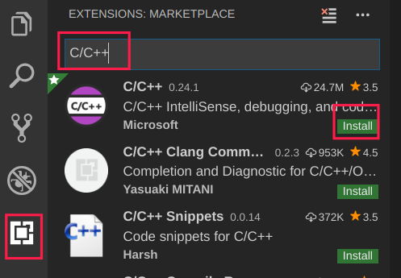
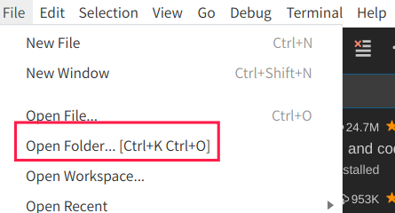
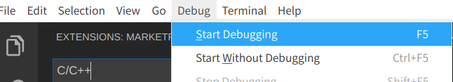
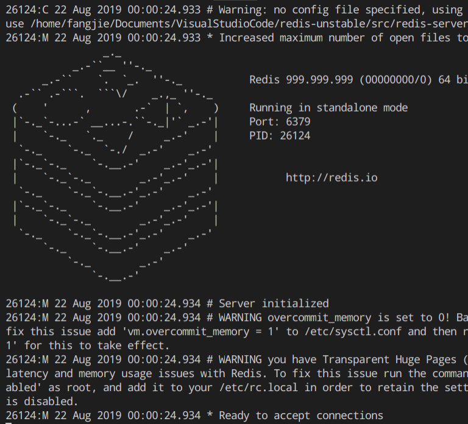

# Redis源码分析—准备工作

## Docker 安装Redis

- 拉取镜像：`docker pull redis`
- 创建容器：`docker run -p 6379:6379 -v /home/fangjie/Documents/Databases/Redis/data:/data --name=redis_6379 -d redis  redis-server --appendonly yes`
  - `-p 本地端口:容器端口`：将本地端口映射到容器端口
  - `-v 本地路径:容器路径`:将本地路径映射到容器中
  - `--name=容器名字`
  - `-d 镜像名词`
  - `redis-server --appendonly yes`：启动Redis且开启持久化
- 验证：`docker exec -it redis_6379 redis-cli`

## 源码获取

Redis的源码地址：`https://github.com/antirez/redis`。

## 源码分析工具

- `VisualStudioCode`下载地址`https://code.visualstudio.com/`。

- 安装`C\C++`插件

  

- 加载源码

  

- 编译源码

  - Windows平台：请安装`MinGW`后，进入源码根目录，执行`make`命令。
  - Linux平台：进入源码根目录，执行`make`命令。

- 配置`debug`信息

  

  点击按钮后，会出来一个文件`launch.json`，将内容更改为：

  ```json
  {
      // Use IntelliSense to learn about possible attributes.
      // Hover to view descriptions of existing attributes.
      // For more information, visit: https://go.microsoft.com/fwlink/?linkid=830387
      "version": "0.2.0",
      "configurations": [
          {
              "name": "(gdb) Launch",
              "type": "cppdbg",
              "request": "launch",
              "program": "${workspaceRoot}/src/redis-server",
              "args": [],
              "stopAtEntry": false,
              "cwd": "${workspaceFolder}",
              "environment": [],
              "externalConsole": false,
              "MIMode": "gdb",
          }
      ]
  }
  ```

- 启动debug

  

