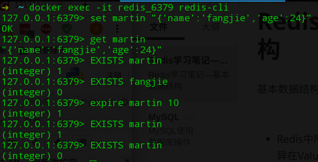

# Redis源码分析—字符串

## 字符串基础介绍

Redis的字符串是一个支持动态扩容的字符串。它通过预分配冗余空间避免修改内容导致频繁内存分配。Redis的字符串结构图：


动态扩容策略：字符串的长度小于`1M`时，每次扩容都是加倍，如果长度超过`1M`，则每次扩容`1M`，字符串的最大长度为`512M`。常用的应用场景：搭配序列化与反序列化缓存用户信息。

## Redis常用操作

- 添加：`set 键 值 选项`
    - 选项：`EX 超时时间(秒)`
    - 选项：`PX 超时时间(毫秒)`
    - 选项：`NX(前提键不存在)`
    - 选项：`XX(前提键存在)`
- 查询：`get|mget 键`
- 追加：`append 键 值(原值基础上追加新值)`
- 删除：`del 键`
- 是否存在：`exists 键`
- 设置过期时间：`expire 键 timeout|setex 键 timeout 值`
- 字符串长度：``strlen 键(获取键对应字符串长度)`

### 命令行操作



### Python操作

Python操作Redis需要安装`redis`库。
- 创建Redis


```python
import json
import redis
# decode_responses=True 写入的数据为字符串类型
client = redis.StrictRedis(host='localhost', port=6379, decode_responses=True)
user_info={'name':'fangjie'}
client.set('martin',json.dumps(user_info))
print(client.get('martin'))
```


- 使用连接池管理连接，避免每次建立、释放连接。


```python
import json
import redis
# decode_responses=True 写入的数据为字符串类型
pool = redis.ConnectionPool(host='localhost', port=6379, decode_responses=True)
client = redis.StrictRedis(connection_pool=pool)
user_info={'name':'fangjie_123'}
client.set('martin_123',json.dumps(user_info))
print(client.get('martin_123'))
```

## 源码分析

