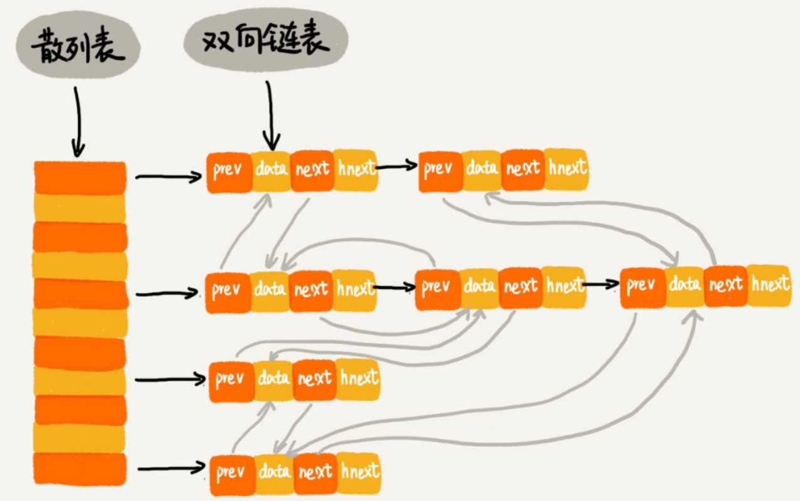

# 数据结构与算法学习笔记—散列表

## 基础

散列表是数组的一种扩展，它通过哈希函数(散列函数)将元素的标识符映射为

数组的下标，然后利用数组下标直接获取元素，其时间复杂度为$O(1)$。

散列表的难点有两个：

- 哈希函数的设计。
- 如何解决散列冲突(不同元素的hash值相同)。

## 哈希函数

一个好的哈希函数有如下三个基本要求：

- 哈希函数得出的哈希值是一个非负整数。
- 如果`key1=key2`，则`hash(key1)=hash(key2)`。
- 如果`key1！=key2`，则`hash(key1)！=hash(key2)`。

如果`key1!=key2`，但`hash(key1)=hash(key2)`，这种现象被称作为**散列冲突**。因为数组的存储空间有限，加剧了散列冲突的概率，所有无法找到一个完美的无冲突的散列函数。基于对成本的考虑，只能想办法去处理散列冲突。

## 散列冲突

### 开放寻址法

开放寻址法的核心思想是：出现散列冲突，重新探测一个空闲位置。

- 线性探测
- 二次探测
- 双重散列

#### 线性探测

线性探测的核心思想是：

- 插入元素：如果出现散列冲突，则从当前位置往后找空闲，插入元素。
- 查找元素：从散列函数得出的散列值开始，依次往后对比，如果相等，则找到元素；如果出现空闲位置，则表示元素不存在。
- 删除元素：不能直接删除元素，因为删除元素后会出现空闲位置，从而导致查找算法失效。删除只能标记为删除，当插入时，没有多余空闲位置，进行rehash操作，将元素重新排列。

线性探测存在一个缺陷：插入的元素越多，出现散列冲突的可能性越大，空闲位置越少，线性探测时间越长，最坏时间复杂度为$O(n)$。

#### 二次探测

线性探测每次的探测步长为`1`，其探测的下标为$(hash(key)+0)%n$，$(hash(key)+1)%n$，$(hash(key)+2)%n$等。二次探测每次的探测步长为$i^2$，其探测下标为$(hash(key)+0^2)%n$，$(hash(key)+1^2)%n$，$(hash(key)+2^2)%n$等。

#### 双重散列 

双重散列是采用一组哈希函数，如果第一个哈希函数得出的位置已经被使用，则使用第二个哈希函数，以此类推，直到找到空闲的存储位置位置。
三种探测方法都面临着当散列表中空闲位置越少，散列冲突的概率越大。为了确保散列表的性能，会通过保证散列表中有一定比例的空闲位置。散列表实际使用容量的比例为$使用数量 /dev 总容量$，该比例被称作为**装载因子**。当装载因子到达极限值时，则需要对散列表进行扩缩容，以确保性能。

#### 优缺点

- 优点：
  - 散列表的数据存储在数组中，可以利用CPU缓存加速查询速度。
  - 序列化简单。
- 缺点：
  - 删除数据麻烦，需要标记被删除的元素。
  - 散列冲突代价大。
  - 需要预先为每个元素分配内存，空间浪费严重。
  - 装载因子必须小于1。

开放寻址法适用于小对象、数据量较小、装载因子较小的场景。

### 链表法

链表法的核心思想：使用一维数组作为槽位，每个槽位指向一个链表，链表中存储散列值相同的元素。插入、查找、删除操作只作用于槽位所对应的链表。

因此，插入删除操作的时间复杂度与链表长度`K`成正比，为$O(K)$。如果哈希函数设计的比较均匀，则$K \approx \frac{n}{m}$，`n`为元素个数，`m`为槽位数。

#### 优缺点

- 优点
  - 内存利用率高：每个节点可以在需要时在申请。
  - 对大装载因子容忍度高：允许装载因子大于1。
- 缺点
  - 存储小对象时，指针带来的内存消耗大。
  - 节点零散分布，对CPU缓存不友好。
  - 不利于序列化。
- 改进：可以将链表改进为跳表或红黑树，这样即使是最差情况，时间复杂度也能保证为$O(logN)$。

链表法适用于大对象、大数据量、大装载因子的场景。

## 如何设计哈希函数

如果哈希函数设计的不好，会导致大量数据集中在几个槽位之间，甚至集中在同一个槽位上。如果采用链表法解决冲突，则会导致最坏时间复杂度为$O(n)$。哈希函数的设计不能太复杂(计算时间消耗大)，要保证其结果尽可能随机且均匀分布。常见的设计方法有：

- 数据分析法：分析标识符，看哪部分出现的比较随机，取这部分的值为散列值。
- 进位法：通过对每一位的值进位之和，作为散列值，如`hash(nice)=('n'-'a')*26^3+('i'-'a')*26^2+('c'-'a')*26+'e'-'a'`。

- 平方取中法。
- 随机数法。

## 装载因子

当装载因子越大，则表明空闲位置越少，出现散列冲突的概率越大。而装载因子过小，则会导致内存存在浪费。因此需要设置两个阈值，当装载因子超过阈值，则进行扩缩容。扩缩容后需要对散列表中所有的元素进行`rehash`操作。

当散列表中元素很多时，`rehash`操作的耗时会很大，如果要求高响应效率，可以采用渐进式`rehash`：扩容后只分配空间，对散列表执行插入、删除操作时执行部分`rehash`操作。

## Java的HashMap

- 初始大小：初始大小为`16`，如果知道大概数据量，可以通过修改初始值，减少动态扩容次数。
- 装载因子：装载因子为`0.75`，如果超过，则扩容为原容量两倍。
- 散列冲突解决：链表长度小于`8`采用链表，大于`8`采用红黑树(维护需要成本)。
- 散列函数：`(ObjectHash^(objectHash>>16))&(capitity-1)`。
  - `ObjectHash^(objectHash>>16)`：采用异或，使hash值具备高16位和低16位的特性。
  - `A%B=A&(B-1)`：除留余数法计算槽位，B必须为2的指数，`B-1`则为低位的掩码，如`16-1=0b00001111`。

## 散列表的应用

### LRU缓存淘汰算法

LRU缓存淘汰算法如果单纯使用链表，缓存数据前会在链表中查找数据，其时间复杂度为$O(N)$。针对查找耗时很长，可以使用散列表加速，其具体的结构为：

使用散列表和双链表的LRU缓存淘汰算法中，节点有三个指针，指针`hnext`是散列表出现散列冲突时连接冲突的节点；指针`prev`和`next`实现双向链表。

- 查找数据：借助散列表能在$O(1)$实现查找，然后将节点移动到双向链表的头部。
- 删除数据：借助散列表能在$O(1)$实现查找节点，使用节点的前驱指针能在$O(1)$找到前驱节点。
- 添加数据：
  - 数据存在：查找到数据后，将数据移动到双向链表的头部。
  - 数据不存在：如果缓存满了，则删除最后一个节点，然后将数据放在链表头部；如果没有满，则直接放在链表头部。

