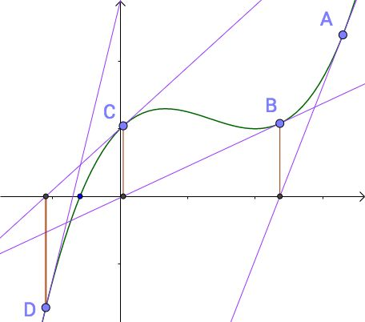

# 数据结构与算法学习笔记—查找

## 二分查找

从一堆数中查找某个数是否存在，有两种思路：

- 遍历所有的数，判断该数是否存在，时间复杂度为$O(n)$。
- 二分查找：将数按从小到大排序后，从中间点开始判断，如果与中间点的值相等，则直存在；如果目标值小于中间值，在左半部分查找，否则在右半部分查找，当区间大小为0时，则完成查找。由于每次都排除了一半的元素，因此其空间复杂度计算为$N/{2^k}=1$，$k=log_2{N}$。

### 递归实现

```python
def binary_search_recursive(elements, target):
    return binary_search_recursive_internal(elements, 0, len(elements)-1, target)

def binary_search_recursive_internal(elements, low, high, target):
    if low>high:
        return -1

    middle = low + ((high - low) >> 1)
    if target == elements[middle]:
        return middle
    elif target<middle:
        return binary_search_recursive_internal(elements, low, middle-1, target)
    else:
        return binary_search_recursive_internal(elements ,middle+1, high, target)
```

### 非递归实现

非递归实现中有两点需要注意：

- 结束条件是`low<=high`，而不是`low<high`。
- 中间值`middle=low + ((high - low) >> 1)`，这样可以防止`high+low`溢出(Python不会，但类似C语言会出现溢出)。

```python
def binary_search_recursive(elements, target):
    low = 0
    high = len(elements) - 1
    while low <= high:
        # prevent low+high overflow
        middle = low + ((high - low) >> 1)
        if elements[middle] == target:
            return middle
        if target < elements[middle]:
            high = middle - 1
        else:
            low = middle + 1
    return -1
```

### 二分查找的缺陷

二分查找有两个缺陷：

- 依赖于顺序表，因此数据量不能太大，防止内存申请失败。
- 顺序表中存储的数据必须是有序的。如果频繁插入删除元素会导致排序耗时过多，因此只适用于数据变化不频繁的有序顺序表。

### 二分法变种

- 查找第一个值等于定值的元素：找到等于定值的元素时，如果前面还有等于定值的元素，则需要继续往前寻找。

  ```python
  def find_first_element(elements, target):
      low = 0
      high = len(elements) - 1
      while low <= high:
          middle = low + ((high - low) >> 1)
          if elements[middle] < target:
              low = middle + 1
          elif elements[middle] > target:
              high = middle - 1
          elif middle == 0 or (elements[middle - 1] != target):
              return middle
          else:
              high = middle - 1
      return -1
  ```

- 查找最后一个等于等值的元素：找到等于定值的元素时，如果后面还有等于定值的元素，则需要继续往后寻找。

  ```python
  def find_last_element(elements, target):
      low = 0
      high = len(elements) - 1
      while low <= high:
          middle = low + ((high - low) >> 1)
          if elements[middle] < target:
              low = middle + 1
          elif elements[middle] > target:
              high = middle - 1
          elif middle == len(elements)-1 or (elements[middle + 1] != target):
              return middle
          else:
              low = middle + 1
      return -1
  ```

- 查找第一个大于等于定值的元素：如果有相等的元素，则返回第一个元素的索引；否则返回第一个大于元素的索引，如果都是小于的元素，则返回`-1`。

  ```python
  def find_first_ge_element(elements, target):
      low = 0
      high = len(elements) - 1
      while low <= high:
          middle = low + ((high - low) >> 1)
          if elements[middle] < target:
              low = middle + 1
          elif middle == 0 or (elements[middle - 1] < target):
              return middle
          else:
              high = middle - 1
      return -1
  ```

- 查找第一个小于等于等值的元素：如果有相等的元素，则返回最后一个元素的索引；否则返回最后一个小于元素的索引，如果都是大于的元素，则返回`-1`。

  ```python
  def find_last_le_element(elements, target):
      low = 0
      high = len(elements) - 1
      while low <= high:
          middle = low + ((high - low) >> 1)
          if elements[middle] > target:
              high = middle - 1
          elif middle == len(elements) - 1 or (elements[middle + 1] > target):
              return middle
          else:
              low = middle + 1
      return -1
  ```

### 思考题

- 如何用编程实现“一个数的平方根”？精确到小数点后6位。
  - 计算一个数A的平方根和二分查找相同，如果$(\frac{A}{2})^2<num$，则说明其平方根在$[\frac{A}{2}^2,A]$之间，否则其平方根在$[0,\frac{A}{2}^2]$之间，通过多次计算逐步逼近，直到其精度满足。

    ```python
    def binary_sqrt(num):
        low = 0.0
        high = num
        middle = low + (high - low) / 2.0
        while abs(middle * middle - num) > 0.0000001:
            if middle * middle > num:
                high = middle
            else:
                low = middle
            middle = low + (high - low) / 2.0
        return middle
    ```

  - 牛顿迭代法：采用数学方法计算。
    
    求解$x^2=target$等价与求$f(x)=x^2-target$与X轴的交点。任取一点$x_1$，做$f(x_1)$关于x的切线，切线与X轴的交点为$x_2$，$f(x_2)$的值如果小于误差，则$x_2$为目标值的平方根；如果不满足，则在$x_2$处继续做切线$y=f(x_2)+f'(x_2)*(x-x_2)$，该切线与$x$轴的交点为$x_3=x_2-\frac{f(x_2)}{f'(x_2)}=\frac{1}{2}*(x_2+\frac{target}{x_2})$，通项公式为：$x_n=\frac{1}{2}*(x_{n-1}+\frac{target}{x_{n-1}})$，通过该交点通项公式逼近目标值的平方根。
    
    
    
    牛顿迭代法的实现：
    ```python
    def sort_newton(target):
        x = target * 1.0
        while abs(x * x - target) > 0.0000001:
            x = 0.5 * (x + target / x)
        return x
    ```

- 如何快速定位一个IP的归属地？

  通常归属地信息会按：`起始IP 结束IP 归属地`的格式进行存储，因此可以按将起始IP转换为32位整数，进行排序后，寻找最后一个起始IP小于等于定值的元素，如果IP在该区间内，则返回归属地信息，否则返回未找到。

- 给定一个循环有序数组，如何实现求值等于定值的二分法查找算法？

  以数组中间点为分区，则可将数组拆分为两部分：有序数组和循环有序数组。如果首元素小于中间点，则前半部分为有序数组，后半部分为循环有序数组；反之前半部分为循环有序数组，后半部分为有序数组。若元素在有序数组内，则采用二分查找；否则继续将循环有序数组部分进行拆分。

### 参考

- [极客时间 数据结构与算法之美](https://time.geekbang.org/column/article/42733)
- [如何通俗易懂地讲解牛顿迭代法求开方？数值分析？](<https://www.zhihu.com/question/20690553>)

## 跳表（空间换时间）

二分查找依赖于数组通过下标随机访问的特性，因此只能用数组来实现。如果对链表加以改造，能支持类似二分查找算法，这种链表叫跳表。

链表中查找一个元素的时间复杂度为$O(n)$，如果能为链表建立一个索引：每个两个元素，取数据值建立索引。查找元素时，先通过索引确定一个起始和结束范围，然后在这个范围内再进行遍历，通过这个操作能将遍历的次数减少一半，如果能构建多层的索引，则能减少更多的查找次数。这个方法就是跳表：


通过跳表能将查找元素的时间复杂度变为$logN$，在每层最多只遍历三个元素。跳表的空间复杂度为$O(n)$，但是通常索引只需存储关键数据和相关指针，当元素对象比索引大很多时，其空间占用几乎可以不计。

采用双向链表的跳表还能实现$O(logN)$内插入删除元素。频繁插入删除元素后会破坏索引的密度，因此必须对索引进行动态维护。跳表的索引维护是依靠随机函数维护的，当元素插入原始列表后，通过随机函数获取一个K值，然后将元素也插入第K层索引。

跳表与红黑树相比，最大的优点是能在$O(logN)$内定位到区间的起点。

## 散列表


## 哈希算法


