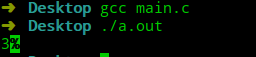
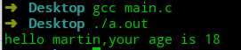

# 极简C语言教程 第13节 函数

前面我们已经使用了`printf`函数，这一节，我们就学习如何去创建一个函数，来让别人进行调用。

函数具备两大特点：

- 代码复用。
- 封装复杂度。

## 定义

在调用函数前必须对函数进行定义与声明，函数的定义规则为：

```c
返回值类型 函数名(参数声明){
    函数体
}
```

如果没有返回值，使用`void`作为函数的返回值类型；如果有返回值，则需要使用`return`语句返回相应类型的数据。

```c
#include <stdio.h>

int sum(int a,int b){
	return a+b;
}

int main(void) {
    printf("%d",sum(1,2));
}
```



`sum`函数定义中，标识符`a`和`b`是形式参数；调用时，函数传入实际的参数，这时标识符`a`和`b`指向的对象将进行初始化。

在定义函数时，有一点需要注意：函数不能返回数组。

- 如果函数的形参要求为数组，可以将形参声明为类似`int arr[]`形式，但是函数获取不到数组的长度，只能显示传入，具体原因请看数组和指针两节内容。
- 传入多维数组时，形参只能省略第一维度的长度。
- 返回值：`return 表达式;`
- 结束函数
  - `return`可以通过返回值来结束函数。
  - `stdlib.h`提供的`exit(数字);`，可以通过数字来表明结束的原因。

## 声明

在调用`printf`函数进行输出时，我们并没有在程序中，定义一个`printf`函数，而是通过`#include<stdio.h>`导入了`printf`函数的函数声明，这样我们就能将函数的定义与调用相隔离。

函数声明的格式为：`返回类型 函数名(形参)`。

```c
#include <stdio.h>
int sum(int a,int b);

int main(void) {
    printf("%d",sum(1,2));
}

int sum(int a,int b){
    return a+b;
}
```

函数声明还有一个作用：编译器能通过函数声明了解到函数的返回值类型，调用时需要传递多少个参数，每个参数的类型。通过函数声明获取信息，可以对函数传参进行检测，若类型不对，还能进行类型转换，因此也将函数声明称之为**函数原型**。

```c
#include <stdio.h>
int sum(int a,int b);

int main(void) {
    printf("%d",sum(1.0,2.0));
}

int sum(int a,int b){
    return a+b;
}
```


## 调用

调用函数时，需要传递给函数相应的参数，这些参数被称之为实参。

由于函数调用时，需要频繁的分配、释放空间，因此函数调用是在一块动态分配内存区域处理的，这段内存被称之为栈内存(其调用过程类似于栈，由于先调用的函数依赖与后进入的函数的结果，因此后调用的函数，反而需要先处理)。

调用函数时，会根据函数原型在动态分配区域分配合适的空间，然后将实参的值直接拷贝到分配的空间中(值传递)，因此在函数中对其修改是不会影响到实参的值。

## 变长参数表

我们刚刚介绍`sum`函数，其参数的个数是固定的，但是`printf`和`scanf`函数接受的参数个数是不确定的。

变长参数的函数的声明形式为：`返回值 函数名(参数,...)`，省略号表示参数表中参数的数量与类型是可变的。省略好只能出现在参数表的尾部，并且参数表中至少得有一个有名参数。通过`stdarg.h`中定义的宏，能够便利参数表。

- `va_list ap`：声明变量`ap`，该变量能依次引用各个参数。
- `va_start(ap,最后一个有名参数)`：将变量指向第一个无名参数。
- `va_arg(ap,类型)`：返回变量`ap`当前引用的参数，类型决定了返回的对象类型以及指向下一个参数需要移动的步长。
- `va_end(ap)`：执行清理操作。

我们在这里实现一个`printf`函数的简化版。

```c
#include <stdio.h>
#include <stdarg.h>
# include <stdlib.h>
void minprintf(char *format,...);
int main(void) {
    minprintf("hello %s,your age is %d","martin",18);
}

void minprintf(char *format,...){
    va_list ap;
    int ival;
    double dval;
    char *p,*sval,*cval,str[255];

    va_start(ap,format);
    for(p=format;*p!='\0';p++){
        if(*p!='%'){
            putchar(*p);
            continue;
        }
        switch(*++p){
            case 'd':
                ival=va_arg(ap, int);
                sprintf(str,"%d",ival);
                puts(str);
                break;
            case 'f':
                dval=va_arg(ap, double);
                sprintf(str,"%f",dval);
                puts(str);
                break;
            case 'c':
                cval=va_arg(ap, char *);
                putchar(*cval);
            case 's':
                for(sval=va_arg(ap, char *);*sval!='\0';sval++)
                    putchar(*sval);
                break;
            default:
                putchar(*p);
                break;
        }
    }
    va_end(ap);
}
```



## 总结

- 可以通过`return`和`exit`语句结束函数。
- 函数原型具备隔离定义与调用、传参检查的功能。
- 函数在调用时都是值传递。

---


