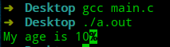
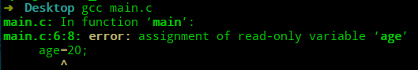

# 极简C语言教程—第2节 变量

## 前言

程序的实质是对数据的处理，在程序运行的过程中会出现两种数据：

- 临时数据。
- 直接写入的明确数据。

为了让后续的代码能使用到这些临时数据，因此必须在内存中将数据存储起来。内存采用16进制的地址来管理内存单元，这时会出现两个问题：

- 16进制的地址也不便于记忆。
- 程序每次运行时，不可能都使用固定的内存地址。

为了解决上面的问题，C语言使用一个标识符来建立与内存单元的映射，这样既可以动态分配内存，也能解决记忆问题。通常将这个标识符称作为**变量**，存储数据的存储单元中称之为**数据对象**。

不同的数据对象其占用的内存空间不同，因此在定义这些变量时，必须声明数据对象的类型。C语言的编译器根据类型来分配合适的内存空间，然后通过符号表记录标识符`sum`与这段内存空间的映射关系。对象的类型也决定了能对该对象执行的操作。

除了变量以外，C语言将直接写入的明确数据称之为**常量**。常量分为好几类：

- 数字常量(整数或小数)
- 字符常量(本质整数)
- 字符串常量
- 枚举常量(本质也是整数)

程序中的数字常量被称作为`magic number`，如果你不加以注释，可能过段时间，自己都难以想起其含义。面对`magic number`，可以在代码开始位置使用`#define 标识符 数字常量`，通过有意义的标识符来表明其含义。

```c
#include <stdio.h>
#define AGE 10

int main(void) {
    printf("My age is %d",AGE);
    return 0;
}
```



## 标识符

C语言中对标识符的命名是有要求的，标识符只能由字母、数字、下划线组成且不能由数字开头。此外还要求标识符不能和内置的标识符同名，因为编译器对关键字将会做特殊处理。下表为`C99`标准中的关键字节选。

| auto       | break    | case     |
| ---------- | -------- | -------- |
| char       | const    | continue |
| default    | do       | double   |
| else       | enum     | extern   |
| float      | for      | goto     |
| if         | inline   | int      |
| long       | register | restrict |
| return     | short    | signed   |
| sizeof     | static   | struct   |
| switch     | typedef  | union    |
| unsigned   | void     | volatile |
| while      | _Bool    | _Complex |
| _Imaginary |          |          |

通常的标识符命名的习惯是：

- 符号常量采用全大写，变量采用小写。
- 标识符的命名须有意义。
- 标识符的开头不要使用`_`，通常库的全局变量是下划线开头。

## 变量定义

所有变量必须先声明后使用(为什么我的标题是变量定义呢，因为定义变量一定会声明，但声明可不一定会定义变量，后面会学习到`extern`关键字)。

变量的定义格式为：`类型 变量名;`。

定义一个变量只会分配存储空间，其中存储的数据未知。因此最好在声明变量的同时对其显式初始化：`类型 变量名=初始化值;`。

```c
#include <stdio.h>

int main(void) {
    int age=10;
    printf("My age is %d",age);
    return 0;
}
```


如果在初始化变量时，采用了`const`关键字修饰，则意味着这个变量存储的值不能被修改。强制去修改其值的行为依赖于编译器的实现。

```c
#include <stdio.h>

int main(void) {
    const int age=10;
    printf("My age is %d",age);
    age=20;
    printf("My age is %d",age);
    return 0;
}
```




## 总结

- 变量定义将在内存中申请空间存储数据。
- `const`关键字保护变量存储的值不被修改。

----

