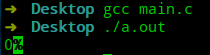

# 极简C语言教程—第2节 声明变量

在第一节中，我们实现了第一个C语言程序，也介绍了一个C语言程序的基本结构。在这一节中，将介绍如何去存储数据。

## 定义变量

在程序中，常常会有一些临时数据产生，这时就需要一些存储单元来存储这些临时数据，C语言中将这些存储单元名称称之为变量，将用于存储数据的存储单元称之为数据对象。不同类型的变量，需要的内存空间也不同，因此在创建这些变量时，必须告知系统其类型。

定义变量的格式为：`变量类型 标识符;`，如`int sum;`，这里的`int`类型为C语言自带的整数类型，将在第三节进行讲解。

通过语句`int sum;`，C语言的编译器会在内存中根据类型`int`的大小，分配合适的内存空间，通过一个表格记录标识符`sum`与这段内存空间的映射关系，这个表格通常被称之为符号表。

符号表通过Key-Value的形式存储标识符和内存空间的关系，以标识符作为Key，内存空间的信息作为Value。

C语言中对标识符的命名是有要求的，标识符只能由字母、数字、下划线组成且不能由数字开头。C语言中要求标识符不能和内置的标识符同名，因为编译器对关键字将会做特殊处理。下表为`C99`标准中的关键字。

| auto       | break    | case     |
| ---------- | -------- | -------- |
| char       | const    | continue |
| default    | do       | double   |
| else       | enum     | extern   |
| float      | for      | goto     |
| if         | inline   | int      |
| long       | register | restrict |
| return     | short    | signed   |
| sizeof     | static   | struct   |
| switch     | typedef  | union    |
| unsigned   | void     | volatile |
| while      | _Bool    | _Complex |
| _Imaginary |          |          |

## 变量赋值

定义一个变量后，我们能对其做很多操作，在这一小节中，将介绍几种对变量的操作。

- 赋值：`sum=0;`，将在`sum`指向的内存中存储数字`0`。
- 初始化：定义变量和对变量赋值写在同一个语句中，如：`int sum=0`。这里需要注意的是，定义变量时，编译器不会做变量初始化操作，因此如果没有赋值，这段内存空间中存储的值是之前这段内存空间中存储的数据(现在好多编译器都为基础类型自动初始化了)。

```c
#include <stdio.h>

int main(void) {
    int sum;
    printf("%d",sum);
    return 0;
}
```



## 总结

- 通过变量定义可以自动在内存中申请空间存储数据。
- 通过变量赋值可以将数据存储到相应内存空间中。

----

