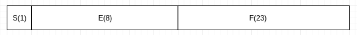
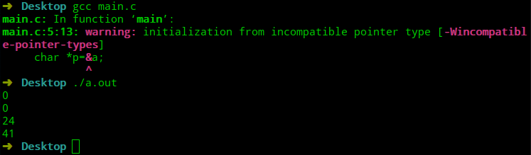
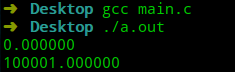
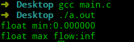

# 极简C语言教程—第5节  浮点型

上一节为大家介绍C语言存储整数，这一节我们将一起学习二进制下如何表达小数，C语言中将小数称之为浮点数，下文中将使用浮点数替代小数。

## 二进制下的浮点型

二进制中浮点数的表达和整数表达类似，`1001`表达的浮点数为：
$$
1*2^-1+0*2^-2+0*2^-3+1*2^-4=0.5625
$$

这里面会出现一个问题，二进制下表达的浮点数是由$2^{-n}$求和而来，因此其不能准确的表达所有的浮点数，只能表达近似值。

## C语言中浮点数的表达

C语言中浮点数采用`IEEE 754`标准来表达二进制浮点数，由3部分组成(以float型为例)：

- 数符`S`：表达浮点数正负，占1位。
- 阶码`E`：表达指数部分，占8位，阶码=阶码真值+127，阶码的实质是确定小数点的位置。
- 尾数`F`：表达小数部分，占23位，尾数真值=1+尾数，用于表达二进制下的有效数字。

其内存结构为：



其二进制的浮点数到二进制的转换公式为：
$$
二进制浮点数={(-1)^S*(1+F)}*2^{E-127}
$$

举个例子：十进制下的10.25转换为二进制存储。

- 十进制转换为二进制：$(10.25)_{10}=(1010.01)_2$。
- 规格化：$(1010.01)_2=(1.01001*2^3)_2$
- 数符：$S=0$，阶码:$E=(3+127)_{10}=(10000010)_2$，数符：$F=01001000000000000000000$
- 二进制存储：$(01000001001001000000000000000000)_2=(0X41240000)_{16}$

标准中规定了3个特殊值：

- 指数与小数为同时为`0`，其表达的数为`0`。
- 若指数位为$2^{E}-1$，且小数部分为`0`，则表达$\pm \infty$。
- 若指数位为$2^{E}-1$，且小数部分不为`0`，则表达`NaN`(不是一个数)。

这里解释一下两个问题？为什么阶码要有偏移量？为什么阶码的偏移量为127？

- 阶码为什么会有偏移量？

设置阶码偏移量的原因是为了简化浮点数的比较。浮点数中有两个符号位：阶符(阶码符号)和数符，数符位不能避免，但阶符可以避免，阶数如果采用无符号正数存储，则可以直接进行二进制的比较(阶数大则值大)。

- 阶码的偏移量为什么是127？

标准中的通过将阶码全设置为0或全设置为1表达特殊值，所以阶码的变化范围为：`1~254`，其阶码真值表达范围：`-126~127`，所以阶码偏移量为127。

## 浮点类型

- C语言中的浮点类型

| 类型          | 长度                 | 描述                                            |
| ------------- | -------------------- | ----------------------------------------------- |
| `float`       | 32位                 | 符号占1位，指数占8位，尾数占23位，精度6个数字   |
| `double`      | 64位                 | 符号占1位，指数占11位，尾数占52位，精度15个数字 |
| `long double` | 具体长度由编译器与系统决定 |                                                 |

- 浮点常量：默认为double类型存储，如果只需要`float`，以`F`结尾，若需要`long double`，以`L`结尾。
## 验证
这里验证一下C语言存储`float`类型数据是否符合`IEEE 754`标准。
```c
#include <stdio.h>

int main(void) {
    float a=10.25F;
    char *p=&a;
    printf("%x\n",*p);
    printf("%x\n",*(p+1));
    printf("%x\n",*(p+2));
    printf("%x\n",*(p+3));
}
```
我的输出结果为`0 0 24 41`，另一种输出结果`41 24 0 0`。出现这个现象的原因是数据存放顺序有大端与小端之分(大端：高位先在低内存地址位置存储，小端：低位先在低内存地址位置存储)。



## 精度

先看一个简单的精度问题：

```c
#include <stdio.h>

int main(void) {
    float a=1.0e10+1.0;
    float b=1.0e5+1.0;
    printf("%f\n",a-1.0e10);
    printf("%f\n",b);
}
```



为什么最后的结果不是`1.0`呢？这是因为`float`的精度为6个有效数字，而我们的`2.0E20+1.0`是对第21位操作，因此`float`类型的数字只能按指数比例将其放缩。

## 溢出

- 上溢：变为`inf`(无穷大)。
- 下溢：将会损失精度，直到为`0.0`。

```c
#include <stdio.h>
#include <float.h>

int main(void) {
    double min_d=DBL_MIN;
    double max_d=DBL_MAX;
    printf("float min:%f\n",min_d/2);
    printf("float max flow:%f\n",max_d*2);
}
```



## 总结

- C语言中的浮点数只能存储近似值，且有精度限制。
- 上溢将变为`inf`。
- 下溢将会损失精度。

------


