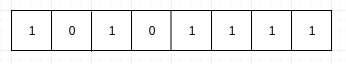
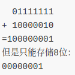

# 极简C语言教程—第4节  整型

第4节和第5节将为大家介绍C语言是如何存储数字的，这一节将为大家介绍C语言存储整数，通常我们将整数统称为整数类型，简称**整型**。

## 内存结构

在开始介绍整型之前，我们先看下内存是如何存储数据的。

- 位：计算机中最小的存储单元，只能存储`0`或`1`。
- 字节：计算机中常见的存储单元，1个字节为8位。



由于设计问题，通常情况下的内存存储数据是通过二进制进行存储的，通过用若干位`0`或`1`来表达数字。现在计算下上图中的存储的数字：

$$
1*2^7+0*2^6+1*2^5+0*2^4+1*2^3+1*2^2+1*2^1+1*2^0=175
$$

## 整型的符号

为了能在二进制中去存储正负数，C语言将用于存储整型的内存中最左边的一位视作为符号位，为`0`则视作为正数，为`1`视作为负数(为了方便表示二进制，采用`0b`作为前缀进行标识)。

上面的设计方案，能表达`-127～+127`，但是会存在两个`0`：$+0==0b00000000$与$-0==0b10000000$，为了压榨计算机的每一滴血，天才般的设计师们想出了**补码**这一解决方案：

- 正数：正数的表达方式不变，$127==0b01111111$。
- 负数：先将负数当做正数处理，然后按位取反(`0`变`1`,`1`变`0`)，最后再加`1`则为负数的补码，$-127==0b10000001$
- 通过补码方案，$-0==0b11111111+1==0b00000000==+0$。

C语言中存储有符号类型和无符号类型，在无符号类型中，符号位也将用作于存储值。

- 有符号类型：用`signed`标识。
- 无符号类型：用`unsigned`标识。

## 整数类型

C语言为了更好的利用空间，提供了表达值范围不同的整型类型，这些类型的具体长度依赖于具体的环境。

- 短整型：`short int`，至少两个字节。
- 整型：`int`
- 长整型：`long int`，至少4个字节。

由于C99标准中并没有规定每种类型的长度，只规定：$short \ int \leq int \leq long \ int$。但是我们可以通过`limits.h`查看每个类型的最小值、最大值。

```c
#include<stdio.h>
#include<limits.h>

int main(void){
    printf("signed short int min:%ld\n",SHRT_MIN);
    printf("signed short int max:%ld\n",SHRT_MAX);
    printf("unsigned short int max:%ld\n",USHRT_MAX);

    printf("signed int min:%ld\n",INT_MIN);
    printf("signed int max:%ld\n",INT_MAX);

    printf("signed long int min:%ld\n",LONG_MIN);
    printf("signed long int max:%ld\n",LONG_MAX);
}
```

C语言不仅仅提供了十进制来表达整型常量，还额外提供了三种进制的表达。

- 二进制：以`0b`开头，如：`0b10101111`。
- 八进制：以数字`0`开头，如：`0731`。
- 十六进制：以`0x`开头，如：`0x12`。

```c
#include<stdio.h>
#include<limits.h>

int main(void){
    printf("Binary:%ld\n",0b10101111);
    printf("Octal:%ld\n",0731);
    printf("Hexadecimal:%ld\n",0x12);
}
```

在存储整型常量时，编译器通过如下次序对整型常量进行尝试存储：

$$int\rightarrow unsigned \ int \rightarrow long\ int \rightarrow unsigned\ long \ int \rightarrow long\ long\ int \rightarrow unsigned\ long\ long int$$

因此如果你想要编译器将整型常量当长整型处理，可以直接使用`L`作为整型常量的结尾；如果想当做无符号数处理，使用`U`结尾。如`123LU`，编译器将会把`123`当做无符号长整型处理。

## 字符类型

C语言中，字符实际上是数字，其存储的是字符集中，该字符的编码，如ASCII码中，`97`代表字符`a`。

字符类型在C语言中使用`char`表示，其长度为一个字节。
```c
#include <stdio.h>

int main(void) {
    printf("%c\n", 'a');
    printf("%c\n", 97);
}
```

## 溢出

整型中，每种类型都是由一定的表达范围，让数值大于或小于能存储的范围时，就会出现溢出。这里用`char`类型来举例讲解。

在分析过程中，大家要牢记，`char`类型只占一个字节。



```c
#include<stdio.h>
#include<limits.h>

int main(void){
    unsigned short int ushort_min=0;
    unsigned short int ushort_max=USHRT_MAX;
    short int short_min=SHRT_MIN;
    short int short_max=SHRT_MAX;
    ushort_min-=1;
    ushort_max+=1;
    short_min-=1;
    short_max+=1;
    printf("signed short int min overflow:%ld\n",short_min);
    printf("signed short int max overflow:%ld\n",short_max);
    printf("unsigned short int min overflow:%ld\n",ushort_min);
    printf("unsigned short int max overflow:%ld\n",ushort_max);
}
```

## 总结

- `signed`表示有符号数，`unsigned`表示无符号数。
- 整型分`short int`、`int`、`long int`、`long long int`。
- 字符通过`char`类型表示。
- 溢出采用二进制进行分析。

----


