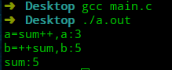
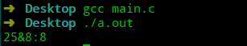
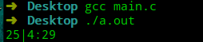
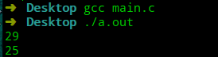
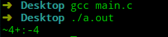
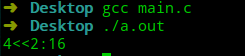
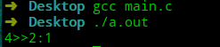
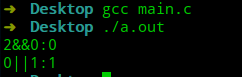
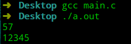
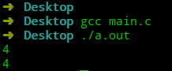

# 极简C语言教程—第5节 运算符

## 前言

前面提到：程序的实质是对数据的处理。变量一节中已经解决了数据的表现形式：即变量或常量，这一节将解释C语言如何对数据进行处理。数据处理的本质是进行数学运算，C语言中通过运算符来表达数学运算。

C语言中的运算符主要分为两大类：

- 数值运算：算术运算符、位运算符。
- 逻辑运算：关系运算符、逻辑运算符。

数值运算符用于进行加、减、乘、除等操作；逻辑运算用于构建逻辑表达式，即表达真或假(布尔量)。

C语言中提供三种方式表达布尔量：

- `0`为`false`，非`0`为`true`。
- 布尔类型`_Bool`，只能为其赋值`0`或`1`。
- `stdbool.h`提供`bool`宏，代替`_Bool`，另外也提供`true`和`false`的宏。

## 算术运算符

- 加法：`a+b`。
- 减法：`a-b`。
- 乘法：`a*b`。
- 除法：`a/b`，除法中需要注意的一点是，若为整数除法，则会执行舍位运算(丢弃小数位)。
- 取余：`a%b`。计算`a`除`b`的余数。

## 自增运算符、自减运算符

- 自增运算符：`++`，用于变量自增`1`。
- 自减运算符：`--`，用于变量自减`1`。
- 前缀运算符，会先改变值，再使用变量的值；后缀运算符，先使用其变量的值，再修改变量值。二者最终对变量的修改相同。

```c
#include <stdio.h>

int main(void) {
    int sum=3;
    int a=0;
    int b=0;
    // a=3
    // 等价于a=sum;sum=sum+1;
    a=sum++;
    // b=5
    // 等价于sum=sum+1;b=sum;
    b=++sum;
    printf("a=sum++,a:%d\n",a);
    printf("b=++sum,b:%d\n",b);
    printf("sum:%d\n",sum);
}
```



## 位运算符

C语言提供位运算符对整数执行二进制形式下操作。

- 按位与：`&`。与运算的运算法则：`1&1=1,0&0=0,1&0=0,0&1=0`。

```c
#include <stdio.h>

int main(void) {
    //0b11001&0b1000=0b01000
    printf("25&8:%d\n",25&8);
}
```

由于与运算具备`0&1=0,1&1=1`，因此可以将第二个操作数的相应位设置为`1`，其他位设置为`0`，可以从第一个操作数过滤出想要的二进制位。在计算机网络中，使用`ip`地址与子网掩码进行按位与，可以获得`ip`的网络号。

	

- 按位或：`|`。或运算的运算法则：`1|1=1,1|0=1,0|1=1,0|0=0`

```c
#include <stdio.h>

int main(void) {
    //0b11001&0b100=0b11101
    printf("25|4:%d\n",25|4);
}
```

或运算中，其具备有`1`则为`1`的特性。常用于将某些位设置为1。



- 按位异或：`^`。异或运算的运算法则：`1^1=0,0^0=0,1^0=1,0^1=1`。

```c
#include <stdio.h>

int main(void) {

    int a=25;
    a=a^4;
    //0b11001^0b100=0b11101
    printf("%d\n",a);
    //0b11101^0b100=0b11001
    a=a^4;
    printf("%d\n",a);
}
```

异或运算中，可以通过将第二个操作数相应的二进制位设置为`1`，从而实现将第一个操作数的相应位取反。



- 按位求反：`~`，求反的运算法则：`~0=1`，常用于求反码。

```c
#include <stdio.h>

int main(void) {
    // 补码中，-4=4的反码+1
    printf("~4+:%d\n",~4+1);
}
```



- 左移：`<<`，二进制形式下往左移动，左移`n`位等价于乘$2^n$。

```c
#include <stdio.h>

int main(void) {
    //0b100<<2=0b10000
    printf("4<<2:%d\n",4<<2);
}
```



- 右移：`>>`，二进制形式下往右移动，右移`n`位等价于除$2^n$。

```c
#include <stdio.h>

int main(void) {
    //0b100>>2=0b001
    printf("4>>2:%d\n",4>>2);
}
```



## 赋值运算符

在赋值表达式中，如果是对变量自身进行运算后再赋值给该变量：`a=a+1`，则可以简化为`a+=1`。

支持赋值运算符的运算符有：`+、-、*、/、%、>>、<<、&、|、^`。

## 关系运算符

| 符号 | 含义     |
| ---- | -------- |
| `==` | 等于     |
| `!=` | 不等于   |
| `<`  | 小于     |
| `<=` | 小于等于 |
| `>`  | 大于     |
| `>=` | 大于等于 |

## 逻辑运算符

| 符号 | 含义 |
| ---- | ---- |
| `&&` | 且   |
| `||` | 或   |
| `！` | 非   |

逻辑运算符`&&`和`||`对操作数执行短路运算(如果左值能推导出整个表达式的结果，则不会再对右操作数进行计算)。关系运算符与逻辑运算符产生的结果为`0`或`1`。

- 或：有真则为真。
- 且：有假则为假。

```c
#include <stdio.h>

int main(void) {
    int a = 2 && 0;
    int b = 0 || 1;
    printf("2&&0:%d\n", a);
    printf("0||1:%d\n", b);
}
```



## 类型转换

当一个运算符的两个操作数是不同类型时，需要将其转换为相同的类型进行计算，通常是将表达范围小的类型转换为表达式范围大的类型(这样数据不会丢失)。

在将`char`类型的转换为`int`类型时需要注意，C语言没有规定`char`类型是否有符号，只保证在标准打印字符集中的字符不会为负值。因此如果想要使用`char`类型存储非字符数据，请指定`signed`或`unsigned`。

C语言的类型转换有两种：隐式类型转换、强制类型转换。

隐式类型转换主要出现了两种情况：算术运算时，将通常是将表达范围小的类型转换为表达式范围大的类型；函数传参时，如果函数原型中没有指定，则默认转换为`int`或`double`，有函数原型，则转换为目标类型。

强制类型转换的格式为：`(类型) 表达式`，通过该转换，能根据表达式的值生成指定类型的值。

```c
#include <stdio.h>

int main(void) {
    int a=12345;
    printf("%d\n",(char) a);
    printf("%d\n",a);
}
```



## 求对象或类型内存空间

`sizeof`运算符可以求变量所指向对象或类型的所占内存空间大小，其以字节为单位，返回`size_t`类型的数字(`size_t`类型是无符号整数类型)，`printf`函数能通过`%zd`或`%lu`转换说明显示`size_t`的值。

```c
#include <stdio.h>

int main(void) {
    int sum;
    printf("%zd\n", sizeof(sum));
    printf("%lu\n", sizeof(int));
    return 0;
}
```



## 优先级

不同的运算符之间拥有不同的优先级，但是我不打算介绍，如果你想了解，请自行搜索。

不介绍运算符的优先级的原因是：不要过度依赖优先级，因为你很有可能会记错，最好的方式是通过括号来表达哪部分先运算，哪部分后运算。

## 总结

- 赋值运算符可以简化算术运算符、位运算符。
- 关系运算符与逻辑运算符能构建逻辑表达式。
- 为了更好的可读性，不要依赖隐式类型转换。
- 通过`sizeof`可以查看对象或类型所占的内存空间。
- 使用括号替代默认优先级。
------


