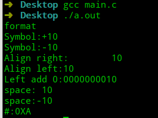
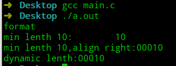
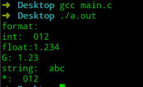
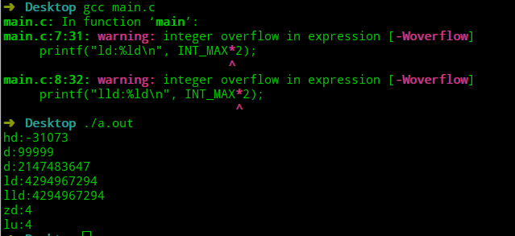
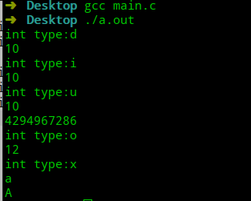
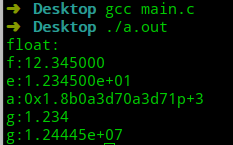
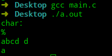
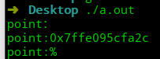
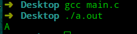

# 极简C语言教程—第6节 格式化输出

## 前言

在介绍整型与浮点型时，`printf`函数中出现了`%d`、`%f`等字符。前面章节没有解释这些字符的含义，这一节将系统解释C语言中的格式化输出。

头文件`stdio.h`定义了很多与输入、输出相关的函数。通过`printf`函数，我们能在标准输出流(`stdout`：显示器)上写入想要的信息。先介绍一下`printf`的函数声明：`printf(const char * restrict format,...)`。

`printf`函数通过`format`参数指定输出格式。`format`中，有两种对象：普通字符与转换说明符，输出时，普通字符将原样输出。转换说明符用于控制`printf`参数的转换与打印，转换说明符通过占位符`%`来指定。

`printf`的转换说明符格式为：`%[标志符][m].[n][长度修饰符][转换说明符]`

## 标识符

- 标识符
  - `+`：显示正负。
  - `-`：左对齐，默认为右对齐。
  - `0`：当输出结果的长度小于`m`时，以0填充。
  - `空格`：显示正负且用空格替换`+`。
  - `#`：配合转换说明符，输出相应的格式。

```c
#include <stdio.h>

int main(void) {
    printf("format\n");
    printf("Symbol:%+d\n", 10);
    printf("Symbol:%+d\n", -10);
    printf("Align right:%10d\n", 10);
    printf("Align left:%-10d\n", 10);
    printf("Left add 0:%010d\n", 10);
    printf("space:% d\n", 10);
    printf("space:% d\n", -10);
    printf("#:%#X\n", 10);
}
```



## 最小长度`m`

- 指定输出内容的最小长度，默认用空格补齐。
- 右对齐时也可指定用`0`补齐。
- 使用`*`，通过参数，动态指定。

```c
#include <stdio.h>

int main(void) {
    printf("format\n");
    printf("min lenth 10:%10d\n", 10);
    printf("min lenth 10,align right:%05d\n", 10);
    printf("dynamic lenth:%0*d\n", 5, 10);
}
```



## 精度`n`

- 针对整型(`d、i、o、u、x、X`)：最小位数。
- 针对浮点型(`f、F、a、A、e、E`)：为小数点后位数。
- 针对`G、g`：有效数字个数。
- 字符串：最大输出字符个数。
- `*`：通过参数，动态指定。

```c
#include <stdio.h>

int main(void) {
    printf("format:\n");
    printf("int:%5.3d\n", 12);
    printf("float:%5.3f\n", 1.2345);
    printf("G:%5.3g\n", 1.2345);
    printf("string:%5.3s\n", "abcdf");
    printf("*:%5.*d\n", 3, 12);
}
```



## 长度修饰符

长度修饰符必须结合转换说明符使用。

- `h`：添加`short`修饰符，整型转换说明符。
- `L`：添加`long`修饰符，能搭配浮点类型和整型转换说明符。
- `ll`：添加`long long`修饰符，能搭配浮点类型和整型转换说明符。
- `z`：结合整型转换说明符，用于输出`size_t`类型数据(`sizeof`的返回值)。如果编译器不支持，可用`lu`替换。

```c
#include <stdio.h>
#include <limits.h>
int main(void) {
    printf("hd:%hd\n", 99999);
    printf("d:%d\n", 99999);
    printf("d:%d\n", INT_MAX);
    printf("ld:%ld\n", INT_MAX*2);
    printf("lld:%ld\n", INT_MAX*2);
    printf("zd:%zd\n", sizeof(int));
    printf("lu:%lu\n", sizeof(int));
}
```



## 转换说明符

通过转换说明符可以指示变量的类型。

- 整型
  - `d、i`：十进制。
  - `u`：无符号十进制。
  - `o`：八进制。
  - `x、X`：十六进制。

```c
#include <stdio.h>

int main(void) {
	printf("int type:d\n");
    printf("%d\n", 10);

    printf("int type:i\n");
    printf("%i\n", 10);

    printf("int type:u\n");
    printf("%u\n", 10);
    // 不会输出-10，而是-10的溢出值
	printf("%u\n", -10);
    
    printf("int type:o\n");
    printf("%o\n", 10);

    printf("int type:x\n");
    printf("%x\n", 10);
    printf("%X\n", 10);
}
```



- 浮点类型
  - `f、F`：`double`类型的浮点数，也支持`float`。
  - `e、E`：十进制科学计数法。
  - `a、A`：十六进制科学计数法。
  - `g、G`：自动选择`F`或`E`。

```c
#include <stdio.h>

int main(void) {
	printf("float:\n");
    printf("f:%f\n", 12.345);
    printf("e:%e\n", 12.345);
    printf("a:%a\n", 12.345);
    printf("g:%g\n", 1.234);
    printf("g:%g\n", 12444456.34544444);
}
```



- 字符类型
  - `%`：输出`%`。
  - `s`：字符串。
  - `c`：字符

```c
#include <stdio.h>

int main(void) {
    printf("char：\n");
    printf("%%\n");
    printf("%s\n", "abcd d");
    printf("%c\n", 'a');
}
```



- 指针地址`p`

```c
#include <stdio.h>

int main(void) {
    printf("point：\n");
    int m;
    printf("point:%p\n", &m);
    // %z 不一定每个编译器都支持
    printf("point:%z\n", sizeof(int));
}
```



## 转换类型不匹配

在介绍`float`类型数据存储时，我使用了`char`类型来打印`float`的每个字节，这里就涉及到了转换类型不匹配。

数据在内存中存储时是没有类型的，只有二进制形式。所有的类型都是人为指定的规则导致的，因此如果你的转换类型不匹配时，将按照指定的类型来转换。

```c
#include <stdio.h>

int main(void) {
    int a=65;
    printf("%c\n", a);
}
```



## 总结

- 格式化输出`format`的格式为：`%[标志符][m].[n][长度修饰符][转换说明符]`。
- 类型不匹配时，将按指定的类型进行转换。

----


