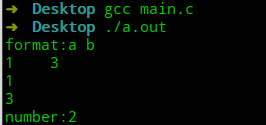
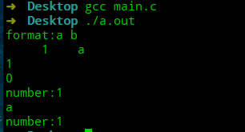
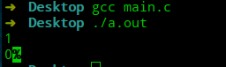
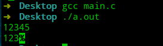
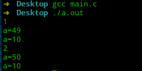

# 极简C语言教程—第7节 格式化输入

在上一节中，我们学习了如何通过`format`来指定格式，在屏幕上显示需要的信息。与之对应，`stdio.h`提供`scanf`函数从标准输入流(`stdin`：键盘)读取输入内容，并通过提供的格式化字符串将输入转换为目标数据。先介绍一下`scanf`的函数声明：`scanf(const char * restrict format,...)`。先简单看一个示例：

```c
#include <stdio.h>

int main(void) {
    printf("format:a b\n");
    int a,b,c;
    // &a的作用后续章节会进行讲解
    c=scanf("%d %d", &a,&b);
    printf("%d\n", a);
    printf("%d\n", b);
    printf("number:%d\n", c);
}
```



我们向`scanf`函数传递`format`用于进行格式匹配，然后`scanf`将占位符匹配到的数据转换为目标格式并存储到指定位置，`scanf`会返回读入的数据项个数。

这里有几点需要注意的是：

- 会跳过开始的空白字符。
- 空白字符能匹配>=0个空白字符。
- 当不匹配时(`%s`：只能匹配非空白字符`)，将把不匹配的字符放回输入流中，并返回读入字符数。
- 非空白字符，要求输入流中有字符相匹配。

```c
#include <stdio.h>

int main(void) {
    printf("format:a b\n");
    int a,b,c;
    b=0;
    char d;
    // 输入的时候，我们输入 1   a
    // 故障构造匹配失败
    c=scanf("%d %d", &a,&b);
    printf("%d\n", a);
    printf("%d\n", b);
    printf("number:%d\n", c);
    // 重新读入数据项个数
    c=scanf("%c", &d);
    printf("%c\n", d);
    printf("number:%d\n", c);
}
```



## format

`format`的格式为：`%[最大长度][长度修饰符][转换说明符]`

- 赋值屏蔽：`*`，读入但不进行赋值。

```c
#include <stdio.h>

int main(void) {
    int a=0;
    scanf("%*d",&a);
    printf("%d",a);
}
```



- 最大长度：限制匹配的最大读取字符数(刚开始空白不算)。

```c
#include <stdio.h>

int main(void) {
    int a=0;
    scanf("%3d",&a);
    printf("%d",a);
}
```



- 转换说明符：同`printf`，只有几个需要特殊说明一下。
  - `[]`提供匹配字符。
  - `[^]`：提供不匹配的字符。

```c
#include <stdio.h>

int main(void) {
    int a=0;
    // 只匹配字符1、2、3
    scanf("%[123]",&a);
    printf("%d",a);
}
```

![格式化输入-[]用法](图片/格式化输入-[]用法.png)

## 缓冲区问题

使用`scanf`时，如果出现输入换行，会出现一个缓冲区问题，即换行符`\n`的匹配。

```c
#include <stdio.h>
int main()
{
    char a;
    int i=0;
    for(;i<4;i++){
    scanf("%c",&a);
    printf("a=%d\n",a);
	}
}
```



## 总结

- `scanf`通过`format`对输入信息进行数据匹配，然后进行转换。
- `[]`能提供可以匹配的字符。
- `scanf`输入换行时，可能会存在`\n`的匹配问题。

---

