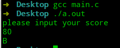
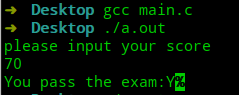
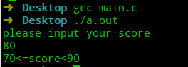

# 极简C语言教程—第8节 选择

## 前言

C语言提供`if`语句和`switch`语句进行条件选择。条件选择的核心是构建逻辑表达式，根据逻辑表达式的真假，执行相应的代码块。

## if语句

`if`语句用于当逻辑表达式为真时，执行所属代码块。`if`语句可以和`else if`、`else`一起使用，进行复杂条件判断。其格式为：

```c
if(表达式1){
// 如果表达式1为真，则执行语句块1
    语句块1
}else if(表达式2){
// 如果不满足表达式1但满足表达式2，执行语句块2
    语句块2
}else{
// 如果表达式1、表达式2都不满足，则执行语句块3
	语句块3
}
```

格式中用`{}`用于表达一个语句块，如果没有`{}`，则只执行到第一个`;`。

```c
#include <stdio.h>

int main(void) {
    printf("please input your score\n");
    int score = -1;
    scanf("%d", &score);
    if (score >= 90)
        printf("A\n");
    else if (score >= 70)
        printf("B\n");
    else if (score >= 60)
        printf("C\n");
    else
        printf("D\n");
}
```



C语言还提供了条件表达式来简化`if 表达式1 表达式2 else 表达式3 `。其格式为`表达式1?表达式2:表达式3`，如果表达式1为真，则执行表达式2，否则执行表达式3。

```c
#include <stdio.h>

int main(void) {
    printf("please input your score\n");
    char result;
    int score;
    scanf("%d", &score);
    result = score >= 60 ? 'Y' : 'N';
    printf("You pass the exam:%c", result);
}
```



## switch

`switch`语句用于判断表达式是否与一些常量整数值中某个值相匹配，并执行相应的分支语句。

```c
switch(表达式){
    case 值1:语句1;break;
    case 值2:语句2;break;
    default:
        语句5；
        break;
}
```
`switch`语句会将表达式的值与`case`后的值相比较，如果相等，则执行后面的语句，一直到遇到`break`或执行完毕为止。
```c
#include <stdio.h>

int main(void) {
    printf("please input your score\n");
    int score = -1;
    scanf("%d", &score);
    char stand;
    if (score >= 90)
        stand = 'A';
    else if (score >= 70)
        stand = 'B';
    else if (score >= 60)
        stand = 'C';
    else
        stand = 'D';

    switch (stand) {
        case 'A':
            printf("score>=90\n");
            break;
        case 'B':
            printf("70<=score<90\n");
            break;
        case 'C':
            printf("60<=score<70\n");
            break;
        default:
            printf("score<60\n");
            break;
    }
}
```

需要注意的是`case`中的值只能为整数常量。



## 总结

- `if`语句配合逻辑表达式，选择性执行代码。
- `switch`用于与多个常量进行等值比较。

---


