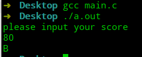
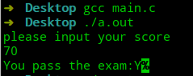

# 极简C语言教程—第9节 循环

C语言中的`for`语句、`while`语句和`do while`语句能将语句块重复执行。这一节将一一介绍这三种语句。

## 逻辑表达式

在C语言中，可以使用关系运算符与逻辑运算符构建逻辑表达式。

- 关系运算符

| 符号 | 含义     |
| ---- | -------- |
| `==` | 等于     |
| `!=` | 不等于   |
| `<`  | 小于     |
| `<=` | 小于等于 |
| `>`  | 大于     |
| `>=` | 大于等于 |

- 逻辑运算符

| 符号 | 含义 |
| ---- | ---- |
| `&&` | 且   |
| `||` | 或   |
| `！` | 非   |

关系表达符与逻辑运算符产生的结果为`0`或`1`.并且，逻辑运算符`&&`和`||`对操作数执行短路运算(如果左值能推导出整个表达式的结果，则不会再对右操作数进行计算)。

- 或：有真则为真。
- 且：有假则为假。

```c
#include <stdio.h>

int main(void) {
    int a = 2 && 0;
    int b = 0 || 1;
    printf("2&&0:%d\n", a);
    printf("0||1:%d\n", b);
}
```


## if

`if`语句用于当逻辑表达式为真时，执行所属代码块，但是其可以和`else if`、`else`一起使用，进行复杂条件判断。其格式为：

```c
if(表达式1){
// 如果表达式1为真，则执行语句块1
    语句块1
}else if(表达式2){
// 如果不满足表达式1但满足表达式2，执行语句块2
    语句块2
}else{
// 如果表达式1、表达式2都不满足，则执行语句块3
	语句块3
}
```

格式中用`{}`用于表明多个语句为一个整体，为一个语句块，如果没有`{}`，则只执行到第一个`;`。

```c
#include <stdio.h>

int main(void) {
    printf("please input your score\n");
    int score = -1;
    scanf("%d", &score);
    if (score >= 90)
        printf("A\n");
    else if (score >= 70)
        printf("B\n");
    else if (score >= 60)
        printf("C\n");
    else
        printf("D\n");
}
```



C语言还提供了条件表达式来简化`if 表达式1 表达式2 else 表达式3 `。其格式为`表达式1?表达式2:表达式3`，如果表达式1为真，则执行表达式2，否则执行表达式3。

```c
#include <stdio.h>

int main(void) {
    printf("please input your score\n");
    char result;
    int score;
    scanf("%d", &score);
    result=score>=60?'Y':'N';
    printf("You pass the exam:%c",result); 
}
```



## switch

如果要将表达式与一系列的值做等值比较时，除了`if`语句，还能使用`switch`语句。

```c
switch(表达式){
    case 值1:语句1;break;
    case 值2:语句2;break;
    default:
        语句5；
        break;
}
```
`switch`语句会将表达式的值与`case`后的值相比较，如果相等，则执行后面的语句，一直到遇到`break`或执行完毕为止。
```c
#include <stdio.h>

int main(void) {
    printf("please input your score\n");
    int score = -1;
    scanf("%d", &score);
    char stand;
    if (score >= 90)
        stand = 'A';
    else if (score >= 70)
        stand = 'B';
    else if (score >= 60)
        stand = 'C';
    else
        stand = 'D';

    switch (stand) {
        case 'A':
            printf("score>=90\n");
            break;
        case 'B':
            printf("70<=score<90\n");
            break;
        case 'C':
            printf("60<=score<70\n");
            break;
        default:
            printf("score<60\n");
            break;
    }
}
```

需要注意的是`case`中的值只能为整数。

## 总结

- 逻辑表达式中，将`0`视作为假，非`0`的数视作为真。
- `if`语句配合逻辑表达式，选择性执行代码。
- `switch`用于与多个值进行等值比较。

---

