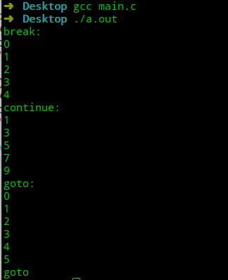

# 极简C语言教程—第9节 循环

## 前言

C语言中提供三种语句用于重复执行语句块：

- `for`语句。
- `while`语句。
- `do while`语句。

## for

`for`语句的格式为：

```c
for(表达式1;表达式2;表达式3){
    语句块
}
```

`for`语句中，表达式1将执行循环开始执行前的初始化步骤，只会执行一次；表达式2为一个逻辑表达式，当逻辑表达式为真时，才会执行循环；表达式3是用于改变逻辑表达式中的某个值，在每次循环结束后执行。

```c
#include <stdio.h>

int main(void) {
    int i;
    for(i=0;i<10;i++){
        printf("hello\n");
    }
}
```


3个表达式可以为空，如果表达式2为空，则将被视作为`true`。

```c
#include <stdio.h>
// 将会一直输出
int main(void) {
    int i;
    for(i=0;;i++){
        printf("hello\n");
    }
}
```

表达式中可以通过逗号运算符，执行多个语句。

```c
#include <stdio.h>
// 求1到9的和
int main(void) {
    int i,sum;
    for(sum=0,i=0;i<10;i++){
        sum+=i;
    }
    printf("%d",sum);
}
```


## while

`while`语句的格式为：

```c
whiel(条件){
	语句块
} 
```

`while`语句只有当条件为真时，才执行语句块。

```c
#include <stdio.h>

int main(void) {
    int i=0;
    int sum=0;
    while(i<10){
        sum+=i;
        i++;
    }
    printf("%d",sum);
}
```


## do while

`do while`语句的格式为：

```c
do{
    语句块 
}while(条件)；
```

`do while`语句和`for`语句、`while`语句的最大的区别是：`do while`语句即使初始条件就不满足，也会执行一次语句块。

```c
#include <stdio.h>

int main(void) {
    int number;
    int digit=0;
    printf("please input positive number:\n");
    scanf("%d",&number);
    do{
        number/=10;
        digit++;
    }while(number>0);
    printf("the number has %d digit",digit);
}
```


如果使用`while`语句处理的话，则需要加额外判断。

```c
#include <stdio.h>

int main(void) {
    int number;
    int digit=0;
    printf("please input positive number:\n");
    scanf("%d",&number);
    if(number==0) digit=1;
    while(number>0){
        number/=10;
        digit++;
    };
    printf("the number has %d digit",digit);
}
```


## 循环退出

在循环中，如果遇到满足某种条件或不满足某种条件可以提前退出循环。C语言提供三种语句来退出循环。

- `break`：退出本层循环。
- `continue`：跳过该次循环。
- `goto 标签`：跳到指定标签。
  - 标签定义：`标签:语句`

```c
#include <stdio.h>

int main(void) {
    int i;
    printf("break:\n");
    for(i=0;i<=10;i++){
        if(i==5) break;
        printf("%d\n",i);
    }
    printf("continue:\n");
    for(i=0;i<=10;i++){
        if(i%2==0) continue;
        printf("%d\n",i);
    }
    printf("goto:\n");
    for(i=0;i<=10;i++){
        if(i==6) goto lab;
        printf("%d\n",i);
    }
    lab:printf("goto\n");
}
```



在使用`goto`时千万得注意，滥用`goto`可能会让程序逻辑比较混乱。

## 总结

- C语言提供三种循环语句：`for`语句、`while`语句、`do while`语句。
- `do while`语句适用于语句块至少执行一次的场景。
- `break`语句、`continue`语句和`goto`语句能控制循环。

---


