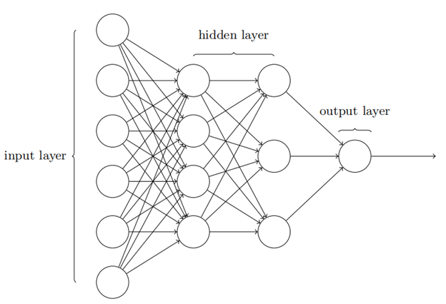

# NLP学习总结

## 深度学习

### 什么是深度学习？

深度学习是一种学习算法，让机器使用历史数据学习，然后对新问题进行预测。

### 如何实现学习与预测呢？

深度学习通过神经网络实现学习与预测，神经网络由多个神经元组成。

一个神经元有若干个输入`x`，每个输入也有相应的权重`w`，因此可以将整个神经元视作为一个函数`f(x)`，在这个函数中，`w`是一组定值。
$$
f(x)=\sum_{i=1}w_ix_i
$$
通常情况下，输入一组`x`，函数 `f(x)`的结果和实际结果是存在一定的误差，因此需要微调权重，让预测值接近实际值，因此深度学习的核心是如何快速高效的更新权重`w`。

### 常见的神经元

常见的神经元有两种：感知器和`sigmoid`神经元。

感知器是最早的神经元，当输入与权重之积大于`threshold`时，输出结果为`1`，反之为`0`。

但感知器由于具备翻转性质，因此微调`w`，可能带来结果大反转。

因此我们需要对变化感知更平滑的`sigmoid`神经元。`S`神经元将输入映射到`(0,1)`的输出范围中

$$
\sigma(z)=\frac{1}{1+e^{-z}}
\\
z=\sum_{i}w_ix_i+b,b为偏置
\\
\sigma(z)\Longleftrightarrow\frac{1}{1+exp(-\sum_{i}w_ix_i-b)}
$$

假设我们需要区分下图中三角形和矩形：

我们需要训练出红线这条直线，来分割两种不同的图像，红线的方程为：
$$
0=w_1x_1+w_2x_2+b
$$

`S`型神经元将
$$
w_1x_1+w_2x_2+b
$$
作为输入处理，将其映射到`(0,1)`中。我们可以将`S`型输出大于`0.5`时视作为矩形，表达为`1`；当输出小于`0.5`时视作为三角形，表达为`-1`，因此可以画出三维图(y1表示类型)

三维图的分割平面在二维平面上的投影方程为：
$$
0=w_1x_1+w_2x_2+b
$$
当数据处于方程右边时，方程的结果大于`0`，导致`S`型神经元的输出大于`0.5`；反之数据处于方程左边时，方程结果小于`0`，导致`S`型神经元的输出小于`0.5`。

从这个例子中，我们得出两个结论：

- `w`决定了分割平面的方向。

- `b`决定了分割平面是往左移还是右移。如果没有`b`，那么分割平面的投影恒过`(0,0)`，不能解决下图的问题：

  

综上我们可以将深度学习的核心理解为如何快速高效的更新权重`w`和偏置`b`。

通常情况下，神经网络中的神经元按层分布，分为输入层、隐藏层和输出层，这种结构被称作为**MLP**(多层感知器)。

### 参考

- [神经网络中w,b参数的作用](https://blog.csdn.net/xwd18280820053/article/details/70681750)
- [神经网络在线课](https://posts.careerengine.us/p/5afbd565e0524d5d843b98f7)