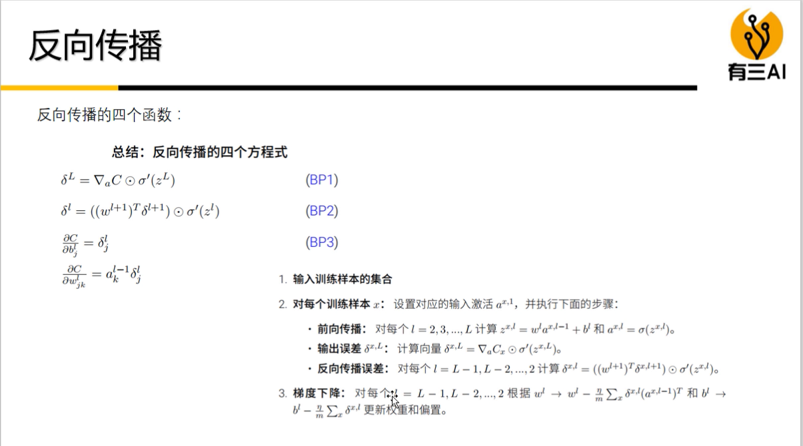

# NLP学习总结

## 深度学习

### 什么是深度学习？

深度学习是一种学习算法，让机器使用历史数据学习，然后对新问题进行预测。

### 如何实现学习与预测呢？

深度学习通过神经网络实现学习与预测，神经网络由多个神经元组成。

一个神经元有若干个输入`x`，每个输入也有相应的权重`w`，因此可以将整个神经元视作为一个函数`f(x)`，在这个函数中，`w`是一组定值。
$$
f(x)=\sum_{i=1}w_ix_i
$$
通常情况下，输入一组`x`，函数 `f(x)`的结果和实际结果是存在一定的误差，因此需要微调权重，让预测值接近实际值，因此深度学习的核心是如何快速高效的更新权重`w`。

### 常见的神经元

常见的神经元有两种：感知器和`sigmoid`神经元。

感知器是最早的神经元，当输入与权重之积大于`threshold`时，输出结果为`1`，反之为`0`。

但感知器由于具备翻转性质，因此微调`w`，可能带来结果大反转。

因此我们需要对变化感知更平滑的`sigmoid`神经元。`S`神经元将输入映射到`(0,1)`的输出范围中

$$
\sigma(z)=\frac{1}{1+e^{-z}}
\\
z=\sum_{i}w_ix_i+b,b为偏置
\\
\sigma(z)\Longleftrightarrow\frac{1}{1+exp(-\sum_{i}w_ix_i-b)}
$$

假设我们需要区分下图中三角形和矩形：

我们需要训练出红线这条直线，来分割两种不同的图像，红线的方程为：
$$
0=w_1x_1+w_2x_2+b
$$

`S`型神经元将
$$
w_1x_1+w_2x_2+b
$$
作为输入处理，将其映射到`(0,1)`中。我们可以将`S`型输出大于`0.5`时视作为矩形，表达为`1`；当输出小于`0.5`时视作为三角形，表达为`-1`，因此可以画出三维图(y1表示类型)

三维图的分割平面在二维平面上的投影方程为：
$$
0=w_1x_1+w_2x_2+b
$$
当数据处于方程右边时，方程的结果大于`0`，导致`S`型神经元的输出大于`0.5`；反之数据处于方程左边时，方程结果小于`0`，导致`S`型神经元的输出小于`0.5`。

从这个例子中，我们得出两个结论：

- `w`决定了分割平面的方向。

- `b`决定了分割平面是往左移还是右移。如果没有`b`，那么分割平面的投影恒过`(0,0)`，不能解决下图的问题：

  

综上我们可以将深度学习的核心理解为如何快速高效的更新权重`w`和偏置`b`。

通常情况下，神经网络中的神经元按层分布，分为输入层、隐藏层和输出层，这种结构被称作为**MLP**(多层感知器)。

### 参考

- [神经网络中w,b参数的作用](https://blog.csdn.net/xwd18280820053/article/details/70681750)
- [神经网络在线课](https://posts.careerengine.us/p/5afbd565e0524d5d843b98f7)

## 梯度下降和反向传播

### 梯度下降

神经网络更新权重和偏置时，需要一个方法来衡量当前选择的权重和偏置是否合理，这种方法被称作为损失函数。常见的损失函数是二次代价函数(MSE)：
$$
C(w,b)=\frac{1}{2n}\sum_x||y(x)-a||^2,y(x)是预期值，a为实际值
$$
损失函数的值越小，当前的(w,b)越合理，因此整个问题转换为求损失函数的最小值。微积分中求函数的最小值通常采用求极值点，然后讨论极值的方法获取。

由于二次代价函数属于多元微积分，因此我们采用求梯度，然后让变量沿梯度方向变化，逼近极值点。梯度是多元导数中的概念，它是一个矢量，多元可微函数`f`在点`P`的梯度是函数`f`在`P`点的偏导数为分量的向量，梯度的方向是函数`f`在`P`点最大的增长方向，梯度的标量则表示增长率。
$$
\Delta C \approx \nabla C \cdot \Delta x\\
\nabla C=(\frac{\partial C}{\partial w},\frac{\partial C}{\partial b})^T ，\nabla C表示梯度\\
w_k \rightarrow w_k'=w_k - \eta\frac{\partial C}{\partial w_k}\\
b_k \rightarrow b_k'=b_k - \eta\frac{\partial C}{\partial b_k}
$$
$\eta$ 表示学习率，用于控制每次迭代的间隙，间隙过小会导致迭代次数过多；间隙过大则可能出现局部最小值无法收敛。

通常情况下，数据量都很大，如果等全部数据都计算后，再更新(w,b)，则会带来大量的时间损耗，因此可以采用随机梯度下降。
$$
m表示将数据集随机分为m份\\
w_k \rightarrow w_k'=w_k - \frac{\eta}{m}\frac{\partial C}{\partial w_k}\\
b_k \rightarrow b_k'=b_k - \frac{\eta}{m}\frac{\partial C}{\partial b_k}
$$

### 反向传播

求权重和偏置的核心是求函数`C`的偏导，但在复杂神经网络中，函数`C`是一个未知函数，不能直接求出偏导，因此需要采用反向传播，求相应的梯度。求解过程中需要如下几个标记：

- 第`l-1`层第`k`个神经元到l层第`j`个神经元的权重：
  $$
  w^l_{jk}
  $$

- 第`l`层第`j`个神经元的偏置：
  $$
  b_j^l
  $$

- 第`l`层第`j`个神经元的带权输入：
  $$
  z^l_j=\sum_kw^l{jk}a^{l-1}_k+b^l_j
  $$

- 第`l`层的带权输入：
  $$
  z^l=w^la^{l-1}+b^l
  $$

- 第`l`层第`j`个神经元的输出：
  $$
  a_j^l=\sigma(\sum_kw^l{jk}a^{l-1}_k+b^l_j)=\sigma(z^l_j)
  $$

- 第`l`层的输出：
  $$
  a^l=\sigma(w^la^{l-1}+b^l)=\sigma(z^l)
  $$

每次`(w,b)`的更新都会导致神经元的带权输入变化，从而带动`C`的变化：
$$
a^l_j=\sigma(z^l_j+\Delta z^l_j)
$$

$$
\frac {\Delta C}{\Delta z^l_j}=\frac{\partial C}{\partial z^l_j}
$$

因此我们可以将
$$
\delta^l_j=\frac{\partial C}{\partial z^l_j}
$$
视作为第`l`层第`j`个神经元对整个代价产生的误差。当`(w,b)`改动后，输出层将展现`C`的变化，因此输出层最方便计算：
$$
\delta^l_j=\frac{\partial C}{\partial z^l_j}=\frac{\partial C}{\partial a^l_j} \cdot \frac{\partial a^l_j}{\partial z^l_j}= \frac{\partial C}{\partial a^l_j} \cdot \sigma(z^l_j)' \\
\delta^l = \nabla C \times \sigma'(z^l)
$$
误差的反向传播公式为(`w`是一个矩阵，一层神经元的输出是一个向量)：
$$
\delta^l=\frac{\partial C}{\partial z^l}=\frac{\partial C}{\partial z^{l+1}} \cdot \frac{{\partial z^{l+1}} }{\partial z^l}=\frac{\partial C}{\partial z^{l+1}} \cdot \frac{ \partial(w^{l+1} \sigma(z^l)+b^{l+1})}{\partial z^l}=(\delta^{l+1}(w^{l+1}))\times\sigma'(z^l)
$$
因此可以推导出误差和偏置求偏导的关系：
$$
\frac{\partial C}{\partial z^l_j}=\frac{\partial C}{\partial b^l_j}\frac{\partial b^l_j}{\partial z^l_j}=\frac{\partial C}{\partial b^l_j}\frac{\partial b^l_j}{\sum_kw^l{jk}a^{l-1}_k+b^l_j}=\frac{\partial C}{\partial b^l_j}=\delta^l_j
$$
同理我们也可以推导出误差和权重求偏导的关系：
$$
\frac{\partial C}{\partial w^l_{jk}}=\frac{\partial C}{\partial z^l_j}\frac{\partial z^l_j}{\partial w^l_{jk}}=\frac{\partial C}{\partial z^l_j}\frac{\partial(\sum_kw^l{jk}a^{l-1}_k+b^l_j)}{\partial w^l_{jk}}=\delta^l_ja^{l-1}_k
$$

### 总结

### 作业

- 作业：自己写代码，实现一下反向传播算法。损失函数为MSE，激活函数为s型函数。
- 可以阅读`caffe`的源码

### 参考

- [梯度]([https://zh.wikipedia.org/wiki/%E6%A2%AF%E5%BA%A6](https://zh.wikipedia.org/wiki/梯度))