# HTTP协议学习笔记(七) TLS1.2

## 0X00 梗概

TLS协议由几个子协议组成：

- 记录协议：TLS中收发数据的单位为记录，负责记录的收发，多个记录可以公用一个TCP包。
- 警报协议：向对端发出警报信息。
- 握手协议：两端进行握手、交换证书并协商会话密钥。
- 变更密码规范：通知对端，后续数据将加密。

学习TLS 1.2的工作流程时需要使用wireshark进行抓包。抓包前有两个准备工作：

- 配置环境变量：`SSLKEYLOGFILE`，保存浏览器握手信息。
```bash
➜  ~ cat .profile
export SSLKEYLOGFILE=/home/fangjie/Desktop/ssl.log
➜  ~ source .profile# 保险起见可以重启下
```

- 配置wireshark：`Edit -> Preferences -> Protocols -> SSL`

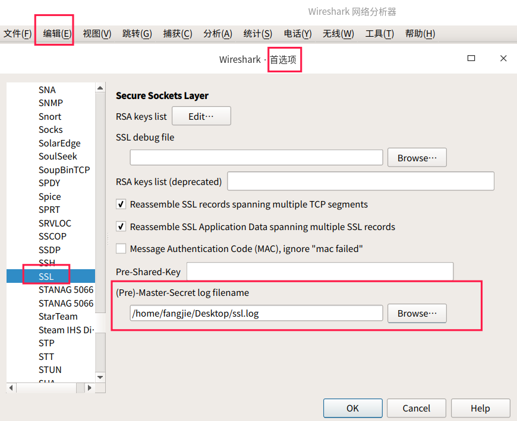

TLS1.2中，常见的密钥交换算法主要有两种：RSA、ECDHE。ECDHE采用ECC的DH算法，在安全强度和性能上都有明显优势，`160`位的ECC相当于`1024`为的RSA，`224`位相当于`2048`位的RSA。由于ECDHE的密钥短，相应的计算量、消耗的内存和带宽也少了，性能有较大提升。

TLS握手流程中通过密码套件确定整个通信流程中将使用的加密方法，如：

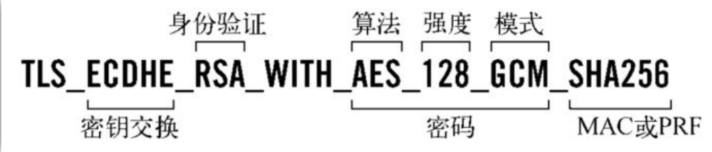

- ECDHE：负责密钥交换。
- RSA：证书的验证算法，用于身份验证。
- AES_128_GCM：使用128位GCM分组工作模式的AES算法进行对称加密。
- SHA256：摘要算法，保证对称加密中，传输数据的完整性。

## 0X01 RSA握手流程

- 客户端向服务器端发送`Client Hello`：随机数C、客户端的TLS版本号、密码套件列表。

  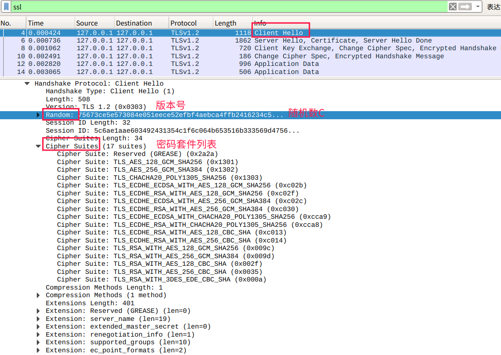

- 服务器向客户端发送`Server Hello`：随机数S、确定TLS版本号和使用的密码套件和证书信息。

  

- 客户端验证证书和签名。

- 客户端生成`pre-master`，使用服务器公钥加密`pre-master`。客户端向服务器发送`Client Key Exchange`(包含`pre-master`)。

  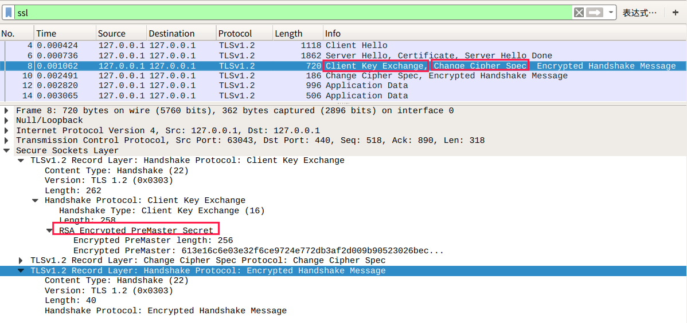

- 客户端向服务器发送`Change Cipher Spec`，表明之后客户端采用对称加密发送数据。

- 服务器使用私钥解密`pre-master`。客户端与服务端使用随机数C、随机数S和`pre-master`生成`master secret`。

- 服务器向客户端发送`Change Cipher Spec`，表明之后服务器用对称加密发送数据。

  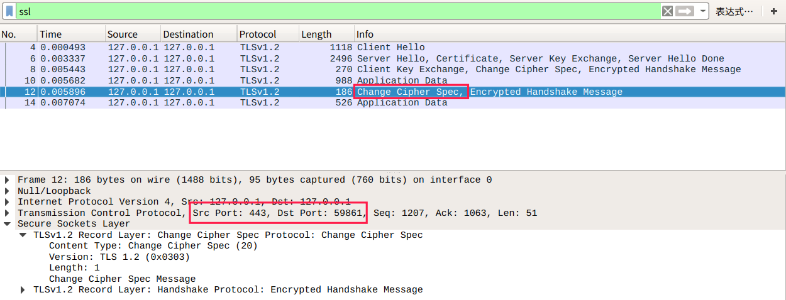

## 0X02 ECDHE握手流程

- 客户端向服务器端发送`Client Hello`：随机数C、客户端的TLS版本号、密码套件列表。

  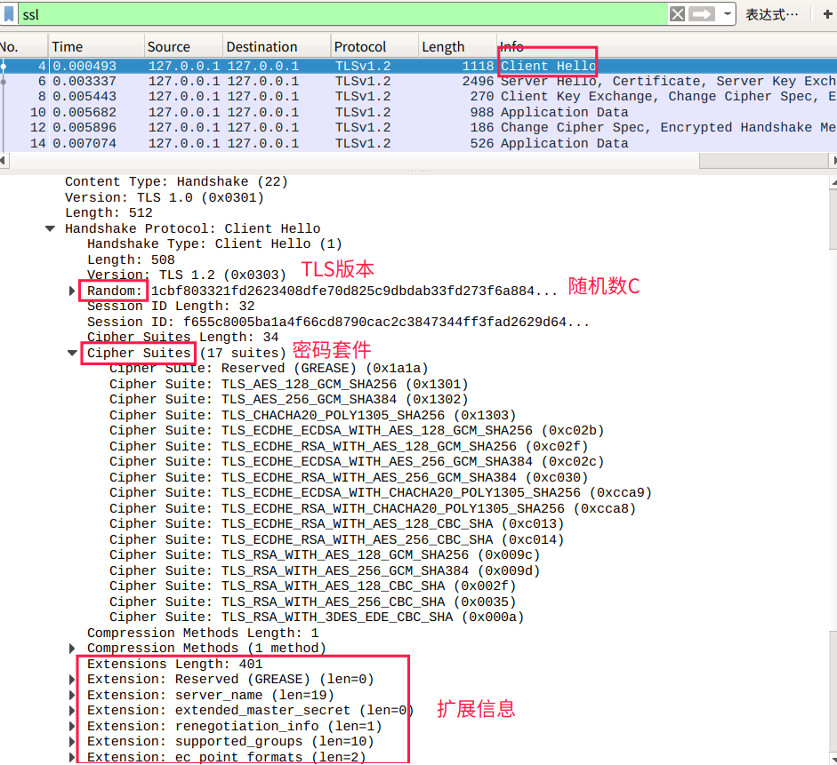

- 服务器向客户端发送`Server Hello`：随机数S、确定TLS版本号和使用的密码套件、ECDHE公钥，并使用自己的私钥为ECDHE的信息签名，保证不被篡改。

  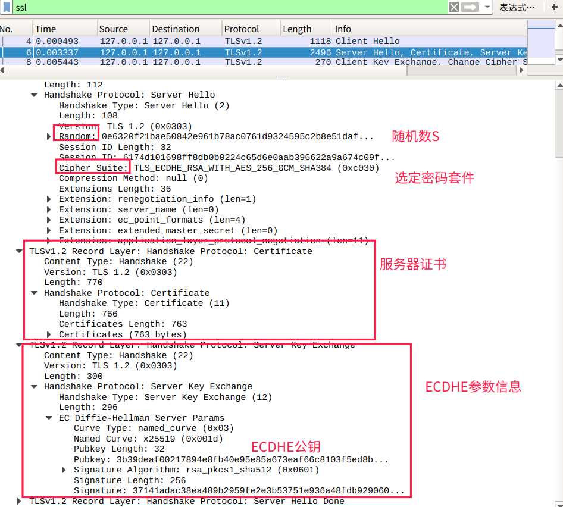

- 客户端验证证书和签名。

- 客户端根据密码套件的信息，生成ECDHE公钥发送给服务器。

  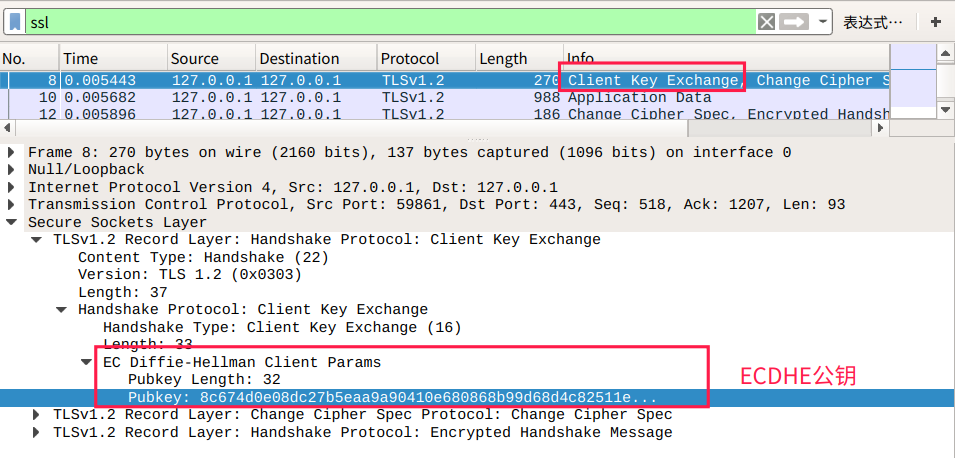

- 现在服务器和客户端双方都拥有了四个参数：`客户端的随机数`、`服务器端的随机数`、`客户端的ECDHE参数`、`服务器端的ECDHE参数`。客户端和服务器端根据两端的ECDHE参数，计算生成`Pre-Master`，然后使用客户端和服务器端的随机数与`Pre-Master`一起生成`Master Secret`(将三个随机数混合在一起，生成更随机的主密钥)。`Master Secret`的计算公式为：

  ```
  master_secret = PRF(pre_master_secret, "master secret",ClientHello.random + ServerHello.random)
  # PRF通过密码套件中的摘要算法再次强化Master Secret的随机性
  ```

  客户端和服务器端生成主密钥后，通过主密钥派生出相关的密钥，如`客户端发送的会话密钥`、`服务器发送的会话密钥`。

- 客户端发送`Change Cipher Spec`，通知服务器，后续数据采用对称加密。然后将之前发送的数据做一个摘要，进行加密发送给服务器，进行验证。

  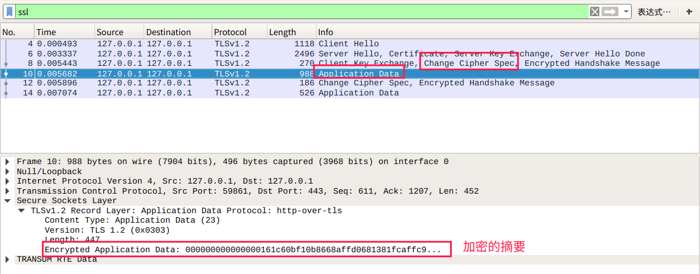

- 服务器发送`Change Cipher Spec`，通知客户端，后续数据采用对称加密。

  

- ECDHE是如何确保在`客户端的ECDHE参数`、`服务器端的ECDHE参数`被截获的情况下，`Pre-Master Secret`的安全性呢？

  - 客户端随机生成随机值Ra，计算Pa(x, y) = Ra * Q(x, y)，Q(x, y)为全世界公认的某个椭圆曲线算法的基点。将Pa(x, y)发送至服务器。
  
  - 服务器随机生成随机值Rb，计算Pb(x,y) - Rb * Q(x, y)。将Pb(x, y)发送至客户端。
  
  - 客户端计算Sa(x, y) = Ra * Pb(x, y)；服务器计算Sb(x, y) = Rb *Pa(x, y)
  
  - 算法保证了Sa = Sb = S，提取其中的S的x向量作为密钥（预主密钥）

## 0X03 双向认证


## 0X04 TLS1.3是如何工作的？

截止现在，TLS1.2已经诞生11年了，TLS1.2面对现在的互联网已经力不从心了，因此TLS1.3诞生了。TLS1.3主要从三方面进行了改进：兼容、安全和性能。

兼容方面，由于很多基础设施是基于TLS1.2，这意味着直接将头字段的版本号从`0X303`(TLS1.2)修改为`0X304`(TLS1.3)时，很多基础设施都无法正确处理。TLS1.3采用TLS1.2中的扩展协议实现先后扩展，`Client Hello`中有`supported_versions`扩展，包含支持的TLS版本号，由服务器进行选择。
```
Handshake Protocol: Client Hello
    Version: TLS 1.2 (0x0303)
    Extension: supported_versions (len=11)
        Supported Version: TLS 1.3 (0x0304)
        Supported Version: TLS 1.2 (0x0303)
```

安全方面，TLS1.3弥补了很大新发现的算法漏洞。TLS1.3只保留了AES、ChaCha20作为对称加密算法，分组模式只能采用AEAD的GCM、CCM和Poly1305，摘要算法只能使用SHA256、SHA384，密钥交换算法只有ECDHE和DHE，椭圆曲线只有5种。通过精简，TLS1.3只有5个密码套件，可以通过代码来表示密码套件。


TLS1.3中密钥交换算法中移除了RSA算法，这是因为RSA算法不具备前向安全，RSA算法采用服务器证书的RSA作为密钥交换，如果密钥泄露或被破解，可以通过私钥解密出之前抓包的`Pre-Master`，计算出会话密钥。ECDHE算法每次握手都会生成一对临时公私钥。

性能方面，TLS1.2会多花两个消息往返(2-RTT)，网络延迟高。由于密码套件大幅度简化，协商流程就没有那么复杂，把握手时间减少到1-
RTT，效率提高了一倍。客户端在`Client Hello`里直接用`supported_groups`带上支持的曲线，`key_share`带上曲线对应的公钥，`signature_algorithms`带上签名算法；服务器从扩展中选取相应的曲线和参数，通过`key_share`返回服务器公钥参数。


TLS1.3中还能通过`pre_share_key`和`early_data`扩展，实现`0-RTT`握手，在TCP连接后立即建立安全连接并发送加密信息。

## 0X05 TLS1.3 的握手流程

<https://www.nginx.com/>

为了兼容TLS1.2的设备，TLS1.3的`Client Hello`的`TLS Version`、`Client Random`和`Cipher Suites`字段和TLS1.2相同，只通过扩展字段描述TLS1.3所需要的信息。

- 客户端向服务器发送`Client Hello`

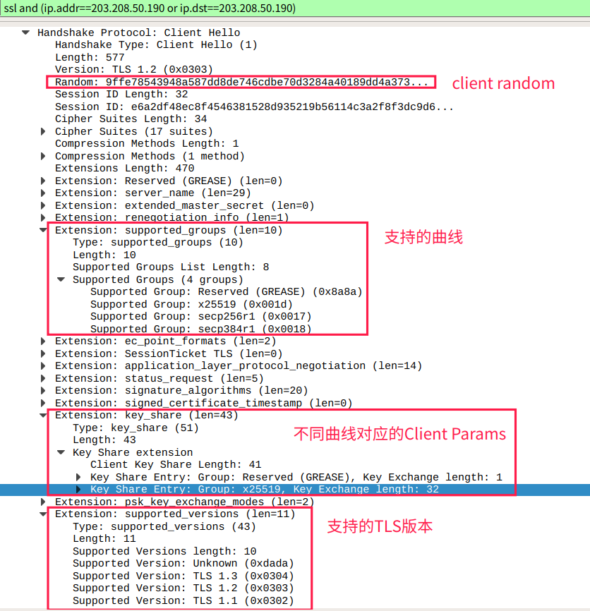

- 服务器向客户端发送`Server Hello`

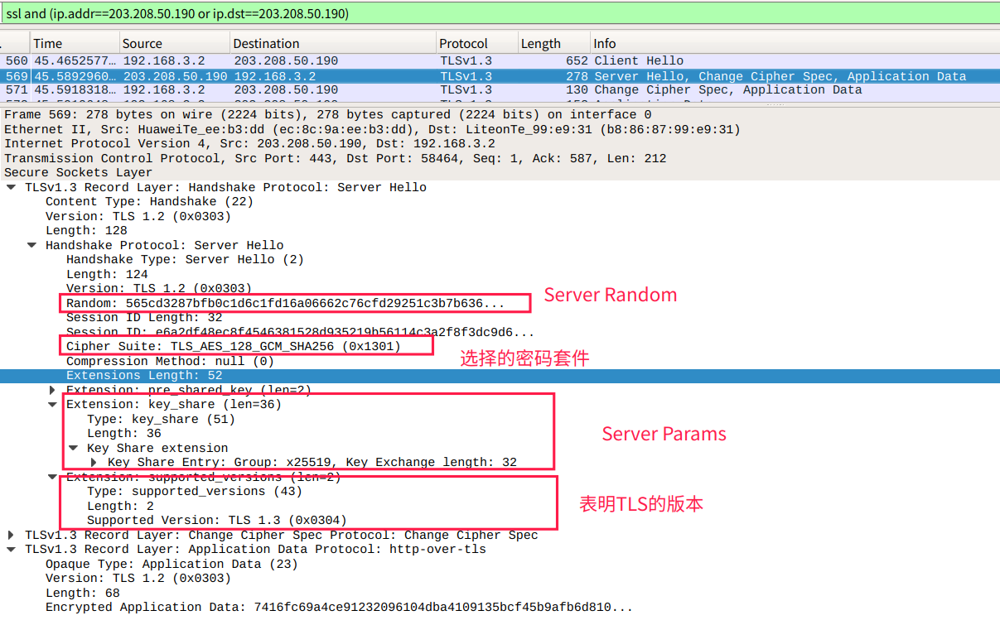

- 通过一次通信，双方已经获得`Client Radom`、`Server Random`、`Client Params`和`Server Params`，双方计算出`Pre-Master`，然后再用HKDF生成`Master Secret`。
- 服务器计算出`Master Secret`后，发出`Change Cipher Sepc`，切换到对称机密通信，因此后续的证书验证也是加密的，减少了握手时明文信息泄露，并且多个`Certificate Verify`，用服务器的私钥为曲线，套件、参数签名，强化了身份验证和防篡改。

False Start：浏览器发送ChangeCipherSpec和Finished后，立即发送加密的应用层数据，而无需等待服务器端的确认。

## 参考

- ECDHE计算来自：https://blog.csdn.net/mrpre/article/details/78025940
- 