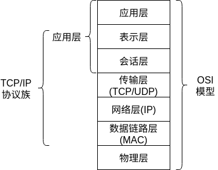
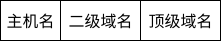
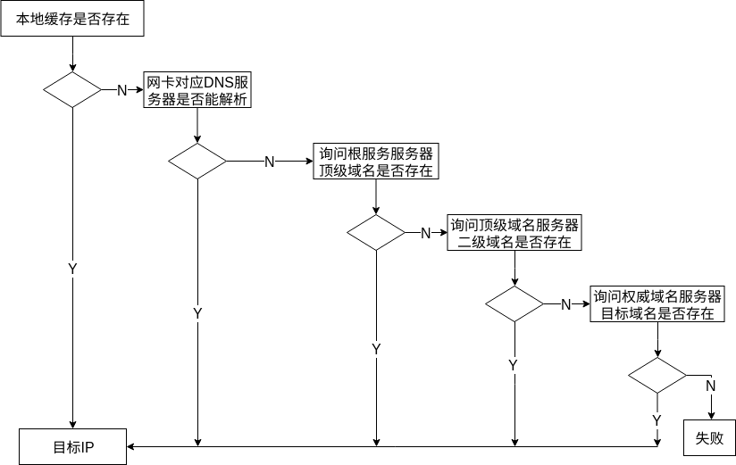
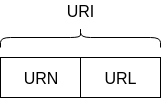
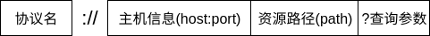

# HTTP协议学习笔记(一) 基本概念

HTTP协议是互联网中使用十分常见的通信协议。在《HTTP协议学习笔记》这个系列中，我将采取问答方式记录我在学习HTTP协议所遇到的问题。

我的学习资料有：

- 《图解HTTP》
- 极客时间课程：透视HTTP协议

## 0X00 HTTP协议是什么？

HTTP(`Hyper Text Transfer Protocol`)协议是一种用于两个计算机之间传输文字、图片、视频等超文本数据的约定和规范。我们使用的APP和网站基本都依靠HTTP协议进行通信。

## 0X01 HTTP协议的基础是什么？

OSI模型将网络划分为7层：

HTTP协议处于应用层，其使用IP协议进行寻址和路由选择、TCP协议实现可靠传输、DNS协议实现域名与IP的转换、SSL/TLS协议实现安全通信。

## 0X02 域名与IP如何进行转换？

IP是有32位二进制表示，但其对人不太友好，很容易记错，因此引入了域名。域名是一串连续的字母或数字组成域名，其被拆分为三部分，采用`.`隔离：

`time.geekbang.org`中，`time`为主机名，`geekbang`为二级域名，`org`为顶级域名。

域名与IP的转换依靠DNS服务器来转换，DNS服务器被分为三大类：

- 根域名服务器：负责返回顶级域名服务器的IP。
- 顶级域名服务器：负责返回权威域名服务器的IP。
- 权威域名服务器：负责返回域名对应的IP。

因此我们查询一个域名的IP时会采用如下流程：

## 0X03 域名可以实现哪些功能？

域名和IP具备映射关系，利用该特点可以实现如下功能：

- 重定向：域名所代表的IP可以任意变动，在面临节点异常下线时，可以通过修改DNS记录将域名映射到正常的节点，保证服务可用。
- 标记内部服务：域名具备名字空间的特性(对应一个主机)，可以使用bind9等开源软件搭建内部DNS服务器，将为每个内部服务建立内部域名，因此在进行通信时，可以直接使用域名。
- 负载均衡：域名解析返回多个IP地址由客户端选择或返回最佳的主机。

## 0X04 URI和URL的区别？

URI(`Uniform Resource Identifier`)统一资源标识符用于区分资源。URI下有两个分支：URN和URL。

URL(`Uniform Resource Location`)统一资源定位符是表达资源的位置的同时还能标识资源，其标准格式为：

- 查询参数中`?`代表开始，采用`name=value`结构，如果有多个查询参数用`&`并列。

- 如果参数中出现特殊字符`?&@`，会将其ASCII转换为16进制并添加`%`作为前缀：`https://www.baidu.com/s?wd=%3F`，`3F`在ASCII中代表`?`。

---

