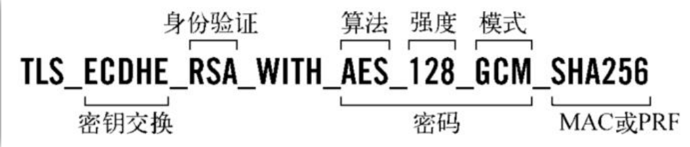
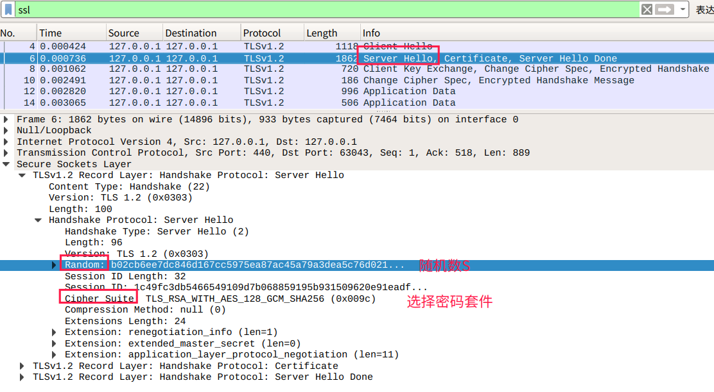
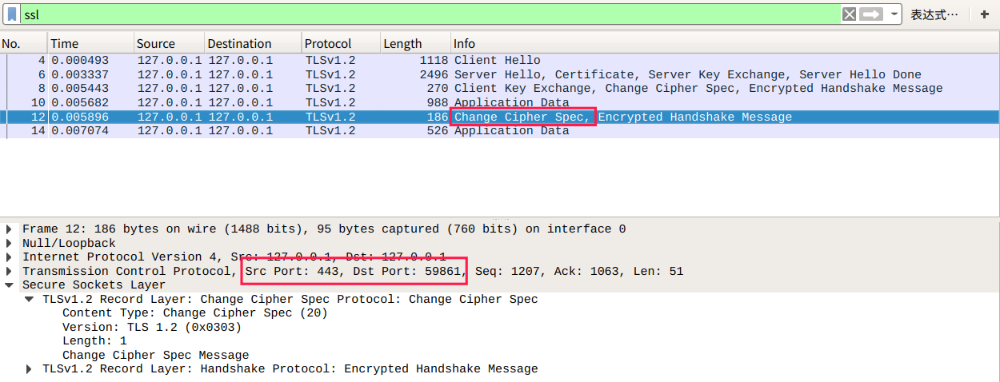
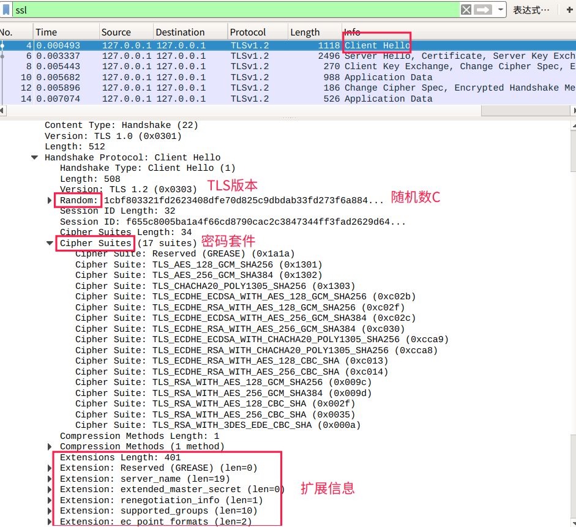
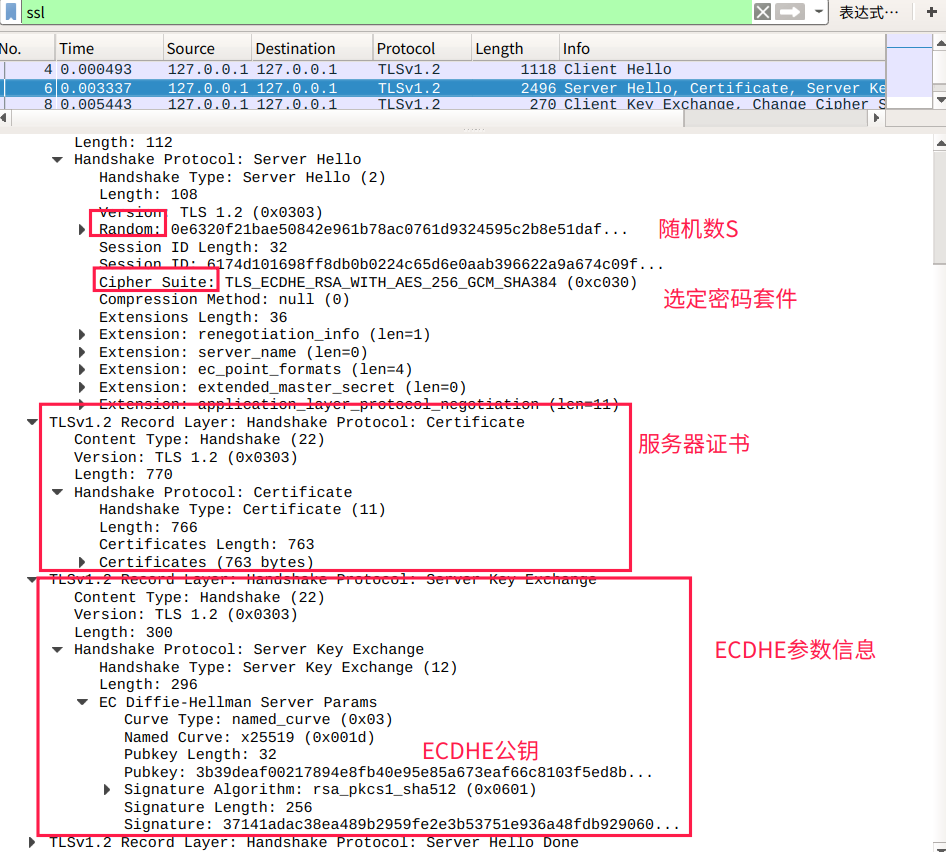
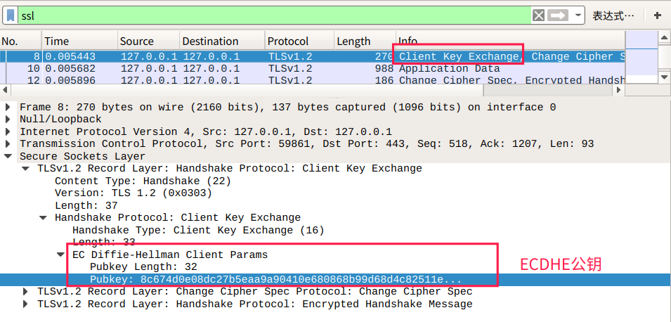
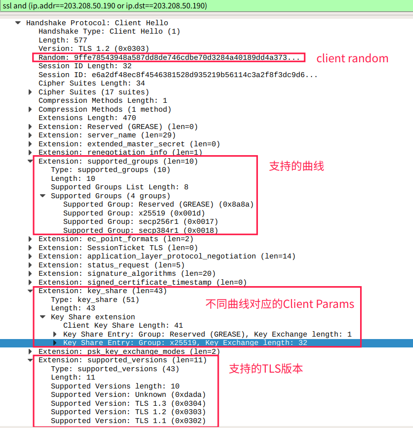
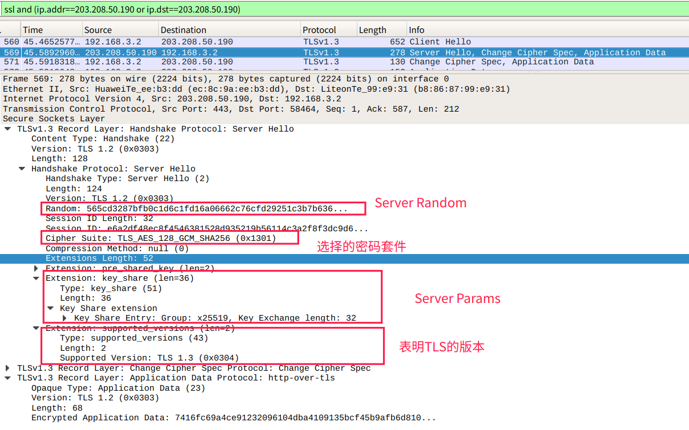

# HTTP协议学习笔记(七) TLS协议

## 0X00 梗概

TLS协议由几个子协议组成：

- 记录协议：TLS中收发数据的单位为记录，负责记录的收发。
- 警报协议：向对端发出警报信息。
- 握手协议：两端进行握手、交换证书并协商会话密钥。
- 变更密码规范：通知对端，后续数据将加密。

常见的TLS协议实现是OpenSSL。学习TLS时需要使用wireshark进行抓包，抓包前有两个准备工作：

- 配置环境变量：`SSLKEYLOGFILE`，保存浏览器握手信息。
```bash
➜  ~ cat .profile
export SSLKEYLOGFILE=/home/fangjie/Desktop/ssl.log
➜  ~ source .profile# 保险起见可以重启下
```

- 配置wireshark：`Edit -> Preferences -> Protocols -> SSL`


TLS协议通过密码套件确定整个通信流程中将使用的加密方法，如：



- ECDHE：负责密钥交换。
- RSA：证书验证算法，用于身份验证。
- AES_128_GCM：使用128位GCM分组工作模式的AES算法进行对称加密。
- SHA256：摘要算法，保证对称加密中数据的完整性。

## 0X01 TLS1.2

TLS1.2协议中，常见的密钥交换算法有两种：RSA、ECDHE。ECDHE采用ECC的DH算法，在安全强度和性能上都有明显优势，`160`位的ECC相当于`1024`为的RSA，`224`位相当于`2048`位的RSA。由于ECDHE的密钥短，相应的计算量、消耗的内存和带宽也少了，性能有较大提升。

现在常用的TLS协议为TLS 1.2和TLS 1.3版本，其中TLS1.2中由于密钥交换算法的不同，握手也不相同，主要分为两大类：

- RSA
- ECDHE

## 0X02 RSA握手流程

分析TLS协议的流程时，要切记TLS协议中传输的单位是记录，多个记录能使用同一个TCP报文发送给对端。RSA握手流程中，对称加密的`pre_master`是由客户端生成，然后通过服务器的公钥进行加密，传输给服务器。服务器和客户端通过`Pre-Master`生成对称加密的`Master Secret`。

- 客户端向服务端发送`Client Hello`：随机数C、TLS版本号、密码套件列表。

  

- 服务器向客户端发送`Server Hello`：随机数S、TLS版本号、密码套件和证书信息。

  

- 客户端对服务器证书执行验签操作后，由客户端生成`Pre-Master`，使用服务器公钥加密。客户端向服务器发送`Client Key Exchange`(包含`Pre-Master`)。

  

- 客户端向服务器发送`Change Cipher Spec`，表明之后客户端采用对称加密传输数据。

- 服务器使用私钥解密出`Pre-Master`。客户端与服务器使用随机数C、随机数S和`Pre-Master`生成`Master Secret`。

- 服务器向客户端发送`Change Cipher Spec`，表明之后服务器采用对称加密传输数据。

  

## 0X03 ECDHE握手流程

ECDHE算法通过ECC算法来实现秘钥交换，其基本原理是：

- 选择一个椭圆曲线算法`Q(x,y)`。
- 客户端生成随机值Ra，计算ECDHE参数`Pa(x,y)=Ra*Q(x,y)`。
- 服务器生成随机值Rb，计算ECDHE参数`Pb(x,y)=Rb*Q(x,y)`。
- 客户端和服务器交换生成的ECDHE参数，然后计算`S=Sa(x,y)=Ra*Pb(x,y)=Sb(x,y)=Rb*Pa(x,y)`，选取S的x轴作为`Pre-Master`，再根据`Pre-Master`生成`Master Secret`。

ECDHE的握手流程只是在RSA握手流程上做了密钥交换的调整：

- 客户端向服务器端发送`Client Hello`：随机数C、TLS版本号、密码套件列表。

  

- 服务器向客户端发送`Server Hello`：随机数S、TLS版本号、密码套件、证书、ECDHE参数，并对ECDHE参数签名，保证不被篡改。

  

- 客户端对服务器证书执行验签操作后，生成ECDHE参数发送给服务器。

  

- 现在双方拥有四个参数：`随机数S`、`随机数C`、`客户端的ECDHE参数`、`服务器端的ECDHE参数`。客户端和服务器端根据ECDHE参数，计算生成`Pre-Master`，然后使用`随机数S`、`随机数C`与`Pre-Master`一起生成`Master Secret`。通过主密钥派生出相关的密钥，如`客户端发送的会话密钥`、`服务器发送的会话密钥`。

- 客户端发送`Change Cipher Spec`，通知服务器，后续数据采用对称加密。然后将之前发送的数据做一个摘要，进行加密发送给服务器，进行验证。

  

- 服务器发送`Change Cipher Spec`，通知客户端，后续数据采用对称加密。

  


## 0X04 TLS1.3协议

截止现在，TLS1.2协议已经诞生11年了，TLS1.2协议面对现在的互联网已力不从心了，因此TLS1.3协议诞生了。TLS1.3协议主要在三方面做了改进：兼容、安全和性能。

- 兼容方面，由于很多基础设施是基于TLS协议，意味着直接将头字段的版本号从`0X303`(TLS1.2)修改为`0X304`(TLS1.3)时，很多基础设施都无法正确处理。TLS1.3协议采用TLS中的扩展字段实现向后扩展，通过在`Client Hello`的`supported_versions`扩展字段包含支持的TLS版本号，由服务器进行选择。

```
Handshake Protocol: Client Hello
    Version: TLS 1.2 (0x0303)
    Extension: supported_versions (len=11)
        Supported Version: TLS 1.3 (0x0304)
        Supported Version: TLS 1.2 (0x0303)
```

- 安全方面，TLS1.3弥补了很多新发现的算法漏洞。TLS1.3移除了RSA算法，因为RSA算法不具备前向安全，RSA算法采用服务器公钥加密密钥，如果私钥泄露或被破解，可通过私钥解密出之前抓包的`Pre-Master`，计算出`Master-Secret`。ECDHE算法每次握手都会生成一对临时公私钥。

  TLS1.3只保留了AES、ChaCha20作为对称加密算法，分组模式只能采用AEAD的GCM、CCM和Poly1305，摘要算法只能使用SHA256、SHA384，密钥交换算法只有ECDHE和DHE，椭圆曲线只有5种。通过精简，TLS1.3只有5个密码套件，可以通过代码来表示密码套件。


- 性能方面，TLS协议握手需要2-RTT(两个消息往返)，网络延迟高。由于密码套件大幅度简化，协商流程就没有那么复杂，把握手时间减少到`1-RTT`，效率提高了一倍。客户端在`Client Hello`中使用`supported_groups`附上支持的曲线，`key_share`附上曲线对应的公钥，`signature_algorithms`带上签名算法；服务器从扩展中选取相应的曲线和参数，通过`key_share`返回服务器公钥参数。


## 0X05 TLS1.3 的握手流程

TLS1.3为了兼容TLS协议的设备，其`Client Hello`的`TLS Version`、`Client Random`和`Cipher Suites`字段和TLS1.2协议相同，只通过扩展字段描述TLS1.3协议所需信息，下面的测试使用的网站是https://www.nginx.com/。

- 客户端向服务器发送`Client Hello`。



- 服务器向客户端发送`Server Hello`。



- 通过一次通信，双方已经获得`Client Radom`、`Server Random`、`Client Params`和`Server Params`，双方先计算出`Pre-Master`，再用HKDF生成`Master Secret`。
- 服务器计算出`Master Secret`后，发出`Change Cipher Sepc`，切换到对称加密通信，因此后续的证书验证也是加密的，减少了握手时明文信息泄露。TLS1.3中多了一个`Certificate Verify`流程，使用服务器的私钥对握手数据进行签名，强化了身份验证和防篡改。

## 参考

- ECDHE计算来自：https://blog.csdn.net/mrpre/article/details/78025940