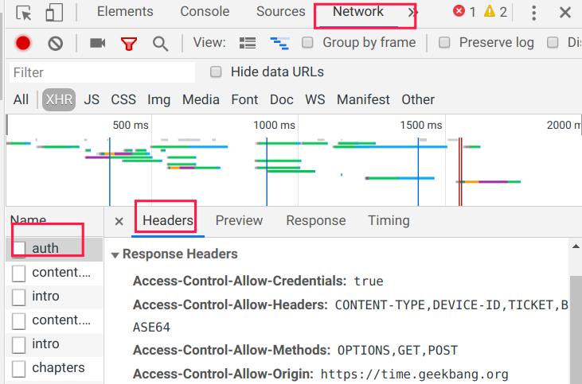
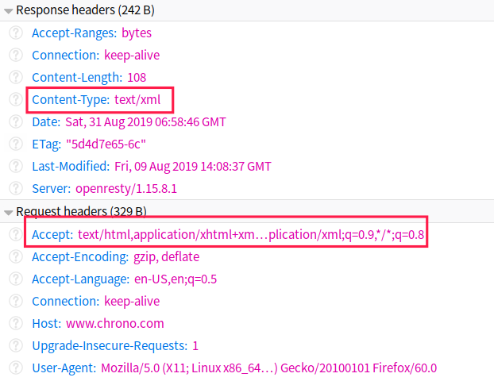
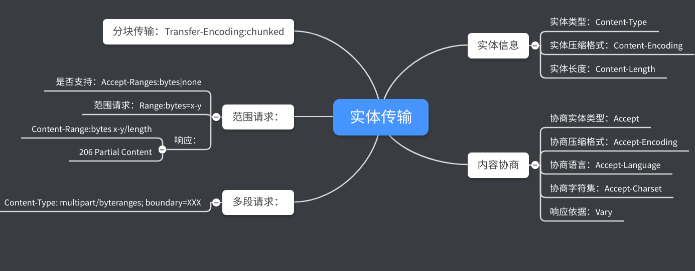

# HTTP协议学习笔记(三)  实体传输

## 0X00 简介

采用HTTP协议传输数据时，需要做两步：

- 在body存放数据。
- 在header中记录数据的相关参数(数据格式、压缩类型等)，以便对端能够进行处理。

这两步中，处理header最为重要，这决定了body是否能被正确处理。你可以使用浏览器的抓包查看header的相关内容(网页右键-->检查-->网络-->headers)。



HTTP协议的头部字段非常灵活并且可扩展，甚至你只需遵循报文基本结构(header+body)，header和body均可自定义。因此你可能会看到各种头部字段，这里只为大家介绍常用的头部字段。

## 0X01 Content-Type：实体类型

`Content-Type`字段用于标识body的类型，以便客户端和服务器能正确处理数据。HTTP协议采用MIME(Multipurpose Internet Mail Extensions)协议来表达实体的类型。

常用的实体类型有：

- text：文本格式数据，如`text/html`、`text/css`。
- image：图像文件，如`image/jpeg`、`image、gif`。
- `audio`：音频数据。
- `video`：视频数据。
- `application`：该数据需要上层应用解释，如`application/pdf`。

## 0X02 Content-Encoding：压缩格式

`Content-EncodingHTTP`字段用于标识body的压缩格式，通过压缩数据，可以节约带宽。通常只对未压缩(文本)的内容压缩，若对已压缩文件(图片、视频)再次压缩可能会使体积增加。

常用的压缩格式为：

- `identity`：不压缩(默认值)。
- `gzip`：采用`gzip`压缩。
- `deflate`：采用`deflate`压缩。
- `br`：采用`Brotli`算法压缩(为HTTP优化)。

## 0X03 Content-Length：数据长度

`Content-Length`字段表示body的长度。

## 0X04 内容协商

HTTP协议中，通信是由客户端主动发起请求，服务器响应该请求，因此客户端可以和服务器进行协商传输的实体格式。内容协商的过程是由客户端通过`Accept`头提供选择，服务器根据自身情况进行选择响应并通过`Content`头告知实际的信息。

常见的`Accept`头与`Content`头有：

- `Accetp`和`Content-Type`：数据类型。
- `Accept-Encoding`和`Content-Encoding`：压缩格式。
- `Accept-Language`和`Content-Language`：自然语言，便于国际化，如`zh-CN、en、en-us`。
- `Accept-Charset`和`Content-Type`：字符集，如`gbk,utf-8`。服务器通过在`Content-Type`字段的中添加`charset=xxx`表示选择 ，如`text/html; charset=utf-8`。

协商时，客户端需要按`类型;q=权重`格式填写Accept头，默认值为1，最小值为0.01，如果置为0，则表示拒绝该类型数据。`Accept: text/html,application/xml;q=0.9,*/*;q=0.8`表示优先接收html文件，其次为xml文件，最后才是其他文件。服务器接收请求头后，通过权重和自身情况，进行响应。



有些服务器会通过响应中的`Vary`字段表明自己发出该响应的判断依据。`Vary:Accept-Encoding,User-Agent,Accept`，表明服务器根据`Accept-Encoding,User-Agent,Accept`这三个头字段，决定如何发回响应报文。如果请求头的相应字段发送改变，请求报文也会发送改变。

**这里需要重点强调：Content头不是响应的专属，客户端通过POST方法发送文件时，也需要用Content头描述body的数据类型**

## 0X05 分块传输

针对大文件传输，有两种解决方案：

- 数据压缩：使用`Content-Encoding`字段，但是数据压缩对超大文件也无能为力。
- 分块传输：采用将大文件拆分小块，然后分批发送，由对方进行组装复原。

`Transfer-Encoding:chunked`字段表示数据通过一系列分块发送，该字段和`Content-Length`互斥，因为body的准确长度无法得知。


浏览器在收到分块传输的数据后将自动除去分块编码，重新组装出内容，因此只能采用wireshark抓包或者Telnet手工发送请求。

```bash
➜  http_study git:(master) ✗ telnet 127.0.0.1 80 
Trying 127.0.0.1...
Connected to 127.0.0.1.
Escape character is '^]'.
GET /16-1 HTTP/1.1
Host:www.chrono.com

# 响应
HTTP/1.1 200 OK
Server: openresty/1.15.8.1
Date: Sat, 31 Aug 2019 08:16:27 GMT
Content-Type: text/plain
Transfer-Encoding: chunked
Connection: keep-alive

f	# 长度
chunked data 1  # 数据

f
chunked data 2

f
chunked data 3

0# 结束行长度
# 结束行
```

## 0X06 范围请求

服务器通过`Accept-Ranges`字段告知客户端是否支持范围请求，`bytes`为支持，`none`则为不支持。客户端通过`Range:bytes=起始偏移量-结束偏移量`发起请求，偏移量起始点为0，支持正负。服务器采用`Content-Range:bytes 起始-结束/总长度`字段搭配`206 Parial Content`响应请求。

通过范围请求可以实现多段下载、断点续传等操作，其完整的流程如图：


通过telnet手动发送请求：

```bash
➜  http_study git:(master) ✗ telnet 127.0.0.1 80
Trying 127.0.0.1...
Connected to 127.0.0.1.
Escape character is '^]'.
GET /16-2 HTTP/1.1
Host:www.chrono.com
Range:bytes=0-12

# 响应
HTTP/1.1 206 Partial Content
Server: openresty/1.15.8.1
Date: Sat, 31 Aug 2019 08:41:19 GMT
Content-Type: text/plain
Content-Length: 13
Last-Modified: Fri, 09 Aug 2019 14:08:37 GMT
Connection: keep-alive
Accept-Ranges: bytes
ETag: "5d4d7e65-5a"
Content-Range: bytes 0-12/90
# 内容
// this is a 
```

## 0X07 多段数据

范围请求还支持在`Range`头中使用多个`x-y`，用于一次性获取多个数据片段。这时`Content`头为`Content-Type: multipart/byteranges; boundary=XXX`，`multipart/byteranges`表明多段数据，`xxx`用于间隔多个数据段。


通过telnet手工发送请求：

```bash
➜  http_study git:(master) ✗ telnet 127.0.0.1 80
Trying 127.0.0.1...
Connected to 127.0.0.1.
Escape character is '^]'.
GET /16-2 HTTP/1.1
Host:www.chrono.com
Range:bytes=0-9,20-29

HTTP/1.1 206 Partial Content
Server: openresty/1.15.8.1
Date: Sat, 31 Aug 2019 08:59:02 GMT
Content-Type: multipart/byteranges; boundary=00000000000000000001
Content-Length: 216
Last-Modified: Fri, 09 Aug 2019 14:08:37 GMT
Connection: keep-alive
Accept-Ranges: bytes
ETag: "5d4d7e65-5a"


--00000000000000000001
Content-Type: text/plain
Content-Range: bytes 0-9/90

// this is
--00000000000000000001
Content-Type: text/plain
Content-Range: bytes 20-29/90

ext json d
--00000000000000000001--
```

## 0X08 总结

这一节介绍了实体传输常用的字段，这里需要注意的是几点：

- `Content`头用于描述body，因此响应和请求都可以使用。
- `Accept`头是用于协商信息，通常只出现在请求中。
- `Transfer-Encoding`用于整个报文是如何传输的，而`Content-Encoding`用于报文中body的压缩格式。



## 0X09 参考资料

极客时间课程《透视HTTP协议》

MDN Web docs：https://developer.mozilla.org/zh-CN/docs/Web/HTTP/Headers

---


