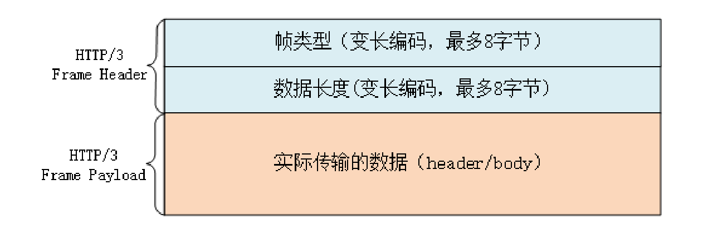

# HTTP协议学习笔记(九)新协议

## 0X00 梗概

HTTP/1有两个缺点：

- 安全方面
- 性能方面

安全方面，HTTPS协议采用`SSL/TLS`协议。性能方面，HTTPS优化了握手流程，但传输过程中没有优化。新的HTTP/2协议主要优化传输过程。

HTTP/2有以下几个特点：

- 兼容HTTP/1
- 压缩头部：采用HPACK算法压缩头部
- 二进制帧传输：将报文碎片化为二进制帧，采用帧来传输数据
- 多路复用：通过流实现多路复用

HTTP/2协议解决了应用层的队头阻塞问题，但HTTP/2的底层协议是TCP，存在TCP层次队头阻塞问题。为了彻底解决队头阻塞问题，采用QUIC协议的HTTP/3协议诞生了。

## 0X01 兼容HTTP/1

HTTP/2为保持和HTTP/1的兼容性，将HTTP协议拆分为语法和语义两部分。语义部分和HTTP/1完全相同，因此采用HTTP协议的上层应用可以在不做任何修改的基础上，无缝切换到HTTP/2。HTTP/2和HTTP/1使用相同的协议名：https和http，由服务器和客户端协商采用哪个协议。

语义部分，HTTP/2主要做了两点修改：

- 存储方式：HTTP/2采用二进制存储报文(原本是ASCII码)，提高了处理效率。
- 传输方式：HTTP/2将报文拆分为帧，以帧的形式传输给对端。

由于主流浏览器只支持加密版本的HTTP/2，因此日常只能使用加密传输的HTTP/2。但HTTP/2也支持非加密，对此，HTTP/2定义了两个标识符：`h2`(加密)、`h2c`(明文)，明文的HTTP/2常用于内网传输。

## 0X01 服务发现

加密版本的HTTP/2，客户端需要在`Client Hello`的`ALPN`中添加支持的协议，由服务器选择，服务器也通过`ALPN`告知客户端后续通信采用的协议。

非加密版本的HTTP/2中，有两种方式和服务器建立HTTP/2通信。

- 直接使用HTTP/2。

- 通过HTTP/1升级到HTTP/2。

  

## 0X03 连接

客户端与服务器完成握手后，向服务器发送Magic(`PRI * HTTP/2.0\r\n\r\nSM\r\n\r\n`)。服务器识别到该字符串后，后续数据将采用HTTP/2。

理论上两端建立好连接后，可以直接使用HTTP/2，不必再传Magic。官方对Magic的解释是对协议的一个最终确认。

## 0X04 头部压缩

HTTP/2采用HPACK算法压缩报文头部，HPACK算法在客户端和服务器上各自维护一个头部信息表(键值对)。这个表和连接相关联，如果连接断开，将重新维护。

客户端发送请求时，执行压缩操作：如果键值对已经存在，则转换为相应序号；如果不存在，则使用原文。压缩后，头部将由已存键值对的序号和未存键值对原文组成。压缩时还采用哈夫曼编码对字符串进一步压缩。

服务器收到请求后，执行解压缩操作：针对序号，查表获取原文；针对原文，更新表。生成响应，向客户端发送响应。客户端收到响应后，更新表中装备状态的键值对。

为了方便管理和压缩，HTTP/2使用伪头部字段替换了HTTP/1协议的起始行，将整个头部都整合为KV结构。伪头部字段以`:`开头，如`:authority`(域名)、`:method`(方法)、`:status`(状态码)。

头部信息表又分为静态表和动态表：

- 静态表存储常用的头部信息

- 动态表存储两端动态变化的头部信息

随着报文数量的增加，头部信息表将越来越丰富，报文的头部也将越来越小，直到全部采用序号表示。

## 0X04 二进制帧

HTTP/2的帧结构简单，其头部只有9个字节。

- 帧长度为3个字节，描述数据部分长度，默认上限为`2^14=16k`，最大上限为`2^24=16M`。
- 帧类型为1个字节，共两大类：数据帧(DATA、HEADERS)和控制帧(SETTINGS、PING、PRIORITY等管理流的控制帧)。
- 标志位为1个字节，常用标志位：END_HEADERS(\r\n)头数据结束、END_STREAM(0\r\n\r\n)单向数据发送结束。
- 流标识符为4个字节(31位)，标识这个帧所属流ID。

## 0X05 流与多路复用

流是二进制帧的双向传输序列，通过流ID来标识所属流。通过在同一连接上传输不同流的帧，可以实现多路复用。连接上的帧是乱序发送的，但在流中，帧是有序的。

同一个流中，客户端和服务器都可以发送、接收数据。同一个连接中，流的ID不能复用，只能递增。客户端和服务器都可以创建流，客户端发起的流ID是奇数，服务器发起的流ID是偶数。不同的流可以通过设置优先级，让对端优先处理。流中有一个特殊流：0号，这个流只能发送控制帧，用于流量控制。客户端最多在一个连接里发起`2^30`个流(请求)，当ID用完后，发送控制帧`GOAWAY`，关闭连接。

多路复用的好处有很多，举个简单的例子：取消文件下载时，只需要在流上发送`RST_STREAM`帧即可中断流，而不断开连接。

## 0X06 流状态转换

客户端发送`HEADERS`帧，获得流ID后，流进入了OPEN阶段两端都可以收发数据，客户端发送完数据后，发送`END_STREAM`帧，表示请求发送完毕，等待响应数据，流进入半关闭状态。服务器发送完响应数据后，发送`END_STEAM`帧，流进入关闭状态。

服务器可以通过发送`PUSH_PROMISE`帧，主动与客户端建立连接。

## 0X08 HTTP/3

HTTP/2采用帧和流技术在应用层解决了队头阻塞问题，但在TCP协议中，队头阻塞问题仍然存在。TCP协议通过丢包重传保证可靠传输，丢失的包必须重新传输，即使后续部分包都收到了，也只能放在缓冲区中，直到确认收到后，才会移交给应用。为了彻底解决队头阻塞问题，基于QUIC协议的HTTP/3诞生了。

QUIC协议基于UDP协议，不需要建连和断连，高效且灵魂，并且它在应用层解决连接管理、流量控制、可靠传输等问题。QUIC协议引入了HTTP/2中的流和多路复用，单个流内有序，可能会因为丢包而阻塞，但其他流不受影响。QUIC采用全面加密通信，避免了其他中间篡改和协议僵化，它内含TLS，使用帧接管TLS的记录，握手消息、警报消息直接采用QUIC的帧发送，节省一次开销。

QUIC的基本数据传输单位为包和帧，一个包由多个帧组成，包面向连接，帧面向流，一个包可以传输多个帧。QUIC使用不透明的连接ID来标记通信的两个端点，解除TCP中的四元组的限制，弱网情况下重连并不影响连接，避免了HTTP/2协议中重连后带来的额外开销。

QUIC协议自身支持加密、流和多路复用，因此HTTP/3将被简化，只需调用QUIC的接口来使用流发送请求-响应即可。

HTTP/3的帧结构十分简单，帧头部只有长度和类型。帧也分为数据帧(HEADERS和DATA)和控制帧，得益于QUIC协议，控制帧得到了很大的简化。头部压缩算法采用`QPACK`，但只能通过专门的流来更新动态表，解决HPACK的队头阻塞问题。

HTTP/3没有默认的端口号，通过HTTP/2中的扩展帧：`Alt-Svc`，提供一个`h3=host:port`字符串，告知服务位置，客户端收到后，使用QUIC异步连接，成功后切换为HTTP/3。

## 0X09 总结

HTTP/2主要的优点是：兼容、安全、传输速度快。

在兼容方面，HTTP/2和HTTP/1完全兼容，拥有了HTTP/1简单易扩展等特点。

在安全方面，HTTP/2要求TLS必须是1.2+，而且只能使用ECDHE(前向安全)，同时默认采用`False Start`，支持`1-RTT`握手。

在传输方面，HTTP/2采用压缩搭配多路复用，避免了HTTP/1中队头阻塞的问题，能更好的利用带宽。HTTP/2中，服务器主动推送功能能直接将数据发送给客户端，节约了客户端主动请求的时间。

HTTP/2虽然拥有很多优点，但是也有很多缺点，比如：

- HTTP/2基于TCP协议，在TCP协议层次上存在队头阻塞问题。
- 应对弱网环境，断开连接后需重新建立连接，HPACK字典将重新计算，浪费带宽。
- 同一个网站只能建立一个连接，当连接出现问题时，整个网站体验变差。HTTP/1可以采用建立多个连接和域名分片(多个域名指向同一主机，用于突破域名并发连接数)来解决。

HTTP/2中不要使用精灵图、资源内联、域名分片这些HTTP/1的优化手段。

- HTTP/2适用于小颗粒化的资源，精灵图是将多个小图合并为一个大文件，大文件传输会降低客户端的处理，并且当少量数据更新时，需要重新下载整个精灵图，缓存失效成本高。
- 内联资源是为了减少请求次数，HTTP/2将无法单独缓存内联资源，无法使用多路复用来加速。
- 域名分片会让客户端和多个域名建立连接，突破客户端对单域名连接数的限制，但建立多个连接，无法共用HPACK字典，增加HTTP/2的成功。

HTTP/3通过使用QUIC协议，彻底解决了HTTP/2中的对头阻塞问题，并且简化了HTTP/2的帧结构。

## 0X10 参考

- HPACK：https://http2.github.io/http2-spec/compression.html
- HTTP/2特性概览：https://time.geekbang.org/column/article/112036
- HTTP/2内核剖析：https://time.geekbang.org/column/article/113481
- 未来之路：HTTP/3展望：https://time.geekbang.org/column/article/115564

