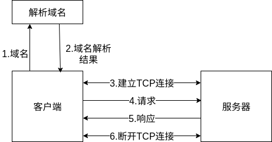
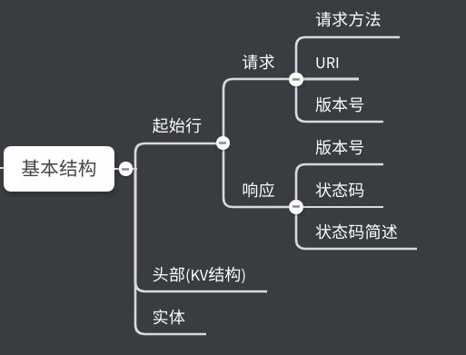

# HTTP协议学习笔记(二) 报文结构

在《HTTP协议学习笔记(一) 基本概念》一节中，已经介绍了关于HTTP协议的基本概念，这一节将介绍HTTP的报文结构。

HTTP协议是一款基于请求—应答模式的通信协议，有客户端主动发送请求后，服务器被动响应。

## 0X00 HTTP的通信流程？

一个HTTP通信的通信流程如图：

## 0X01 HTTP协议传输载体结构？

HTTP协议和通过快递传递HTTP协议和写信类似，其传递信息载体是报文。HTTP协议将报文划分为三部分：

- 起始行：描述请求或响应的基本信息。
- 头部字段(header)：使用key-value形式详细说明报文。
- 传输实体(body)：实际传输的数据。

HTTP协议规定报文必须有起始行和header，但可没有body。header和body之间用空行隔开("CRLF"表示换行，十六进制为`0D0A`)。

客户端向服务器发送的请求报文结构：

服务器向客户端发送的响应报文结构：

## 0X02 请求报文起始行

请求报文的起始行被称作为请求行，由请求方法、请求目标(URI标记)、HTTP版本号组成。这三i部分用空格`SP`分隔，最后用`CRLF`表示结束。

## 0X03 响应报文起始行

响应报文的起始行被称作为状态行，由版本号、状态码、状态码简述组成。

## 0X04 总结

