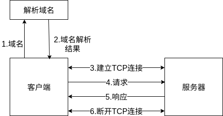
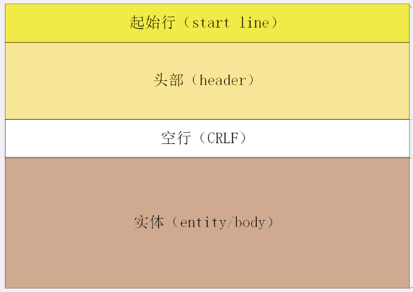

# HTTP协议学习笔记(二) 基本结构

在《HTTP协议学习笔记(一) 基本概念》一节中，已经介绍了关于HTTP协议的基本概念，这一节将介绍HTTP的基本结构。

## 0X00 HTTP的访问流程？

一个HTTP通信的访问流程如图：

## 0X01 HTTP报文的结构？

HTTP协议的数据单位是报文。它规定传输数据时必须会添加一个由ASCII码组成的HTTP头。HTTP头由三部分组成：

- 起始行：描述请求或响应的基本信息。
- 头部字段(header)：使用key-value形式详细说明报文。
- 传输实体(body)：实际传输的数据。

HTTP协议中规定报文必须有header，但是可以没有body；header和body之间用空行隔开("CRLF"，十六进制为`0D0A`)。

## 0X02 起始行的结构？

HTTP协议中有两种报文：请求报文和响应报文。两种报文其对应的起始行内容也不尽相同。

- 请求报文：请求报文的起始行被称作为请求行，由请求方法、请求目标(URI标记)、HTTP版本号组成。这三部分用空格`SP`分隔，最后用`CRLF`表示结束。

  

- 响应报文：响应报文的起始行被称作为状态行，由版本号、状态码、状态码简述组成。

  

