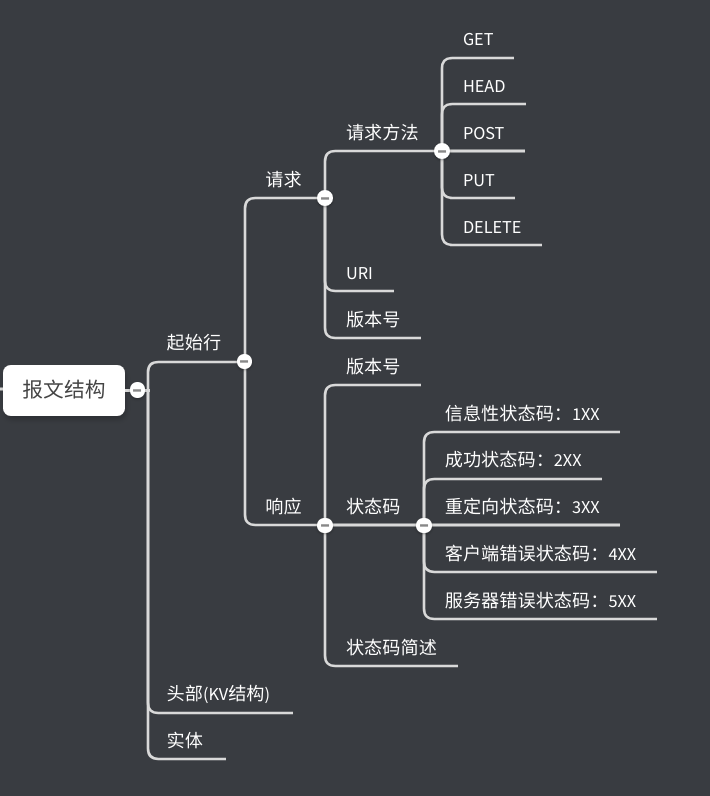

# HTTP协议学习笔记(二) 报文结构

在《HTTP协议学习笔记(一) 基本概念》一节中，已经介绍了关于HTTP协议的基本概念，这一节将介绍HTTP的报文结构。

HTTP协议是一款基于请求—应答模式的通信协议，有客户端主动发送请求后，服务器被动响应。

## 0X00 HTTP的通信流程？

一个HTTP通信的通信流程如图：

## 0X01 HTTP报文结构？

HTTP协议和通过快递传递物品相同：寄快递时需要填写快递单，描述寄件人、收件人和物品信息，然后将快递单贴在物品上一同寄出。HTTP协议以报文为单位传递数据，它将报文划分为两大块、三部分：

- 起始行：描述请求或响应的基本信息。
- 头部字段(header)：使用key-value形式详细说明报文。
- 传输实体(body)：实际传输的数据。

HTTP协议采用明文传递，规定报文必须有起始行和header(快递单号)，但可没有body。header和body之间用空行隔开("CRLF"表示换行，十六进制为`0D0A`)。

客户端向服务器发送的请求报文结构：

服务器向客户端发送的响应报文结构：

## 0X02 请求报文起始行

请求报文的起始行被称作为请求行，由请求方法(`Method`)、请求目标(`URI`)、HTTP版本号(`Version`)组成。这三部分用空格`SP`分隔，最后以`CRLF`结束。

请求中的请求方法用于表明客户端的意图。常见的请求方法有：

- GET：获取URI标识的资源。
- HEAD：只获取GET方法的Header信息。
- POST：让服务器将报文的body保存。
- PUT：用body更新URI标识的资源。
- DELETE：删除URI标识的资源。

## 0X03 响应报文起始行

响应报文的起始行被称作为状态行，由版本号(`Version`)、状态码(`Status Code`)、状态码(`Reason`)简述组成。

HTTP状态码负责表达服务器对请求的处理状态。状态码被分为五类：1XX、2XX、3XX、4XX、5XX。

- 1XX：信息性状态码（请求正在被处理，通常只在服务器内部使用）
- 2XX：成功状态码（请求正常处理）
  - 200：OK，请求被正常处理。
  - 204：No Content，请求正常处理，但响应报文主体为空。
  - 206：Partial Content，响应了客户端范围请求。
- 3XX：重定向状态码（需要客户端额外操作才能完成处理）
  - 301：Moved Permanently，永久重定向，资源已经分配新URI，客户端请求新的URI。
  - 302：Found，临时重定向。
  - 303：See Other，请用GET方法访问资源新URI。
  - 304：Not Modified，资源未改变，可使用缓存。
- 4XX：客户端错误状态码（请求有错误，服务器无法处理）
  - 400：Bad Request，请求报文语法错误。
  - 401：Unauthorized，请进行信息认证（搭配WWW-Authenticate）。
  - 403：Forbidden，禁止访问该资源。
  - 404：Not Found，访问资源不存在。
- 5XX：服务器错误状态码（服务器处理异常）
  - 500：Interval Server Error，服务器内部错误。
  - 503：Server Unavailable，服务不可用（超负载或停机维护)。

## 0X04 总结

这一节介绍了HTTP协议的通信流程和HTTP报文结构，并着重介绍了HTTP请求的请求方法和响应状态码。思维导图总结：

----

