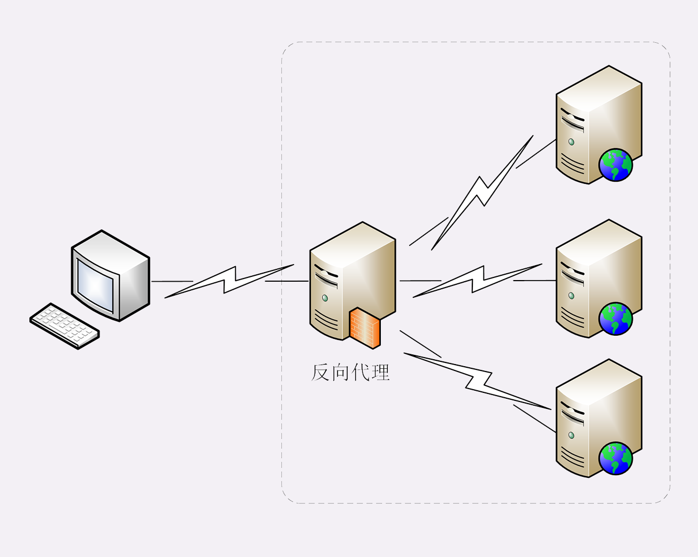

# HTTP协议学习笔记(五)  缓存管理

## 0X00 梗概

HTTP传输过程中，一共有三个角色：

- 客户端
- 服务器
- 代理服务：面向客户端，表现为服务器；面向服务器，表现为客户端

这三个角色都可以存在缓存管理。

## 0X01 服务器如何进行缓存管理？

服务器的资源随时都可能发生变化，不能保证过段时间，资源未变化。因此为了避免客户端的资源老旧，服务器需要控制资源的有效期。

服务器通过响应的`Cache-Control`字段来控制资源的有效期。`Cache-Control`一共有四个字段值：

- `max-age=30`：则表示该资源只能缓存30秒，起始时间是响应创建的时间。

- `no-store`：不允许缓存该资源。
- `must-revalidate`：未过期可以直接使用；过期后必须去服务器验证是否存在新版本。
- `no-cache`：可以缓存，但使用前必须去服务器验证，等价于`max-age=0;must-revalidate`。

如果响应提供了`Last-Modified`字段，却没有提供`Cache-Control`字段，客户端会使用启发算法计算缓存时间，RFC中建议为：`(Date-Last-Modified)*10%`。

## 0X02 客户端如何进行缓存管理？

客户端也通过`Cache-Control`字段来控制缓存。客户端使用缓存主要有两个场景：

- `Ctrl+R`刷新时，请求头添加`Cache-Control:max-age=0`，请求最新的资源，因此不会使用本地的缓存。

- `Ctrl+F5`强制刷新时，请求头添加`Cache-Control:no-cache`来请求最新资源。

如果客户端仅仅通过`Cache-Control`来控制缓存策略，则会面临更新资源时会发送两个请求，成本很高。

HTTP协议提供了5个条件请求字段用于验证资源是否过期，验证操作由服务器执行。

## 0X03 条件请求

条件请求字段可以分为三大类：

- 使用修改时间进行条件请求：`If-Modified-Since`和`If-Unmodified-Since`
- 使用资源标识符进行条件请求：`If-None-Match`和`If-Match`
- 判断是否执行范围请求：`If-Range`

条件请求还需要两个响应字段来配合，用于响应客户端第一次请求时，告知其资源的元数据：

- `Last-Modified`：表示资源最近一次修改时间，时间格式`RFC1123`(Wed, 04 Sep 2019 09:13:50 GMT)。
- `ETag`：资源标识符，当资源更新时，标识符也会改变。`ETag`分为强`ETag`(字节级别相同)和弱`ETag`(只要语义未改变，如删除空格，则不变，用`W/`前缀区分)。

常用的条件请求字段为`If-Modified-Since`和`If-None-Match`，如果资源未改变，服务器返回`304 Not Modified`，客户端加载本地资源：

- `If-Modified-Since:time_a`：若$Last\_Modified \neq time\_a$，返回最新资源。
- `If-None-Match:EtagA`：若$ETag \neq EtagA$，返回最新资源。

采用`Last-Modified`标记资源是否更新，存在两个缺陷：

- `Last-Modified`对时间的敏感度为秒，如果资源在一秒内多次更新，则无法区分新版本。
- 资源定期更新，有时可能只改变了时间，这时更新资源会浪费带宽。

因此针对更新频繁的资源，通常采用`ETag`进行条件请求。

不常用的条件请求字段为`If-Match`、`If-Unmodified-Since`和`If-Range`，条件不满足时，服务器返回`412 Precondition Failed`响应：

- `If-Match:EtagA`：若$EtagA=Etag$，处理请求。`ETagA=*`时，指代任意资源，服务处理请求。
- `If-Unmodified-Since:TimeA`：若$Last\_Modified = time\_a$，处理请求。
- `If-Range:EtagA或TimeA`：当$Last\_Modified = time\_a$或$EtagA=Etag$，处理该范围请求，否则返回整个资源，该字段需要与`Range`联用。

## 0X04 什么是代理？

代理处于客户端和服务器的中间位置，负责转发上下游的请求和响应。

代理本身不生产内容，具备双重身份：

- 面向下游用户，表现为服务器，代表源服务器响应客户端的请求。
- 面向上游源服务器，表现为客户端，代表客户端发送请求。

代理常被分为四种：匿名代理、透明代理、正向代理和反向代理。反向代理是最常见的，其为源服务器提供代理服务。

代理中主要涉及3个字段，用于记录代理的相关信息：

- `Via`：记录代理信息，`Via`是一个链式结构`Via:proxy1,proxy2,proxy3`。`Via`中追加代理主机名或域名，只能用于判断是否存在代理。
- `X-Forwarded-For`：追加请求方的IP，因此最左边为客户端真实IP。
- `X-Real-IP`：记录客户端真实IP。

代理服务器直接操作`X-Forwarded-For`字段存在两个问题：

- 需要解析HTTP报文头，开销比较大，降低了代理的转发性能。
- 修改报文头信息，必须要修改原始报文。使用`HTTPS`通信加密时，报文不能修改。

因此出现了专门的代理协议HAProxy，HAProxy有V1和V2两个版本，V1版本在HTTP报文前添加一行ASCII文本：`PROXY TCP4|TCP6 请求方IP 应答方IP 请求方端口 应答方端口`，其中TCP4代表IPv4，TCP6代表IPv6。代理服务器只需解析第一行就可以获取客户端地址，不会修改HTTP报文。

## 0X05 代理的作用？

- 负载均衡：客户端只能看到代理服务器，而看不到背后的源服务器数量及IP信息，因此可以利用代理服务器来分发请求，决定由哪个服务器来响应请求，常用的。

  

- 健康检查：利用”心跳“等机制监控后端服务器，发现有故障可即使踢出集群，保证服务高可用。

- 安全防护：限制IP或流量，为后端服务器提供抵御网络攻击和过载的功能。

- 加密卸载：对外网采用SSL/TLS加密，对安全的内容不加密，消除加密成本。

- 数据过滤：拦截上下行数据，指定策略修改请求或响应。

- 内容缓存：暂存、复用服务器响应，降低服务器负荷。

## 0X06 代理如何进行缓存管理？

当中间有了代理角色后，缓存管理更佳细化，`Cache-Control`也多了很多新属性。针对代理服务器相关的属性有：

- 权限相关：
  - `private`：该资源只能由客户端缓存。
  - `public`：公共资源，代理服务器可以缓存。
- 资源失效后，重新验证：
  - `must-revalidate`：过期后必须会源服务器验证。
  - `proxy-revalidate`：过期后只需向代理验证即可。
- 生存时间：
  - `max-age`：资源在客户端的有效时间。
  - `s-maxage`：资源在代理中的有效时间。
- `no-transform`：不允许代理修改资源。

针对客户端的缓存属性有：

- `only-if-cached`：只接受代理缓存的资源，如果没有有效缓存，则返回`504 Gateway Timeout`。
- `max-stale=<N seconds>`：缓存过期N秒后，仍有效。
- `min-fresh=<N seconds>`：缓存过期前N秒后，失效。$now+min\_fresh<max\_age$有效。

## 0X03 额外

协商中有一个`Vary`字段，表示响应报文根据`Vary`中的信息生成，因此同一个请求，可能因为协商的内容不同，会有不同的响应，缓存代理必须存储这些不同的版本。当收到相同的请求时，代理会根据缓存的`Vary`与请求头进行对比，完全匹配才会返回缓存数据。

缓存清理：

- 过期数据及时淘汰，避免占空间。
- 源站有资源更新时，主动更新。
- 删除不该缓存的数据。

常用的方法是自定义请求方法`PURGE`，发送给代理服务器，要求删除URI对应的缓存数据。