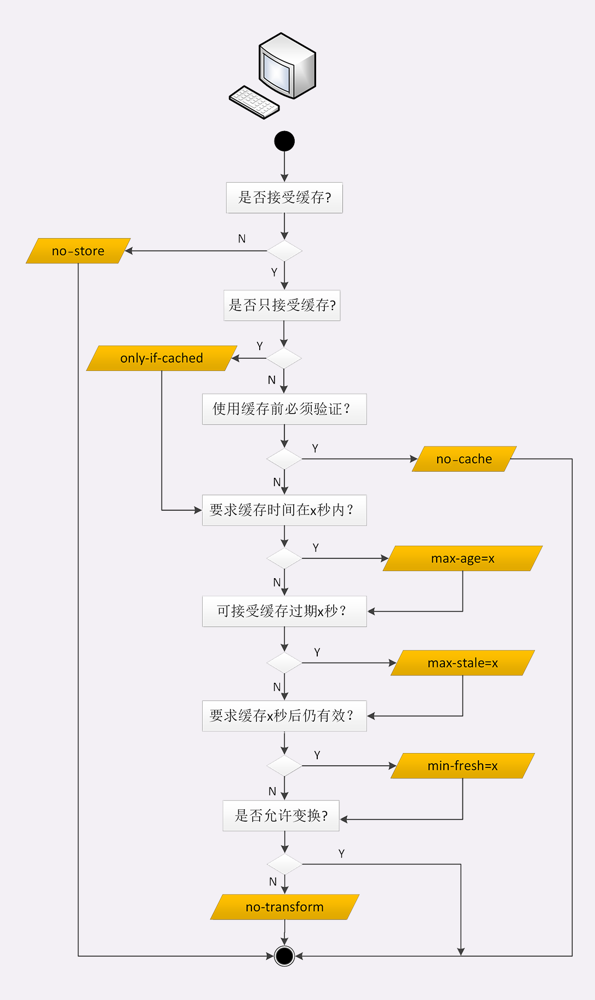
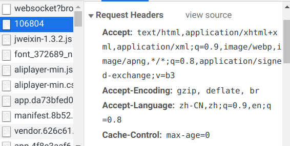

# HTTP协议学习笔记(五)  缓存管理

## 0X00 梗概

HTTP传输过程中，存在三个角色：

- 客户端
- 服务器
- 代理：面向客户端，表现为服务器；面向服务器，表现为客户端

为了尽可能的提高服务器的利用率，也为了让客户端体验更好，HTTP协议提供了缓存管理。通过缓存管理，将静态资源缓存到客户端或代理服务器，客户端下次直接从本地或代理获取静态资源，能有效减轻源服务器的压力。

## 0X01 什么是代理

代理处于客户端和服务器的中间位置，负责转发上下游的请求和响应。

代理本身不生产内容，具备双重身份：

- 面向下游用户，表现为服务器，代表源服务器响应客户端的请求。
- 面向上游源服务器，表现为客户端，代表客户端发送请求。

代理常被分为四种：匿名代理、透明代理、正向代理和反向代理。反向代理是最常见的，其为源服务器提供代理服务。

代理中主要涉及3个字段，用于记录代理的相关信息：

- `Via`：记录代理信息，`Via`是一个链式结构`Via:proxy1,proxy2,proxy3`。`Via`中追加代理主机名或域名，只能用于判断是否存在代理。
- `X-Forwarded-For`：追加请求方的IP，因此最左边为客户端真实IP。
- `X-Real-IP`：记录客户端真实IP。

代理服务器直接操作`X-Forwarded-For`字段存在两个问题：

- 解析HTTP报文头开销比较大，降低了代理的转发性能。
- 使用`HTTPS`通信加密时，不能修改报文。

因此出现了专门的代理协议HAProxy，HAProxy的V1版本在HTTP报文前添加一行ASCII文本：`PROXY TCP4|TCP6 请求方IP 应答方IP 请求方端口 应答方端口`，其中TCP4代表IPv4，TCP6代表IPv6。代理服务器只需解析第一行就可以获取客户端地址，不会修改HTTP报文。

## 0X02 代理的应用

代理最常见的应用有：

- 负载均衡：客户端只能看到代理服务器，而看不到背后的源服务器数量及IP信息，因此可以利用代理服务器来分发请求，决定由哪个服务器来响应请求。

  

- 内容缓存：暂存、复用服务器响应，降低服务器负荷。

- 健康检查：利用”心跳“等机制监控后端服务器，将故障节点及时踢出集群，保证服务高可用。

- 安全防护：限制IP或流量，为后端服务器提供抵御网络攻击和过载的功能。

- 加密卸载：对内外网的传输的数据加解密，内网传输的数据不加密，消除后端服务器加解密成本。

- 数据过滤：拦截上下行数据，指定策略修改请求或响应。

## 0X03 源服务器的缓存控制策略

源服务器通过`Cache-Control`字段来控制客户端和缓存代理。源服务器缓存控制策略为：

- 是否可以缓存
	- `no-store`：不允许缓存该资源。
	- `no-cache`：可以缓存，但使用前必须去服务器验证，等价于`max-age=0;must-revalidate`。
- 权限相关：
  - `private`：该资源只能由客户端缓存。
  - `public`：公共资源，代理服务器可以缓存。
- 资源失效后，重新验证：
  - `must-revalidate`：未过期可以直接使用；过期后必须回源服务器验证。
  - `proxy-revalidate`：过期后只需向代理验证即可。
- 有效时间：
  - `max-age`：资源在客户端的有效时间。
  - `s-maxage`：资源在代理中的有效时间。
- `no-transform`：不允许代理修改资源。

代理服务器还存在两个特殊情况：

- 如何清理缓存？常用方法是通过自定义请求方法`PURGE`，要求代理服务器删除URI对应的缓存数据。
- `Vary`字段变化如何处理？响应报文根据`Vary`中的信息生成，因此针对同一个URI的请求，因为`Vary`内容不同，存在不同版本的响应。缓存代理必须存储这些不同的版本的资源，当收到请求时，代理将缓存资源的`Vary`与请求头进行对比，完全匹配才会返回缓存。

## 0X04 客户端的缓存控制策略

客户端通过响应的`Cache-Control`字段了解如何控制资源的缓存。客户端缓存控制策略为：

- `only-if-cached`：只接受缓存代理的资源，如果没有有效缓存，则返回`504 Gateway Timeout`。
- `max-stale=<N seconds>`：缓存过期N秒后，仍有效。
- `min-fresh=<N seconds>`：缓存过期前N秒后，失效。$now+min\_fresh<max\_age$有效。

客户端也能使用`Cache-Control`字段，主要有两个场景：

- `Ctrl+R`刷新时，请求头添加`Cache-Control:max-age=0`，请求最新的资源，因此不会使用本地的缓存。

- `Ctrl+F5`强制刷新时，请求头添加`Cache-Control:no-cache`来请求最新资源。

## 0X05 条件请求

客户端只能用`Cache-Control`来刷新资源。然而缓存会出现失效，使用前需要去服务器验证资源的有效性。

通过这种方法，更新一个资源，需要两个请求，成本很高。

HTTP协议提供了5个条件请求字段，当提供的条件满足时，服务器会通过响应返回相应资源，验证操作由服务器执行。条件请求字段可以分为三大类：

- 使用修改时间进行条件请求：`If-Modified-Since`和`If-Unmodified-Since`
- 使用资源标识符进行条件请求：`If-None-Match`和`If-Match`
- 判断是否执行范围请求：`If-Range`

条件请求还需要两个响应字段来配合，用于响应客户端的第一次请求时，告知其资源相关的元数据：

- `Last-Modified`：表示资源最近一次修改时间，时间格式`RFC1123`(Wed, 04 Sep 2019 09:13:50 GMT)。
- `ETag`：资源标识符，当资源更新时，标识符也会改变。`ETag`分为强`ETag`(字节级别相同)和弱`ETag`(只要语义未改变，如删除空格，则不变，用`W/`前缀区分)。

常用的条件请求字段为`If-Modified-Since`和`If-None-Match`。若资源未改变，服务器返回`304 Not Modified`响应，客户端加载本地资源：

- `If-Modified-Since:TimeA`：若$Last\_Modified \neq TimeA$，返回最新资源。
- `If-None-Match:EtagA`：若$ETag \neq EtagA$，返回最新资源。

采用`Last-Modified`标记资源是否更新，存在两个缺陷：

- `Last-Modified`对时间的敏感颗粒度为秒，如果资源在一秒内多次更新，无法区分新版本。
- 资源定期更新，只改变了时间，此时更新资源会浪费带宽。

因此针对更新频繁的资源，通常采用`ETag`进行条件请求。

不常用的条件请求字段为`If-Match`、`If-Unmodified-Since`和`If-Range`。条件不满足时，服务器返回`412 Precondition Failed`响应：

- `If-Match:EtagA`：若$Etag=EtagA$，处理请求。`ETagA=*`时，指代任意资源。
- `If-Unmodified-Since:TimeA`：若$Last\_Modified = TimeA$，处理请求。
- `If-Range:EtagA或TimeA`：当$Last\_Modified = TimeA$或$Etag=EtagA$，处理该范围请求，否则返回整个资源，该字段需要与`Range`联用。

## 0X06 总结

这一章节的知识点比较多，整理了快两天，希望大家仔细看看，也可以先收藏，使用时对照查询。

## 0X07 参考资料

极客时间课程《透视HTTP协议》

MDN Web docs：https://developer.mozilla.org/zh-CN/docs/Web/HTTP/Headers

------

